| 序号 | 修改时间   | 修改内容                             | 修改人 | 审稿人 |
| ---- | ---------- | ------------------------------------ | ------ | ------ |
| 1    | 2018-4-5   | 创建。从《大数据开发》拆分出BI内容。 | 吴启福 |        |
| 2    | 2019-12-14 | 增加数据湖章节。                     | 同上   |        |
---

 

 

 

# 目录

 

[目录... 1](#_Toc16721504)

[1    BI概述... 5](#_Toc16721505)

[1.1       BI简介... 5](#_Toc16721506)

[1.2       BI市场和主要工具... 7](#_Toc16721507)

[1.3       方法论... 8](#_Toc16721508)

[1.3.1     BI业务分析：五步曲... 9](#_Toc16721509)

[1.4       本章参考... 9](#_Toc16721510)

[2    数据治理... 9](#_Toc16721511)

[2.1       概述... 10](#_Toc16721512)

[2.2       数据模型DM.. 11](#_Toc16721513)

[2.2.1     金融业... 11](#_Toc16721514)

[2.2.2     电信业... 14](#_Toc16721515)

[2.2.3     本节参考... 15](#_Toc16721516)

[2.3       示例：华为的数据治理... 15](#_Toc16721517)

[2.4       本章参考... 16](#_Toc16721518)

[3    数据挖掘DM.. 16](#_Toc16721519)

[3.1       数据挖掘简介... 16](#_Toc16721520)

[3.1.1     基本概念... 17](#_Toc16721521)

[3.1.2     CRISP-DM.. 18](#_Toc16721522)

[3.1.3     数据挖掘过程示例：餐饮业... 20](#_Toc16721523)

[3.2       数据预处理... 20](#_Toc16721524)

[3.3       挖掘模式... 20](#_Toc16721525)

[3.3.1     频繁模式挖掘... 20](#_Toc16721526)

[3.3.2     交互挖掘... 20](#_Toc16721527)

[3.3.3     增量挖掘... 21](#_Toc16721528)

[3.4       相似度发现... 21](#_Toc16721529)

[3.4.1     距离测度... 21](#_Toc16721530)

[3.5       本章参考... 21](#_Toc16721531)

[4    数据仓库Data warehouse. 21](#_Toc16721532)

[4.1       简介... 21](#_Toc16721533)

[4.1.1     定义... 21](#_Toc16721534)

[4.1.2     数据仓库组成... 22](#_Toc16721535)

[4.1.3     术语... 22](#_Toc16721536)

[4.2       数据仓库架构... 23](#_Toc16721537)

[4.2.1     架构组成简介... 23](#_Toc16721538)

[4.2.2     数据集市架构... 26](#_Toc16721539)

[4.3       数据仓库建模... 26](#_Toc16721540)

[4.3.1     E/R范式建模... 26](#_Toc16721541)

[4.3.2     kimball维度模型... 26](#_Toc16721542)

[4.3.3     Data Vault模型... 27](#_Toc16721543)

[4.3.4     Anchor模型... 27](#_Toc16721544)

[4.4       ETL. 27](#_Toc16721545)

[4.4.1     ETL工具... 28](#_Toc16721546)

[4.5       数仓基准~TPC-H.. 28](#_Toc16721547)

[4.5.1     TPC-H.. 28](#_Toc16721548)

[4.5.2     TPC基准列表... 29](#_Toc16721549)

[4.6       DW实例... 30](#_Toc16721550)

[4.6.1     IBM.. 31](#_Toc16721551)

[4.6.2     TeraData. 31](#_Toc16721552)

[4.6.3     淘宝... 32](#_Toc16721553)

[4.7       本章参考... 32](#_Toc16721554)

[5    BI~自助分析... 33](#_Toc16721555)

[5.1       简介... 33](#_Toc16721556)

[5.2       PowerBI 34](#_Toc16721557)

[5.3       Tableau. 35](#_Toc16721558)

[5.4       Superset. 35](#_Toc16721559)

[5.5       其它工具... 35](#_Toc16721560)

[5.5.1     Pentaho BI 35](#_Toc16721561)

[5.6       本章参考... 36](#_Toc16721562)

[5.6.1     PowerBI 参考资料... 36](#_Toc16721563)

[6    BI行业案例... 36](#_Toc16721564)

[6.1       金融业... 37](#_Toc16721565)

[6.2       电商... 39](#_Toc16721566)

[6.2.1     示例：2017.11.11（购物节）... 41](#_Toc16721567)

[6.2.2     示例：2018.6.18（年中销售节）... 41](#_Toc16721568)

[6.2.3     本节参考... 42](#_Toc16721569)

[6.3       零售业... 42](#_Toc16721570)

[6.4       制造业... 42](#_Toc16721571)

[6.5       本章参考... 43](#_Toc16721572)

[7    DM工具... 43](#_Toc16721573)

[参考资料... 43](#_Toc16721574)

[参考书目... 43](#_Toc16721575)

[参考链接... 44](#_Toc16721576)

[附录... 44](#_Toc16721577)

[官方组织... 44](#_Toc16721578)

 

 

 

**表目录**

[表格 1 BI厂商列表__ 7](#_Toc16721579)

[表格 2 BI工具列表__ 7](#_Toc16721580)

[表格 3 华为的数据资产目录__ 15](#_Toc16721581)

[表格 4 数据挖掘处理过程（参考）__ 19](#_Toc16721582)

[表格 6 DM常见术语__ 22](#_Toc16721583)

[表格 5 维度建模常用术语__ 26](#_Toc16721584)

[表格 7 TPC Active Benchmarks 30](#_Toc16721585)

[表格 8 IBM与Teradata仓库模型比较__ 30](#_Toc16721586)

[表格 9 主流BI自助分析工具比较__ 33](#_Toc16721587)

[表格 10 Power BI版本定价策略__ 34](#_Toc16721588)

[表格 11 店铺流量指标详述__ 39](#_Toc16721589)

[表格 12 电商交易指标详述__ 40](#_Toc16721590)

[表格 13电商商品指标详述__ 40](#_Toc16721591)

 

**图目录**

[图 1 数据价值链示意图__ 6](#_Toc16721592)

[图 2 Gartner2017年商业智能与分析魔力象限__ 7](#_Toc16721593)

[图 3 数据资产管理体系结构__ 10](#_Toc16721594)

[图 4 企业三类数据的关系__ 10](#_Toc16721595)

[图 5 Teradata FS-LDM十大主题划分__ 12](#_Toc16721596)

[图 6 IBM FSDM_ 13](#_Toc16721597)

[图 7 电信业的一级主题域__ 14](#_Toc16721598)

[图 8 电信业的二级主题域关系视图（部分）__ 14](#_Toc16721599)

[图 9 餐饮行业数据挖掘建模过程示例图__ 20](#_Toc16721600)

[图 10 数据仓库价值曲线__ 22](#_Toc16721601)

[图 11数据仓库基本体系结构1_ 23](#_Toc16721602)

[图 12数据仓库基本体系结构2_ 24](#_Toc16721603)

[图 13 DW五层模型架构__ 24](#_Toc16721604)

[图 14 淘宝计算存储平台的发展史__ 32](#_Toc16721605)

[图 15 PowerBI组件图__ 34](#_Toc16721606)

[图 16 金融业业务架构__ 37](#_Toc16721607)

[图 17 金融业-精准营销__ 38](#_Toc16721608)

[图 18 金融业-用户画像__ 38](#_Toc16721609)

[图 19 金融业-通过大数据平台建设用户画像进行精准营销__ 39](#_Toc16721610)

 

 

 

# 1  BI概述

## 1.1   BI简介

BI（Business Intelligence）即商务智能，它是一套完整的解决方案，用来将企业中现有的数据进行有效的整合，快速准确地提供报表并提出决策依据，帮助企业做出明智的业务经营决策。

商业智能的关键是从许多来自不同的企业运作系统的数据中提取出有用的数据并进行清理，以保证数据的正确性，然后经过抽取（Extraction）、转换（Transformation）和装载（Load），即ETL过程，合并到一个企业级的数据仓库里，从而得到企业数据的一个全局视图，在此基础上利用合适的查询和分析工具、数据挖掘工具、OLAP工具等对其进行分析和处理（这时信息变为辅助决策的知识），最后将知识呈现给管理者，为管理者的决策过程提供数据支持。商业智能产品及解决方案大致可分为**数据仓库**产品、**数据抽取**产品、**OLAP**产品、展示产品、和集成以上几种产品的针对某个应用的整体解决方案等。

 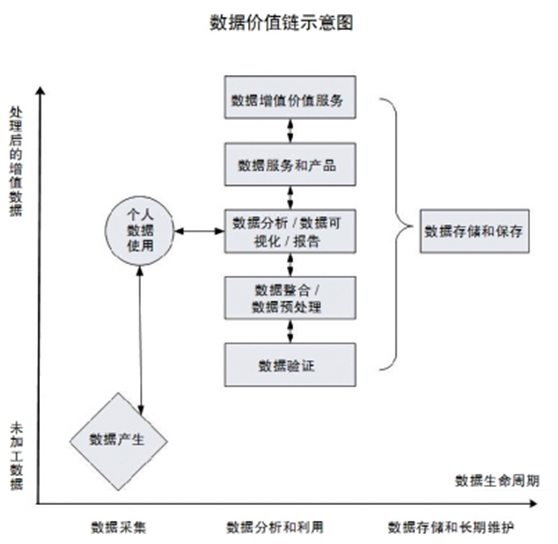

​                               

图 1 数据价值链示意图

## 1.2   BI市场和主要工具

 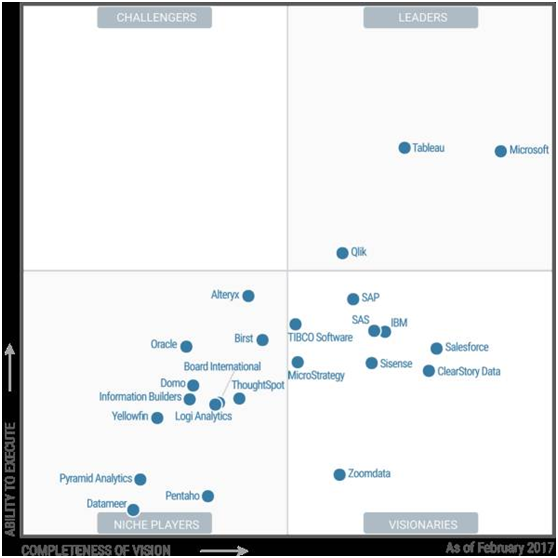

图 2  Gartner2017年商业智能与分析魔力象限

 

表格 1 BI厂商列表

|             | 主流厂商                                                     | 侯选厂商 |
| ----------- | ------------------------------------------------------------ | -------- |
| 全领域      | IBM公司、[Oracle](https://baike.baidu.com/item/Oracle)、[Microsoft](https://baike.baidu.com/item/Microsoft) |          |
| 数据集成DI  | [Informatica](https://baike.baidu.com/item/Informatica)      | QlikView |
| 数据仓库DW  | [Sybase](https://baike.baidu.com/item/Sybase)、[Teradata](https://baike.baidu.com/item/Teradata)、 | SAP      |
| 数据挖掘DM  | SAS                                                          |          |
| 数据集市DM2 |                                                              |          |

 

表格 2 BI工具列表

| 公司                                                | 工具                                             | 简介                                                         |
| --------------------------------------------------- | ------------------------------------------------ | ------------------------------------------------------------ |
| IBM                                                 | IBM SPSS Modeler                                 | 原名Clementine，2009年被IBM收购后对产品的性能和功能进行了大幅度改进和提升。它封装了最先进的统计学和数据挖掘技术，来获得预测知识并将相应的决策方案部署到现有的业务系统和业务过程中，从而提高企业的效益。同那些仅仅着重于模型的外在表现而忽略了数据挖掘在整个业务流程中的应用价值的其它数据挖掘工具相比，　SPSS Modeler具有功能强大的数据挖掘算法，使数据挖掘贯穿业务流程的始终。 |
|                                                     | IBM PureData  (Netezza)                          |                                                              |
|                                                     | `datastage`                                      | 最专业的ETL工具，价格不菲，使用难度一般                      |
| [Microsoft](https://baike.baidu.com/item/Microsoft) |                                                  | 主要包括SQL Server、power BI                                 |
|                                                     | SQL Server                                       | Microsoft的SQL Server中集成了数据挖掘工具，借助SQL  Server的数据库管理功能，用户可以实现数据挖掘建模。在SQL Server2008中提供了决策树算法、聚类分析算法、Naive Bayes 算法、关联规则算法、时序算法、神经网络算法、线性回归算法等9种常用的数据挖掘算法。但是其预测建模的实现是基于SQL Server平台的，平台移植性相对较差，也没有考虑综合各种预测方法来优化预测结果。 |
|                                                     | [power BI](https://powerbi.microsoft.com/zh-cn/) | Power BI 是一套商业分析工具，用于在组织中提供见解。可连接数百个数据源、简化数据准备并提供即席分析。生成美观的报表并进行发布，供组织在 Web 和移动设备上使用。每个人都可创建个性化仪表板，获取针对其业务的全方位独特见解。在企业内实现扩展，内置管理和安全性。 |
| [Oracle](https://baike.baidu.com/item/Oracle)       | Oracle Exadat                                    |                                                              |
|                                                     |                                                  |                                                              |
| SAP                                                 | Hana                                             |                                                              |
| SAS                                                 | SAS Enterprise Miner（EM）                       | SAS推出的一个集成的数据挖掘系统，允许使用和比较不同的技术，同时还集成了复杂的数据库管理软件。它的运行方式是通过在一个工作空间（workspace）中按照一定的顺序添加各种可以实现不同功能的节点，然后对不同节点进行相应的设置，最后运行整个工作流程(workflow)，便可以得到相应的结果。 |
| Mathworks                                           | MATLAB                                           | （Matrix Laboratory,矩阵实验室）是美国Mathworks公司开发的应用软件，具备强大的科学及工程计算能力，它不但具有以矩阵计算为基础的强大数学计算能力和分析功能，而且还具有丰富的可视化图形表现功能和方便的程序设计能力。 |
| Teradata                                            | AsterData                                        | 数据仓库。                                                   |

 

## 1.3   方法论

方法论还可参见 《运营专题》中的数字化运营5W法。

### 1.3.1 BI业务分析：五步曲
*  确定正确的人（使用者）：决策层、管理层和执行层。
*  确定正确的信息（内容）：收集业务分析需求，提炼业务指标，构建业务分析线路
*  确定场景：如月度经营分析会，半年或全年的战略或计划会，报表上报或对外披露，日常查询、分析和监控，对外形象展示
*  正确的（方式）：可视化展示、分析报表展示、格式报表展示、自助查询分析、自助分析报告
*  支持辅助功能（行为）：数据回写、批量上报、批量导出、自动切换、数据自动刷新、数据推送等

 

## 1.4   本章参考

[1].   《大道至简的数据治理方法论》

[2].   《大道至简的数据体系构建方法论》 https://ask.hellobi.com/blog/yonghongtech/3044 

[3].   《大道至简的深度分析方法论》

[4].   30多种常见的数据图表，职场人必备技能啊！ https://zhuanlan.zhihu.com/p/23221414?refer=haizhibdp 

[5].   Chart Suggestions: A Thought Starter (Andrew Abela) http://www.infographicsblog.com/chart-suggestions-a-thought-starter-andrew-abela/

[6].   常用的产品数据分析方法之漏斗模型与归因模型 [www.woshipm.com/data-analysis/411316.html](http://www.woshipm.com/data-analysis/411316.html) 

[7].   什么是数据分析的漏斗模型？ http://bigdata.51cto.com/art/201709/553100.htm 

 

# 2  数据治理

传统的IT治理是指，组织在信息化过程中需要建立的一种宏观的决策、协调及控制机制。其作用是明确IT决策责任、建立协调沟通机制，有效利用各种资源，控制信息化风险，促进IT与业务的融合，使IT为企业创造价值。建立自适应的信息安全能力，是新型IT治理的重要目标之一。目标是实现共赢。

在整个IT治理架构中，数据治理较为特殊，有首席数据官直接负责，横跨数据管理和风险管理两个闭环，从数据的生产、使用、挖掘和管理四个角度，为组织决策提供重要信息。

## 2.1   概述

 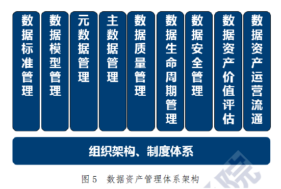

图 3 数据资产管理体系结构

数据一般可分为主数据、元数据、参考数据。
*  **元数据**：描述数据的数据。分技术、业务和操作元数据。用于描述企业数据的所有信息和数据，如结构、关系、安全需求等，除增加数据可读性外，也是后续数据管理的基础。
*  **主数据**：具有高度业务价值，可以在企业内部跨流程跨系统重复使用的数据。具有唯一、准确和权威的数据源。真实的企业业务数据，是企业的关键业务数据。
*  **参考数据**：对数据的解释，针对一些数据范围和取值的数据解释，让人们容易读取相关的数据。

备注：相对交易数据，主数据变换缓慢。

 

一般而言，企业中这三类数据与其它数据的数据量、质量需求，更新频率、数据生命周期的关系大致如下图：

 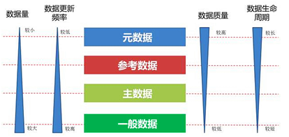

图 4 企业三类数据的关系

 

数据的分类
*  按数据格式：结构化、非结构化
*  按数据参照程度：主数据、非主数据
*  按数据采集频道：实时、非实时 
*  按使用性质：分析性、共享

## 2.2   数据模型Model

数据模型Data Model的过程：从概念性模型CDM -》 逻辑模型LDM -》 物理模型PDM。

数据主题域由业务信息按照其业务耦合程度聚合而成的高阶数据主题群，一般与业务域有着紧密的对应关系。例如：财务、物资、生产等。 

数据主题域通过数据主题域视图和数据主题域关系视图来体现。

### 2.2.1 金融业

#### Teradata FS-LDM

　Teradata天睿公司（纽交所代码：TDC），是美国前十大上市软件公司之一。经过逾30 年的发展，Teradata天睿公司已经成为全球最大的专注于大数据分析、数据仓库和整合营销管理解决方案的供应商。 其提出一种先进的FS-LDM模型(Financial Services Logcial Data Model) --企业级数据模型，包括金融机构业务数据，囊括了银行约80%的业务数据，并把预定义的业务模板连接到核心银行业务数据和数据仓库中。

　Teradata FS-LDM是一个成熟产品，在一个集成的模型内支持保险、银行及证券，包含十大主题：当事人、产品、协议、事件、资产、财务、机构、地域、营销、渠道。

 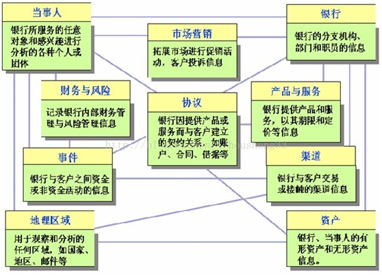

图 5 Teradata FS-LDM十大主题划分

 

**BANK-LDM主题域模型设计采用分类设计的策略:**
 1、重点设计主题（客户、协议、事件、资产、财务）
 　特点：是模型中的重点主题，且在源系统中有丰富的数据来源和参照。
 　目标：尽量保持完整性、丰富性。
 　策略：按照FS-LDM的框架进行设计，同时补充银行的个性数据元素。
 2、自主设计主题（申请、营销活动、渠道、机构、产品）
 　特点：非核心主题，基本没有或者仅有非常少的数据来源和参照。
 　目标：保证模型架构的完整性和扩充性。
 　策略：按照FS-LDM进行设计，将来根据实际情况调整。
 3、简化设计主题（地域）
 　特点：模型的重要参考主题，一般情况下源系统有数据，但定义和使用方法与FS-LDM不匹配。
 　目标：暂不进行唯一地址识别，但要完整保留此类信息。
 　策略：暂作为客户等的属性信息进行设计。

 

**逻辑数据模型LDM，以协议主题实例：**

 

 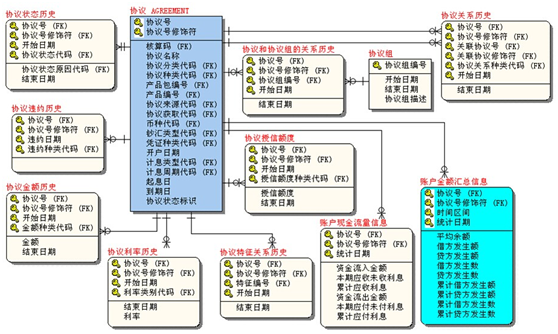

 

#### IBM FSDM

 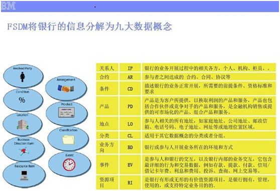

图 6 IBM FSDM

 

 

### 2.2.2 电信业

 

图 7 电信业的一级主题域

 

 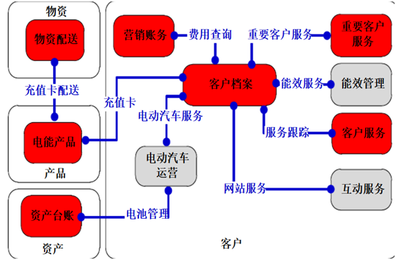

图 8 电信业的二级主题域关系视图（部分）

 

### 2.2.3 本节参考

[1].   TeraData金融数据模型 https://www.cnblogs.com/oracle-dba/p/3903442.html

[2].   Teradata在中国银行业的应用简介

http://wenku.baidu.com/link?url=JURfyMr-KFDwPp1vjk7UJUSLJTuW9S5m-YUtRHHcOsxUsoDq72qtuetHJDjGFcXA4Jg4Z39HaWZcPDQ55-lVECdx95tzw8jj1DD7_A58UCO

 

## 2.3   示例：华为的数据治理

华为的数据架构由四部分组成，分别是数据资产目录（五层）、数据模型（五层）、数据标准和数据分布。
*  数据资产目录：主题域分组、主题域、业务对象、属性组、属性
*  数据模型：ESAM(Enterprise Subject Area Model)、EBIM(Enterprise Business Information Model)、BALDM(Business Area)、APP LDM、APP PDM
*  数据标准：业务定义规范，如接口、模型设计/开发规范
*  数据分布： 数据地图dmap，可以很方便在业务元数据和技术元数据之间转换。
*  元数据管理：gData

 

**十一大主题域分组**

| 主题域分级  | 简介                      | 详述           |
| ----------- | ------------------------- | -------------- |
| IPD         | 集成产品开发。            |                |
| MTL         | Market  to Lead           | 市场到机会点。 |
| LTC         | Lead  to Cash             | 机会点到现金   |
| ITR         |                           |                |
| DS          | Develop  Stragety         |                |
| CRM         | 客户关系管理              |                |
| SD          | Service  Deliver.服务交付 |                |
| Supply      |                           |                |
| Manufacture |                           |                |
| Procurment  |                           |                |
| Manage  HR  |                           |                |

备注：这十一大主题域之外，还包括一些跨领域的数据。如渠道销售、零售Retail、管理（包括财经、BT&IT、Business Support、投资）等等。另外华为新业务并还没有完全纳入新的主题域里。

 

表格 3 华为的数据资产目录

| 主题域分组  | 主题                                                 | 业务对象 |
| ----------- | ---------------------------------------------------- | -------- |
| IPD         | offering、                                           |          |
|             | 重量级团队、                                         |          |
|             | 需求、                                               |          |
|             | 研发项目                                             |          |
| MTL         | 细分市场、营销、市场洞察、销售                       |          |
| LTC         | 线索、机会点、客户合同、销售战略、解决方案           |          |
| ITR         | 技术服务请求、备件服务                               |          |
| DS          | SP  BP                                               |          |
| CRM         | 客户信息、政策、满意度                               |          |
| SD          | 交付资源、交付信息资产、交付项目                     |          |
| Supply      | 运输、计划、销售定单、库存、供应解决方案             |          |
| Manufacture | 制造资源、质量、工程能力、新产品导入、仓储           |          |
| Procurment  | 供应商、采购合同、采购PO、采购分类                   |          |
| Manage  HR  | 组织、人员、人与组织关系、组织应用、人员应用、侯选人 |          |

说明： 

SCOR：Supply Chain Operation Reference，包括五方面，分别是Source/make/deliver/plan/Return。

 

## 2.4   本章参考

[1].   一组图详解元数据、主数据与参考数据 [www.cbdio.com/BigData/2016-02/16/content_4617126.htm](http://www.cbdio.com/BigData/2016-02/16/content_4617126.htm) 

[2].   北极星与海盗：数据指标体系的倚天与屠龙 https://www.jianshu.com/p/3e9bd65a32ad

[3].   KPI指标体系 [https://baike.baidu.com/item/KPI%E6%8C%87%E6%A0%87%E4%BD%93%E7%B3%BB](https://baike.baidu.com/item/KPI指标体系)

[4].   阿里巴巴全域数据建设 [www.cbdio.com/BigData/2017-10/18/content_5618979.htm](http://www.cbdio.com/BigData/2017-10/18/content_5618979.htm) 

[5].   《2017中国大数据企业排行榜》V3.0发布 [www.cbdio.com/BigData/2017-02/23/content_5455866.htm](http://www.cbdio.com/BigData/2017-02/23/content_5455866.htm) 

[6].   W3 http://w3.huawei.com/dmap 

[7].   第二届中国数据安全治理高峰论坛：通用数据安全治理框架及完整技术落地方案 [www.aqniu.com/industry/34432.html](http://www.aqniu.com/industry/34432.html) 

# 3  数据挖掘.DM

数据挖掘是一个过程。数据挖掘能取得多大的成就跟所采用的工具，使用工具的能力和挖掘过程中的方法论密切相关。数据挖掘的方法论有， 
*  战略上: CRISP_DM(Cross Industry Standard Process for DM); 
*  战术上：采用美国SAS公司的SEMMA方法(Sample,Explore,Modify,Model, Assess). 

 

## 3.1   数据挖掘简介

**数据挖掘定义**

（[英语](http://zh.wikipedia.org/zh-cn/英語)：[**Data mining**](http://en.wikipedia.org/wiki/Data_mining)**）**又译为**数据采矿**、**数据挖掘**。它是**数据库知识发现**（英语：[**K**nowledge-**D**iscovery in **D**atabases](http://en.wikipedia.org/wiki/Knowledge-Discovery_in_Databases)，简称：**KDD**)中的一个步骤。数据挖掘一般是指从大量的数据中自动搜索隐藏于其中的有着特殊关系性（属于[Association rule learning](http://en.wikipedia.org/wiki/association_rule_learning)）的信息的过程。

 

**发展历程**

1989年，第十一届国际联合人工智能学术会议上首次出现KDD（知识发现）一词。这是关于KDD的首个专题讨论会

1995年，出现数据挖掘领域的首个国际会议SIGKDD．自此，SIGKDD大会每年召开一次，已经称为数据挖掘领域的顶级会议．

 

### 3.1.1 基本概念

**数据**
*  数据：对象及属性的集合．
*  数据类型：分类，数值．．．
*  数据处理：标准化，离散化，取样，维度递减．．．

 

**数据挖掘任务：**是指用户进行的数据分析形式.
*  分类/预测模型：利用已知参数，预测未知参数的值．
*  描述模型：发现人可以理解，可以描述数据的模术．

基本方法: 分类，聚类和关联分析．

 

**数据挖掘功能(模式发现)**

数据挖掘功能用于指定数据挖掘任务中要找的模式类型. 

常见的模式

1)     概念/类描述: 特征化和区分

数据特征的输出可以用多种形式提供,如饼图,条图等.

数据区分是将目标类对象的一般特性与一个或多个类比对象的一般特性作比较.

2)     关联分析

关联分析发现关联规则, 规则展示属性-值频繁地给定数据集中一起出现的条件. 关联分析广泛用于购物篮或事务数据分析.

3)     分类和预测

4)     聚类分析

5)     孤立点分析

6)     演变分析

数据演变分析描述行为随时间变化的对象的规律或趋势.

 

**数据挖掘原语**

一个数据挖掘任务可以用数据挖掘查询的形式说明. 数据挖掘查询的形式即数据挖掘原语,有如下定义.
*  任务相关的数据, 如数据库,表等
*  挖掘的知识类型, 即模式
*  背景知识
*  模式兴趣度度量, 简洁,实用,确实,新颖
*  发现模式的可视化, 如表格,图等

 

### 3.1.2 CRISP-DM

CRISP-DM (cross-industry standard process for data mining), 即为"跨行业数据挖掘标准流程"。此KDD[过程模型](https://baike.baidu.com/item/过程模型)于1999年欧盟机构联合起草。通过近几年的发展，CRISP-DM 模型在各种KDD过程模型中占据领先位置，2014年统计表明，采用量达到43%。

 

CRISP-DM 模型为一个[KDD](https://baike.baidu.com/item/KDD)工程提供了一个完整的过程描述。该模型将一个KDD工程分为6个不同的，但顺序并非完全不变的阶段，分别是商业理解、数据理解、数据准备、建模、评估和部署。

 

**商业理解（business understanding）**

从商业的角度了解项目的要求和最终目的是什么，并将这些目的与数据挖掘的定义以及结果结合起来。

主要工作包括：确定商业目标，发现影响结果的重要因素，从商业角度描绘客户的首要目标，评估形势，查找所有的资源、局限、设想以及在确定数据分析目标和项目方案时考虑到的各种其他的因素，包括风险和意外、相关术语、成本和收益等等，接下来确定数据挖掘的目标，制定项目计划。

 

**数据理解（data understanding）**

数据理解阶段开始于数据的收集工作。接下来就是熟悉数据的工作，具体如：检测数据的量，对数据有初步的理解，探测数据中比较有趣的数据子集，进而形成对潜在信息的假设。收集原始数据，对数据进行装载，描绘数据，并且探索数据特征，进行简单的特征统计，检验数据的质量，包括数据的完整性和正确性，缺失值的填补等。

 

**数据准备（data preparation）**

数据准备阶段涵盖了从原始粗糙数据中构建最终数据集（将作为建模工具的分析对象）的全部工作。数据准备工作有可能被实施多次，而且其实施顺序并不是预先规定好的。这一阶段的任务主要包括：制表，记录，数据变量的选择和转换，以及为适应建模工具而进行的数据清理等等。

根据与挖掘目标的相关性，数据质量以及技术限制，选择作为分析使用的数据，并进一步对数据进行清理转换，构造衍生变量，整合数据，并根据工具的要求，格式化数据。

 

**建模（modeling）**

在这一阶段，各种各样的建模方法将被加以选择和使用，通过建造，评估模型将其参数将被校准为最为理想的值。比较典型的是，对于同一个数据挖掘的问题类型，可以有多种方法选择使用。如果有多重技术要使用，那么在这一任务中，对于每一个要使用的技术要分别对待。一些建模方法对数据的形式有具体的要求，因此，在这一阶段，重新回到数据准备阶段执行某些任务有时是非常必要的。

 

**评估（evaluation）**

从数据分析的角度考虑，在这一阶段中，已经建立了一个或多个高质量的模型。但在进行最终的模型部署之前，更加彻底的评估模型，回顾在构建模型过程中所执行的每一个步骤，是非常重要的，这样可以确保这些模型是否达到了企业的目标。一个关键的评价指标就是看，是否仍然有一些重要的企业问题还没有被充分地加以注意和考虑。在这一阶段结束之时，有关数据挖掘结果的使用应达成一致的决定。

 

**部署（deployment）**

部署，即将其发现的结果以及过程组织成为可读文本形式。模型的创建并不是项目的最终目的。尽管建模是为了增加更多有关于数据的信息，但这些信息仍然需要以一种客户能够使用的方式被组织和呈现。这经常涉及到一个组织在处理某些决策过程中，如在决定有关网页的实时人员或者营销数据库的重复得分时，拥有一个“活”的模型。

 

表格 4 数据挖掘处理过程（参考）

| 过程         | 简介                                                         | 详述                                                         |
| ------------ | ------------------------------------------------------------ | ------------------------------------------------------------ |
| 定义挖掘目标 | 明确本次的挖掘目标是什么？系统完成后要达到什么效果？         |                                                              |
| 数据取样     | 从业务系统中抽取一个与挖掘目标相关的样本数据子集。           | 抽取数据标准要求相关、可靠和有效。                           |
| 数据探索     | 分析数据属性之间的相关性                                     | 包括：  Ø 数据质量分析：异常值、缺失值、一致性  Ø 数据特征分析：分布、对比、统计量、相关性、周期性和贡献度。 |
| 数据预处理   | 当采集数据维度过大时，需要降维、缺失值处理等。               | 包括：  Ø 数据筛选（清洗）：异常值、缺失值  Ø 数据集成：实体识别、冗余属性识别  Ø 数据转换：简单函数变换、数据规范（标准）化、连续属性离散化、属性选择（构造）、小波变换  Ø 数据规约：属性规约（合并、决策树归纳、PCA主成分分析），数值规约（回归、直方图、抽样等）。 |
| 挖掘建模     | 这是核心环节。                                               | 考虑DM中的哪类问题：  分类、聚类、关联规则、时序模式或智能推荐。 |
| 模型评价     | 根据分析结果找出一个好的模型，根据业务对模型进行解释和应用。 |                                                              |
| 模型发布     | 应用模型进行分析和预测。                                     |                                                              |

事实上，就方法学而言，CRISP-DM并不是什么新观念，本质来看就是在分析应用中提出问题、分析问题和解决问题的过程。而可贵之处在于其提纲挈领的特性，非常适合工程管理，适合大规模定制，以至CRISP-DM如今已经成为事实上的行业标准。

 

### 3.1.3 数据挖掘过程示例：餐饮业

 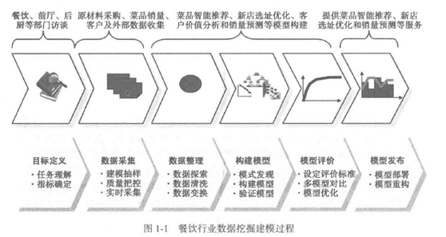

图 9 餐饮行业数据挖掘建模过程示例图

 

## 3.2   数据预处理

数据预处理一般有以下方法: 数据清理、数据集成、数据变换, 数据规约, 离散化和概念分层。

## 3.3   挖掘模式

### 3.3.1 频繁模式挖掘

 

### 3.3.2 交互挖掘

 

### 3.3.3 增量挖掘

 

## 3.4   相似度发现

相似度的问题是发现具有较大交集的集合问题，如频繁项集。

### 3.4.1 距离测度

参见 《非数值和工业界领域算法》

## 3.5   本章参考

[1].   CRISP-DM https://baike.baidu.com/item/CRISP-DM/7002457?fr=aladdin

[2].   数据挖掘十大经典算法 http://blog.csdn.net/aladdina/archive/2009/05/01/4141177.aspx

[3].   皮尔逊相关系数评价算法（集体智慧编程） http://lobert.iteye.com/blog/2024999

[4]: http://www.chinakdd.com/ "CHINA KDD"

 

# 4  数据仓库.Data warehouse

## 4.1   简介

### 4.1.1 定义

[数据仓库](http://baike.baidu.com/view/19711.htm)，英文名称为Data Warehouse，可简写为DW或DWH。

**定义**：数据仓库是面向主题的、集成的、随时间变化的、非易失的数据集合，用于支持管理者的决策过程。

它是单个数据存储，出于分析性报告和决策支持目的而创建。为需要业务智能的企业，提供指导业务流程改进、监视时间、成本、质量以及控制。

 

数据仓库 ，由数据仓库之父比尔·恩门（Bill Inmon）于1990年提出，主要功能仍是将组织透过资讯系统之[联机事务处理](http://baike.baidu.com/view/8028.htm)(OLTP)经年累月所累积的大量资料，透过数据仓库理论所特有的资料储存架构，作一有系统的分析整理，以利各种分析方法如[联机分析处理](http://baike.baidu.com/view/22068.htm)(OLAP)、[数据挖掘](http://baike.baidu.com/view/7893.htm)(Data Mining)之进行，并进而支持如决策支持系统(DSS)、主管资讯系统(EIS)之创建，帮助决策者能快速有效的自大量资料中，分析出有价值的资讯，以利决策拟定及快速回应外在环境变动，帮助建构[商业智能](http://baike.baidu.com/view/21020.htm)(BI)。

 

**企业的数据处理大致分为两类：**
*  一类是操作型处理，也称为联机事务处理OLTP，它是针对具体业务在数据库联机的日常操作，通常对少数记录进行查询、修改。
*  另一类是分析型处理OLAP，一般针对某些主题的历史数据进行分析，支持管理决策。数据仓库针对的是此类类型。

 

图 10 数据仓库价值曲线

 

### 4.1.2 数据仓库组成

数据仓库的组成部分包括：数据源、数据准备、数据存储、信息传递、元数据和管理控制部分。
*  数据源：有四个主要类别分别是生产数据、内部数据、存档数据和外部数据。
*  数据准备：ETL过程。
*  数据存储：一般是多维数据库。
*  信息传递：提供在线查询和报表。定期邮件报表等等。
*  元数据：包括三类分别是操作型元数据，抽取和转换元数据、最终用户元数据。
*  管理控制部分：元数据是管理控制模块的数据来源。

 

### 4.1.3 术语

表格 5 DM常见术语

| 名词 | 定义                                                         |
| ---- | ------------------------------------------------------------ |
| OLTP | 联线事务处理。针对具体业务在数据库联机的日常操作，通常对少数记录进行查询、修改。 |
| OLAP | 联线分析处理。一般针对某些主题的历史数据进行分析，支持管理决策。传统数据仓库一般是此类型。 |

 

## 4.2   数据仓库架构

### 4.2.1 架构组成简介

数据仓库是一个过程而不是一个项目。

数据仓库系统是一个信息提供平台，他从[业务处理系统](http://baike.baidu.com/view/5328424.htm)获得数据，主要以星型模型和雪花模型进行数据组织，并为用户提供各种手段从数据中获取信息和知识。

从功能结构划分，数据仓库系统至少应该包含数据获取（Data Acquisition）、[数据存储](http://baike.baidu.com/view/551712.htm)（Data Storage）、数据访问（Data Access）三个关键部分。

 

数据仓库的目的是构建面向分析的集成化数据环境，为企业提供决策支持（Decision Support）。其实数据仓库本身并不“生产”任何数据，同时自身也不需要“消费”任何的数据，数据来源于外部，并且开放给外部应用，这也是为什么叫“仓库”，而不叫“工厂”的原因。因此数据仓库的基本架构主要包含的是数据流入流出的过程，可以分为三层——**源数据**、**数据仓库**、**数据应用**：

 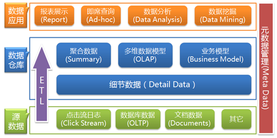

图 11数据仓库基本体系结构1

 

 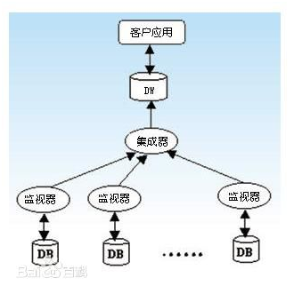

图 12数据仓库基本体系结构2

 

 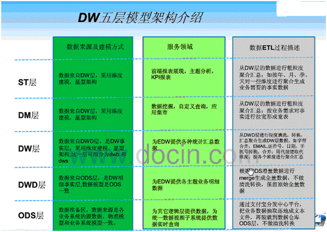

图 13 DW五层模型架构

备注：ODS~Operation Data Store操作数据存储。DWD~Dataware Detail数据仓库明细层。

 

图14 大数据的数据仓库平台架构

说明：逻辑上，一般都有数据采集层、数据存储与分析层、数据共享层、数据应用层。

**数据采集**

数据采集层的任务就是把数据从各种数据源中采集和存储到数据存储上，期间有可能会做一些简单的清洗。

数据源的种类比较多：
*  网站日志：

作为互联网行业，网站日志占的份额最大，网站日志存储在多台网站日志服务器上，

一般是在每台网站日志服务器上部署flume agent，实时的收集网站日志并存储到HDFS上；
*  业务数据库：

业务数据库的种类也是多种多样，有Mysql、Oracle、SqlServer等，这时候，我们迫切的需要一种能从各种数据库中将数据同步到HDFS上的工具，Sqoop是一种，但是Sqoop太过繁重，而且不管数据量大小，都需要启动MapReduce来执行，而且需要Hadoop集群的每台机器都能访问业务数据库；应对此场景，淘宝开源的DataX，是一个很好的解决方案（可参考文章 《[异构数据源海量数据交换工具-Taobao DataX 下载和使用](http://lxw1234.com/archives/2015/05/231.htm)》），有资源的话，可以基于DataX之上做二次开发，就能非常好的解决，我们目前使用的DataHub也是。

当然，Flume通过配置与开发，也可以实时的从数据库中同步数据到HDFS。
*  来自于Ftp/Http的数据源：

有可能一些合作伙伴提供的数据，需要通过Ftp/Http等定时获取，DataX也可以满足该需求；
*  其他数据源：

比如一些手工录入的数据，只需要提供一个接口或小程序，即可完成；

 

### 4.2.2 数据集市架构

[数据集市](https://baike.baidu.com/item/数据集市)(Data Mart) ，也叫数据市场，数据集市就是满足特定的部门或者用户的需求，按照多维的方式进行存储，包括定义维度、需要计算的指标、维度的层次等，生成面向决策分析需求的数据立方体。

 

## 4.3   数据仓库建模

DW三种常见模型：E/R关系、维度和Data Vault 模型。

 

### 4.3.1 E/R范式建模

参见 数据模型。

### 4.3.2 kimball维度模型

《The Data Warehouse Toolkit: The Definitive Guide to Dimensional Modeling (3rd ed.)》

**评论**：《数据仓库工具箱（第3版）-- 维度建模权威指南》英文初版1996年，二版1998年，三版2015年。kimball是本书作者，也是kimball集团的创始人。第三版共21章其中14章是14个行业的建模案例。

 

表格 6 维度建模常用术语

| 名词       | 定义                                                         |
| ---------- | ------------------------------------------------------------ |
| 维度       | Dimension，相当于SQL中的GROUP BY                             |
| 度量       | 对于在事实表或者一个多维立方体里面存放的数值型的、连续的字段，就是度量。 |
| cube立方体 | 指的是维度的组合，是2^N。如3个维度有8种组合（1，2，3，12，13，23，123，空）。 |
| 事实表     | 数据仓库结构中的中央表，它包含联系事实与维度表的数字度量值和键。事实数据表包含描述业务（例如产品销售）内特定事件的数据。 |
| 维度表     | 维度属性的集合。可分为细节维度和维度子集（子维度，如更高粒度的汇总）。 |
| 层次维度   | 如日期有四个层次：年、季度、月和日。                         |
| 退化维度   | 指减少维度的数量，通常被保留作操作型事务的标识符。           |
| 杂项维度   | 一种包含的数据具有很少可能值的维度，如标志和指示符字段。     |
| 周期事实表 |                                                              |
| 累积事实表 |                                                              |

 

维度模型常见的有：星型、雪花。

核心概念：事实表、维度表、度量、粒度。

**事实表**：事实表是数据仓库结构中的中央表，它包含联系事实与维度表的数字度量值和键。事实数据表包含描述业务（例如产品销售）内特定事件的数据。

**维度表**：维度表是维度属性的集合。是分析问题的一个窗口。是人们观察数据的特定角度，是考虑问题时的一类属性，属性的集合构成一个维。把逻辑业务比作一个立方体，产品维、时间维、地点维分别作为不同的坐标轴，而坐标轴的交点就是一个具体的事实。也就是说事实表是多个维度表的一个交点，而维度表是分析事实的一个窗口。

**度量：**对于在事实表或者一个多维立方体里面存放的数值型的、连续的字段，就是度量。这符合上面的意思，有标准，一个度量字段肯定是统一单位，例如元、户数。

粒度：

 

维度模型的逻辑表示：星型、雪花型。

构建过程

1)     选择业务流程。

2)     声明粒度。粒度用来确定事实中表示是什么。

3)     确认维度。

4)     确认事实。

 

#### 4.3.2.1 维度表技术

 

#### 4.3.2.2 事实表技术

 

### 4.3.3 Data Vault模型

此模型有中心表（HUB）、链接表(LINK）、附属表(SATELLITE）三个主要组成部分。中心表记录业务主键，链接表记录业务关系，附属表记录业务描述。

 

### 4.3.4 Anchor模型

 

## 4.4   ETL

**ETL**，是英文 Extract-Transform-Load 的缩写，用来描述将数据从来源端经过抽取（extract）、转换（transform）、加载（load）至目的端的过程。**ETL**一词较常用在[数据仓库](http://baike.baidu.com/view/19711.htm)，但其对象并不限于数据仓库。

ETL是构建数据仓库的重要一环，用户从[数据源](http://baike.baidu.com/view/286828.htm)抽取出所需的数据，经过[数据清洗](http://baike.baidu.com/view/1739747.htm),最终按照预先定义好的数据仓库模型，将数据加载到数据仓库中去。
*  Extract：处理缺省值、空值和异常值；数据类型转化；修改不合规字段；编码方式/统计口径不一致。
*  Transform：单变量自身转换；多变量相互衍生。
*  Load:

 

**数据抽取**

抽取方式：全量或增量。

抽取手段：timestamp、触发器、备案、日志

 

### 4.4.1 ETL工具

详见 《大数据开发》

## 4.5   数仓基准~TPC-H

**TPC**

事务处理性能委员会（ Transaction ProcessingPerformance Council ），是由数10家会员公司创建的非盈利组织，总部设在美国。该组织对全世界开放，但迄今为止，绝大多数会员都是美、日、西欧的大公司。TPC的成员主要是计算机软硬件厂家，而非计算机用户，它的功能是制定商务应用基准程序（Benchmark）的标准规范、性能和价格度量，并管理测试结果的发布。

 

TPC不给出基准程序的代码，而只给出基准程序的标准规范（Standard Specification）。任何厂家或其它测试者都可以根据规范，最优地构造出自己的系统（测试平台和测试程序）。（需要自己写测试工具，测试完之后提交给ＴＰＣ协会）为保证测试结果的客观性，被测试者（通常是厂家）必须提交给TPC一套完整的报告（FullDisclosure Report），包括被测系统的详细配置、分类价格和包含五年维护费用在内的总价格。该报告必须由TPC授权的审核员核实（TPC本身并不做审计），现在全球只有不到十个审核员，全部在美国。

 

### 4.5.1 TPC-H

**TPC-H的目的**

**TPC-H**主要目的是评价特定查询的决策支持能力，强调服务器在数据挖掘、分析处理方面的能力。查询是决策支持应用的最主要应用之一，数据仓库中的复杂查询可以分成两种类型：一种是预先知道的查询，如定期的业务报表；另一种则是事先未知的查询，称为动态查询（Ad- Hoc Query）。

通俗的讲，TPC-H就是当一家数据库开发商开发了一个新的数据库操作系统，采用TPC-H作为测试基准，来测试衡量数据库操作系统查询决策支持方面的能力．

 

**TPC-H的衡量指标**

它模拟决策支持系统中的数据库操作，测试数据库系统复杂查询的响应时间，以每小时执行的查询数(TPC-H QphH@Siz)作为度量指标．

**TPC-H标准规范**

TPC- H 标准规范由10章正文和5个附录组成。

 

**数据库运行的环境条件**

TPC- H 测试模型为数据库服务器连续7×24 小时工作，可能只有1 次/月的维护；多用户并发执行复杂的动态查询，同时有并发执行表修改操作。数据库模型见图1，共有8 张表，除Nation 和Region 表外，其它表与测试的数据量有关，即比例因SF（Scale Factor）

 

数据库关系图以及表各个字段定义如下图

  

​                               

图 14  TPC-H的数据表关联图

 

 

图 15 TPC-H的数据库模型

 

由于数据量的大小对查询速度有直接的影响，TPC- H 标准对数据库系统中的数据量有严格、明确的规定。用SF 描述数据量，1SF 对应1 GB 单位，SF 由低到高依次是1、10、30、100、300、1 000、3 000、10 000。需要强调，SF 规定的数据量只是8个基本表的数据量，不包括索引和临时表。

从TPC- H 测试全程来看，需要的数据存储空较大，一般包括有基本表、索引、临时表、数据文件和备份文件，基本表的大小为x；索引和临时空间的经验值为3-5 位，取上限5x；DBGEN产生的数据文件的大小为x；备份文件大小为x；总计需要的存储空间为8x。就是说SF=1，需要准备8 倍，即8 GB 存储空间，才能顺利地进行测试

 

测试语句：22个查询，2个更新

**3** **个测试**

TPC-H 测试分解为3 个子测试：数据装载测试、Power 测试和Throughput 测试。

建立测试数据库的过程被称为装载数据，装载测试是为测试DBMS 装载数据的能力。装载测试是第一项测试，测试装载数据的时间，这项操作非常耗时。Power 测试是在数据装载测试完成后，数据库处于初始状态，未进行其它任何操作，特别是缓冲区还没有被测试数据库的数据，被称为raw查询。Power 测试要求22 个查询顺序执行1 遍，同时执行一对RF1 和RF2 操作。最后进行Throughput 测试，也是最核心和最复杂的测试，它更接近于实际应用环境，与Power 测试比对SUT 系统的压力有非常大的增加，有多个查询语句组，同时有一对RF1 和RF2 更新流。

 **度量指标**

​    测试中测量的基础数据都与执行时间有关，这些时间又可分为：装载数据的每一步操作时间、每个查询执行时间和每个更新操作执行时间，由这些时间可计算出：数据装载时间、Power@Size、Throughput@Size、QphH@Size 和$/QphH@Size。

### 4.5.2 TPC基准列表

**TPC目前推出的基准程序**

TPC推出过许多基准程序，目前11套活跃基准程序，5套不被业界接受而放弃（分别是TPC-A、TPC-B、TPC-D、TPC-R、TPC-W和TPC- App）。

表格 7 TPC Active Benchmarks

| Benchmar/  Document | 当前版本 | 目的                                                         | Specification                                                | Source Code                                                  |
| ------------------- | -------- | ------------------------------------------------------------ | ------------------------------------------------------------ | ------------------------------------------------------------ |
| TPC-C               | 5.11.0   | 测试数据库系统的事务处理能力。                               | [pdf](http://www.tpc.org/TPC_Documents_Current_Versions/pdf/tpc-c_v5.11.0.pdf) | n/a                                                          |
| TPC-DI              | 1.1.0    |                                                              | [pdf](http://www.tpc.org/TPC_Documents_Current_Versions/pdf/TPC-DI_v1.1.0.pdf) | [TPC-DI_Tools_v1.1.0.zip](http://www.tpc.org/TPC_Documents_Current_Versions/download_programs/tools-download-request.asp?bm_type=TPC-DI&bm_vers=1.1.0&mode=CURRENT-ONLY) |
| TPC-DS              | 2.9.0    |                                                              | [pdf](http://www.tpc.org/TPC_Documents_Current_Versions/pdf/TPC-DS_v2.9.0.pdf) | [TPC-DS_Tools_v2.9.0.zip](http://www.tpc.org/TPC_Documents_Current_Versions/download_programs/tools-download-request.asp?bm_type=TPC-DS&bm_vers=2.9.0&mode=CURRENT-ONLY) |
| TPC-E               | 1.14.0   |                                                              | [pdf](http://www.tpc.org/TPC_Documents_Current_Versions/pdf/TPC-E_v1.14.0.pdf) | [TPC-E_Tools_v1.14.0.zip](http://www.tpc.org/TPC_Documents_Current_Versions/download_programs/tools-download-request.asp?bm_type=TPC-E&bm_vers=1.14.0&mode=CURRENT-ONLY) |
| TPC-H               | 2.17.3   | 评价特定查询的决策支持能力，强调服务器在数据挖掘、分析处理方面的能力。 | [pdf](http://www.tpc.org/TPC_Documents_Current_Versions/pdf/tpc-h_v2.17.3.pdf) | [TPC-H_Tools_v2.17.3.zip](http://www.tpc.org/TPC_Documents_Current_Versions/download_programs/tools-download-request.asp?bm_type=TPC-H&bm_vers=2.17.3&mode=CURRENT-ONLY) |
| TPC-VMS             | 1.2.0    |                                                              | [pdf](http://www.tpc.org/TPC_Documents_Current_Versions/pdf/TPC-VMS_V1.2.0.pdf) | n/a                                                          |
| TPCX-BB             | 1.2.0    |                                                              | [pdf](http://www.tpc.org/TPC_Documents_Current_Versions/pdf/TPCX-BB_v1.2.0.pdf) | [TPCX-BB_Tools_v1.2.0.zip](http://www.tpc.org/TPC_Documents_Current_Versions/download_programs/tools-download-request.asp?bm_type=TPCX-BB&bm_vers=1.2.0&mode=CURRENT-ONLY) |
| TPCX-HCI            | 1.1.3    |                                                              | [pdf](http://www.tpc.org/TPC_Documents_Current_Versions/pdf/TPCx-HCI_v1.1.3.pdf) | [TPCx-HCI_Benchmarking_Kit_v1.1.3.zip](http://www.tpc.org/TPC_Documents_Current_Versions/download_programs/tools-download-request.asp?bm_type=TPCX-HCI&bm_vers=1.1.3&mode=CURRENT-ONLY) |
| TPCX-HS             | 2.0.3    |                                                              | [pdf](http://www.tpc.org/TPC_Documents_Current_Versions/pdf/TPCX-HS_v2.0.3.pdf) | [TPCX-HS_Tools_v2.0.3.zip](http://www.tpc.org/TPC_Documents_Current_Versions/download_programs/tools-download-request.asp?bm_type=TPCX-HS&bm_vers=2.0.3&mode=CURRENT-ONLY) |
| TPCX-IOT            | 1.0.3    |                                                              | [pdf](http://www.tpc.org/TPC_Documents_Current_Versions/pdf/tpcx-IoT_v1.0.3.pdf) | [TPCx-IoT_Tools_v1.0.3.zip](http://www.tpc.org/TPC_Documents_Current_Versions/download_programs/tools-download-request.asp?bm_type=TPCX-IOT&bm_vers=1.0.3&mode=CURRENT-ONLY) |
| TPCX-V              | 2.1.3    |                                                              | [pdf](http://www.tpc.org/TPC_Documents_Current_Versions/pdf/TPCx-V_v2.1.3.pdf) | [TPCx-V_Benchmarking_Kit_v2.1.3.zip](http://www.tpc.org/TPC_Documents_Current_Versions/download_programs/tools-download-request.asp?bm_type=TPCX-V&bm_vers=2.1.3&mode=CURRENT-ONLY) |

备注：数据时间截止至2018-9-8.

 

## 4.6   DW实例

表格 8 IBM与Teradata仓库模型比较

|        | IBM                                 | Teardata                                       |
| ------ | ----------------------------------- | ---------------------------------------------- |
| 银行业 | BDWM(Banking  Data Warehouse Model) | FS-LDM(Financial Services Logical  Data Model) |
| 电信业 | TDWM(Telecom Data Warehouse Model)  | TS-LDM(Telecom Services Logical Data  Model)   |

 

### 4.6.1 IBM

 

图 2 IBM数据仓库解决方案产品组成

 

### 4.6.2 TeraData

 

 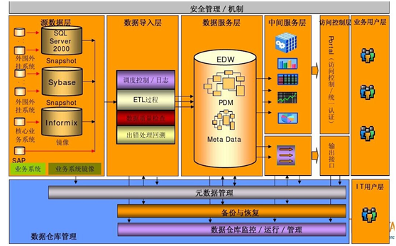

### 4.6.3 淘宝

 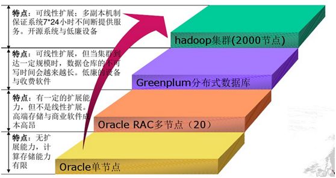

图 14 淘宝计算存储平台的发展史

 

## 4.7   本章参考

[1].   tpch  http://www.tpc.org/tpch/

[2].   TPC-H 使用 https://blog.csdn.net/leixingbang1989/article/details/8766047

[3].   大数据环境下互联网行业数据仓库/数据平台的架构之漫谈http://lxw1234.com/archives/2015/08/471.htm

[4].   数据仓库 [http://zh.wikipedia.org/wiki/%E8%B3%87%E6%96%99%E5%80%89%E5%84%B2](http://zh.wikipedia.org/wiki/資料倉儲)

[5].  TPC基准  http://www.tpc.org/tpc_documents_current_versions/current_specifications.asp

[6]: 百亿级实时大数据分析项目，为什么不用Hadoop？ http://www.yonghongtech.com/webShare/webshare_w4.html 

[7]:   Java BI新生代——百度商业运营实践 http://www.infoq.com/cn/presentations/java-bi-the-new-generation-baidu-business-practice

[8]:   阿里巴巴数据产品经理工作总结篇http://mp.weixin.qq.com/s?__biz=MjM5MDI1ODUyMA==&mid=205181896&idx=3&sn=bb2d98b6d90c86552c260791bdd30faf#rd

[9]:   淘宝数据仓库架构实践 http://wenku.baidu.com/view/72d5a86658fafab069dc02d6.html

 

 # 5  数据湖

##  数据湖简介

**数据湖定义**

数据湖是一个集中式存储库，允许您以任意规模存储所有结构化和非结构化数据。您可以按原样存储数据（无需先对数据进行结构化处理），并运行不同类型的分析 – 从控制面板和可视化到大数据处理、实时分析和机器学习，以指导做出更好的决策。

**数据湖的价值**

能够在更短的时间内从更多来源利用更多数据，并使用户能够以不同方式协同处理和分析数据，从而做出更好、更快的决策。数据湖具有增值价值的示例包括：改善客户互动、改善研发创新选择和提高运营效率。

**数据湖的挑战**

数据湖架构的主要挑战是存储原始数据而不监督内容。对于使数据可用的数据湖，它需要有定义的机制来编目和保护数据。没有这些元素，就无法找到或信任数据，从而导致出现“[数据沼泽](https://www.gartner.com/newsroom/id/2809117)”。 满足更广泛受众的需求需要数据湖具有管理、语义一致性和访问控制。

## 数据湖 VS 数据仓库

根据要求，典型的组织将需要数据仓库和数据湖，因为它们可满足不同的需求和使用案例。

数据仓库是一个优化的数据库，用于分析来自事务系统和业务线应用程序的关系数据。事先定义数据结构和 Schema 以优化快速 SQL 查询，其中结果通常用于操作报告和分析。数据经过了清理、丰富和转换，因此可以充当用户可信任的“单一信息源”。

数据湖有所不同，因为它存储来自业务线应用程序的关系数据，以及来自移动应用程序、IoT  设备和社交媒体的非关系数据。捕获数据时，未定义数据结构或  Schema。这意味着您可以存储所有数据，而不需要精心设计也无需知道将来您可能需要哪些问题的答案。您可以对数据使用不同类型的分析（如 SQL  查询、大数据分析、全文搜索、实时分析和机器学习）来获得见解。

随着使用数据仓库的组织看到数据湖的优势，他们正在改进其仓库以包括数据湖，并启用各种查询功能、数据科学使用案例和用于发现新信息模型的高级功能。Gartner 将此演变称为“分析型数据管理解决方案”或“[DMSA](https://www.gartner.com/doc/3614317/magic-quadrant-data-management-solutions)”。

| 特性          | 数据仓库                                           | 数据湖                                                       |
| ------------- | -------------------------------------------------- | ------------------------------------------------------------ |
| **数据**      | 来自事务系统、运营数据库和业务线应用程序的关系数据 | 来自 IoT 设备、网站、移动应用程序、社交媒体和企业应用程序的非关系和关系数据 |
| **Schema**    | 设计在数据仓库实施之前（写入型 Schema）            | 写入在分析时（读取型 Schema）                                |
| **性价比**    | 更快查询结果会带来较高存储成本                     | 更快查询结果只需较低存储成本                                 |
| **数据质量 ** | 可作为重要事实依据的高度监管数据                   | 任何可以或无法进行监管的数据（例如原始数据）                 |
| **用户**      | 业务分析师                                         | 数据科学家、数据开发人员和业务分析师（使用监管数据）         |
| **分析**      | 批处理报告、BI 和可视化                            | 机器学习、预测分析、数据发现和分析                           |

组织构建数据湖和分析平台时，他们需要考虑许多关键功能，包括：

| 功能                 | 功能描述                                                     |
| -------------------- | ------------------------------------------------------------ |
| 数据移动             | 数据湖允许您导入任何数量的实时获得的数据。您可以从多个来源收集数据，并以其原始形式将其移入到数据湖中。此过程允许您扩展到任何规模的数据，同时节省定义数据结构、Schema 和转换的时间。 |
| 安全地存储和编目数据 | 数据湖允许您存储关系数据（例如，来自业务线应用程序的运营数据库和数据）和非关系数据（例如，来自移动应用程序、IoT  设备和社交媒体的运营数据库和数据）。它们还使您能够通过对数据进行爬网、编目和建立索引来了解湖中的数据。最后，必须保护数据以确保您的数据资产受到保护。 |
| 分析                 | 数据湖允许组织中的各种角色（如数据科学家、数据开发人员和业务分析师）通过各自选择的分析工具和框架来访问数据。这包括  Apache Hadoop、Presto 和 Apache Spark  等开源框架，以及数据仓库和商业智能供应商提供的商业产品。数据湖允许您运行分析，而无需将数据移至单独的分析系统。 |
| 机器学习             | 数据湖将允许组织生成不同类型的见解，包括报告历史数据以及进行机器学习（构建模型以预测可能的结果），并建议一系列规定的行动以实现最佳结果。 |

## 本章参考

[1]: https://aws.amazon.com/cn/big-data/datalakes-and-analytics/what-is-a-data-lake/?nc=sn&amp;loc=2	"AWS-  什么是数据湖"

# 5  BI~自助分析

## 5.1   简介

2016年起，BI自助分析流行。移动BI也正在兴起。

 

表格 9 主流BI自助分析工具比较

|          | 细项         | Power  BI                                           | Tableau                            | superset                                                     |
| -------- | ------------ | --------------------------------------------------- | ---------------------------------- | ------------------------------------------------------------ |
| 简介     | 简介         | 2015年Microsoft推出的商业软件，由MS EXCEL发展而来。 | 2004年成立的Tableau公司。          | 2015年[airbnb](https://link.zhihu.com/?target=https%3A//github.com/airbnb/superset/blob/master/CONTRIBUTING.md%23setting-up-a-python-development-environment)推出的开源软件。python开发，最新版本0.24。 |
| 功能     | 报表访问     | 桌面、网站、移动端                                  | 桌面、网站、移动端                 | 网站                                                         |
|          | 报表制作     | 桌面                                                | 桌面                               | 网站                                                         |
|          | 数据源       | 多文件格式+上百种数据源。                           | 多文件格式+多种数据源              | csv文件+近12种数据源                                         |
|          | 图表         | 很多                                                | 很多                               | 47种，不断更新中。                                           |
|          | 共享协作     | 支持                                                | 支持                               | 不支持共享                                                   |
|          | 数据钻取     | 支持                                                | 支持                               | 不支持                                                       |
|          | 多数据源融合 | 支持                                                | 支持                               | 不支持                                                       |
| 安全性   | 安全性       | 有专门的权限管理服务器SASS。                        | 有专门的权限管理服务器。           | 账号权限管理复杂。                                           |
| 成本     | 商业成本     | 分桌面、专业和白金。桌面版免费。                    | 分桌面和服务器。桌面14天免费试用。 | 开源免费                                                     |
|          | 二次开发     | 支持第三方插件                                      | 不支持                             | 完全支持                                                     |
|          | 学习成本     | Office用户很容易适应。用户文档齐全。                | 用户文档齐全。                     | 物理表需要手工添加。文档较滞后，社区活跃。                   |
| 特性     | 优点         | 可交互、可钻取。  数据源巨多。与Excel深度嵌入。     | 出现早，用户众多，文档齐全。       | 开源免费，版本更新非常快。与  Druid深度集成。                |
|          | 缺点         | 价格不菲。                                          |                                    | 易用性                                                       |
| 适用场景 |              | 大中小型公司的BI全套解决方案                        | 大中小型公司的数据可视化。         | 中小型公司的轻量级数据可视化。                               |

备注：1. 最终更新时间为2018-3。

2. BI工具基本功能：获取数据（连接多数据源和ETL）、分析数据（建模和分析）和呈现数据（通过桌面、在线网站或移动端）。

 

## 5.2   PowerBI

  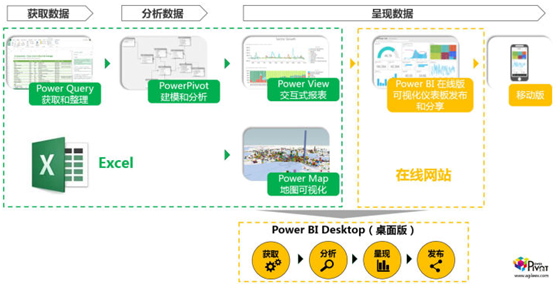

图 15 PowerBI组件图

说明：组件详解如下
*  Power Query：负责抓取和整理数据的，它可以抓取几乎市面上所有格式的源数据，然后再按照我们需要的格式整理出来。
*  Power Pivot：负责建模分析。处理数据可达到亿级。
*  Power View: 嵌套在Excel里的交互式图表工具，只用Excel也可以制作高大上的仪表板。
*  Power Map: 嵌套在Excel里的基于地图的可视化工具。
*  Power BI Online Service（在线版）：主要负责仪表板的制作和分享
*  Power BI Mobile（移动版）：iphone、Android、Windows手机上随时查看。
*  Power BI的桌面版– Power BI Desktop：集成了其它组件的主要功能

 

Power BI分为三个版本，分别是桌面版、专业和白金版。

表格 10 Power BI版本定价策略

| 版本 | Power  BI Desktop                                            | Power  BI Pro                                                | Power  BI Premium                                            |
| ---- | ------------------------------------------------------------ | ------------------------------------------------------------ | ------------------------------------------------------------ |
| 用途 | 作者                                                         | 共享和协作                                                   | 缩放大型部署                                                 |
| 费用 | free                                                         | $9.99  每用户每月                                            | 容量定价  每节点每月                                         |
| 功能 | 连接数百个[数据源](https://powerbi.microsoft.com/zh-cn/#connect-wrapper)  使用可视化工具清理和准备数据  使用自定义可视化分析和生成出色的报表  发布到 Power BI 服务  嵌入公共网站 | 构建可全方位实时查看业务的仪表板  自动保持数据最新状态，包括本地源  针对共享数据进行协作  审核和管理数据的访问和使用方式  通过应用将内容打包并分发给用户 | 获取分配、缩放和控制的专用容量  分发和[嵌入内容](https://powerbi.microsoft.com/zh-cn/power-bi-embedded/)，而无需购买每用户许可证  使用 Power BI 报表服务器在本地发布报表  针对 Pro 用户提供更多容量并降低限制 |

 

 

## 5.3   Tableau

 

## 5.4   Superset

详见另文《superset二次开发》

 

## 5.5   其它工具

### 5.5.1 Pentaho BI

[Pentaho BI](http://www.pentaho.com/)平台不同于传统的BI 产品，它是一个以流程为中心的，面向解决方案（Solution）的框架。其目的在于将一系列企业级BI产品、开源软件、API等等组件集成起来，方便商务智能应用的开发。它的出现，使得一系列的面向商务智能的独立产品如Jfree、Quartz等等，能够集成在一起，构成一项项复杂的、完整的商务智能解决方案。

Pentaho BI 平台，Pentaho Open BI 套件的核心架构和基础，是以流程为中心的，因为其中枢控制器是一个工作流引擎。工作流引擎使用流程定义来定义在BI 平台上执行的商业智能流程。流程可以很容易的被定制，也可以添加新的流程。BI 平台包含组件和报表，用以分析这些流程的性能。目前，Pentaho的主要组成元素包括报表生成、分析、数据挖掘和工作流管理等等。这些组件通过 J2EE、WebService、SOAP、HTTP、Java、JavaScript、Portals等技术集成到Pentaho平台中来。 Pentaho的发行，主要以Pentaho SDK的形式进行。

Pentaho SDK共包含五个部分：Pentaho平台、Pentaho示例数据库、可独立运行的Pentaho平台、Pentaho解决方案示例和一个预先配制好的 Pentaho网络服务器。其中Pentaho平台是Pentaho平台最主要的部分，囊括了Pentaho平台源代码的主体；Pentaho数据库为 Pentaho平台的正常运行提供的数据服务，包括配置信息、Solution相关的信息等等，对于Pentaho平台来说它不是必须的，通过配置是可以用其它数据库服务取代的；可独立运行的Pentaho平台是Pentaho平台的独立运行模式的示例，它演示了如何使Pentaho平台在没有应用服务器支持的情况下独立运行；Pentaho解决方案示例是一个Eclipse工程，用来演示如何为Pentaho平台开发相关的商业智能解决方案。
Pentaho BI 平台构建于服务器，引擎和组件的基础之上。这些提供了系统的J2EE 服务器，安全，portal，工作流，规则引擎，图表，协作，内容管理，数据集成，分析和建模功能。这些组件的大部分是基于标准的，可使用其他产品替换之。

## 5.6   本章参考

**官网**
* powerbi  https://powerbi.microsoft.com/zh-cn
* tableau  https://www.tableau.com/zh-cn
* superset官网 https://superset.incubator.apache.org

 

### 5.6.1 PowerBI 参考资料

**参考链接**
*  关于微软的Power BI介绍？ https://www.zhihu.com/question/21588013
*  Power BI系列课程地址：[从Excel到Power BI数据分析可视化](https://link.zhihu.com/?target=http%3A//study.163.com/series/1001139001.htm)
*  [一张图看懂微软Power BI系列组件](https://link.zhihu.com/?target=http%3A//www.agileex.com/powerpivotworks/2016-5-20/636.html)

 

1、PowerBI国内学习网站：

[Excel120.com](https://link.zhihu.com/?target=http%3A//www.excel120.com/)（宗萌老师个人博客）

[pbihome.net](https://link.zhihu.com/?target=http%3A//www.pbihome.net)（国内唯一PowerBI交流论坛，论坛刚起步，内容较少，但是相关这方面相关大咖均已入驻，大家学习过程中遇到什么问题都可以发帖交流）

[PowerQuery - 简书](https://link.zhihu.com/?target=http%3A//www.jianshu.com/u/234dbfc62e9d)

[Power BI - 知乎专栏](https://zhuanlan.zhihu.com/leigongzi)

[Power BI 专栏 - 知乎专栏](https://zhuanlan.zhihu.com/PowerBI) 

2、PowerBI国外学习网站：

[SQLBI](https://link.zhihu.com/?target=http%3A//www.sqlbi.com/)

[PowerPivotPro - Transforming your Business with Power Pivot and Power BI](https://link.zhihu.com/?target=http%3A//www.powerpivotpro.com/) 

[Power Query Archives – The BIccountant](https://link.zhihu.com/?target=http%3A//www.thebiccountant.com/category/power-query/) 

[Chris Webb&#x27;s BI Blog](https://link.zhihu.com/?target=https%3A//blog.crossjoin.co.uk) 

3、PowerBI公众号推荐：

《Powerpivot工坊》

《PowerBI极客》

《PowerBI大师》

《Excel120》

4、PowerBI学习线路图推荐：《[PBI系列学习框架地图 | Excel120](https://link.zhihu.com/?target=http%3A//www.excel120.com/posts/2016/04/1015.html)》

如果你想下载阅读这些电子书可以直达我们PowerBIhome论坛下载《[点击直达电子书下载](https://link.zhihu.com/?target=http%3A//pbihome.net/forum.php%3Fmod%3Dviewthread%26tid%3D43%26extra%3Dpage%3D1)》

# 6  BI行业案例

四大业务场景：
*  用户画像：服务于产品研发设计人员；针对业务需求；精准营销。
*  销售收入分析：
*  物流分析
*  财务分析

## 6.1   金融业

 

图 16 金融业业务架构

说明：考核银行盈利的传统指标包括ROE（[股权收益率](https://baike.baidu.com/item/股权收益率)）和ROA（[资产回报率](https://baike.baidu.com/item/资产回报率)），这种指标最大的缺点是没有将风险考虑在内。它们的计算公式分别为：
*  ROE=净收益/[所有者权益](https://baike.baidu.com/item/所有者权益)
*  ROA=净收益/平均资产价值

1.EVA模型：*经济增加值模型*(Economic Value Added) 是Stern Stewart咨询公司开发的一种新型的价值分析工具和业绩评价指标，EVA是基于剩余收益思想发展起来的新型价值模型。其公式为：EVA(t) = E(t) － r×C(t)－1

其中，EVA(t) 为公司在第t时间阶段创造的经济增加值大小； E(t) 为公司在t时间阶段使用该资产获得的实际收益；r 单位资产的使用成本； C(t)－1 为t时间阶段初使用的资产净值。

2. RAROC：RAROC（Risk Adjusted Return on Capital）即风险调整资本收益，是由信孚银行（Banker Trust）于20世纪70年代提出来的，RAROC其最初的目的是为了度量银行信贷资产组合的风险。

3. 精准营销：如何认识客户；客户需要的是什么；如何有效地营销和销售；如何提升客户价值和保持客户忠诚度。

 

图 17 金融业-精准营销

 

图 18 金融业-用户画像

 

 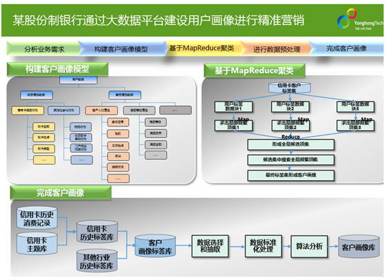

图 19 金融业-通过大数据平台建设用户画像进行精准营销

 

## 6.2   电商

电商的基本流程可归纳为：需求 - 查看宝贝 - 购买 - 售后体验。

电商行业一般分为3类指标，分别是流量、交易和商品指标。

**1、流量指标（客户行为数据）**

流量指标提供了店铺整体流量的概貌，能够帮助我们了解店铺整体的流量规模、质量、结构，并了解流量的变化趋势。

**关键指标：访客数、浏览量、跳失率、平均停留时间**

表格 11 店铺流量指标详述

| **指标**         | **简介**                                       | **作用**                                 |
| ---------------- | ---------------------------------------------- | ---------------------------------------- |
| **访客数UV**     | 单位时间内访问店铺页面或商品详情页的去重人数。 | 点击率的数据必须在一定量级才有参考价值。 |
| **浏览量PV**     | 单位时间内访问店铺页面或商品详情页的次数。     | 值越大，表明内容越受欢迎。               |
| **跳失率**       | 单位时间内PV=1的访客数/总访问数                | 值越低，表明流量的质量越好               |
| **平均停留时间** | 总停留时长/访客数，单位为秒。                  | 值越大，表明内容越受欢迎。               |

**备注：单位时间通常指一天。**

1、每日uv、pv等等……

2、热区图（把用户的行为做一个简单的可视化呈现，看看哪里点的最多，活动页面下面几屏有没有热度，如果下面有想要主推的利润高的产品，要及时往上挪）

3、转化漏斗（从访问、注册、加购、下单、付款做一个漏斗，看到底哪个环节流失客户最多，有bug修bug，有流程不顺要改善）

 

**推广数据**

1、推广总费用，总收入，ROI

2、各渠道费用，点击量，收入，ROI（可以用分组条图或柱线图来展示各渠道的费用与收入，投入高的渠道效果不一定好，通过对比可以筛选性价比最高的推广渠道）

 

**2、交易指标**

交易指标提供了店铺的整体交易情况。从访客到下单到支付的交易漏斗。

**关键指标：支付金额、转化率**

表格 12 电商交易指标详述

| **指标** | **简介**                                                     | **作用**                           |
| -------- | ------------------------------------------------------------ | ---------------------------------- |
| 支付金额 | 买家拍下后支付给卖家的金额，当天购买当天申请退款的卖家未当于处理的也计算在内。 | 判断一个店铺的规模以及市场影响力。 |
| 转化率   | 即来访客户成交占比的比例。统计时间内，支付买家数/访客数      |                                    |

**备注：淘宝将店铺分为钻石、黄金、白银、青铜等不同级别，主要的参考标准就是支付金额。**

**商品方面**

1、销售数据商品方面：1、总销售额，总销量

2、热销商品top N，热销品类top N （这些是件数，也就是销量）

3、商品销售额贡献top N，品类销售额贡献 top N （这些是金额，有些大件商品）还可以看的更细一点，每件商品的利润不一样，可以算出来：

4、利润额贡献top N，品类利润额贡献 top N。——以上有助于你划分哪些商品来引流，哪些商品来促销。

5、浏览量商品最高 top N，浏览量品类最高 top N。——看看有啥商品浏览量高却卖不出去的，要调查原因是价格不好还是什么？

 

**客户方面**
*  总访客、新访客、新注册用户、客单价用户地域分布、用户设备来源分布（浏览器或设备）、用户渠道来源分布（访问网站、百度推广、券妈妈之类的……）
*  活动期间访问趋势（一般是个线图 横轴是时间 纵轴是访问量 多线图还可以加一根销售额）

 

**3、商品指标**

**商品指标分析了与商品相关的浏览访客加购偏好异常商品等。**

关键指标：加购件数、商品收藏次数、异常商品数

表格 13电商商品指标详述

| **指标**     | **简介**                                         | **作用**                                 |
| ------------ | ------------------------------------------------ | ---------------------------------------- |
| 加购件数     | 统计时间内，访客将商品加入购物车的商品件数总和。 | 代表了消费者对产品的偏好度               |
| 商品收藏次数 | 统计时间内，商品被访客收藏的总次数               | 权重次于加购件数，一定程度上代表了人气。 |
| 异常商品数   | 出现各种异常导致的商品去重数。                   | 对于爆款影响很大，需要监控。             |

 

市场数据一般可做：行业分析、产品演变、子类目市场分析、商品属性分析、人群定位及价格定位分析、竞争对手分析、全店诊断分析、新老客户行为分析、买家分析、广告效果分析、库存分析。

 

### 6.2.1 示例：2017.11.11（购物节）

### 6.2.2 示例：2018.6.18（年中销售节）

#### 6.2.2.1 广告数据

拓端数据显示，5月30日至6月6日期间，消费者讨论最多的关键词、声量第一的是”天猫“，天猫以声量数12275位居618关键词搜索榜首。而在618的网络声量中，天猫的相关讨论均占据了40%以上内容。

”天猫618掀价格战：大家电比京东贵我就赔！“内容的转发，从媒体源数据对比中可见，此话题在微信的传播速度稍快于微博。

 

#### 6.2.2.2 销售数据

据星图统计数字显示，在6.1-6.18日整个促销期内，全网47家电商（包括综合性电商及垂直类电商），实现的总销售额为2844.7亿元。按照销售额排名的话，前五名分别是京东、天猫、拼多多、苏宁和唯品会。

从华为商城的促销数据来看，618当天的销售额约是平常日的5倍左右，销售日过后恢复平常状态。

 

**1.平台热销产品**

京东：累计下单额为1592亿。

天猫：

苏宁：持续稳居海尔、美的、海信、西门子、格力等品牌最大渠道。超市、母婴等迎来爆发，雀巢奶粉、泰国金枕头榴莲、雪花啤酒等闯入单品订单排行榜前十名。

 

 

**2.类品：手机品牌**

销量

京东：小米、荣耀、苹果、华为、360、锤子、魅族、OPPO、努比亚、vivo。

天猫：小米、苹果、荣耀、华为、魅族、vivo、OPPO、三星、中兴和酷系。

苏宁：小米、荣耀、魅族、华为、OPPO。

 

销售额

京东：苹果、荣耀、小米、华为、OPPO。

天猫：苹果、小米、荣耀、华为、vivo、魅族、三星、OPPO、美图和努比亚。

苏宁：苹果、荣耀、小米、华为、三星。

小米创始人雷军晒出的战绩显示，6月1日至18日，小米手机夺得天猫、京东、苏宁三大平台手机销量第一。

 

### 6.2.3 本节参考

[1].   电商运营如何做数据分析？ https://www.zhihu.com/question/47393031/answer/260229398

[2].   【618数据】全网47家电商总销售额2844.7亿元 京东618排第一 [www.yangqiu.cn/i100ec/4132192.html](http://www.yangqiu.cn/i100ec/4132192.html)

[3].   【大数据部落】618电商大数据分析报告  [www.sohu.com/a/151327831_826434](http://www.sohu.com/a/151327831_826434)

 

## 6.3   零售业

零售业包括了采购--库存--销售的流程。

零售业的核心问题：

1）如何快速地把商品卖出去

2）要卖哪些商品，需要进多少货。

 

1. 体系化的思路。

对于线下零售，可以有商品、店铺、顾客、员工，中间是财务。

业绩指标分成零售、金额、数量、交易笔数、客流类、平均单价、折扣率等等

 

## 6.4   制造业

**库存分析**

库存分析关键指标：库存天数、库销比

 

四类八大案例如下:

1.改善制造业的生产流程
*  案例1：某生物医药公司产能因素分析
*  案例2: 芜湖格力生产效率分析

2.定制产品设计
*  案例3：某大型制造公司精益生产
*  案例4：红领服装定制

3.更好的质量保证
*  案例5：因特尔芯片测试
*  案例6：芜湖格力生产线监控

4.理解用户需求
*  案例7：美的，改善产品设计打造爆款产品

5.市场竞争分析
*  案例8 海尔零售市场分析

 

## 6.5   本章参考

[1].   制造业大数据如何创造高价值生产 ——五大场景八大案例深度解析 https://ask.hellobi.com/blog/yonghongtech/6735

[2].   新一代银行大数据运营中心解决方案 https://ask.hellobi.com/blog/yonghongtech/3775

# 7  DM工具

详见 《AI框架分析》相应章节

# 参考资料

## 参考书目

[1].   Jiawei Han、Micheline Kamber等著，《数据挖掘：概念与技术》，机械工业出版社，2001  [ISBN 1-55860-489-8](http://zh.wikipedia.org/zh-cn/Special:网络书源/1558604898)

[2].   [**Ian H.Witten,Eide Frank** ](http://www.china-pub.com/s/?key1=%a3%a8%d0%c2%ce%f7%c0%bc%a3%a9Ian+H.Witten%2cEide+Frank) [**Data Mining: Practical Learning Tools and Techniques with Java Implementations** ](http://www.amazon.com/exec/obidos/ASIN/1558605525/qid%3D1066016823/sr%3D11-1/ref%3Dsr_11_1/104-7761378-9162309)　 [Elsevier ](http://www.china-pub.com/s/?key1=Elsevier)　2003

[3].   数据仓库工具箱：维度建模的完全指南，Ralph Kimball著, 电子工业出版社 2003.10

[4].   数据仓库生命周期工具箱：设计、开发和部署数据仓库的专家方法，Ralph Kimball著, 电子工业出版社 2009

[5].   数据仓库， W.H.Inmon著，    机械工业出版社 2003.9

[6].   数据仓库基础，Paulraj Ponniah著，电子工业出版社 2004

[7].   BernardMarr（伯纳德·马尔） 《智能大数据SMART准则-数据分析方法.案例和行动纲领》 电子工业出版社 2015

[8].   [天善智能](https://book.douban.com/search/天善智能) 《数据实践之美》 机械工业出版社 2017.1

 

## 参考链接

[1].   百度百科-BI https://baike.baidu.com/item/BI/4579902 

[2].   永洪科技-商业智能社区 https://ask.hellobi.com/

 

# 附录

## 官方组织

元数据标准组织：元数据联盟、对象管理组

 

**OLAP**

OLAP 协会建立于1995 年1 月。它的会员和成员向所有有兴趣的组织开放。到2000 年，

这个协会有16 个一般成员，主要是OLAP 产品的提供商。