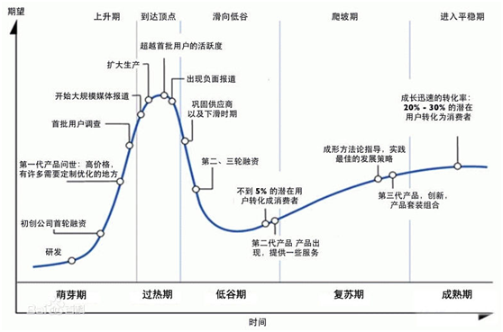
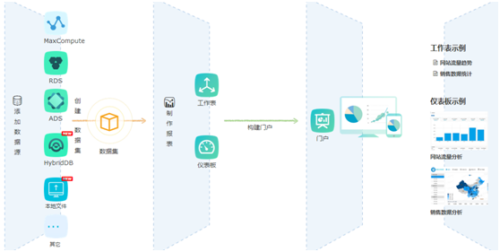
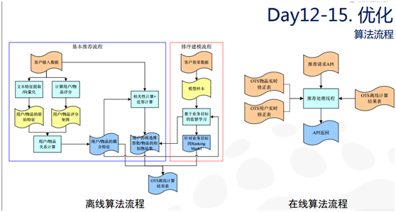
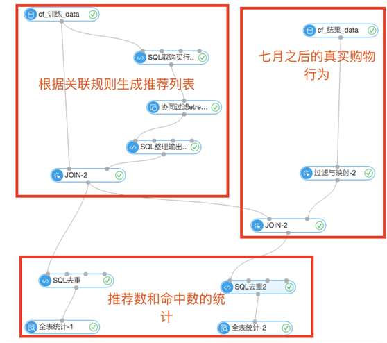
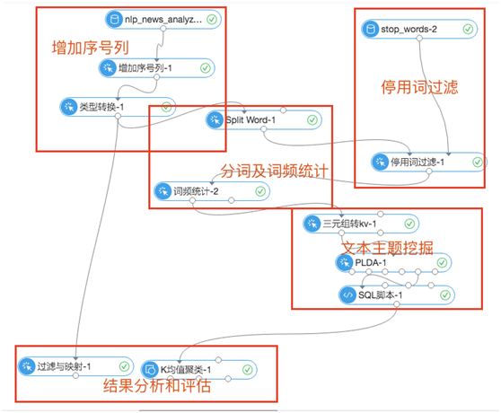

| 序号 | 修改时间  | 修改内容                         | 修改人 | 审稿人 |
| ---- | --------- | -------------------------------- | ------ | ------ |
| 1    | 2016-8-1  | 创建                             | 吴启福 |        |
| 2    | 2017-10-8 | 新增大数据挖掘实例章节           | 同上   |        |
| 3    | 2018-4-1  | 增加大数据分析平台：华为、阿里。 | 同上   |        |
| 4    | 2018-7-12 | 增加IT咨询公司~IDC和Gartner      | 同上   |        |
| 5    | 2018-9-9  | 迁移出个人数据分析章节另文。     | 同上   |        |
|      |           |                                  |        |        |
---

# 目录

[目录... 1](#_Toc16335284)

[1    大数据分析方法... 3](#_Toc16335285)

[1.1    分析理论... 3](#_Toc16335286)

[1.1.1     IBM 3A5步方法论... 3](#_Toc16335287)

[1.2    常规分析方法... 4](#_Toc16335288)

[1.2.1     数学分析... 4](#_Toc16335289)

[1.2.2     公众舆情分析... 4](#_Toc16335290)

[1.3    BI 5](#_Toc16335291)

[1.4    本章参考... 5](#_Toc16335292)

[2    公开统计数据源... 5](#_Toc16335293)

[2.1    公开统计数据主要来源... 5](#_Toc16335294)

[2.1.1     国际权威数据（跨国）... 5](#_Toc16335295)

[2.1.2     中国数据... 7](#_Toc16335296)

[2.1.3     其它经济体的数据... 9](#_Toc16335297)

[2.2    主要大数据分析商... 10](#_Toc16335298)

[2.2.1     IDC. 11](#_Toc16335299)

[2.2.2     Gartner. 11](#_Toc16335300)

[2.3    金融数据... 15](#_Toc16335301)

[2.4    生活服务... 17](#_Toc16335302)

[2.5    其它... 17](#_Toc16335303)

[2.6    本章参考... 18](#_Toc16335304)

[3    典型数据分析... 18](#_Toc16335305)

[3.1    大数据在行业中的应用... 18](#_Toc16335306)

[3.2    不同领域的数据分析和应用... 19](#_Toc16335307)

[3.2.1     社交网站... 19](#_Toc16335308)

[3.2.2     金融、电商... 19](#_Toc16335309)

[3.2.3     生活... 19](#_Toc16335310)

[3.2.4     其它... 20](#_Toc16335311)

[3.3    数据冰山 - 知乎专栏... 20](#_Toc16335312)

[3.4    本章参考... 21](#_Toc16335313)

[4    大数据挖掘案例... 21](#_Toc16335314)

[4.1    大数据挖掘案例列表... 21](#_Toc16335315)

[4.2    案例1：文本数据挖掘... 23](#_Toc16335316)

[4.3    本章参考... 23](#_Toc16335317)

[5    大数据分析平台... 23](#_Toc16335318)

[5.1    华为HW云... 23](#_Toc16335319)

[5.2    阿里云的大数据平台... 24](#_Toc16335320)

[5.2.1     数加平台介绍... 24](#_Toc16335321)

[5.2.2     MaxCompute. 26](#_Toc16335322)

[5.2.3     BI 26](#_Toc16335323)

[5.2.4     推荐系统... 27](#_Toc16335324)

[5.2.5     实验案例... 30](#_Toc16335325)

[5.2.6     本节参考... 35](#_Toc16335326)

[5.3    AWS亚马逊云... 35](#_Toc16335327)

[5.4    H3C大数据平台Data Engine. 35](#_Toc16335328)

[5.5    本章参考... 37](#_Toc16335329)

[参考资料... 37](#_Toc16335330)

[附录... 37](#_Toc16335331)

 

 

**表目录**

[表格 1国际组织的统计数据发布情况__ 5](#_Toc16335332)

[表格 2民间机构的统计数据发布情况__ 6](#_Toc16335333)

[表格 3中国经济的统计数据来源__ 7](#_Toc16335334)

[表格 4中国互联网的官方统计数据来源__ 7](#_Toc16335335)

[表格 5中国具体行业的统计数据来源__ 8](#_Toc16335336)

[表格 6美国的统计数据来源__ 9](#_Toc16335337)

[表格 7主要经济体的统计数据来源__ 9](#_Toc16335338)

[表格 8 大数据分析商列表__ 10](#_Toc16335339)

[表格 9金融业数据来源和统计分析__ 15](#_Toc16335340)

[表格 10 大数据的行业中的应用__ 18](#_Toc16335341)

[表格 11 大数据挖掘案例列表__ 21](#_Toc16335342)

[表格 12 AWS的大数据组件__ 24](#_Toc16335343)

[表格 14 实验案例列表__ 30](#_Toc16335344)

 

 

---

# 1    大数据分析方法

数据分析：基本统计、趋势分析、情感分析、回归分析

**基本统计**：性别、地区、累计分布等等。

**情感分析**：对微博正文切词，然后进行情感判别。我想了两个思路，第一个基于切词、情感词典和极性词的情感判别；第二个是基于机器学习的（与垃圾分类类似，进行情感分类；可以训练个分类器试试）。当时实现了第一个，判别了每条微博正文的情感value。然后与性别、省份做了交叉分析。

 数据处理：自然语言处理技术

统计和分析：地域占比，文本情感分析，A/B TEST，TOP N排行榜

数据挖掘：建模，聚类，分类和排名

模型预测：预测模型，机器学习，建模仿真

 

## 1.1   分析理论

### **1.1.1**  IBM **3A5步方法论**

2012年5月17日，IBM正式在中国市场发布了智慧的分析洞察(Smarter Analytics)，并从实战角度推出一套完整的方法论从转变信息到分析结果，再从分析结果到业务成果的整体途径，IBM将其总结为“3A5步”。

“3A5步”分别是掌控信息(Align)、获悉洞察(Anticipate)、采取行动(Act)、学习(Learn)和转型(Transform)。针对每一步、每一阶段，IBM都为用户提供了相应的软硬件产品和咨询服务。

​                               

图 1 IBM 3A5步方法论

针对每一步、每一阶段，IBM都为用户提供了相应的软硬件产品和咨询服务。

　　第一步掌控信息：全面收集、整合、掌控信息。随着大数据时代的企业需求不断增加，IBM推出大数据平台、分析型数据仓库等解决方案，致力于对非结构化数据、流数据等新型数据的处理和掌控。

　　第二步获悉洞察：提取洞察并预测。自2005年开始，IBM在业务分析领域不断加大投资和收购力度。目前，IBM具有全面的分析能力，包括财务绩效管理、商业智能、预测分析、内容分析和风险分析。

　　第三步采取行动：优化决策成就业务绩效。通过将掌握的信息通过分析获取洞察，用到决策平台或决策流程中，帮助企业业务人员和企业高管等决策者实现业务绩效的优化。

　　第四步学习：从每一次业务结果中获得学习和反馈，改善基于信息的决策流程。以Watson为例，从信息证据和行动结果中进行学习，在每次迭代中获取更智慧的解决方案。

　　第五步转型：制定清晰的分析战略，结合行业经验和既有案例，缔造突破性业务成果。通过确定业务的优先级分析目标、清晰一致的策略，找到新的方法、业务创新模式;通过已经有的行业解决方案和其他客户的最佳实践，识别新的业务机会和价值。

## 1.2   常规分析方法

### 1.2.1 数学分析

参考： 本人另作《数学的实践思考》

数据预处理：有效性、错误检测

相关系数：

回归分析: 线性规划

养分分析：

统计分析：

 

### 1.2.2 公众舆情分析

基于全网公开发布数据、传播路径和受众群体画像，利用*语义分析*、*情感算法*和*机器学习*，分析公众对品牌形象、热点事件和公共政策的认知趋势。

 

**热词分析**

挖掘网络的热议词语，分析这个词语相关联的词语网络，通过词语网络筛选相应的详细舆情信息，同时可以结合用户情感及舆情媒体来源来快速定位想要查看的信息，帮助企业聚类用户反馈，提升企业形象及优化产品体验。

 

**舆情分析**

自定义关键词组来爬取全网的舆情信息，支持各种新闻媒体、贴吧、微信、微博、论坛站点的爬取；然后根据这些舆情内容分析关注度及情感走势、渠道分布、热门事件等。

 

**媒体传播路径分析**

对单条微博的传播情况进行多维度分析，完整呈现微博的传播路径、曝光及转发量，通过传播账号识别传播者的情感分析、账号类型及地域性别等。

 

**事件分析**

挖掘网络上的热门事件，通过事件脉络及趋势分析全观事件内容，同时挖掘出事件涉及最多的主体有哪些，分析与这些主体有关联的词语，点击关联词语，可以搜索到对应的详情舆情，分析渠道来源及情感强弱。

## 1.3   BI

详见 《BI专题》

## 1.4   本章参考

 

# 2    公开统计数据源

## 2.1   公开统计数据主要来源

参考：中国国家统计局《[国际统计](http://www.stats.gov.cn/tjzs/tjbk/nsbzs/201310/P020140226567578845081.pdf)》、《[如何获取统计数据](http://www.stats.gov.cn/tjzs/tjbk/201502/P020150212355160516322.pdf)》

### 2.1.1 国际权威数据（跨国）

参见：国际组织网站http://data.stats.gov.cn/international/org?m=

国际数据权威发布主要有国际组织、主要经济体相关部门和民间机构三大来源。

 

国际组织的统计数据发布情况如下表：

表格 1国际组织的统计数据发布情况

| 来源                     | 网页                                                         | 发布内容                                                     |
| ------------------------ | ------------------------------------------------------------ | ------------------------------------------------------------ |
| 联合国统计司（UNSD）     | http://unstats.un.org/unsd/syb/  [http://unstats.un.org/unsd/mbs](http://unstats.un.org/unsd/mbs/app/DataSearchTable.aspx) | 国民经济核算、国际贸易、工业、能源、人口、环境和社会全球主要统计信息。提供月度在线数据（2000年始）、千年发展指数、统计年鉴（PDF格式可免费下载）等等 |
| 联合国粮农组织（FAO）    | http://www.fao.org/                                          | 世界主要粮食供给、需求和价格等统计信息。                     |
| 世界卫生组织（WHO）      | http://www.who.int                                           | 193个会员国卫生统计信息的年度数据及有关报告。                |
| 世界贸易组织（WTO）      | http://www.wto.org/    [WTO database](http://stat.wto.org/StatisticalProgram/WSDBStatProgramSeries.aspx?Language=E) | 国际贸易统计、贸易报告等。                                   |
| 国际劳工组织（ILO）      | http://www.ilo.org/                                          | 国际劳工统计信息。                                           |
| 世界银行（WB）           | http://www.worldbank.org/    http://data.worldbank.org.cn/?display=graph | 有关各国发展的部分统计信息及有关报告。  可在线搜索数据。     |
| 国际货币基金组织（IMF）  | [http://www.imf.org/](http://www.imf.org/external/index.htm) | 有关IMF贷款、汇率及其它经济、金融等一系列时序统计信息、相关报告、统计手册等。 |
| 经济合作发展组织（OECD） | http://stats.oecd.org/mei/  [OECD iLibrary](http://www.oecd-ilibrary.org/economics/country-statistical-profiles-key-tables-from-oecd_20752288) | 经合组织主要成员和主要非成员经济体经济统计信息及有关报告，OECD经济领先指数等。 |
| 亚洲开发银行（ADB）      | http://www.adb.org/                                          | 有关亚行发展中成员的基本经济、金融、社会统计信息及相关报告。 |
| 欧盟统计局               | http://ec.europa.eu/eurostat/                                | 欧洲及欧洲国家主要经济、金融和社会发展信息。                 |
| 欧洲中央银行             | http://www.ecb.europa.eu    [ECB   Database](http://sdw.ecb.europa.eu/browse.do?node=9484572) | 欧洲欧元区货币政策，货币、银行和金融市场统计信息，以及政府财政、国际收支等。 |
|                          |                                                              |                                                              |

 

表格 2民间机构的统计数据发布情况

| 来源                                          | 网页                                                         | 发布内容                                                     |
| --------------------------------------------- | ------------------------------------------------------------ | ------------------------------------------------------------ |
| 路透社                                        | [www.reuters.com](http://www.reuters.com)                    | 全球主要投票、债券市场交易情况，原油等大宗商品价格、主要币种汇率信息。 |
| 波罗的海航交所                                | http://www.balticexchange.com/                               | 波罗的海干散货指数。                                         |
| 经济时间序列网                                | http://www.economagic.com/                                   | 付费网站                                                     |
| IPUMS                                         | http://www.ipums.org/                                        | 普查数据的集成网站，包括人口、地理、居民生活、收入和消费信息。 |
| ICPSR                                         | http://www.icpsr.umich.edu/icpsrweb/ICPSR/                   | Umich的数据中心收集的数据集，社会科学常用的大部分微观数据都能在这里找到，但在做跨国比较时工作量较大。 |
| CIA world factbook                            | https://www.cia.gov/library/publications/the-world-factbook/ | 美国中央情报局收集的数据，包括地理、人口、社会、交通、军力等信息。 |
| [FRED](http://research.stlouisfed.org/fred2/) | http://research.stlouisfed.org/fred2/  [Federal Reserve   Economic Data](http://research.stlouisfed.org/fred2/) |                                                              |
|                                               |                                                              |                                                              |

 

### 2.1.2 中国数据

参见：部门数据http://data.stats.gov.cn/department/index?m=

表格 3中国经济的统计数据来源

| 来源                          | 网页                                                         | 发布内容                                                     |
| ----------------------------- | ------------------------------------------------------------ | ------------------------------------------------------------ |
| 中国国家统计局/中国统计信息网 | http://www.stats.gov.cn/                                     | 中国国民经济社会的年度、季度和月度数据。另外**国际数据**中也有全球大多数国家1997年以来的少量指标数据。 |
| 国务院发展研究中心信息网      | http://202.204.214.109:8080/  http://www.drcnet.com.cn/      | 提供国研、宏观经济、行业等数据。                             |
| 中国经济信息网（中经网）      | [http://www.cei.gov.cn/](http://bbs.pinggu.org/linkto.php?url=http%3A%2F%2Fwww.cei.gov.cn%2F) | 由国家信息中心组建的，以提供经济信息服务为主的专业性信息网络。它的特点就是时效性和权威性。 |
| 中国宏观经济信息网            | [http://www.macrochina.com.cn/](http://bbs.pinggu.org/linkto.php?url=http%3A%2F%2Fwww.macrochina.com.cn%2F) |                                                              |
| 中国人民银行（央行）          | http://www.pbc.gov.cn/                                       | 汇率、存贷款利率、[公开市场操作](http://www.pbc.gov.cn/publish/zhengcehuobisi/615/index.html)等。 |
| 中国债券信息网                | [www.chinabond.com.cn/](http://www.chinabond.com.cn/)        | 债券市场的月份统计数据                                       |
| 中经网统计数据库              | http://cedb.cei.gov.cn/　（无法访问）                        | “中国经济统计数据库”目前包括“宏观月度库”、“综合年度库”、“行业月度   库”、“海关月度库”和“城市年度库”5个子库。世界经济统计数据库包括OECD月度库和OECD年度库。 |

说明:

 

表格 4中国互联网的官方统计数据来源

| 类别                                                         | 来源                                                         | 简介                                                         | 发布内容                                                     |
| ------------------------------------------------------------ | ------------------------------------------------------------ | ------------------------------------------------------------ | ------------------------------------------------------------ |
| 官方                                                         | [CAC.国家互联网信息办公室](http://www.cac.gov.cn)            | 成立于2011年5月，主要职责包括落实[互联网](http://baike.baidu.com/subview/6825/18005829.htm)信息传播方针政策和推动互联网信息传播法制建设，指导、协调、督促有关部门加强互联网信息内容[管理](http://baike.baidu.com/view/18841.htm)，依法站等。 | 1997，CNNIC成立。  2001，中国互联网协会成立。  2011，CAC成立。 |
| [CNNIC中国互联网信息中心](http://www.cnnic.net.cn/)（China Internet  Network Information Center，简称[CNNIC](http://baike.baidu.com/view/21970.htm)） | 中国互联网络信息中心是经国家主管部门批准，于1997年6月3日组建的管理和服务机构，行使国家[互联网络信息中心](http://baike.baidu.com/view/7114483.htm)的职责。 | 下辖[CNIDP](http://www.cnidp.cn/).中国互联网数据平台；  CNNIC的互联网使用状况调查；  《中国互联网发展》系列报告 |                                                              |
| [CERT国家互联网应急中心](http://www.cert.org.cn)（国家计算机网络应急技术处理协调中心的简称，CNCERT) | 成立于1999年9月，是一个非政府非盈利的网络安全技术协调组织。  | 下辖[CNVD](http://www.cnvd.org.cn/).国家信息安全漏洞共享平台 |                                                              |
| [iTrust.中国互联网信用中心](http://www.itrust.org.cn/)       | 2008年始，中国互联网协会专门成立“企业信用评价中心”和“企业信用评价专家评审委员会”。 | 个人、企业的信用评价和查询                                   |                                                              |
| 官方研究院                                                   | [中国信息通信研究院](http://www.catr.cn/)（工信部电信研究院） | 前身为邮电部邮电科学研究院(始建于1957年)，1994年正式组院，现为工业和信息化部直属科研事业单位，是国家在信息通信领域(ICT)最重要的支撑单位以及工业和信息化部综合政策领域主要依托单位。 | 通信设备产业白皮书（2014）、网络与信息安全产业（2015年）、  物联网白皮书（2015年）、  移动互联网（2015年）、  云计算（2016年）、  移动智能终端暨智能硬件白皮书（2016） |
| [中国电子技术标准化研究院](中国电子技术标准化研究院)（工信部第四研究院，CESI） | 创建于1963年，是工业和信息化部直属事业单位，是国家从事电子信息技术领域标准化的专业研究机构。在 2011年底根据中央编办《关于工业和信息化部电子工业标准化研究所更名的批复》，部人事教育司已正式批准CESI由“所”改“院”。 | 大数据（2014年）、  智能终端（2014年）、  云计算（2014年）、  中国智慧城市（2014年） |                                                              |
|                                                              |                                                              |                                                              |                                                              |
| 其它官方                                                     | 全国扫黄办、                                                 |                                                              |                                                              |
| 中国互联网协会                                               | 2001年成立。                                                 |                                                              |                                                              |
|                                                              | 中国互联网大会                                               |                                                              |                                                              |
|                                                              | 全球互联网大会                                               | 2014年首届于浙江乌镇举办。                                   |                                                              |
|                                                              |                                                              |                                                              |                                                              |

 

表格 5中国具体行业的统计数据来源

| 行业     | 网址                                                         | 说明 |
| -------- | ------------------------------------------------------------ | ---- |
| 金融业   | 迈博汇金（券商报告较全）  http://www.microbell.com/  [和讯](http://calendar.hexun.com/country/)（中文版的全球宏观经济数据2003-2012） |      |
| 房地产业 |                                                              |      |
|          |                                                              |      |

 

### 2.1.3 其它经济体的数据

参见：各国统计网站http://data.stats.gov.cn/international/site?m=

表格 6美国的统计数据来源

| 来自美国的统计数据     |                                                              |                                                              |
| ---------------------- | ------------------------------------------------------------ | ------------------------------------------------------------ |
| 来源                   | 网址                                                         | 发布内容                                                     |
| 美联储                 | [www.federalreserve.gov](http://www.federalreserve.gov)      | 银行资产和负债、股票债券、利率汇率、工业生产和产能利用率等统计信息。 |
| 财政部                 | [www.treasury.gov](http://www.treasury.gov)                  | 利率、国家储备、政府融资统计信息等。  每年出版《美国统计摘要》（Statistical abstract of the U.S.）（1878-）。 |
| 商务部普查局           | [www.census.gov](http://www.census.gov)                      | 人口及住房普查资料、经济普查资料、社区调查及其它调查信息。   |
| 商务部经济分析局       | [www.bea.gov](http://www.bea.gov)                            | 国民经济核算资料、国际贸易、产业统计及分地区经济资料。  每月出版《当代商业纵览》（Survey of Current Business）。 |
| 劳工部劳工统计局       | http://Stats.bls.gov                                         | 就业失业、劳动生产率、工资福利及工伤、通货膨胀和物价统计信息。 |
| 能源部能源信息管理局   | [www.eia.gov](http://www.eia.gov)                            | 能量储量、生产、需求、技术等统计信息。                       |
| 联邦教育部             | [www.ed.gov](http://www.ed.gov)                              | 全国及各联邦有关教育类统计信息。                             |
| 农业部                 | [www.usda.gov](http://www.usda.gov)                          | 食品、农业、农村资源及农村社会经济统计信息。                 |
| 卫生部国家卫生统计中心 | [www.cdc.gov/nchs](http://www.cdc.gov/nchs)                  | 疾病、残疾、婚姻、生育、死亡等统计信息。                     |
| 美国商品调查局         | [www.crbtrade.com](http://www.crbtrade.com)                  | CRB指数。                                                    |
| 美国中情局             | [https://www.cia.gov/](http://bbs.pinggu.org/linkto.php?url=https%3A%2F%2Fwww.cia.gov%2F) |                                                              |
|                        |                                                              |                                                              |

补充：《总统经济报告》（Economic Report of President）美国政府印刷办公室出版、经济顾问委员会撰写[www.access.gpo.gov/eop](http://www.access.gpo.gov/eop) 

 

表格 7主要经济体的统计数据来源

| 来源       | 网页                                    | 发布内容                                                     |                                                  |
| ---------- | --------------------------------------- | ------------------------------------------------------------ | ------------------------------------------------ |
| 日本       | 统计局                                  | [www.stat.go.jp](http://www.stat.go.jp)                      | 日本金融、物价、消费、就业等主要经济金融统计信息 |
| 日本央行   | [www.boj.or.jp](http://www.boj.or.jp)   | 货币供应、存贷款情况、利率汇率、国际收支、政府债券等统计     |                                                  |
| 经济产业省 | [www.meti.go.jp](http://www.meti.go.jp) | 工业、第三产业及部分行业调查统计信息。                       |                                                  |
| 内阁府     | [www.cao.go.jp](http://www.cao.go.jp)   | 日本国民经济核算、日本商情指数、机械订单信息以及消费者信心调查、经济展望调查等。 |                                                  |
| 俄罗斯     | 统计局                                  | http://www.gks.ru/                                           | 俄罗斯经济、金融、社会主要统计信息。             |
| 巴西       | 国家地理和统计局                        | http://www.ibge.gov.br                                       | 巴西经济、金融、社会主要统计信息。               |
| 印度       | 统计和计划执行部                        | [www.mospi.nic.in](http://www.mospi.nic.in)                  | 印度经济、金融、社会主要统计信息。               |
| 澳大利亚   | 统计部                                  | http://www.abs.gov.au/                                       | 澳大利亚经济、金融、社会主要统计信息。           |
|            |                                         |                                                              |                                                  |

 

## 2.2   主要大数据分析商

表格 8 大数据分析商列表

| 网站                                      | 简介                                                         | 提供数据内容                                                 | 备注                                                  |
| ----------------------------------------- | ------------------------------------------------------------ | ------------------------------------------------------------ | ----------------------------------------------------- |
| [alexa](http://www.alexa.com/)            | Alexa是一家专门发布网站世界排名的网站。以[搜索引擎](http://baike.baidu.com/view/1154.htm)起家的Alexa创建于1996年4月（美国），目的是让互联网网友在分享虚拟世界资源的同时，更多地参与互联网资源的组织。1999年，被[亚马逊](http://baike.baidu.com/subview/27780/6672342.htm)公司以约价值两亿五千万美元的股票买下。 | 查看网站流量及排名                                           | 需要安装alexa工具栏才会被计入流量，欧美比较流行准确。 |
| 百度：[百度指数](http://index.baidu.com/) | [百度指数](http://baike.baidu.com/view/1235.htm)是以百度海量[网民](http://baike.baidu.com/view/7657.htm)行为数据为基础的数据分享平台，是当前互联网乃至整个数据时代最重要的统计分析平台之一，自发布之日便成为众多企业营销决策的重要依据。百度指数能够告诉用户：某个关键词在百度的搜索规模有多大，一段时间内的涨跌态势以及相关的新闻舆论变化，关注这些词的网民是什么样的，分布在哪里，同时还搜了哪些相关的  词，帮助用户优化数字营销活动方案。  截至2014年，[百度指数](http://baike.baidu.com/view/1235.htm)的主要功能模块有：基于单个词的趋势研究（包含整体趋势、PC趋势还有移动趋势）、需求图谱、舆情管家、人群画像；基于行业的整体趋势、地域分布、人群属性、搜索时间特征。 | 百度统计、  百度指数、  百度搜索风云榜  基于搜索引擎的查询词趋势研究。 |                                                       |
| 谷歌                                      |                                                              | Google Analytics、  DoubleClick Ad Planner  Google Trends    |                                                       |
| [艾瑞咨询](http://www.iresearch.com.cn/)  | iResearch*艾瑞咨询*成立于2002年,由杨伟庆发起创立, 是最早涉及互联网研究的第三方机构，致力成为中国大数据时代下最佳互联网收视率及消费者洞察公司。 | 互联网大数据研究。                                           |                                                       |
| [易观分析](http://www.analysys.cn)        | *易观*国际成立于2000年,是中国信息化、互联网和新媒体以及电信运营行业规模最大的基于互联网的高科技智囊机构。 | 移动互联网大数据分析                                         |                                                       |
| [新榜](http://www.newrank.cn/)            | 新榜定位于内容创业服务平台，用以衡量传播价值、品牌价值、投资价值的新榜指数，已经成为中国移动互联网内容价值标准。  中国最早提供微信公众号内容数据价值评估的第三方机构。 | 评估内容价值，包括微信、微博、网红。                         |                                                       |
| QuestMobile                               | QuestMobile(贵士移动) 专注于移动互联网数据研究，创建于2014年。创始人原易观国际员工。 |                                                              |                                                       |
| 友盟                                      | 移动互联网                                                   | APP统计                                                      |                                                       |
| [Gartner](https://www.gartner.com/)       | 创建于1979年，全球最早和最权威的IT研究与顾问咨询公司。       | 研究范围覆盖全部IT产业                                       |                                                       |
| [IDC](https://www.idc.com/)               |                                                              | PC调查数据                                                   |                                                       |
| Compete                                   |                                                              |                                                              |                                                       |
| [Wind](http://www.wind.com.cn/)           | 中国大陆领先的金融数据、信息和软件服务企业，总部位于[上海](https://baike.baidu.com/item/上海)[陆家嘴金融中心](https://baike.baidu.com/item/陆家嘴金融中心)。Wind已建成国内完整、准确的以金融证券数据为核心一流的大型金融工程和财经数据仓库。 | 资讯是[中国大陆](https://baike.baidu.com/item/中国大陆/5944925)金融数据、信息和[软件](https://baike.baidu.com/item/软件)服务企业. |                                                       |
|                                           |                                                              |                                                              |                                                       |

备注：1. IDC和Gartner是国际最具知名度的两家专业的IT研究与顾问咨询公司。

### 2.2.1 IDC

https://www.idc.com/

### 2.2.2 Gartner

https://www.gartner.com/

Gartner Group公司成立于1979年，它是第一家信息技术研究和分析的公司。2017年Gartner 26亿美元收购CEB拓展商业调研服务。

Gartner (高德纳，又译顾能公司，NYSE: IT and ITB)全球最具权威的IT研究与顾问咨询公司，成立于1979年，总部设在美国康涅狄克州斯坦福。其研究范围覆盖全部IT产业，就IT的研究、发展、评估、应用、市场等领域，为客户提供客观、公正的论证报告及市场调研报告，协助客户进行市场分析、技术选择、项目论证、投资决策。为决策者在投资风险和管理、营销策略、发展方向等重大问题上提供重要咨询建议，帮助决策者作出正确抉择。

Gartner由四大部分组成，旨在向客户提供在促进高效使用IT方面所需的全面的研究与咨询服务，这些部分包括：

1、Gartner Research & Advisory Services(Gartner研究与咨询服务)

2、Gartner Consulting(Gartner咨询)

3、Gartner Measurement(Gartner评测)

4、Gartner Community(Gartner社区)

 

#### 研究方法：魔力象限(Magic Quadrant)

**二个维度**：执行力Execute、远见性Vision

**作用**：主要用来选择卖家vendor。对于有意向找一家能满足自身需求的公司的投资者以及力图在市场中PK掉竞争者且可获得优势的企业来说，魔力象限研究报告用处极大。

案例1：国外很多客户选择供应商时，只考虑出现在魔力四象限的企业。

案例2：华为用魔力四象限来衡量自己的国际化战略。通用存储-华为在2010~2011进入到特定领域象限，2013~2015进入到挑战者象限；2016~进入到领导者象限。

 

​     魔力象限是在某一特定时间内的对市场情况进行的图形化描述。 魔力象限(Magic Quadrant)由Gartner公司于2006年9月25日取得“魔力象限”注册版权，并可以在获得许可的情况下重复使用。它根据Gartner公司的定义，它描述了Gartner公司依据标准对该市场内的厂商所进行的分析。

​     与单纯的给出统计数字或者列表为公司排名不同，魔力象限使用二维模型去阐释公司间的实力及差异。魔力象限基于公司发展前景的完备性和执行能力，将构成竞争的公司分成四个不同的部分。
* 利基型企业：特定领域者（Niche Players）。公司发展前景的完备性和执行能力方面都得低分的公司也许占有一定的市场份额，但还是比不上规模大一些的厂商。这些公司通常关注功能性或其他特定领域，要么就是新成立的公司。
* 有远见者：了解市场动态并且有潜力进行创新，但也许尚缺乏执行这些的能力。虽然这是早期市场中的企业标准，但是在较为成熟的市场中，有远见者则常常要么是设法实现的小企业，要么是不想按常理出牌的大厂商。
* 挑战者：执行能力高，但缺少强劲的发展势头。挑战者往往是大型一点的成熟厂商并且不愿打破其当前的发展计划。随着公司的发展他们完全有实力成为行业领袖。
* 行业领袖：公司发展前景的完备性和执行能力方面均得高分的行业领袖往往是大型的成熟公司、拥有大量客户群并且在市场上知名度极高。行业领袖在市场中有巨大的拉力，甚至有实力影响市场的整体发展方向。

 

 

图 2  Gartner魔力四象限（Magic Quadrant）

备注：尽管似乎行业领袖类别中的公司总是首选，Gartner还是建议用户对所有象限进行一一检测，因为每类的企业都有其值得注意的独一无二的强项和弱项。同时更应注意到，魔力象限设计之初是为了减少厂商搜索，并不是为用户选择厂商而指明道路的。

 

图 3 示例：魔力四象限

#### Gartner的技术成熟曲线

技术成熟度曲线（The Hype Cycle），又称技术循环曲线，光环曲线，炒作周期，指的是企业用来评估新科技的可见度，利用时间轴与市面上的可见度(媒体曝光度)决定要不要采用新科技的一种工具。

1995年开始，高德纳咨询公司依其专业分析预测与推论各种新科技的成熟演变速度及要达到成熟所需的时间，分成5个阶段：
* 科技诞生的促动期 (Technology Trigger)：在此阶段，随着媒体大肆的报道过度，非理性的渲染，产品的知名度无所不在，然而随着这个科技的缺点、问题、限制出现，失败的案例大于成功的案例，例如:.com公司 1998~2000年之间的非理性疯狂飙升期。
* 过高期望的峰值（Peak of Inflated Expectations）：早期公众的过分关注演绎出了一系列成功的故事——当然同时也有众多失败的例子。对于失败，有些公司采取了补救措施，而大部分却无动于衷。
* 泡沫化的底谷期 (Trough of Disillusionment)：在历经前面阶段所存活的科技经过多方扎实有重点的试验，而对此科技的适用范围及限制是以客观的并实际的了解，成功并能存活的经营模式逐渐成长。
* 稳步爬升的光明期 (Slope of Enlightenment)：在此阶段，有一新科技的诞生，在市面上受到主要媒体与业界高度的注意，例如:1996年的Internet ，Web。
* 实质生产的高峰期 (Plateau of Productivity)：在此阶段，新科技产生的利益与潜力被市场实际接受，实质支援此经营模式的工具、方法论经过数代的演进，进入了非常成熟的阶段

 

 

图 4 Gartner技术成熟度曲线

## 2.3   金融数据

表格 9金融业数据来源和统计分析

| 数据                                                         | 网址                                | 简介                                                         |
| ------------------------------------------------------------ | ----------------------------------- | ------------------------------------------------------------ |
| [Global   Financial Data](https://www.globalfinancialdata.com/index.html)提供的历史金融数据 | https://www.globalfinancialdata.com | GFD~历史金融数据供应机构。根据经济核心地位时期的国家数据作为参照，分析全球金融数据。  1285-1600，意大利（1285~1303/1408~1500来自威尼斯，1304~1407来自热内亚，1520~1598来自意大利）。  1606~1699，荷兰。  1700~1914，英国。  1919~今，美国。 |
| Wind资讯股票专家                                             | http://www.wind.com.cn/             | 付费的中国金融数据服务，数据及时且全。财经院校的学生，他们会提供免费的数据。 |
|                                                              |                                     |                                                              |

 

pip install Quandl

[TuShare -财经数据接口包](file:///\\link.zhihu.com\?target=http%3A//tushare.org/fundamental.html%23id4) 国内好心人做的开源财经数据接口（觉得好的可以捐助一下）。这里几乎可以获取到A股的所有信息了，还包括一些经济数据。重点是他不仅免费，还提供了一个Python库tushare。

pip install tushare
 import tushare as ts

 

1.股票
 ①新浪财经
 最多人用的就是新浪财经了，因为它是免费的，并且使用起来也不难。以下是网上找的教程：
 [获取历史和实时股票数据接口](http://link.zhihu.com/?target=http%3A//www.cnblogs.com/seacryfly/articles/stock.html)

 ②东方财富网
 网站提供了大量信息，也是基本面投资者的好去处。可以查看财务指标或者根据财务指标选股（如净资产收益率）：[选股器 _ 数据中心](http://link.zhihu.com/?target=http%3A//data.eastmoney.com/xuangu/%23Yz1beWxubDAxKDF8MC4wNSldfHM9eWxubDAxKDF8MC4wNSl8c3Q9LTE%3D)。这些都是很好的投资参考，当然还有其它功能有对应的API，可以自己分析一下。

 ③中财网
 [http://data.cfi.cn/cfidata.aspx](http://link.zhihu.com/?target=http%3A//data.cfi.cn/cfidata.aspx)提供各种产品的数据

（国内很多功能类似网站，如和讯、网易财经、雪球等等，具体的我没有一一试验就不放上来了，各位可以自己去试试，下同。）

 2. 大宗商品
 ①[黄金头条——用资讯帮你赚钱！炒黄金，看黄金头条！黄金价格](http://link.zhihu.com/?target=http%3A//www.goldtoutiao.com/)
 这里提供了各种大宗商品的行情，也可以分析获取。包括技术分析方面。

②当然还有外国网站：[Investing.com](http://link.zhihu.com/?target=http%3A//www.investing.com/)

 3. 美股等综合类

 ①Wind资讯。很多机构用的都是这里的数据，当然普通个人是拿不到的，不过如果你是财经院校的学生，他们会提供免费的数据。详见官网。

 ②[Market Data Feed and API](http://link.zhihu.com/?target=http%3A//www.xignite.com/)
 外国网站，提供了大量数据，付费。有试用期。

 ③[Quandl Financial and Economic Data](http://link.zhihu.com/?target=https%3A//www.quandl.com/)
 同上。部分免费。

 ④[96 Stocks APIs: Bloomberg, NASDAQ and E*TRADE](http://link.zhihu.com/?target=http%3A//www.programmableweb.com/news/96-stocks-apis-bloomberg-nasdaq-and-etrade/2013/05/22)
 外国网站整合的96个股票API合集，可以看看。

 ⑤雅虎财经
 [http://www.finance.yahoo.com/](http://link.zhihu.com/?target=http%3A//www.finance.yahoo.com/)
 [https://hk.finance.yahoo.com/](http://link.zhihu.com/?target=https%3A//hk.finance.yahoo.com/)

 

## 2.4   生活服务

 1.手机话费充值。[手机话费充值数据服务](http://link.zhihu.com/?target=http%3A//www.apix.cn/services/show/110)
 2.天气查询。[天气查询数据服务](http://link.zhihu.com/?target=http%3A//www.apix.cn/services/show/19)
 3.快递查询。[快递查询服务数据服务](http://link.zhihu.com/?target=http%3A//www.apix.cn/services/show/133)
 4.健康食谱。[健康食谱数据服务](http://link.zhihu.com/?target=http%3A//www.apix.cn/services/show/54)
 5.查医院。[医院大全数据服务](http://link.zhihu.com/?target=http%3A//www.apix.cn/services/show/43)
 6.水电煤缴费。[水电煤缴费数据服务](http://link.zhihu.com/?target=http%3A//www.apix.cn/services/show/114)
 7.电影大全。[电影大全数据服务](http://link.zhihu.com/?target=http%3A//www.apix.cn/services/show/29)
 8.谜语、歇后语、脑筋急转弯。[猜一猜数据服务](http://link.zhihu.com/?target=http%3A//www.apix.cn/services/show/86)
 9.音乐搜索。[音乐搜索接口数据服务](http://link.zhihu.com/?target=http%3A//www.apix.cn/services/show/140)
 10.健康知识。[健康知识数据服务](http://link.zhihu.com/?target=http%3A//www.apix.cn/services/show/44)
 11.百度糯米、团购等信息。[糯米开放api数据服务](http://link.zhihu.com/?target=http%3A//www.apix.cn/services/show/68)
 12.彩票开奖。[彩票开奖查询数据服务](http://link.zhihu.com/?target=http%3A//www.apix.cn/services/show/121)

 以上接口都来自网站：
 [APIX_国内领先的云数据服务平台_API接口服务平台](http://link.zhihu.com/?target=http%3A//www.apix.cn/)

[API数据接口_开发者数据定制](http://link.zhihu.com/?target=https%3A//www.juhe.cn/)
 [API Store_为开发者提供最全面的API服务](http://link.zhihu.com/?target=http%3A//apistore.baidu.com/)
 [API数据接口_免费数据调用-91查|91cha.com](http://link.zhihu.com/?target=http%3A//www.91cha.com/)

 

## 2.5   其它

撇去上面的API不说，如果单单爬取网页上的内容下来，那就太多可以爬的了。如：

1.爬取网站上的图片。包括贴吧、知乎、Tumblr、轮子哥、XXX（你懂的）。

2.爬取影评、电影资讯、图书等等。比如豆瓣电影。轻轻松松掌握好书好电影。

3.爬取社交网络。比如新浪微博，Twitter。（Twitter提供了API，可以提交关键字等信息爬取搜索结果中的每一条内容。）爬完可以对整个社交网络群体做个分析，情绪、作息、区域……

4.一些网站有你喜欢的文章或者帖子，但是他们没有APP或者是APP做得不友好，你可以直接爬取页面信息推送到手机上。

5.做一个微信公众号。有了上面那么多数据，还怕公众号没东西？生活服务、选股器、行情分析、文章推送等等等。

 

## 2.6   本章参考

[1].   Gartner  https://baike.baidu.com/item/Gartner/8864046?fr=aladdin

[2].   资源 | 25个深度学习开源数据集，have fun ! https://blog.csdn.net/tMb8Z9Vdm66wH68VX1/article/details/79890586

# 3    典型数据分析

## 3.1   舆情分析

### 3.1.1 简介

在时下互联网信息的浪潮下，信息的传播速度远超我们的想象。微博里一条大V的帖子，朋友圈的一个状态更新，热门论坛的一条新闻，购物平台的购物评价，可能会产生数以万计的转发，关注，点赞。如果是一些非理性负面的评论会激发人们的负面感，甚至影响到消费者对企业品牌的认同，如果不能及时的采取正确的应对措施，会造成难以估计的损失。所以我们需要一个高效的全网舆情分析系统，帮助我们实时的观测舆情。

舆情分析包括但不限于
* 舆情的影响力诊断，从传播量级和扩散趋势来做预测，确定是否最终形成舆情。
* 传播路径分析，分析舆情传播的关键路径。
* 用户画像，对舆情的参与者提供共性特征勾勒，如性别，年龄，地域和感兴趣话题。
* 情感分析，分析新闻或者评价是正面还是负面。情感分类后进行统计聚合。
* 预警设置，我们支持舆情讨论量阈值设置，达到阈值后通知推送业务方，避免错过舆情的黄金参与时间。

 

 

图 5 舆情分析数据流

 

 

图 6  舆情系统业务流程
* 原始网页存储库，这个库需要能支持海量数据，低成本，低延时写入。网页数据写入后，要做实时结构化提取，提取出来的数据再进行降噪，分词，图片ocr处理等。对分词文本，图片进行情感识别产生舆情数据结果集。传统的离线全量计算很难满足舆情系统的时效性需求。
* 计算引擎在做数据处理时，可能还需要从存储库中获取一些元数据，例如用户信息，情感词元数据信息等。
* 除了实时的计算链路，对存量数据定期要做一些聚类，优化我们的情感词识别库，或者上游根据业务需要触发情感处理规则更新，根据新的情感打标库对存量数据做一次舆情计算。

舆情的结果数据集有不同类的使用需求。对于重大舆情，需要做实时的预警。完整的舆情结果数据展示层需要支持全文检索，灵活的属性字段组合查询。业务上可能根据属性字段中的置信度，舆情时间，或者关键词组合进行分析。

### 3.1.2 架构

 

图 7 开源舆情架构图

1)     系统的最上游是分布式的爬虫引擎，根据抓取任务抓取订阅的网页原文内容。爬虫会把抓取到的网页内容实时写入Kafka队列，进入Kafka队列的数据根据前面描述的计算需求，会实时流入流计算引擎（例如Spark或者Flink），也会持久化存储在Hbase，进行全量数据的存储。全量网页的存储可以满足网页爬取去重，批量离线计算的需求。

2)     流计算会对原始网页进行结构化提取，将非结构化网页内容转化为结构数据并进行分词，例如提取出网页的标题，作者，摘要等，对正文和摘要内容进行分词。提取和分词结果会写回Hbase。结构化提取和分词后，流计算引擎会结合情感词库进行网页情感分析，判断是否有舆情产生。

3)     流计算引擎分析的舆情结果存储Mysql或者Hbase数据库中，为了方便结果集的搜索查看，需要把数据同步到一个搜索引擎例如Elasticsearch，方便进行属性字段的组合查询。如果是重大的舆情时间，需要写入Kafka队列触发舆情报警。

4)     全量的结构化数据会定期通过Spark系统进行离线计算，更新情感词库或者接受新的计算策略重新计算历史数据修正实时计算的结果。

 

 

图 8 云上舆情大数据架构

### 3.1.3 本节参考

[1].   基于大数据的舆情分析系统架构 - 架构篇 https://blog.csdn.net/weixin_43970890/article/details/90905293 

[2].   百亿级全网舆情分析系统存储设计 https://yq.aliyun.com/articles/265024 

## 3.2   大数据在行业中的应用

大数据发展趋势：Gartner技术成熟曲线。

大数据行业画像：[FirstMark](http://firstmarkcap.com/)

表格 10 大数据的行业中的应用

| 行业 | 目的       | 应用场景                                                     |
| ---- | ---------- | ------------------------------------------------------------ |
| 治理 | 治理更对症 | 舆情监控、监控视频分析、群体性事件预测、宏观经济数据监控民生应用创新 |
| 交通 | 畅行更无阻 | 车流密度监控、交通拥堵疏导、公交线路优化、城市功能区划分     |
| 零售 | 营销更精准 | 推荐系统、计算广告                                           |
| 金融 | 风控更有效 | 两个时间（授信前后）、三个对象（个人、企业、市场）、新技术（金融科技、区块链BlockChain）  个人：精准营销、风险定价、反欺诈  企业：风险监控、风险定位、反欺诈  市场：量化交易、财富组合管理 |
| 体育 | 竞技更具像 | 体能建模、转会评估、教学管理、战术分析                       |
| 教育 | 学习更个性 | 三个维度（平台、内容和工具），五个对象（主管部门、校长、老师、家长和学生） |
| 医疗 | 看病更靠谱 | 互联网医疗、医疗大数据、医疗管理、医学研究                   |
| 旅游 | 服务更周全 | 三时间（旅游前中后）、四对象（主管部门、景区、商家、游客）   |
| 农业 | 案例更清晰 | 农业机械化、优化播种、精准施肥                               |
| 制造 | 流程更高效 | 故障诊断、产品创新、工业物联网、供应链优化                   |

 

## 3.3   不同领域的数据分析和应用

### 3.3.1 社交网站

社交之**知乎**

[知乎社交网络分析（上）：基本统计](http://link.zhihu.com/?target=http%3A//www.jianshu.com/p/60ffb949113f)
 [知乎社交网络分析（下）：关注网络](http://link.zhihu.com/?target=http%3A//www.jianshu.com/p/3b2a1895a12d)

[带逛传万世 因有我参与 - 挖掘知乎里有趣的东西 - 知乎专栏](http://zhuanlan.zhihu.com/grapeot/20597170)
 [你们最爱的知乎头像 - 挖掘知乎里有趣的东西 - 知乎专栏](http://zhuanlan.zhihu.com/grapeot/20562686)
 [头像带逛 - 挖掘知乎里有趣的东西 - 知乎专栏](http://zhuanlan.zhihu.com/grapeot/20555637)

[沧海横流，看行业起伏（2015年） - 数据冰山 - 知乎专栏](http://zhuanlan.zhihu.com/hemingke/20559922) 

[知乎用户信息爬虫（规模化爬取）](https://link.zhihu.com/?target=http%3A//aljun.me/post/22)

[知乎用户图谱（用户数据分析）](https://link.zhihu.com/?target=http%3A//aljun.me/post/23)

[python爬虫 推送知乎文章到kindle电子书](https://link.zhihu.com/?target=http%3A//30daydo.com/article/7)

[编辑推荐 - 发现](https://www.zhihu.com/explore/recommendations)

 

**其它社交**

[如何利用爬虫爬微信公众号的内容？ - 移动互联网](https://www.zhihu.com/question/31285583)

[风向标-微信公众账号和文章的导航及推荐](https://link.zhihu.com/?target=http%3A//www.fxbiao.net/)

[陌陌](https://link.zhihu.com/?target=http%3A//www.apptool.com.cn/index.php/home/apprank/apprank/id/48)

[Python自定义豆瓣电影种类，排行，点评的爬取与存储](https://link.zhihu.com/?target=http%3A//blog.csdn.net/mrlevo520/article/details/51966992)

[基于python豆瓣自定义电影抓取](https://link.zhihu.com/?target=http%3A//download.csdn.net/detail/mrlevo520/9581491)

根据情绪预测股市[http://battleofthequants.net/wp-content/uploads/2013/03/2010-10-15_JOCS_Twitter_Mood.pdf](http://link.zhihu.com/?target=http%3A//battleofthequants.net/wp-content/uploads/2013/03/2010-10-15_JOCS_Twitter_Mood.pdf)

### 3.3.2 金融、电商

**金融**

[python 获取中国证券网的公告](https://link.zhihu.com/?target=http%3A//www.30daydo.com/article/59)

 

**电商** 

[爬取京东,亚马逊商城的数据违法吗? - 互联网](https://www.zhihu.com/question/20568741)

 

### 3.3.3 生活

**MMUbee Android:** [MMUbee - Android Apps on Google Play](https://link.zhihu.com/?target=https%3A//play.google.com/store/apps/details%3Fid%3Dmy.zh.mmubee%26hl%3Den)

 

### 3.3.4 其它

**招聘网站**

[爬下拉勾网数据进行分析--傅sir的个人主页|Alan_fu's Blog|程序设计](http://link.zhihu.com/?target=http%3A//fualan.com/article/44/)

 

[apptool，应用工具，app排名查询，app排名优化，app排名，应用市场排名](https://link.zhihu.com/?target=http%3A//www.apptool.com.cn/index.php/home/)

一条数据狗的上海房价研究 https://zhuanlan.zhihu.com/p/20827121

 

全球网络设备 [zoomeye.org/statistic/device](https://link.zhihu.com/?target=http%3A//www.zoomeye.org/statistic/device)

全球 Web 服务 [zoomeye.org/statistic/w](https://link.zhihu.com/?target=http%3A//www.zoomeye.org/statistic/web)eb

[你是怎样利用互联网赚到自己的第一桶金的？ - 知乎用户的回答](http://www.zhihu.com/question/28278308/answer/40654262)

 

 

 

## 3.4   [数据冰山 - 知乎专栏](http://zhuanlan.zhihu.com/hemingke)

汽车之家

[大数据画像：宝马车主究竟有多任性？ - 数据冰山 - 知乎专栏](http://zhuanlan.zhihu.com/hemingke/20573253) 利用论坛发言的抓取以及NLP，对各种车型的车主做画像。

 

**天猫、京东、淘宝等电商网站**

[超越咨询顾问的算力，在用户理解和维护：大数据改变管理咨询（三） - 数据冰山 - 知乎专栏](http://zhuanlan.zhihu.com/hemingke/20583037)，抓取各大电商的评论及销量数据，对各种商品（颗粒度可到款式）沿时间序列的销量以及用户的消费场景进行分析。

 

**58同城的房产、安居客、Q房网、搜房等房产网站**

[下半年深圳房价将如何发展 - 数据冰山 - 知乎专栏](http://zhuanlan.zhihu.com/hemingke/20135185)，抓取房产买卖及租售信息，对热热闹闹的房价问题进行分析。

 

**大众点评、美团网等餐饮及消费类网站**

[黄焖鸡米饭是怎么火起来的？ - 何明科的回答](https://www.zhihu.com/question/24331936/answer/48616123)，抓取各种店面的开业情况以及用户消费和评价，了解周边变化的口味，所谓是“舌尖上的爬虫”。

 

**58同城等分类信息网站**

[花10万买贡茶配方，贵不贵？ - 何明科的回答](https://www.zhihu.com/question/39843548/answer/83532516)，抓取招商加盟的数据，对定价进行分析，帮助网友解惑。

 

**拉勾网、中华英才网等招聘网站**
 [互联网行业哪个职位比较有前途？ - 数据冰山 - 知乎专栏](http://zhuanlan.zhihu.com/hemingke/20217862)，抓取各类职位信息，分析最热门的职位以及薪水。

 

**挂号网等医疗信息网站**
 [如何评价挂号网？ - 何明科的回答](https://www.zhihu.com/question/25564657/answer/44862007)，抓取医生信息并于宏观情况进行交叉对比。

 

**应用宝等App市场**
 [你用 Python 做过什么有趣的数据挖掘/分析项目？ - 何明科的回答](https://www.zhihu.com/question/28975391/answer/82797746)，对各个App的发展情况进行跟踪及预测。（顺便吹一下牛，我们这个榜单很早就发现小红书App的快速增长趋势以及在年轻人中的极佳口碑）

 

**携程、去哪儿及12306等交通出行类网站**
 [你用 Python 做过什么有趣的数据挖掘/分析项目？ - 何明科的回答](https://www.zhihu.com/question/28975391/answer/82797746)，对航班及高铁等信息进行抓取，能从一个侧面反映经济是否正在走入下行通道。

 

**雪球等财经类网站**
 抓取雪球KOL或者高回报用户的行为，找出推荐股票

 

**58同城二手车、易车等汽车类网站**
 [一年当中买车的最佳时间为何时？ - 何明科的回答](https://www.zhihu.com/question/30086195/answer/47825568)和[什么品牌或者型号的二手车残值高？更保值？反之，什么类型的贬值较快？ - 二手车](https://www.zhihu.com/question/20931757)，找出最佳的买车时间以及最保值的汽车。

 

**神州租车、一嗨租车等租车类网站**
 抓取它们列举出来的租车信息，长期跟踪租车价格及数量等信息

 

**各类信托网站**
 通过抓取信托的数据，了解信托项目的类型及规模

 

## 3.5   本章参考

[1].   [FirstMark](http://firstmarkcap.com/) 

# 4    大数据挖掘案例

## 4.1   大数据挖掘案例列表

表格 11 大数据挖掘案例列表

| 案例名称                           | 背景与挖掘目标                                       | 数据获取                                                   | 数据预处理                                                   | 模型构建                                        | 模型检验                      | 模型应用                             |
| ---------------------------------- | ---------------------------------------------------- | ---------------------------------------------------------- | ------------------------------------------------------------ | ----------------------------------------------- | ----------------------------- | ------------------------------------ |
| 电力窃漏电用户自动识别             | 目标：自动检查、判断用户是否存在漏电行为。           | 营销系统获取用户数据；电力计量自动化系统获取实时用电数据。 | 异常值~拉氏插值。  指标：电量趋势下降指标、线损率、告警类指标 | LM神经网络或  DT决策树                          | 分类结果的混淆矩阵。  ROC曲线 |                                      |
| 航空公司客户价值分析               | 客户分类；  比较客户价值；客户个性化服务。           | 客户基本信息；乘机信息；积分信息。                         | 航空公司LRFMC模型或RFM模型。                                 | K中心聚类                                       |                               | 会员升级与保级；首次兑换；交叉销售。 |
| 中医证型关联规则挖掘               | 挖掘患者症状与中医证型之间的关联关系。               | 问卷调查。                                                 | 证型系数；数据离散化                                         | 关联规则                                        |                               |                                      |
| 基于水色图像的水质评价             | 基于计算机视觉，以专家经验为基础，水质分级判别。     | 采集图像。图像特征：颜色                                   | 图像切割和颜色矩特征提取。  颜色直方图。                     | SVM                                             |                               |                                      |
| 家电电器用户行为分析与事件识别     | 识别用户                                             | 热水器采集                                                 | 属性构造（4类属性指标：时长、频率、用水的量化、用水的波动）  | 神经网络                                        |                               |                                      |
| 应用系统负载分析与磁盘容量预测     |                                                      | CPU/内存/磁盘使用信息                                      |                                                              | 平衡性检验、白噪声检验、模型识别                | 检验残差序列是否为白噪声      | 容量预测                             |
| 电子商务网站用户行为分析及服务推荐 | 用户访问推荐                                         | 用户访问日志                                               |                                                              | 推荐系统（协同过滤CF）                          |                               |                                      |
| 财政收入影响因素分析及预测模型     | 识别影响财务收入的关键特征                           |                                                            | 相关系数矩阵                                                 | 回归；神经网络                                  |                               | 灰色预测                             |
| 基于基站定位数据的商圈分析         | 对基站分群；  对商圈分群。                           | 移动运营商提供的接口数据                                   |                                                              | 谱系聚类                                        |                               |                                      |
| 电商产品评论数据情感分析           | 分析某产品的用户情感倾向。从评论中挖掘出产品优劣点。 | 某产品的文本评论数据                                       | 文本去重；文本机械压缩去词；短句删除；文本分词。             | 神经网络语言模型NNLM；语义网络分析；LDA主题模型 |                               |                                      |
|                                    |                                                      |                                                            |                                                              |                                                 |                               |                                      |
| 案例名称                           | 背景与挖掘目标                                       | 数据获取                                                   | 数据预处理                                                   | 模型构建                                        | 模型检验                      | 模型应用                             |

备注：

1. ROC：受试者工作特征曲线 （receiver operating characteristic curve，简称ROC曲线），又称为[感受性](https://baike.baidu.com/item/感受性)曲线（sensitivity curve）。以假阳性概率（False positive rate）为[横轴](https://baike.baidu.com/item/横轴)，击中概率为纵轴所组成的坐标图，和被试在特定刺激条件下由于采用不同的判断标准得出的不同结果画出的曲线。在ROC曲线上，最靠近坐标图左上方的点为敏感性和特异性均较高的临界值。曲线下面积越大越准确。

2. 航空公司LRFMC模型：用来识别客户价值的五个指标。统计时间段为观察窗口时间，一般单位为月。

| 模型  | L                                      | R                    | F        | M          | C                                |
| ----- | -------------------------------------- | -------------------- | -------- | ---------- | -------------------------------- |
| LRFMC | *会员入会时间***距观察窗口结束的月数** | 客户最近一次坐飞机-- | 飞行次数 | 总飞行里程 | 乘坐舱位所对应的*平均折扣系数*。 |

\3. 图像特征包括颜色、纹理、形状和空间关系特征等等。颜色特征主要包括颜色直方图和颜色矩方法。一幅图像的色彩分布也可认为是一种概率分布，因此图像可以用其各阶矩来表示。对于一幅RGB颜色空间的图像，具有R/G/B三个颜色通道，9个分量。
* 颜色直方图反应的是图像中颜色的组成分布。
* 颜色矩包括各个颜色通道的一、二、三阶矩。一阶颜色矩采用一阶原点矩，反映图像的整体明暗程度；二阶颜色矩采用二阶中心矩的平方根，反映图像颜色的分布范围；三阶颜色矩采用三阶中心矩的立方根，反映图像颜色分布的对称性。

 

## 4.2   案例1：文本数据挖掘

## 4.3   本章参考

 

# 5    大数据分析平台

## 5.1   华为HW云

详见 《华为专题》

## 5.2   阿里云的大数据平台

E-MapReduce 是构建于阿里云 ECS 弹性虚拟机之上，利用开源大数据生态系统，包括 Hadoop、Spark、Kafka、Storm，为用户提供集群、作业、数据等管理的一站式大数据处理分析服务。

### 5.2.1 数加平台介绍

阿里云数加平台由三大部分组成：

一、开发套件

1. 数据开发套件：

（1）大数据开发：集成可视化开发环境，可实现数据开发、调度、部署、运维、及数仓设计、数据质量管理等功能，

（2）BI报表工具，海量数据的实时在线分析、丰富的可视化效果，助您轻松完成数据分析、业务探查等，所见即所得。（特色报表：中国地图气泡表或色彩表）

（3）机器学习工具，集数据处理、特征工程、建模、离线预测为一体的机器学习平台,优质算法汇集,可视化编辑。

2. 应用开发套件：

（1）面向通用数据应用场景：提供数据应用开发的基础级工具，加速基础数据服务开发。如个性化推荐工具、数据可视化工具、快速BI站点搭建工具搭数、规则引擎工具等。

（2）面向行业垂直应用场景：提供行业相关性很高，适合特定场景的数据工具，如面向政府县级区域经济的可视化套件。

 

二、解决方案

数加针对不同的业务场景，基于平台提供的开发套件与行业服务商的能力，将多方产品串联，提供行业解决方案，如敏捷BI解决方案、交通预测解决方案、智能问答机器人等，一方面客户可以自行参考解决方案，以自助的方式完成解决方案的实施。另一方面，客户也可以咨询行业服务商或者阿里云大数据平台官方，根据客户场景，提供定制化的端到端的解决方案实施。

 

三、数据市场

访问：https://market.aliyun.com/chn/data

除了阿里云大数据官方的数据应用，我们会联合合作伙伴、ISV等来丰富大数据应用，打造大数据生态，以普惠大数据为使命，给用户提供更多更好的数据应用、数据API。

 

**aws大数据组件**

表格 12 AWS的大数据组件

| **组件类别**   | 组成                                                         | 处理过程                                                     |
| -------------- | ------------------------------------------------------------ | ------------------------------------------------------------ |
| 源目标         | OSS数据同步、写数据、读数据、MySQL数据同步                   | 数据来源多处，可以是数据库、本地文件上传。                   |
| **数据预处理** | 从二个子类和其它分述。                                       | 主要在数据进入算法流程前对数据进行去噪、填充缺失值、类型变换等操作。 |
|                | 采样过滤                                                     | 随机/加权/分层采样、过滤与映射                               |
|                | 数据合并                                                     | 合并行、列，调用SQL中JOIN、UNION                             |
|                | 其它：类型转化、增加序号号、拆分、缺失值补充、标准化、归一化、KEY-TO-TABLE、TALBE-TO-KV | 标准化：按比例将数据缩小，并落到一个区间。  归一化：作用是将每个特征的数值范围变为0到1之间。  拆分：ML中将一组数据按一定比例进行拆分，如7：3，即70%作为训练集，30%用于预测集。 |
| **特征过程**   | 从下面四个子类分述。                                         |                                                              |
|                | 特征变换                                                     |                                                              |
|                | 特征重要性评估                                               | 熵和基尼系数是表示这个特征区间对于目标值的影响。             |
|                | 特征选择                                                     | 过滤式特征选择：用来判断每个特征对于结果的影响。通过信息熵和基尼系数来表示，可以通过查看评估报告来显示最终的结果。 |
|                | 特征生成                                                     |                                                              |
| **统计分析**   | 包括协方差、数据视图、全表统计等等                           |                                                              |
| **机器学习**   | 从五个子类、评估和预测分述。                                 |                                                              |
|                | 二分类                                                       |                                                              |
|                | 多分类                                                       |                                                              |
|                | 聚类                                                         |                                                              |
|                | 回归                                                         | 线性回归，是利用数理统计中回归分析，来确定两种或两种以上变量间相互依赖的定量关系。  GBDT回归： |
|                | 关联推荐                                                     |                                                              |
|                | 评估                                                         | 评估方法有二分类、多分类、聚类、回归和混淆矩阵。评估模型的指标有准确率/召回率/F1等。 |
|                | 预测                                                         |                                                              |
| **文本分析**   | 包括分词、字符串相似度等等                                   |                                                              |
| **网络分析**   | 包括树深度、PageRank、最大联通子图、标签传播分类、标签传播聚类、单源最短路径等等。 | 最大联通子图：可以找到有通联关系的最大集合，排除无关元素。  单源最短路径：探查出每个人的一度人脉、二度人脉关系等。  标签传播分类：用已标记节点的标签信息去预测未标记节点的标签信息。 |
| 工具：SQL脚本  | SQL语法                                                      |                                                              |

备注：过滤通常可用SQL语句的WHERE限制来实现。

 

### 5.2.2 MaxCompute

 

图 9 MaxCompute生态

 

### 5.2.3 BI

 

图 10阿里云BI流程

说明：**工作表里**的交叉表可以直播查看原始数据，类似excel或者phpmyadmin的数据展现（SQL查询），智能图表则可以切换成图表的显示。**仪器表**是excel里的各种图表。门户是各种数据的组合展现模板如日志分析模板，类似站长流量跟踪系统里的数据分析。

 

图 11 工作表VS仪表盘

说明：阿里云的BI类似phpmyadmin管理MySQL的数据可视化，但数据源更多，包括oracle等等；数据可视化展现更全面，可以多维报表同时展现，并且报表更丰富，如特有的中国地图气泡图/色彩图。

### 5.2.4 推荐系统

#### 概述

推荐引擎（Recommendation Engine，以下简称RecEng，特指阿里云推荐引擎）是在阿里云计算环境下建立的一套推荐服务框架，目标是让广大中小互联网企业能够在这套框架上快速的搭建满足自身业务需求的推荐服务。

推荐服务通常由三部分组成：日志采集，推荐计算和产品对接。推荐服务首先需要采集产品中记录的用户行为日志到离线存储，然后在离线环境下利用推荐算法进行用户和物品的匹配计算，找出每个用户可能感兴趣的物品集合后，将这些预先计算好的结果推送到在线存储上，最终产品在有用户访问时通过在线API向推荐服务发起请求，获得该用户可能感兴趣的物品，完成推荐业务。

 

 

图 1 阿里云数加推荐系统流程图

 

**离线计算**

离线计算模块包含推荐业务、场景、离线算法流程的创建、编辑、删除操作，支持算法流程任务的启动、停止和日志查看，提供默认的离线推荐算法模板和创建自定义算法模板。推荐引擎中，离线流程和效果流程都是在离线计算的，离线数据规范中定义了这两类流程的数据规范。一般情况下，离线计算的输入和输出都是MaxCompute（原ODPS）表，所以离线数据规范其实上是一组MaxCompute表的格式规范，包括接入数据、中间数据和输出数据三类数据的格式规范。接入数据指客户离线提供的用户、物品、日志等数据，中间数据是在离线算法流程中产生的各种中间性质的结果数据表，输出数据是指推荐结果数据表，该结果最终将会被导入到在线存储中，供在线计算模块使用。

 

**在线计算**

推荐引擎的的在线计算负责的任务是推荐API接收到API请求时，实时对离线和近线修正产生的推荐结果进行过滤、排重、补足等处理；后者主要处理用户行为发生变化、推荐物品发生更新时，对离线推荐结果进行更新。

 

**近线计算**

推荐引擎的的近线计算主要处理用户行为发生变化、推荐物品发生更新时，对离线推荐结果进行更新。不像离线算法，天然以MaxCompute（原ODPS）表作为输入和输出，近线程序的输入数据可以来自多个数据源，如在线的表格存储（原OTS），以及用户的API请求，又或者是程序中的变量；输出可以是程序变量，或者写回在线存储，或者返回给用户。出于安全性考虑，推荐引擎提供了一组SDK供客户自定义在线代码读写在线存储（Table Store），不允许直接访问，所以需要定义每类在线存储的别名和格式。对于需要频繁使用的在线数据，无论其来自在线存储还是用户的API请求，RecEng会预先读好，保存在在线程序的变量中，客户自定义代码可以直接读写这些变量中的数据。

 

**A/B** **测试**

支持推荐算法流程的A/B测试，辅助推荐算法优化提升。允许一个场景下存在多条推荐流程（rec_path），A/B 测试也是针对同属于一个场景的不同推荐流程来进行的，在进行A/B 测试时，同一个场景下的每个推荐流程都会被分配一定的流量比例，这个比例是可以在产品界面中配置的。在执行推荐API时，推荐引擎第一步就会按照比例随机分配流量，把当前用户分配到某个推荐流程中，然后再执行这个推荐流程的在线流程。RecEng在分配流量时是完全随机的，不遵从任何规则，如某个用户一定要分配到某一条推荐流程中这样的规则。

 

**API**

推荐引擎提供多个API供客户用于业务系统对接，包括：启动数据预处理任务API、启动离线任务API、启动效果计算任务API、查询任务状态API、在线获取推荐结果API（推荐API）、在线数据更新API、系统日志采集API（日志API）。这些API需要客户集成，RecEng建议客户端将这些API统一集成在自己搭建的服务器上。

 

#### 开发流程

**1. 数据准备**

**数据源：数据表组成，可转换到mysql/json等格式，并进行数据预处理。**

| 表格                             | 字段                       | 简介                                                         |
| -------------------------------- | -------------------------- | ------------------------------------------------------------ |
| 用户表  user_meta                |                            | 描述用户元信息的数据表                                       |
| 用户属性维度表  user_meta_config |                            | 定义用户表中各元信息数据的类型                               |
| 物品表item_meta                  |                            | 描述物品元信息的数据表                                       |
| 物品属性维度表item_meta_config   |                            | 定义物品表中各元信息数据的类型                               |
| 行为表 user_behavior             | {userid, itemid, bhv_type} | 描述用户对物品的行为（包括搜索、点击、浏览、收藏等）信息的数据表 |
| 可推荐物品表rec_item_info        |                            | 可被推荐给用户的物品信息数据表，通常是物品表的子集           |

 

**2. 上传数据和预处理数据**

 

**3. 配置离线和在线算法**

 

 

**4. 从测试开发环境发布上线。**

 

**5. 效果测试**

 

### 5.2.5 实验案例

表格 13 实验案例列表

| 序号 | 实验案例名称                                                 | 目的                                                         | 输入（数据源）                                               | 输出（结论）                                                 | 应用知识                       | 处理过程                                                     |
| ---- | ------------------------------------------------------------ | ------------------------------------------------------------ | ------------------------------------------------------------ | ------------------------------------------------------------ | ------------------------------ | ------------------------------------------------------------ |
| 1.   | [人口普查统计案例](https://help.aliyun.com/document_detail/34410.html?spm=5176.doc42600.6.557.bP7BaI) | 统计学历对于收入的影响                                       | [UCI开源数据集Adult](http://archive.ics.uci.edu/ml/datasets/Adult)（32561条） | {学历、收入}  结论：学历越高平均收入越高。                   | BI：数据统计、分析             | 类型转化（*income**字段~0/1)*。  全表统计/数据视图/类型转化/SQL语句/过滤。 |
| 2.   | [心脏病预测案例](https://help.aliyun.com/document_detail/34929.html?spm=5176.doc42600.6.554.bP7BaI) | 根据一组用户的体检指标预测另一组用户是否患有心脏病。         | [UCI开源数据集heart_disease](http://archive.ics.uci.edu/ml/datasets/Heart+Disease)（300多条） | {name，概率}  结论1：心跳数影响最大、性别没有影响。  结论2： | ML：逻辑回归二分类模型（线性） | 类型转化（性别~0/1、胸部疼痛程度0~3等等）、过滤式特征选择（得到特征权重）、归一化、拆分、混淆矩阵评估 |
| 3.   | [【图算法】金融风控实验](https://help.aliyun.com/document_detail/35357.html?spm=5176.doc42600.6.552.bP7BaI) | 算出图中每个人是欺诈用户的概率                               | {start_point、end_point、count.关系紧密度}                   | {用户，tag, 权重}                                            | ML：最大联通子图               | 最大联通子图、单源最短路径、标签传播分类                     |
| 4.   | [协同过滤做商品推荐](https://help.aliyun.com/document_detail/42600.html?spm=5176.product9091750_30212.6.270.ECSVab) |                                                              | 购买行为数据{user_id、item_id、active_type、active_date}     | 推荐列表和统计命中数                                         | 推荐：关联规则、协同过滤       |                                                              |
| 5.   | [回归算法做农业贷款发放预测](https://help.aliyun.com/document_detail/43135.html?spm=5176.doc42600.6.553.bP7BaI) | 通过农业贷款的历史发放情况，预测是否给预测集的用户发放他们需要的金额的贷款。 | 贷款训练集（200多条，历史贷款数据）、贷款预测集（当前申请贷款者） | {用户，申请贷款值，预期还款金额}                             | ML：线性回归                   | 类型转换（region 0~2、claim_type~0/1）                       |
| 6.   | [新闻分类案例](https://help.aliyun.com/document_detail/43471.html?spm=5176.doc42600.6.555.bP7BaI) | 通过PLDA算法挖掘文章的主题，通过主题权重的聚类，实现新闻自动分类。 | {category、title、 content}                                  | {docs_id, 类别id}                                            | ML：PLDA算法、聚类             | 增加序号列、停用词过滤、分词及词频统计、文本主题挖掘（三元组转V1，PLDA算法、K均值聚类）、结果分析和评估。 |
| 7.   | [学生考试成绩预测](https://help.aliyun.com/document_detail/43891.html?spm=5176.doc42600.6.558.bP7BaI) | 预测学生期末成绩。                                           | 某中学在校生的家庭背景数据以及在校行为数据                   | {字段、权重}  结论：medu最正相关，mjob负相关。               | ML：逻辑回归                   | 类型转化、归一化、逻辑回归二分类、预测、混淆矩阵             |
| 8.   | [雾霾天气预测](https://help.aliyun.com/document_detail/48700.html?spm=5176.doc42600.6.559.bP7BaI) | 预测雾霾天气（PM2.5/ PM10）最相关的因子                      | 北京2016年全年天气数据                                       | {字段，权重}  结论：二氧化氮是跟雾霾天气相关性最强。         | ML：逻辑回归                   | 类型转化、归一化、拆分、随机森林或逻辑回归二分类、预测       |

备注：1. 共8个实验。实验案例涉及机器学习、BI、推荐和AI。

2. BI的报表为仪表板（即各种图表的组合），工作表可以查看原始数据。

3. ML：一般要将非数值字段作类型转化，非数值字段可能有枚举（如星座）、二元值（如性别）、多元值等等。

 

参考资料：

[【玩转数据系列一】人口普查统计案例](https://yq.aliyun.com/articles/53862?spm=5176.100244.teamconlist.9.sXpb3b) 

[【玩转数据系列二】机器学习应用没那么难，这次教你玩心脏病预测](https://yq.aliyun.com/articles/54260?spm=5176.100244.teamconlist.7.sXpb3b) 

[【玩转数据系列三】利用图算法实现金融行业风控](https://yq.aliyun.com/articles/57261?spm=5176.100244.teamconlist.3.sXpb3b) 

[【玩转数据系列四】听说啤酒和尿布很配？本期教你用协同过滤做推荐](https://yq.aliyun.com/articles/57718?spm=5176.100244.teamconlist.3.RPKvxw) 

[【玩转数据系列五】农业贷款发放预测](https://yq.aliyun.com/articles/58722?spm=5176.100244.teamconlist.3.amS6rQ) 

[【玩转数据系列六】文本分析算法实现新闻自动分类](https://yq.aliyun.com/articles/59205?spm=5176.100244.teamconlist.3.EEa648) 

 

#### 5.2.5.1 实验1：人口普查统计

 

图 12 人口普查统计的数据流程

说明：

输入（数据源）：字段除了age/education_num/hours_per_week这三个字段是double类型外，其余字段是string类型。

输出：统计学历对于收入区间（0/1）的影响：{学位、最大，平均，最小}，

​     **结论：博硕士的平均收入区间是1，学士是0，说明学历高平均收入也高。**

数据处理过程：
* 全表统计/数据视图：目的就是对数据作个刷选。
* 类型转化：收入income字段是string，要作***类型转化\***。本案例将收入大于5万设值为1，低于5万设值为0。

select age,workclass,education,education_num,occupation,race,sex,hours_per_week,native_country, **(case income when '<=50K' then 0 else 1 end) as income**_result from **${t1}**;
* 直方图（多字段）：实质上也是报表的一种，数据展现。
* SQL脚本：执行单行SQL命令。
* 过滤：实质是SQL语句中的WHERE过滤。

 

#### 5.2.5.2 实验4：协同过滤做商品推荐

本文的业务场景如下：通过一份7月份前的用户购物行为数据，获取商品的关联关系，对用户7月份之后的购买形成推荐，并评估结果。比如用户甲某在7月份之前买了商品A，商品A与B强相关，我们就在7月份之后推荐了商品B，并探查这次推荐是否命中。

 

图 13 协同过滤商品推荐的数据流程

说明：以上由三个部分组成，分别是***推荐系统\***生成推荐列表、用户直实购物形为、推荐数和命中数的统计。

 协同过滤结果，表示的是商品的关联性。{目标商品，相似度概率}

 

#### 5.2.5.3 实验6：新闻分类（文本挖掘）

https://help.aliyun.com/document_detail/43471.html?spm=5176.doc30348.6.283.T4lbaj

一、背景

新闻分类是文本挖掘领域较为常见的场景。目前很多媒体或是内容生产商对于新闻这种文本的分类常常采用人肉打标的方式，消耗了大量的人力资源。本文尝试通过智能的文本挖掘算法对于新闻文本进行分类。无需任何人肉打标，完全由机器智能化实现。

本文通过PLDA算法挖掘文章的主题，通过主题权重的聚类，实现新闻自动分类。包括了分词、词型转换、停用词过滤、主题挖掘、聚类等流程。

 

二、数据集介绍

具体字段如下：

| 字段名   | 含义     | 类型   | 描述                           |
| -------- | -------- | ------ | ------------------------------ |
| category | 新闻类型 | string | 体育、女性、社会、军事、科技等 |
| title    | 标题     | string | 新闻标题                       |
| content  | 内容     | string | 新闻内容                       |

 

三、数据探索流程

首先，实验流程图：

 

实验可以大致分为五个模块，分别是增加序号列、停用词过滤、分词及词频统计、文本主题挖掘、结果分析和评估。

**文本主题挖掘**

使用PLDA文本挖掘组件需要先将文本转换成三元形式，append_id是每篇新闻的唯一标识，key_value字段中冒号前面的数字表示的是单词抽象成的数字标识（可以用汉字内码转数字生成word_id），冒号后面是对应的单词出现的频率。三元组组件生成结果如下： (append_id word_id word_freq)

在上一步完成了文本转数字的过程，下一步数据进入PLDA算法。PLDA算法又叫主题模型，算法可以定位代表每篇文章的主题的词语。本次试验设置了50个主题，PLDA有六个输出桩，第五个输出桩输出结果显示的是每篇文章对应的每个主题的概率。

 

### 5.2.6 本节参考

[1].   [https://data.aliyun.com/](https://data.aliyun.com/?spm=5176.doc30262.2.4.pyVvAG)

[2].   [阿里云数加机器学习平台](https://data.aliyun.com/product/learn?spm=a2c0j.7906235.header.11.I2EEKW)

[3].   aws推荐引擎示例教程 https://help.aliyun.com/document_detail/35065.html?spm=5176.doc30251.6.577.BW2OHy

[4].   [21天搭建个性化推荐系统](http://docs-aliyun.cn-hangzhou.oss.aliyun-inc.com/assets/attach/30369/cn_zh/1463551649394/21天搭建推荐系统 (1).pdf)

 

## 5.3   AWS亚马逊云

2006 年，Amazon Web Services (AWS) 开始以 Web 服务的形式向企业提供 IT 基础设施服务，现在通常称为云计算。

 

## 5.4   H3C大数据平台Data Engine

**H3C历史**

2003年思科在美国突然起诉华为，为应对诉讼华为和3Com在杭州成立了华为3Com，其中华为拥有51%的股权，3Com拥有49%股份。

2005年的时候，3Com公司从华为手中又购得%2的股权，2006年3Com以8亿多美元收购了全部股份，同时华为3Com正式更名为H3C。

2014年HP收购3Com，华三成为HP全资子公司。

2016年紫光集团收购华三，并改名新华三。

关系链如下：

华三（2003~华为+3Com）-- 华三（2005~3Com） -- 华三（2014~HP） -- 新华三（2016~紫光）

 

H3C 大数据平台（Data Engine）采用开源社区 Apache Hadoop2.0 和 MPP 分布式数据库混合计算框架为用户提供一套完整的大数据平台解决方案，具备高性能、高可用、高扩展特性，可以为超大规模数据管理提供高性价比的通用计算存储能力。H3C 大数据平台提供数据采集转换、计算存储、分析挖掘、共享交换以及可视化等全系列功能，并广泛地用于支撑各类数据仓库系统、BI 系统和决策支持系统帮助用户构建海量数据处理系统，发现数据的内在价值。

 

图 14 华三大数据平台Data Engine的产品架构

H3C 大数据平台包含 4 个部分：

第一部分是运维管理，包括：安装部署、配置管理、主机管理、用户管理、服务管理、监控告警和安全管理等。

第二部分是数据 ETL，即获取、转换、加载，包括：关系数据库连接 Sqoop、日志采集 Flume、ETL 工具 Kettle。

第三部分是数据计算。MPP 采用分析型分布式数据库，存储高价值密度的结构化数据；Hadoop 存储非结构化/半结构化数据和低价值密度结构化数据。计算结果都存到数据仓库，数据仓库中的数据可直接用于分析和展示。数据仓库是面向主题的、集成的、稳定的且随时间不断变化的数据集合，用以支持经营管理中的决策制定过程。

第四部分数据服务，包括：机器学习、数据挖掘、数据检索、数据可视化、即席分析、SQL 和 API，为应用层提供服务和中间件调用。

 

**管理平台**

华三大数据平台Data Engine提供了web端的管理界面，集群部署完毕后访问https://ip:8443即可访问管理平台。

从Data Engine管理平台页面中左侧列表可以看出，平台提供各种服务，包括系统服务，数据存储，数据计算，数据服务，数据管理，MPP，以及其他服务。

其中系统服务中包括：Metrics，Kafka，Oozie，Slider，YARN，ZooKeeper，HUE。

数据存储包括：HDFS，HBase，PostgreSQL，Redis。

数据计算包括：MapReduce2，Spark，Storm，Tez。

数据服务包括：ElasticSearch，HAWQ，PXF，Hive，Mahout，Pig，Solr，HBase Indexer，Drill。

数据管理包括：Flume，Kettle，Sqoop。

MPP包括：MPP。 

其他服务包括：Zeppelin。

 

## 5.5   快手OLAP平台

 

图 15 快手 OLAP 的平台架构图

中间部分是 Druid 自有的组件，数据通过 kafka 实时摄入和离线从 Hive 数仓中批量导入。除此之外，我们还配套了完善的 Metric 系统，探针系统、Druid 数据源管理系统等。

 

 

图 16 快手druid-资源隔离部署方案

 

## 5.6   本章参考

[1].   AWS https://aws.amazon.com/cn/about-aws/

[2].   H3C大数据产品介绍 https://blog.csdn.net/bingoxubin/article/details/79072132

[3].   h3c http://www.h3c.com/cn/Products___Technology/Products/Big_Data/Catalog/DataEngine/DataEngine/

[4].   《微软大数据解决方案》 2015.5

[5].   微软解决方案体系结构 https://azure.microsoft.com/zh-cn/solutions/architecture/

[6].   快手万亿级实时 OLAP 平台的建设与实践 https://www.infoq.cn/article/IWfHmTig_KNAeEJKF8eS

# 参考资料

**书籍**
* 《Python数据分析与挖掘实战》 [张良均](https://book.douban.com/search/张良均) / [王路](https://book.douban.com/search/王路) / [谭立云](https://book.douban.com/search/谭立云) / [苏剑林](https://book.douban.com/search/苏剑林) 机械工业出版社 2016-1 9787111521235
* 《Storm分布式实时计算模式》吉奥兹 (P.Taylor Goetz)、奥尼尔机械工业出版社 / 2015-1-1
* 《Storm实时数据处理》（澳）Quinton Anderson / 卢誉声 / 机械工业出版社 / 2014-6
* 《Hadoop技术内幕 : 深入解析MapReduce架构设计与实现原理》 董西成 / 机械工业出版社 / 2013-5
* 《Hadoop技术内幕 : 深入解析Hadoop Common和HDFS架构设计与实现原理》 蔡斌、陈湘萍 / 机械工业出版社 / 2013-4

 

**网站**
* [数据冰山](https://zhuanlan.zhihu.com/hemingke)-知乎专栏 https://zhuanlan.zhihu.com/p/20217862
* IT桔子 http://www.itjuzi.com 

 

**参考链接**

[1].   有哪些网站用爬虫爬取能得到很有价值的数据？https://www.zhihu.com/question/36132174

[2].   能利用爬虫技术做到哪些很酷很有趣很有用的事情https://www.zhihu.com/question/27621722

 

# 附录