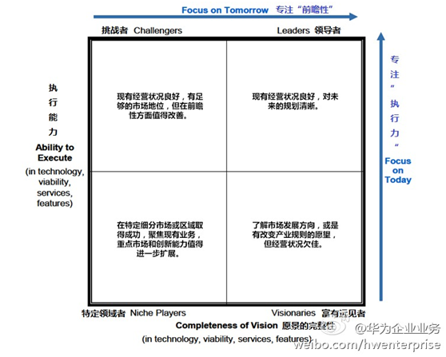
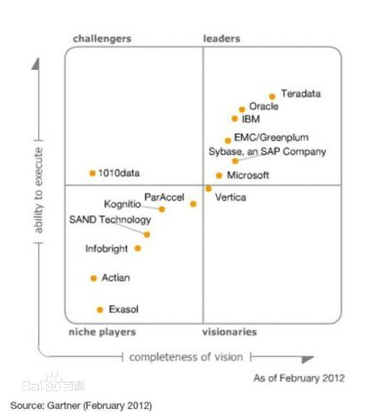
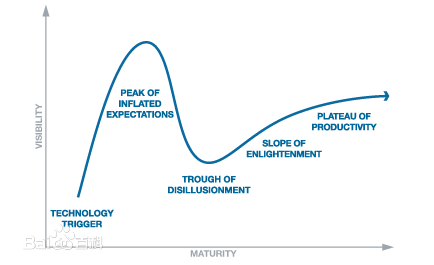
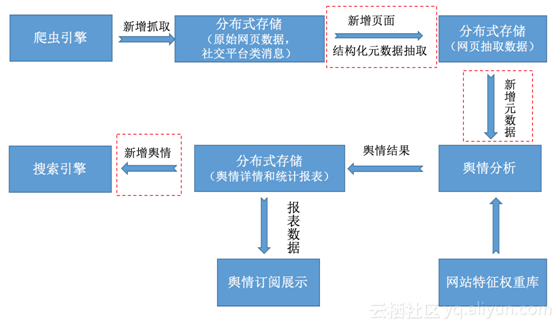
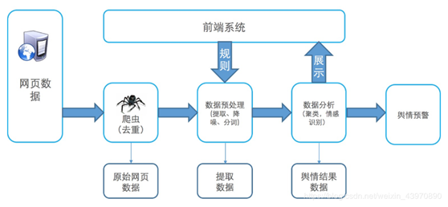

| 序号 | 修改时间  | 修改内容                         | 修改人 | 审稿人 |
| ---- | --------- | -------------------------------- | ------ | ------ |
| 1    | 2016-8-1  | 创建                             | 吴启福 |        |
| 2    | 2017-10-8 | 新增大数据挖掘实例章节           | 同上   |        |
| 3    | 2018-4-1  | 增加大数据分析平台：华为、阿里。 | 同上   |        |
| 4    | 2018-7-12 | 增加IT咨询公司~IDC和Gartner      | 同上   |        |
| 5    | 2018-9-9  | 迁移出个人数据分析章节另文。     | 同上   |        |
|      |           |                                  |        |        |
---


# 目录

[目录... 1](#_Toc16335284)

[1    大数据分析方法... 3](#_Toc16335285)

[1.1    分析理论... 3](#_Toc16335286)

[1.1.1     IBM 3A5步方法论... 3](#_Toc16335287)

[1.2    常规分析方法... 4](#_Toc16335288)

[1.2.1     数学分析... 4](#_Toc16335289)

[1.2.2     公众舆情分析... 4](#_Toc16335290)

[1.3    BI 5](#_Toc16335291)

[1.4    本章参考... 5](#_Toc16335292)

[2    公开统计数据源... 5](#_Toc16335293)

[2.1    公开统计数据主要来源... 5](#_Toc16335294)

[2.1.1     国际权威数据（跨国）... 5](#_Toc16335295)

[2.1.2     中国数据... 7](#_Toc16335296)

[2.1.3     其它经济体的数据... 9](#_Toc16335297)

[2.2    主要大数据分析商... 10](#_Toc16335298)

[2.2.1     IDC. 11](#_Toc16335299)

[2.2.2     Gartner. 11](#_Toc16335300)

[2.3    金融数据... 15](#_Toc16335301)

[2.4    生活服务... 17](#_Toc16335302)

[2.5    其它... 17](#_Toc16335303)

[2.6    本章参考... 18](#_Toc16335304)

[3    典型数据分析... 18](#_Toc16335305)

[3.1    大数据在行业中的应用... 18](#_Toc16335306)

[3.2    不同领域的数据分析和应用... 19](#_Toc16335307)

[3.2.1     社交网站... 19](#_Toc16335308)

[3.2.2     金融、电商... 19](#_Toc16335309)

[3.2.3     生活... 19](#_Toc16335310)

[3.2.4     其它... 20](#_Toc16335311)

[3.3    数据冰山 - 知乎专栏... 20](#_Toc16335312)

[3.4    本章参考... 21](#_Toc16335313)

[4    大数据挖掘案例... 21](#_Toc16335314)

[4.1    大数据挖掘案例列表... 21](#_Toc16335315)

[4.2    案例1：文本数据挖掘... 23](#_Toc16335316)

[4.3    本章参考... 23](#_Toc16335317)

[5    大数据分析平台... 23](#_Toc16335318)

[5.1    华为HW云... 23](#_Toc16335319)

[5.2    阿里云的大数据平台... 24](#_Toc16335320)

[5.2.1     数加平台介绍... 24](#_Toc16335321)

[5.2.2     MaxCompute. 26](#_Toc16335322)

[5.2.3     BI 26](#_Toc16335323)

[5.2.4     推荐系统... 27](#_Toc16335324)

[5.2.5     实验案例... 30](#_Toc16335325)

[5.2.6     本节参考... 35](#_Toc16335326)

[5.3    AWS亚马逊云... 35](#_Toc16335327)

[5.4    H3C大数据平台Data Engine. 35](#_Toc16335328)

[5.5    本章参考... 37](#_Toc16335329)

[参考资料... 37](#_Toc16335330)

[附录... 37](#_Toc16335331)

 

 

**表目录**

[表格 1国际组织的统计数据发布情况__ 5](#_Toc16335332)

[表格 2民间机构的统计数据发布情况__ 6](#_Toc16335333)

[表格 3中国经济的统计数据来源__ 7](#_Toc16335334)

[表格 4中国互联网的官方统计数据来源__ 7](#_Toc16335335)

[表格 5中国具体行业的统计数据来源__ 8](#_Toc16335336)

[表格 6美国的统计数据来源__ 9](#_Toc16335337)

[表格 7主要经济体的统计数据来源__ 9](#_Toc16335338)

[表格 8 大数据分析商列表__ 10](#_Toc16335339)

[表格 9金融业数据来源和统计分析__ 15](#_Toc16335340)

[表格 10 大数据的行业中的应用__ 18](#_Toc16335341)

[表格 11 大数据挖掘案例列表__ 21](#_Toc16335342)

[表格 12 AWS的大数据组件__ 24](#_Toc16335343)

[表格 14 实验案例列表__ 30](#_Toc16335344)

 


 

---

# 1  大数据分析方法

数据分析：基本统计、趋势分析、情感分析、回归分析

**基本统计**：性别、地区、累计分布等等。

**情感分析**：对微博正文切词，然后进行情感判别。我想了两个思路，第一个基于切词、情感词典和极性词的情感判别；第二个是基于机器学习的（与垃圾分类类似，进行情感分类；可以训练个分类器试试）。当时实现了第一个，判别了每条微博正文的情感value。然后与性别、省份做了交叉分析。


 数据处理：自然语言处理技术

统计和分析：地域占比，文本情感分析，A/B TEST，TOP N排行榜

数据挖掘：建模，聚类，分类和排名

模型预测：预测模型，机器学习，建模仿真

 

## 1.1   分析理论

### **1.1.1**  IBM **3A5步方法论**

2012年5月17日，IBM正式在中国市场发布了智慧的分析洞察(Smarter Analytics)，并从实战角度推出一套完整的方法论从转变信息到分析结果，再从分析结果到业务成果的整体途径，IBM将其总结为“3A5步”。

“3A5步”分别是掌控信息(Align)、获悉洞察(Anticipate)、采取行动(Act)、学习(Learn)和转型(Transform)。针对每一步、每一阶段，IBM都为用户提供了相应的软硬件产品和咨询服务。

​                               

图 1 IBM 3A5步方法论

针对每一步、每一阶段，IBM都为用户提供了相应的软硬件产品和咨询服务。

　　第一步掌控信息：全面收集、整合、掌控信息。随着大数据时代的企业需求不断增加，IBM推出大数据平台、分析型数据仓库等解决方案，致力于对非结构化数据、流数据等新型数据的处理和掌控。

　　第二步获悉洞察：提取洞察并预测。自2005年开始，IBM在业务分析领域不断加大投资和收购力度。目前，IBM具有全面的分析能力，包括财务绩效管理、商业智能、预测分析、内容分析和风险分析。

　　第三步采取行动：优化决策成就业务绩效。通过将掌握的信息通过分析获取洞察，用到决策平台或决策流程中，帮助企业业务人员和企业高管等决策者实现业务绩效的优化。

　　第四步学习：从每一次业务结果中获得学习和反馈，改善基于信息的决策流程。以Watson为例，从信息证据和行动结果中进行学习，在每次迭代中获取更智慧的解决方案。

　　第五步转型：制定清晰的分析战略，结合行业经验和既有案例，缔造突破性业务成果。通过确定业务的优先级分析目标、清晰一致的策略，找到新的方法、业务创新模式;通过已经有的行业解决方案和其他客户的最佳实践，识别新的业务机会和价值。


## 1.2   常规分析方法

### 1.2.1 数学分析

参考： 本人另作《数学的实践思考》

数据预处理：有效性、错误检测

相关系数：

回归分析: 线性规划

养分分析：

统计分析：

 

### 1.2.2 公众舆情分析

基于全网公开发布数据、传播路径和受众群体画像，利用*语义分析*、*情感算法*和*机器学习*，分析公众对品牌形象、热点事件和公共政策的认知趋势。

 

**热词分析**

挖掘网络的热议词语，分析这个词语相关联的词语网络，通过词语网络筛选相应的详细舆情信息，同时可以结合用户情感及舆情媒体来源来快速定位想要查看的信息，帮助企业聚类用户反馈，提升企业形象及优化产品体验。

 

**舆情分析**

自定义关键词组来爬取全网的舆情信息，支持各种新闻媒体、贴吧、微信、微博、论坛站点的爬取；然后根据这些舆情内容分析关注度及情感走势、渠道分布、热门事件等。

 

**媒体传播路径分析**

对单条微博的传播情况进行多维度分析，完整呈现微博的传播路径、曝光及转发量，通过传播账号识别传播者的情感分析、账号类型及地域性别等。

 

**事件分析**

挖掘网络上的热门事件，通过事件脉络及趋势分析全观事件内容，同时挖掘出事件涉及最多的主体有哪些，分析与这些主体有关联的词语，点击关联词语，可以搜索到对应的详情舆情，分析渠道来源及情感强弱。

## 1.3   BI

详见 《[BI专题](../BI专题.md)》


## 1.4   本章参考

 

# 2  公开统计数据源

## 2.1   公开统计数据主要来源

参考：中国国家统计局《[国际统计](http://www.stats.gov.cn/tjzs/tjbk/nsbzs/201310/P020140226567578845081.pdf)》、《[如何获取统计数据](http://www.stats.gov.cn/tjzs/tjbk/201502/P020150212355160516322.pdf)》

### 2.1.1 国际权威数据（跨国）

参见：国际组织网站http://data.stats.gov.cn/international/org?m=

国际数据权威发布主要有国际组织、主要经济体相关部门和民间机构三大来源。

 

国际组织的统计数据发布情况如下表：

表格 1 国际组织的统计数据发布情况

| 来源                     | 网页                                                         | 发布内容                                                     |
| ------------------------ | ------------------------------------------------------------ | ------------------------------------------------------------ |
| 联合国统计司（UNSD）     | http://unstats.un.org/unsd/syb/  [http://unstats.un.org/unsd/mbs](http://unstats.un.org/unsd/mbs/app/DataSearchTable.aspx) | 国民经济核算、国际贸易、工业、能源、人口、环境和社会全球主要统计信息。提供月度在线数据（2000年始）、千年发展指数、统计年鉴（PDF格式可免费下载）等等 |
| 联合国粮农组织（FAO）    | http://www.fao.org/                                          | 世界主要粮食供给、需求和价格等统计信息。                     |
| 世界卫生组织（WHO）      | http://www.who.int                                           | 193个会员国卫生统计信息的年度数据及有关报告。                |
| 世界贸易组织（WTO）      | http://www.wto.org/    [WTO database](http://stat.wto.org/StatisticalProgram/WSDBStatProgramSeries.aspx?Language=E) | 国际贸易统计、贸易报告等。                                   |
| 国际劳工组织（ILO）      | http://www.ilo.org/                                          | 国际劳工统计信息。                                           |
| 世界银行（WB）           | http://www.worldbank.org/    http://data.worldbank.org.cn/?display=graph | 有关各国发展的部分统计信息及有关报告。  可在线搜索数据。     |
| 国际货币基金组织（IMF）  | [http://www.imf.org/](http://www.imf.org/external/index.htm) | 有关IMF贷款、汇率及其它经济、金融等一系列时序统计信息、相关报告、统计手册等。 |
| 经济合作发展组织（OECD） | http://stats.oecd.org/mei/  [OECD iLibrary](http://www.oecd-ilibrary.org/economics/country-statistical-profiles-key-tables-from-oecd_20752288) | 经合组织主要成员和主要非成员经济体经济统计信息及有关报告，OECD经济领先指数等。 |
| 亚洲开发银行（ADB）      | http://www.adb.org/                                          | 有关亚行发展中成员的基本经济、金融、社会统计信息及相关报告。 |
| 欧盟统计局               | http://ec.europa.eu/eurostat/                                | 欧洲及欧洲国家主要经济、金融和社会发展信息。                 |
| 欧洲中央银行             | http://www.ecb.europa.eu    [ECB   Database](http://sdw.ecb.europa.eu/browse.do?node=9484572) | 欧洲欧元区货币政策，货币、银行和金融市场统计信息，以及政府财政、国际收支等。 |

 

表格 2民间机构的统计数据发布情况

| 来源                                          | 网页                                                         | 发布内容                                                     |
| --------------------------------------------- | ------------------------------------------------------------ | ------------------------------------------------------------ |
| 路透社                                        | [www.reuters.com](http://www.reuters.com)                    | 全球主要投票、债券市场交易情况，原油等大宗商品价格、主要币种汇率信息。 |
| 波罗的海航交所                                | http://www.balticexchange.com/                               | 波罗的海干散货指数。                                         |
| 经济时间序列网                                | http://www.economagic.com/                                   | 付费网站                                                     |
| IPUMS                                         | http://www.ipums.org/                                        | 普查数据的集成网站，包括人口、地理、居民生活、收入和消费信息。 |
| ICPSR                                         | http://www.icpsr.umich.edu/icpsrweb/ICPSR/                   | Umich的数据中心收集的数据集，社会科学常用的大部分微观数据都能在这里找到，但在做跨国比较时工作量较大。 |
| CIA world factbook                            | https://www.cia.gov/library/publications/the-world-factbook/ | 美国中央情报局收集的数据，包括地理、人口、社会、交通、军力等信息。 |
| [FRED](http://research.stlouisfed.org/fred2/) | http://research.stlouisfed.org/fred2/  [Federal Reserve   Economic Data](http://research.stlouisfed.org/fred2/) |                                                              |
|                                               |                                                              |                                                              |

 

### 2.1.2 中国数据

参见：部门数据 http://data.stats.gov.cn/department/index?m=

表格 3 中国经济的统计数据来源

| 来源                          | 网页                                                         | 发布内容                                                     |
| ----------------------------- | ------------------------------------------------------------ | ------------------------------------------------------------ |
| 中国国家统计局/中国统计信息网 | http://www.stats.gov.cn/                                     | 中国国民经济社会的年度、季度和月度数据。另外**国际数据**中也有全球大多数国家1997年以来的少量指标数据。 |
| 国务院发展研究中心信息网      | http://202.204.214.109:8080/  http://www.drcnet.com.cn/      | 提供国研、宏观经济、行业等数据。                             |
| 中国经济信息网（中经网）      | [http://www.cei.gov.cn/](http://bbs.pinggu.org/linkto.php?url=http%3A%2F%2Fwww.cei.gov.cn%2F) | 由国家信息中心组建的，以提供经济信息服务为主的专业性信息网络。它的特点就是时效性和权威性。 |
| 中国宏观经济信息网            | [http://www.macrochina.com.cn/](http://bbs.pinggu.org/linkto.php?url=http%3A%2F%2Fwww.macrochina.com.cn%2F) |                                                              |
| 中国人民银行（央行）          | http://www.pbc.gov.cn/                                       | 汇率、存贷款利率、[公开市场操作](http://www.pbc.gov.cn/publish/zhengcehuobisi/615/index.html)等。 |
| 中国债券信息网                | [www.chinabond.com.cn/](http://www.chinabond.com.cn/)        | 债券市场的月份统计数据                                       |
| 中经网统计数据库              | http://cedb.cei.gov.cn/　（无法访问）                        | “中国经济统计数据库”目前包括“宏观月度库”、“综合年度库”、“行业月度   库”、“海关月度库”和“城市年度库”5个子库。世界经济统计数据库包括OECD月度库和OECD年度库。 |

说明:

 

表格 4 中国IT行业的官方统计数据来源

| 类别       | 来源                                                         | 简介                                                         | 发布内容                                                     |
| ---------- | ------------------------------------------------------------ | ------------------------------------------------------------ | ------------------------------------------------------------ |
| 官方       | [CAC.国家互联网信息办公室](http://www.cac.gov.cn)            | 成立于2011年5月，主要职责包括落实[互联网](http://baike.baidu.com/subview/6825/18005829.htm)信息传播方针政策和推动互联网信息传播法制建设，指导、协调、督促有关部门加强互联网信息内容[管理](http://baike.baidu.com/view/18841.htm)，依法站等。 | 1997，CNNIC成立。  <Br>2001，中国互联网协会成立。  2011，CAC成立。 |
|            | [CNNIC.中国互联网信息中心](http://www.cnnic.net.cn/)         | 中国互联网络信息中心（China Internet  Network Information Center，简称[CNNIC](http://baike.baidu.com/view/21970.htm)）是经国家主管部门批准，于1997年6月3日组建的管理和服务机构，行使国家[互联网络信息中心](http://baike.baidu.com/view/7114483.htm)的职责。 | 下辖[CNIDP](http://www.cnidp.cn/).中国互联网数据平台；  CNNIC的互联网使用状况调查；  《中国互联网发展》系列报告 |
|            | [CERT.国家互联网应急中心](http://www.cert.org.cn)            | [CERT国家互联网应急中心](http://www.cert.org.cn)（国家计算机网络应急技术处理协调中心的简称，CNCERT)成立于1999年9月，是一个非政府非盈利的网络安全技术协调组织。 | 下辖[CNVD](http://www.cnvd.org.cn/).国家信息安全漏洞共享平台 |
|            |                                                              |                                                              |                                                              |
| 官方研究院 | [中国信息通信研究院](http://www.catr.cn/)（工信部电信研究院） | 前身为邮电部邮电科学研究院(始建于1957年)，1994年正式组院，现为工业和信息化部直属科研事业单位，是国家在信息通信领域(ICT)最重要的支撑单位以及工业和信息化部综合政策领域主要依托单位。<br>挂靠单位有：中国互联网协会,云计算开源产业联盟,工业互联网产业联盟,"互联网+节能"产业联盟,网络5.0产业和技术创新联盟,中国宽带发展联盟,数据中心联盟,应急通信产业联盟,IMT-2020(5G)推进组,电信终端产业协会,中国通信企业协会通信网络安全专委会,互联网医疗健康产业联盟,中国人工智能产业发展联盟,南京新一代人工智能研究院。 | 中国信通院将基础性、前瞻性、战略性软科学研究作为全院的核心工作之一，设立了ICT产业领域、两化融合与产业互联网领域、无线移动领域、信息网络领域、先进计算领域、大数据与人工智能领域、数字经济与法律监管领域、网络安全与国际治理领域八大软科学研究领域，形成了跨部门协作、知识共享、点面结合、业务链贯通的科研体系架构，每年完成百余项软科学研究课题。 |
|            | CESI.[中国电子技术标准化研究院](http://www.cesi.cn/)         | 又叫工信部第四研究院，创建于1963年，是工业和信息化部直属事业单位，是国家从事电子信息技术领域标准化的专业研究机构。在 2011年底根据中央编办《关于工业和信息化部电子工业标准化研究所更名的批复》，部人事教育司已正式批准CESI由“所”改“院”。 | 大数据（2014年）、  智能终端（2014年）、  云计算（2014年）、  中国智慧城市（2014年） |
| 其它       |                                                              |                                                              |                                                              |
|            | [中国互联网协会](https://www.isc.org.cn/)                    | 成立于2001年5月25日，是由中国互联网行业及与互联网相关的企事业单位、社会组织自愿结成的全国性、行业性、非营利性社会组织，接受登记管理机关中华人民共和国民政部和业务主管单位工业和信息化部的业务指导和监督管理。<BR>2002年，每年举办[中国互联网大会](https://baike.baidu.com/item/中国互联网大会/9609093)。<br>2008年，每年举办中国网络营销大会。 |                                                              |
|            | 全球互联网大会                                               | 2014年首届于浙江乌镇举办。                                   |                                                              |
|            | 全国扫黄办                                                   |                                                              |                                                              |

 

表格 5 中国具体行业的统计数据来源

| 行业     | 网址                                                         | 说明 |
| -------- | ------------------------------------------------------------ | ---- |
| 金融业   | 迈博汇金（券商报告较全）  http://www.microbell.com/  [和讯](http://calendar.hexun.com/country/)（中文版的全球宏观经济数据2003-2012） |      |
| 房地产业 |                                                              |      |
|          |                                                              |      |

 

### 2.1.3 其它经济体的数据

参见：各国统计网站 http://data.stats.gov.cn/international/site?m=

表格 6 美国的统计数据来源

| 来源                   | 网址                                                         | 发布内容                                                     |
| ---------------------- | ------------------------------------------------------------ | ------------------------------------------------------------ |
| 美联储                 | [www.federalreserve.gov](http://www.federalreserve.gov)      | 银行资产和负债、股票债券、利率汇率、工业生产和产能利用率等统计信息。 |
| 财政部                 | [www.treasury.gov](http://www.treasury.gov)                  | 利率、国家储备、政府融资统计信息等。  每年出版《美国统计摘要》（Statistical abstract of the U.S.）（1878-）。 |
| 商务部普查局           | [www.census.gov](http://www.census.gov)                      | 人口及住房普查资料、经济普查资料、社区调查及其它调查信息。   |
| 商务部经济分析局       | [www.bea.gov](http://www.bea.gov)                            | 国民经济核算资料、国际贸易、产业统计及分地区经济资料。  每月出版《当代商业纵览》（Survey of Current Business）。 |
| 劳工部劳工统计局       | http://Stats.bls.gov                                         | 就业失业、劳动生产率、工资福利及工伤、通货膨胀和物价统计信息。 |
| 能源部能源信息管理局   | [www.eia.gov](http://www.eia.gov)                            | 能量储量、生产、需求、技术等统计信息。                       |
| 联邦教育部             | [www.ed.gov](http://www.ed.gov)                              | 全国及各联邦有关教育类统计信息。                             |
| 农业部                 | [www.usda.gov](http://www.usda.gov)                          | 食品、农业、农村资源及农村社会经济统计信息。                 |
| 卫生部国家卫生统计中心 | [www.cdc.gov/nchs](http://www.cdc.gov/nchs)                  | 疾病、残疾、婚姻、生育、死亡等统计信息。                     |
| 美国商品调查局         | [www.crbtrade.com](http://www.crbtrade.com)                  | CRB指数。                                                    |
| 美国中情局             | [https://www.cia.gov/](http://bbs.pinggu.org/linkto.php?url=https%3A%2F%2Fwww.cia.gov%2F) |                                                              |

补充：《总统经济报告》（Economic Report of President）美国政府印刷办公室出版、经济顾问委员会撰写[www.access.gpo.gov/eop](http://www.access.gpo.gov/eop) 

 

表格 7 主要经济体的统计数据来源

| 来源     | 网页             | 发布内容                                    |                                                              |
| -------- | ---------------- | ------------------------------------------- | ------------------------------------------------------------ |
| 日本     | 统计局           | [www.stat.go.jp](http://www.stat.go.jp)     | 日本金融、物价、消费、就业等主要经济金融统计信息             |
|          | 日本央行         | [www.boj.or.jp](http://www.boj.or.jp)       | 货币供应、存贷款情况、利率汇率、国际收支、政府债券等统计     |
|          | 经济产业省       | [www.meti.go.jp](http://www.meti.go.jp)     | 工业、第三产业及部分行业调查统计信息。                       |
|          | 内阁府           | [www.cao.go.jp](http://www.cao.go.jp)       | 日本国民经济核算、日本商情指数、机械订单信息以及消费者信心调查、经济展望调查等。 |
| 俄罗斯   | 统计局           | http://www.gks.ru/                          | 俄罗斯经济、金融、社会主要统计信息。                         |
| 巴西     | 国家地理和统计局 | http://www.ibge.gov.br                      | 巴西经济、金融、社会主要统计信息。                           |
| 印度     | 统计和计划执行部 | [www.mospi.nic.in](http://www.mospi.nic.in) | 印度经济、金融、社会主要统计信息。                           |
| 澳大利亚 | 统计部           | http://www.abs.gov.au/                      | 澳大利亚经济、金融、社会主要统计信息。                       |
| 德国     |                  |                                             |                                                              |
| 法国     |                  |                                             |                                                              |
| 加拿大   |                  |                                             |                                                              |

 

## 2.2   主要大数据分析商

备注：咨询师报告里的Q1-Q4（Quarter，季度），H1-H2（Half year，上半年/下半年），E（预测）

表格 8 大数据分析商列表

| 网站                                      | 简介                                                         | 提供数据内容                                                 | 备注                                                  |
| ----------------------------------------- | ------------------------------------------------------------ | ------------------------------------------------------------ | ----------------------------------------------------- |
| [alexa](http://www.alexa.com/)            | Alexa是一家专门发布网站世界排名的网站。以[搜索引擎](http://baike.baidu.com/view/1154.htm)起家的Alexa创建于1996年4月（美国），目的是让互联网网友在分享虚拟世界资源的同时，更多地参与互联网资源的组织。1999年，被[亚马逊](http://baike.baidu.com/subview/27780/6672342.htm)公司以约价值两亿五千万美元的股票买下。 | 查看网站流量及排名                                           | 需要安装alexa工具栏才会被计入流量，欧美比较流行准确。 |
| 百度：[百度指数](http://index.baidu.com/) | [百度指数](http://baike.baidu.com/view/1235.htm)是以百度海量[网民](http://baike.baidu.com/view/7657.htm)行为数据为基础的数据分享平台，是当前互联网乃至整个数据时代最重要的统计分析平台之一，自发布之日便成为众多企业营销决策的重要依据。<BR>百度指数能够告诉用户：某个关键词在百度的搜索规模有多大，一段时间内的涨跌态势以及相关的新闻舆论变化，关注这些词的网民是什么样的，分布在哪里，同时还搜了哪些相关的  词，帮助用户优化数字营销活动方案。  <br>截至2014年，[百度指数](http://baike.baidu.com/view/1235.htm)的主要功能模块有：基于单个词的趋势研究（包含整体趋势、PC趋势还有移动趋势）、需求图谱、舆情管家、人群画像；基于行业的整体趋势、地域分布、人群属性、搜索时间特征。 | 百度统计、  百度指数、  百度搜索风云榜  基于搜索引擎的查询词趋势研究。 |                                                       |
| 谷歌                                      |                                                              | Google Analytics、  DoubleClick Ad Planner  Google Trends    |                                                       |
| [艾瑞咨询](http://www.iresearch.com.cn/)  | iResearch*艾瑞咨询*成立于2002年,由杨伟庆发起创立, 是最早涉及互联网研究的第三方机构，致力成为中国大数据时代下最佳互联网收视率及消费者洞察公司。 | 互联网大数据研究。                                           |                                                       |
| [易观分析](http://www.analysys.cn)        | *易观*国际成立于2000年,是中国信息化、互联网和新媒体以及电信运营行业规模最大的基于互联网的高科技智囊机构。 | 移动互联网大数据分析                                         |                                                       |
| [新榜](http://www.newrank.cn/)            | 新榜定位于内容创业服务平台，用以衡量传播价值、品牌价值、投资价值的新榜指数，已经成为中国移动互联网内容价值标准。  中国最早提供微信公众号内容数据价值评估的第三方机构。 | 评估内容价值，包括微信、微博、网红。                         |                                                       |
| QuestMobile                               | QuestMobile(贵士移动) 专注于移动互联网数据研究，创建于2014年。创始人原易观国际员工。 |                                                              |                                                       |
| 友盟                                      | 移动互联网                                                   | APP统计                                                      |                                                       |
| [Gartner](https://www.gartner.com/)       | 创建于1979年，全球最早和最权威的IT研究与顾问咨询公司。       | 研究范围覆盖全部IT产业                                       |                                                       |
| [IDC](https://www.idc.com/)               |                                                              | PC调查数据                                                   |                                                       |
| Compete                                   |                                                              |                                                              |                                                       |
| [Wind](http://www.wind.com.cn/)           | 中国大陆领先的金融数据、信息和软件服务企业，总部位于[上海](https://baike.baidu.com/item/上海)[陆家嘴金融中心](https://baike.baidu.com/item/陆家嘴金融中心)。<br>Wind已建成国内完整、准确的以金融证券数据为核心一流的大型金融工程和财经数据仓库。 | 资讯是[中国大陆](https://baike.baidu.com/item/中国大陆/5944925)金融数据、信息和[软件](https://baike.baidu.com/item/软件)服务企业. |                                                       |

备注：1. IDC和Gartner是国际最具知名度的两家专业的IT研究与顾问咨询公司。


### 2.2.1 IDC

https://www.idc.com/

国际数据公司是[国际数据集团](https://baike.baidu.com/item/国际数据集团/10563111)旗下全资子公司，全称是International Data Corporation。国际数据公司（IDC）是全球著名的信息技术、电信行业和消费科技咨询、顾问和活动服务专业提供商。成立于1964年，IDC在全球拥有超过1100名分析师，为110多个国家的技术和行业发展机遇提供全球化、区域化和本地化的专业视角及服务。IDC的分析和洞察助力IT专业人士、业务主管和投资机构制定基于事实的技术决策，以实现关键业务目标。IDC于1986年正式在中国设立分支机构，是最早进入中国市场的全球著名的科技市场研究机构。在中国，IDC分析师专注于本地ICT市场研究，与本地市场高度结合，研究领域覆盖硬件、软件、服务、互联网、各类新兴技术以及企业数字化转型等方面。


### 2.2.2 Gartner

https://www.gartner.com/

Gartner Group公司成立于1979年，它是第一家信息技术研究和分析的公司。2017年Gartner 26亿美元收购CEB拓展商业调研服务。

Gartner (高德纳，又译顾能公司，NYSE: IT and ITB)全球最具权威的IT研究与顾问咨询公司，成立于1979年，总部设在美国康涅狄克州斯坦福。其研究范围覆盖全部IT产业，就IT的研究、发展、评估、应用、市场等领域，为客户提供客观、公正的论证报告及市场调研报告，协助客户进行市场分析、技术选择、项目论证、投资决策。为决策者在投资风险和管理、营销策略、发展方向等重大问题上提供重要咨询建议，帮助决策者作出正确抉择。

Gartner由四大部分组成，旨在向客户提供在促进高效使用IT方面所需的全面的研究与咨询服务，这些部分包括：

1、Gartner Research & Advisory Services(Gartner研究与咨询服务)

2、Gartner Consulting(Gartner咨询)

3、Gartner Measurement(Gartner评测)

4、Gartner Community(Gartner社区)

 

#### 研究方法：魔力象限(Magic Quadrant)

**二个维度**：执行力Execute、远见性Vision

**作用**：主要用来选择卖家vendor。对于有意向找一家能满足自身需求的公司的投资者以及力图在市场中PK掉竞争者且可获得优势的企业来说，魔力象限研究报告用处极大。

案例1：国外很多客户选择供应商时，只考虑出现在魔力四象限的企业。

案例2：华为用魔力四象限来衡量自己的国际化战略。通用存储-华为在2010-2011进入到特定领域象限，2013-2015进入到挑战者象限；2016~进入到领导者象限。

 

​     魔力象限是在某一特定时间内的对市场情况进行的图形化描述。 魔力象限(Magic Quadrant)由Gartner公司于2006年9月25日取得“魔力象限”注册版权，并可以在获得许可的情况下重复使用。它根据Gartner公司的定义，它描述了Gartner公司依据标准对该市场内的厂商所进行的分析。

​     与单纯的给出统计数字或者列表为公司排名不同，魔力象限使用二维模型去阐释公司间的实力及差异。魔力象限基于公司发展前景的完备性和执行能力，将构成竞争的公司分成四个不同的部分。
* 利基型企业：特定领域者（Niche Players）。公司发展前景的完备性和执行能力方面都得低分的公司也许占有一定的市场份额，但还是比不上规模大一些的厂商。这些公司通常关注功能性或其他特定领域，要么就是新成立的公司。
* 有远见者：了解市场动态并且有潜力进行创新，但也许尚缺乏执行这些的能力。虽然这是早期市场中的企业标准，但是在较为成熟的市场中，有远见者则常常要么是设法实现的小企业，要么是不想按常理出牌的大厂商。
* 挑战者：执行能力高，但缺少强劲的发展势头。挑战者往往是大型一点的成熟厂商并且不愿打破其当前的发展计划。随着公司的发展他们完全有实力成为行业领袖。
* 行业领袖：公司发展前景的完备性和执行能力方面均得高分的行业领袖往往是大型的成熟公司、拥有大量客户群并且在市场上知名度极高。行业领袖在市场中有巨大的拉力，甚至有实力影响市场的整体发展方向。

 

 

图 2  Gartner魔力四象限（Magic Quadrant）

备注：尽管似乎行业领袖类别中的公司总是首选，Gartner还是建议用户对所有象限进行一一检测，因为每类的企业都有其值得注意的独一无二的强项和弱项。同时更应注意到，魔力象限设计之初是为了减少厂商搜索，并不是为用户选择厂商而指明道路的。

 

图 3 示例：魔力四象限

#### Gartner的技术成熟曲线

技术成熟度曲线（The Hype Cycle），又称技术循环曲线，光环曲线，炒作周期，指的是企业用来评估新科技的可见度，利用时间轴与市面上的可见度(媒体曝光度)决定要不要采用新科技的一种工具。

1995年开始，高德纳咨询公司依其专业分析预测与推论各种新科技的成熟演变速度及要达到成熟所需的时间，分成5个阶段：
* 科技诞生的促动期 (Technology Trigger)：在此阶段，随着媒体大肆的报道过度，非理性的渲染，产品的知名度无所不在，然而随着这个科技的缺点、问题、限制出现，失败的案例大于成功的案例，例如:.com公司 1998~2000年之间的非理性疯狂飙升期。
* 过高期望的峰值（Peak of Inflated Expectations）：早期公众的过分关注演绎出了一系列成功的故事——当然同时也有众多失败的例子。对于失败，有些公司采取了补救措施，而大部分却无动于衷。
* 泡沫化的底谷期 (Trough of Disillusionment)：在历经前面阶段所存活的科技经过多方扎实有重点的试验，而对此科技的适用范围及限制是以客观的并实际的了解，成功并能存活的经营模式逐渐成长。
* 稳步爬升的光明期 (Slope of Enlightenment)：在此阶段，有一新科技的诞生，在市面上受到主要媒体与业界高度的注意，例如:1996年的Internet ，Web。
* 实质生产的高峰期 (Plateau of Productivity)：在此阶段，新科技产生的利益与潜力被市场实际接受，实质支援此经营模式的工具、方法论经过数代的演进，进入了非常成熟的阶段

 

 

图 4 Gartner技术成熟度曲线


## 2.3   金融数据

表格 9 金融业数据来源和统计分析

| 数据                                                         | 网址                                | 简介                                                         |
| ------------------------------------------------------------ | ----------------------------------- | ------------------------------------------------------------ |
| [Global   Financial Data](https://www.globalfinancialdata.com/index.html)提供的历史金融数据 | https://www.globalfinancialdata.com | GFD~历史金融数据供应机构。根据经济核心地位时期的国家数据作为参照，分析全球金融数据。  1285-1600，意大利（1285~1303/1408~1500来自威尼斯，1304~1407来自热内亚，1520~1598来自意大利）。  1606~1699，荷兰。  1700~1914，英国。  1919~今，美国。 |
| Wind资讯股票专家                                             | http://www.wind.com.cn/             | 付费的中国金融数据服务，数据及时且全。财经院校的学生，他们会提供免费的数据。 |
|                                                              |                                     |                                                              |

 

[TuShare -财经数据接口包](file:///\\link.zhihu.com\?target=http%3A//tushare.org/fundamental.html%23id4) 国内好心人做的开源财经数据接口（觉得好的可以捐助一下）。这里几乎可以获取到A股的所有信息了，还包括一些经济数据。重点是他不仅免费，还提供了一个Python库tushare。

```shell
pip install Quandl
pip install tushare
import tushare as ts
```


1. 股票

   ①新浪财经
    最多人用的就是新浪财经了，因为它是免费的，并且使用起来也不难。以下是网上找的教程：
    [获取历史和实时股票数据接口](http://link.zhihu.com/?target=http%3A//www.cnblogs.com/seacryfly/articles/stock.html)

​     ②东方财富网
 网站提供了大量信息，也是基本面投资者的好去处。可以查看财务指标或者根据财务指标选股（如净资产收益率）：[选股器 _ 数据中心](http://link.zhihu.com/?target=http%3A//data.eastmoney.com/xuangu/%23Yz1beWxubDAxKDF8MC4wNSldfHM9eWxubDAxKDF8MC4wNSl8c3Q9LTE%3D)。这些都是很好的投资参考，当然还有其它功能有对应的API，可以自己分析一下。

​    ③中财网
 [http://data.cfi.cn/cfidata.aspx](http://link.zhihu.com/?target=http%3A//data.cfi.cn/cfidata.aspx)提供各种产品的数据

（国内很多功能类似网站，如和讯、网易财经、雪球等等，具体的我没有一一试验就不放上来了，各位可以自己去试试，下同。）

 2. 大宗商品
 ①[黄金头条——用资讯帮你赚钱！炒黄金，看黄金头条！黄金价格](http://link.zhihu.com/?target=http%3A//www.goldtoutiao.com/)
 这里提供了各种大宗商品的行情，也可以分析获取。包括技术分析方面。

​      ②当然还有外国网站：[Investing.com](http://link.zhihu.com/?target=http%3A//www.investing.com/)

 3. 美股等综合类

 ①Wind资讯。很多机构用的都是这里的数据，当然普通个人是拿不到的，不过如果你是财经院校的学生，他们会提供免费的数据。详见官网。

 ②[Market Data Feed and API](http://link.zhihu.com/?target=http%3A//www.xignite.com/)
 外国网站，提供了大量数据，付费。有试用期。

 ③[Quandl Financial and Economic Data](http://link.zhihu.com/?target=https%3A//www.quandl.com/)
 同上。部分免费。

 ④[96 Stocks APIs: Bloomberg, NASDAQ and E*TRADE](http://link.zhihu.com/?target=http%3A//www.programmableweb.com/news/96-stocks-apis-bloomberg-nasdaq-and-etrade/2013/05/22)
 外国网站整合的96个股票API合集，可以看看。

 ⑤雅虎财经
 [http://www.finance.yahoo.com/](http://link.zhihu.com/?target=http%3A//www.finance.yahoo.com/)
 [https://hk.finance.yahoo.com/](http://link.zhihu.com/?target=https%3A//hk.finance.yahoo.com/)

 

## 2.4   生活服务

 1.手机话费充值。[手机话费充值数据服务](http://link.zhihu.com/?target=http%3A//www.apix.cn/services/show/110)
 2.天气查询。[天气查询数据服务](http://link.zhihu.com/?target=http%3A//www.apix.cn/services/show/19)
 3.快递查询。[快递查询服务数据服务](http://link.zhihu.com/?target=http%3A//www.apix.cn/services/show/133)
 4.健康食谱。[健康食谱数据服务](http://link.zhihu.com/?target=http%3A//www.apix.cn/services/show/54)
 5.查医院。[医院大全数据服务](http://link.zhihu.com/?target=http%3A//www.apix.cn/services/show/43)
 6.水电煤缴费。[水电煤缴费数据服务](http://link.zhihu.com/?target=http%3A//www.apix.cn/services/show/114)
 7.电影大全。[电影大全数据服务](http://link.zhihu.com/?target=http%3A//www.apix.cn/services/show/29)
 8.谜语、歇后语、脑筋急转弯。[猜一猜数据服务](http://link.zhihu.com/?target=http%3A//www.apix.cn/services/show/86)
 9.音乐搜索。[音乐搜索接口数据服务](http://link.zhihu.com/?target=http%3A//www.apix.cn/services/show/140)
 10.健康知识。[健康知识数据服务](http://link.zhihu.com/?target=http%3A//www.apix.cn/services/show/44)
 11.百度糯米、团购等信息。[糯米开放api数据服务](http://link.zhihu.com/?target=http%3A//www.apix.cn/services/show/68)
 12.彩票开奖。[彩票开奖查询数据服务](http://link.zhihu.com/?target=http%3A//www.apix.cn/services/show/121)

 以上接口都来自网站：
 [APIX_国内领先的云数据服务平台_API接口服务平台](http://link.zhihu.com/?target=http%3A//www.apix.cn/)

[API数据接口_开发者数据定制](http://link.zhihu.com/?target=https%3A//www.juhe.cn/)
 [API Store_为开发者提供最全面的API服务](http://link.zhihu.com/?target=http%3A//apistore.baidu.com/)
 [API数据接口_免费数据调用-91查|91cha.com](http://link.zhihu.com/?target=http%3A//www.91cha.com/)

 

## 2.5   其它

撇去上面的API不说，如果单单爬取网页上的内容下来，那就太多可以爬的了。如：

1.爬取网站上的图片。包括贴吧、知乎、Tumblr、轮子哥、XXX（你懂的）。

2.爬取影评、电影资讯、图书等等。比如豆瓣电影。轻轻松松掌握好书好电影。

3.爬取社交网络。比如新浪微博，Twitter。（Twitter提供了API，可以提交关键字等信息爬取搜索结果中的每一条内容。）爬完可以对整个社交网络群体做个分析，情绪、作息、区域……

4.一些网站有你喜欢的文章或者帖子，但是他们没有APP或者是APP做得不友好，你可以直接爬取页面信息推送到手机上。

5.做一个微信公众号。有了上面那么多数据，还怕公众号没东西？生活服务、选股器、行情分析、文章推送等等等。

 

## 2.6   本章参考

[1].   Gartner  https://baike.baidu.com/item/Gartner/8864046?fr=aladdin

[2].   资源 | 25个深度学习开源数据集，have fun ! https://blog.csdn.net/tMb8Z9Vdm66wH68VX1/article/details/79890586


# 3  典型数据分析

## 3.1   舆情分析

### 3.1.1 简介

在时下互联网信息的浪潮下，信息的传播速度远超我们的想象。微博里一条大V的帖子，朋友圈的一个状态更新，热门论坛的一条新闻，购物平台的购物评价，可能会产生数以万计的转发，关注，点赞。如果是一些非理性负面的评论会激发人们的负面感，甚至影响到消费者对企业品牌的认同，如果不能及时的采取正确的应对措施，会造成难以估计的损失。所以我们需要一个高效的全网舆情分析系统，帮助我们实时的观测舆情。

舆情分析包括但不限于
* 舆情的影响力诊断，从传播量级和扩散趋势来做预测，确定是否最终形成舆情。
* 传播路径分析，分析舆情传播的关键路径。
* 用户画像，对舆情的参与者提供共性特征勾勒，如性别，年龄，地域和感兴趣话题。
* 情感分析，分析新闻或者评价是正面还是负面。情感分类后进行统计聚合。
* 预警设置，我们支持舆情讨论量阈值设置，达到阈值后通知推送业务方，避免错过舆情的黄金参与时间。

 

 

图 5 舆情分析数据流

 

 

图 6  舆情系统业务流程
* 原始网页存储库，这个库需要能支持海量数据，低成本，低延时写入。网页数据写入后，要做实时结构化提取，提取出来的数据再进行降噪，分词，图片ocr处理等。对分词文本，图片进行情感识别产生舆情数据结果集。传统的离线全量计算很难满足舆情系统的时效性需求。
* 计算引擎在做数据处理时，可能还需要从存储库中获取一些元数据，例如用户信息，情感词元数据信息等。
* 除了实时的计算链路，对存量数据定期要做一些聚类，优化我们的情感词识别库，或者上游根据业务需要触发情感处理规则更新，根据新的情感打标库对存量数据做一次舆情计算。

舆情的结果数据集有不同类的使用需求。对于重大舆情，需要做实时的预警。完整的舆情结果数据展示层需要支持全文检索，灵活的属性字段组合查询。业务上可能根据属性字段中的置信度，舆情时间，或者关键词组合进行分析。

### 3.1.2 架构

 

图 7 开源舆情架构图

1)     系统的最上游是分布式的爬虫引擎，根据抓取任务抓取订阅的网页原文内容。爬虫会把抓取到的网页内容实时写入Kafka队列，进入Kafka队列的数据根据前面描述的计算需求，会实时流入流计算引擎（例如Spark或者Flink），也会持久化存储在Hbase，进行全量数据的存储。全量网页的存储可以满足网页爬取去重，批量离线计算的需求。

2)     流计算会对原始网页进行结构化提取，将非结构化网页内容转化为结构数据并进行分词，例如提取出网页的标题，作者，摘要等，对正文和摘要内容进行分词。提取和分词结果会写回Hbase。结构化提取和分词后，流计算引擎会结合情感词库进行网页情感分析，判断是否有舆情产生。

3)     流计算引擎分析的舆情结果存储Mysql或者Hbase数据库中，为了方便结果集的搜索查看，需要把数据同步到一个搜索引擎例如Elasticsearch，方便进行属性字段的组合查询。如果是重大的舆情时间，需要写入Kafka队列触发舆情报警。

4)     全量的结构化数据会定期通过Spark系统进行离线计算，更新情感词库或者接受新的计算策略重新计算历史数据修正实时计算的结果。

 

 

图 8 云上舆情大数据架构

### 3.1.3 本节参考

[1].   基于大数据的舆情分析系统架构 - 架构篇 https://blog.csdn.net/weixin_43970890/article/details/90905293 

[2].   百亿级全网舆情分析系统存储设计 https://yq.aliyun.com/articles/265024 

## 3.2   大数据在行业中的应用

大数据发展趋势：Gartner技术成熟曲线。

大数据行业画像：[FirstMark](http://firstmarkcap.com/)

表格 10 大数据的行业中的应用

| 行业 | 目的       | 应用场景                                                     |
| ---- | ---------- | ------------------------------------------------------------ |
| 治理 | 治理更对症 | 舆情监控、监控视频分析、群体性事件预测、宏观经济数据监控民生应用创新 |
| 交通 | 畅行更无阻 | 车流密度监控、交通拥堵疏导、公交线路优化、城市功能区划分     |
| 零售 | 营销更精准 | 推荐系统、计算广告                                           |
| 金融 | 风控更有效 | 两个时间（授信前后）、三个对象（个人、企业、市场）、新技术（金融科技、区块链BlockChain）  个人：精准营销、风险定价、反欺诈  企业：风险监控、风险定位、反欺诈  市场：量化交易、财富组合管理 |
| 体育 | 竞技更具像 | 体能建模、转会评估、教学管理、战术分析                       |
| 教育 | 学习更个性 | 三个维度（平台、内容和工具），五个对象（主管部门、校长、老师、家长和学生） |
| 医疗 | 看病更靠谱 | 互联网医疗、医疗大数据、医疗管理、医学研究                   |
| 旅游 | 服务更周全 | 三时间（旅游前中后）、四对象（主管部门、景区、商家、游客）   |
| 农业 | 案例更清晰 | 农业机械化、优化播种、精准施肥                               |
| 制造 | 流程更高效 | 故障诊断、产品创新、工业物联网、供应链优化                   |

 

## 3.3   不同领域的数据分析和应用

### 3.3.1 社交网站

社交之**知乎**

[知乎社交网络分析（上）：基本统计](http://link.zhihu.com/?target=http%3A//www.jianshu.com/p/60ffb949113f)
 [知乎社交网络分析（下）：关注网络](http://link.zhihu.com/?target=http%3A//www.jianshu.com/p/3b2a1895a12d)

[带逛传万世 因有我参与 - 挖掘知乎里有趣的东西 - 知乎专栏](http://zhuanlan.zhihu.com/grapeot/20597170)
 [你们最爱的知乎头像 - 挖掘知乎里有趣的东西 - 知乎专栏](http://zhuanlan.zhihu.com/grapeot/20562686)
 [头像带逛 - 挖掘知乎里有趣的东西 - 知乎专栏](http://zhuanlan.zhihu.com/grapeot/20555637)

[沧海横流，看行业起伏（2015年） - 数据冰山 - 知乎专栏](http://zhuanlan.zhihu.com/hemingke/20559922) 

[知乎用户信息爬虫（规模化爬取）](https://link.zhihu.com/?target=http%3A//aljun.me/post/22)

[知乎用户图谱（用户数据分析）](https://link.zhihu.com/?target=http%3A//aljun.me/post/23)

[python爬虫 推送知乎文章到kindle电子书](https://link.zhihu.com/?target=http%3A//30daydo.com/article/7)

[编辑推荐 - 发现](https://www.zhihu.com/explore/recommendations)

 

**其它社交**

[如何利用爬虫爬微信公众号的内容？ - 移动互联网](https://www.zhihu.com/question/31285583)

[风向标-微信公众账号和文章的导航及推荐](https://link.zhihu.com/?target=http%3A//www.fxbiao.net/)

[陌陌](https://link.zhihu.com/?target=http%3A//www.apptool.com.cn/index.php/home/apprank/apprank/id/48)

[Python自定义豆瓣电影种类，排行，点评的爬取与存储](https://link.zhihu.com/?target=http%3A//blog.csdn.net/mrlevo520/article/details/51966992)

[基于python豆瓣自定义电影抓取](https://link.zhihu.com/?target=http%3A//download.csdn.net/detail/mrlevo520/9581491)

根据情绪预测股市[http://battleofthequants.net/wp-content/uploads/2013/03/2010-10-15_JOCS_Twitter_Mood.pdf](http://link.zhihu.com/?target=http%3A//battleofthequants.net/wp-content/uploads/2013/03/2010-10-15_JOCS_Twitter_Mood.pdf)

### 3.3.2 金融、电商

**金融**

[python 获取中国证券网的公告](https://link.zhihu.com/?target=http%3A//www.30daydo.com/article/59)

 

**电商** 

[爬取京东,亚马逊商城的数据违法吗? - 互联网](https://www.zhihu.com/question/20568741)

 

### 3.3.3 生活

**MMUbee Android:** [MMUbee - Android Apps on Google Play](https://link.zhihu.com/?target=https%3A//play.google.com/store/apps/details%3Fid%3Dmy.zh.mmubee%26hl%3Den)

 

### 3.3.4 其它

**招聘网站**

[爬下拉勾网数据进行分析--傅sir的个人主页|Alan_fu's Blog|程序设计](http://link.zhihu.com/?target=http%3A//fualan.com/article/44/)

 

[apptool，应用工具，app排名查询，app排名优化，app排名，应用市场排名](https://link.zhihu.com/?target=http%3A//www.apptool.com.cn/index.php/home/)

一条数据狗的上海房价研究 https://zhuanlan.zhihu.com/p/20827121

 

全球网络设备 [zoomeye.org/statistic/device](https://link.zhihu.com/?target=http%3A//www.zoomeye.org/statistic/device)

全球 Web 服务 [zoomeye.org/statistic/w](https://link.zhihu.com/?target=http%3A//www.zoomeye.org/statistic/web)eb

[你是怎样利用互联网赚到自己的第一桶金的？ - 知乎用户的回答](http://www.zhihu.com/question/28278308/answer/40654262)

 

 

 

## 3.4   [数据冰山 - 知乎专栏](http://zhuanlan.zhihu.com/hemingke)

汽车之家

[大数据画像：宝马车主究竟有多任性？ - 数据冰山 - 知乎专栏](http://zhuanlan.zhihu.com/hemingke/20573253) 利用论坛发言的抓取以及NLP，对各种车型的车主做画像。

 

**天猫、京东、淘宝等电商网站**

[超越咨询顾问的算力，在用户理解和维护：大数据改变管理咨询（三） - 数据冰山 - 知乎专栏](http://zhuanlan.zhihu.com/hemingke/20583037)，抓取各大电商的评论及销量数据，对各种商品（颗粒度可到款式）沿时间序列的销量以及用户的消费场景进行分析。

 

**58同城的房产、安居客、Q房网、搜房等房产网站**

[下半年深圳房价将如何发展 - 数据冰山 - 知乎专栏](http://zhuanlan.zhihu.com/hemingke/20135185)，抓取房产买卖及租售信息，对热热闹闹的房价问题进行分析。

 

**大众点评、美团网等餐饮及消费类网站**

[黄焖鸡米饭是怎么火起来的？ - 何明科的回答](https://www.zhihu.com/question/24331936/answer/48616123)，抓取各种店面的开业情况以及用户消费和评价，了解周边变化的口味，所谓是“舌尖上的爬虫”。

 

**58同城等分类信息网站**

[花10万买贡茶配方，贵不贵？ - 何明科的回答](https://www.zhihu.com/question/39843548/answer/83532516)，抓取招商加盟的数据，对定价进行分析，帮助网友解惑。

 

**拉勾网、中华英才网等招聘网站**
 [互联网行业哪个职位比较有前途？ - 数据冰山 - 知乎专栏](http://zhuanlan.zhihu.com/hemingke/20217862)，抓取各类职位信息，分析最热门的职位以及薪水。

 

**挂号网等医疗信息网站**
 [如何评价挂号网？ - 何明科的回答](https://www.zhihu.com/question/25564657/answer/44862007)，抓取医生信息并于宏观情况进行交叉对比。

 

**应用宝等App市场**
 [你用 Python 做过什么有趣的数据挖掘/分析项目？ - 何明科的回答](https://www.zhihu.com/question/28975391/answer/82797746)，对各个App的发展情况进行跟踪及预测。（顺便吹一下牛，我们这个榜单很早就发现小红书App的快速增长趋势以及在年轻人中的极佳口碑）

 

**携程、去哪儿及12306等交通出行类网站**
 [你用 Python 做过什么有趣的数据挖掘/分析项目？ - 何明科的回答](https://www.zhihu.com/question/28975391/answer/82797746)，对航班及高铁等信息进行抓取，能从一个侧面反映经济是否正在走入下行通道。

 

**雪球等财经类网站**
 抓取雪球KOL或者高回报用户的行为，找出推荐股票

 

**58同城二手车、易车等汽车类网站**
 [一年当中买车的最佳时间为何时？ - 何明科的回答](https://www.zhihu.com/question/30086195/answer/47825568)和[什么品牌或者型号的二手车残值高？更保值？反之，什么类型的贬值较快？ - 二手车](https://www.zhihu.com/question/20931757)，找出最佳的买车时间以及最保值的汽车。

 

**神州租车、一嗨租车等租车类网站**
 抓取它们列举出来的租车信息，长期跟踪租车价格及数量等信息

 

**各类信托网站**
 通过抓取信托的数据，了解信托项目的类型及规模

 

## 3.5   本章参考

[1].   [FirstMark](http://firstmarkcap.com/) 


# 4  大数据挖掘案例

## 4.1   大数据挖掘案例列表

表格 11 大数据挖掘案例列表

| 案例名称                           | 背景与挖掘目标                                       | 数据获取                                                   | 数据预处理                                                   | 模型构建                                        | 模型检验                      | 模型应用                             |
| ---------------------------------- | ---------------------------------------------------- | ---------------------------------------------------------- | ------------------------------------------------------------ | ----------------------------------------------- | ----------------------------- | ------------------------------------ |
| 电力窃漏电用户自动识别             | 目标：自动检查、判断用户是否存在漏电行为。           | 营销系统获取用户数据；电力计量自动化系统获取实时用电数据。 | 异常值~拉氏插值。  指标：电量趋势下降指标、线损率、告警类指标 | LM神经网络或  DT决策树                          | 分类结果的混淆矩阵。  ROC曲线 |                                      |
| 航空公司客户价值分析               | 客户分类；  比较客户价值；客户个性化服务。           | 客户基本信息；乘机信息；积分信息。                         | 航空公司LRFMC模型或RFM模型。                                 | K中心聚类                                       |                               | 会员升级与保级；首次兑换；交叉销售。 |
| 中医证型关联规则挖掘               | 挖掘患者症状与中医证型之间的关联关系。               | 问卷调查。                                                 | 证型系数；数据离散化                                         | 关联规则                                        |                               |                                      |
| 基于水色图像的水质评价             | 基于计算机视觉，以专家经验为基础，水质分级判别。     | 采集图像。图像特征：颜色                                   | 图像切割和颜色矩特征提取。  颜色直方图。                     | SVM                                             |                               |                                      |
| 家电电器用户行为分析与事件识别     | 识别用户                                             | 热水器采集                                                 | 属性构造（4类属性指标：时长、频率、用水的量化、用水的波动）  | 神经网络                                        |                               |                                      |
| 应用系统负载分析与磁盘容量预测     |                                                      | CPU/内存/磁盘使用信息                                      |                                                              | 平衡性检验、白噪声检验、模型识别                | 检验残差序列是否为白噪声      | 容量预测                             |
| 电子商务网站用户行为分析及服务推荐 | 用户访问推荐                                         | 用户访问日志                                               |                                                              | 推荐系统（协同过滤CF）                          |                               |                                      |
| 财政收入影响因素分析及预测模型     | 识别影响财务收入的关键特征                           |                                                            | 相关系数矩阵                                                 | 回归；神经网络                                  |                               | 灰色预测                             |
| 基于基站定位数据的商圈分析         | 对基站分群；  对商圈分群。                           | 移动运营商提供的接口数据                                   |                                                              | 谱系聚类                                        |                               |                                      |
| 电商产品评论数据情感分析           | 分析某产品的用户情感倾向。从评论中挖掘出产品优劣点。 | 某产品的文本评论数据                                       | 文本去重；文本机械压缩去词；短句删除；文本分词。             | 神经网络语言模型NNLM；语义网络分析；LDA主题模型 |                               |                                      |
|                                    |                                                      |                                                            |                                                              |                                                 |                               |                                      |
| 案例名称                           | 背景与挖掘目标                                       | 数据获取                                                   | 数据预处理                                                   | 模型构建                                        | 模型检验                      | 模型应用                             |

备注：

1. ROC：受试者工作特征曲线 （receiver operating characteristic curve，简称ROC曲线），又称为[感受性](https://baike.baidu.com/item/感受性)曲线（sensitivity curve）。以假阳性概率（False positive rate）为[横轴](https://baike.baidu.com/item/横轴)，击中概率为纵轴所组成的坐标图，和被试在特定刺激条件下由于采用不同的判断标准得出的不同结果画出的曲线。在ROC曲线上，最靠近坐标图左上方的点为敏感性和特异性均较高的临界值。曲线下面积越大越准确。

2. 航空公司LRFMC模型：用来识别客户价值的五个指标。统计时间段为观察窗口时间，一般单位为月。

| 模型  | L                                      | R                    | F        | M          | C                                |
| ----- | -------------------------------------- | -------------------- | -------- | ---------- | -------------------------------- |
| LRFMC | *会员入会时间***距观察窗口结束的月数** | 客户最近一次坐飞机-- | 飞行次数 | 总飞行里程 | 乘坐舱位所对应的*平均折扣系数*。 |

\3. 图像特征包括颜色、纹理、形状和空间关系特征等等。颜色特征主要包括颜色直方图和颜色矩方法。一幅图像的色彩分布也可认为是一种概率分布，因此图像可以用其各阶矩来表示。对于一幅RGB颜色空间的图像，具有R/G/B三个颜色通道，9个分量。
* 颜色直方图反应的是图像中颜色的组成分布。
* 颜色矩包括各个颜色通道的一、二、三阶矩。一阶颜色矩采用一阶原点矩，反映图像的整体明暗程度；二阶颜色矩采用二阶中心矩的平方根，反映图像颜色的分布范围；三阶颜色矩采用三阶中心矩的立方根，反映图像颜色分布的对称性。

 

## 4.2   案例1：文本数据挖掘

## 4.3   本章参考

 


# 参考资料

**书籍**
* 《Python数据分析与挖掘实战》 [张良均](https://book.douban.com/search/张良均) / [王路](https://book.douban.com/search/王路) / [谭立云](https://book.douban.com/search/谭立云) / [苏剑林](https://book.douban.com/search/苏剑林) 机械工业出版社 2016-1 9787111521235
* 《Storm分布式实时计算模式》吉奥兹 (P.Taylor Goetz)、奥尼尔机械工业出版社 / 2015-1-1
* 《Storm实时数据处理》（澳）Quinton Anderson / 卢誉声 / 机械工业出版社 / 2014-6
* 《Hadoop技术内幕 : 深入解析MapReduce架构设计与实现原理》 董西成 / 机械工业出版社 / 2013-5
* 《Hadoop技术内幕 : 深入解析Hadoop Common和HDFS架构设计与实现原理》 蔡斌、陈湘萍 / 机械工业出版社 / 2013-4

 

**网站**
* [数据冰山](https://zhuanlan.zhihu.com/hemingke)-知乎专栏 https://zhuanlan.zhihu.com/p/20217862
* IT桔子 http://www.itjuzi.com 

 

**参考链接**

[1].   有哪些网站用爬虫爬取能得到很有价值的数据？https://www.zhihu.com/question/36132174

[2].   能利用爬虫技术做到哪些很酷很有趣很有用的事情https://www.zhihu.com/question/27621722

 

# 附录