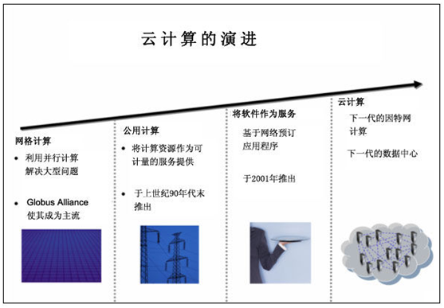
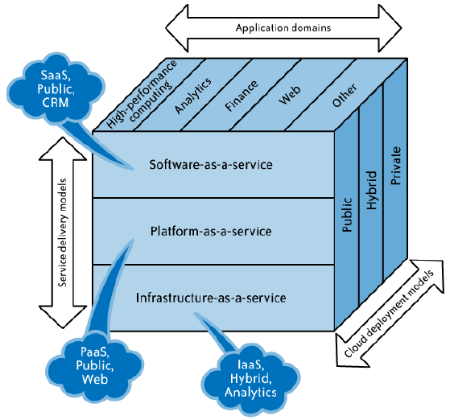
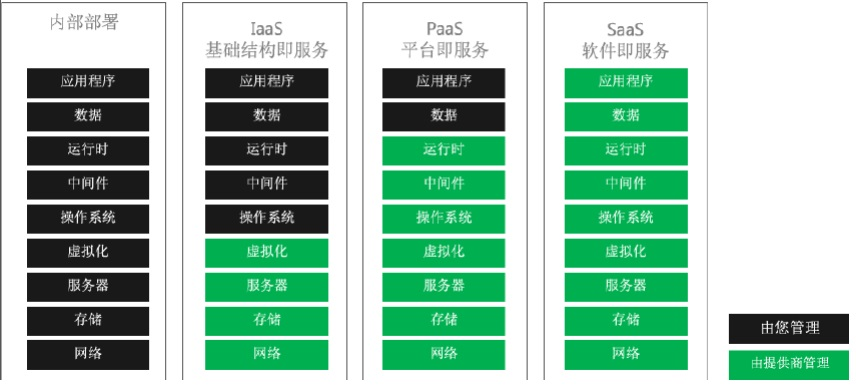
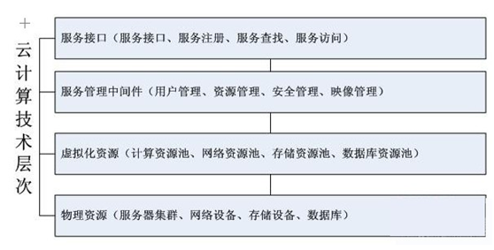
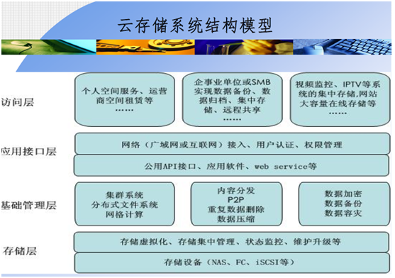
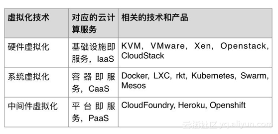
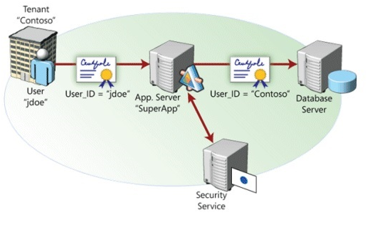
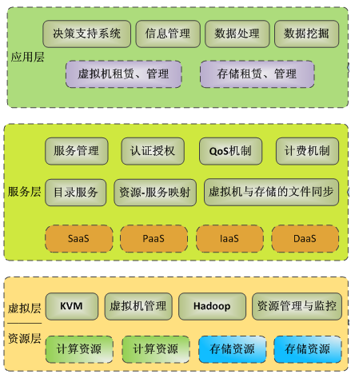
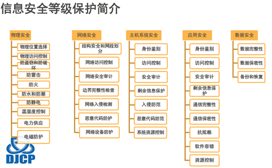

| 序号 | 修改时间   | 修改内容                       | 修改人 | 审稿人 |
| ---- | ---------- | ------------------------------ | ------ | ------ |
| 1    | 2010-5     | 创建                           | 吴启福 | 吴启福 |
| 2    | 2011-7-19  | 整理文档结构并填充             | 同上   |        |
| 3    | 2011-7-25  | 阐述hadoop内容                 | 同上   |        |
| 4    | 2016-10-24 | 增加云应用章节，大幅更新内容。 | 同上   |        |
| 5    | 2017-2-25  | 增加云架构实例章节             | 同上   |        |
| 6    | 2018-7-18  | 调整目录结构，更新云服务章节   | 同上   |        |
| 7    | 2019-12-14           | 更新头部云服务提供商相关内容                               |   同上     |        |

---

# 目录

[目录... 1](#_Toc519720671)

[1..... 概述... 4](#_Toc519720672)

[1.1     云计算的演进... 5](#_Toc519720673)

[1.2     云计算的服务和部署模型... 5](#_Toc519720674)

[1.3     云计算的参考体系结构... 7](#_Toc519720675)

[2..... 云服务... 9](#_Toc519720676)

[2.1     简介... 9](#_Toc519720677)

[2.2     国外云服务提供商... 11](#_Toc519720678)

[2.2.1     Amazon~ AWS. 11](#_Toc519720679)

[2.2.2     Microsoft~Azure. 11](#_Toc519720680)

[2.2.3     Google. 13](#_Toc519720681)

[2.2.4     IBM.. 14](#_Toc519720682)

[2.2.5     Oralce/Sun. 15](#_Toc519720683)

[2.2.6     Vmware. 16](#_Toc519720684)

[2.3     国内云服务提供商... 16](#_Toc519720685)

[2.3.1     阿里云... 16](#_Toc519720686)

[2.3.2     百度云... 17](#_Toc519720687)

[2.3.3     腾讯云... 17](#_Toc519720688)

[2.3.4     华为云... 17](#_Toc519720689)

[2.3.5     瑞星云... 17](#_Toc519720690)

[2.3.6     新浪SAE. 18](#_Toc519720691)

[2.4     各家云服务比较... 18](#_Toc519720692)

[2.4.1     云技术比较... 18](#_Toc519720693)

[2.4.2     云市场排名... 19](#_Toc519720694)

[2.5     本章参考... 21](#_Toc519720695)

[3..... 云应用... 22](#_Toc519720696)

[3.1     云安全... 22](#_Toc519720697)

[3.1.1     云安全事件案例... 22](#_Toc519720698)

[3.1.2     云计算带来的安全挑战... 23](#_Toc519720699)

[3.1.3     应用：安全云/云查杀... 23](#_Toc519720700)

[3.2     物联网... 24](#_Toc519720701)

[3.3     云主机和云终端... 25](#_Toc519720702)

[3.4     云存储/云盘... 25](#_Toc519720703)

[3.5     本章参考... 27](#_Toc519720704)

[4..... 云计算的核心技术 1. 27](#_Toc519720705)

[4.1     虚拟化技术... 27](#_Toc519720706)

[4.1.1     实时迁移技术... 28](#_Toc519720707)

[4.1.2     虚拟化资源管理... 29](#_Toc519720708)

[4.2     多租户技术... 29](#_Toc519720709)

[4.3     Hadoop体系... 31](#_Toc519720710)

[4.4     OpenStack. 31](#_Toc519720711)

[4.5     本章参考... 31](#_Toc519720712)

[5..... 云架构实例... 31](#_Toc519720713)

[5.1     云安全架构... 31](#_Toc519720714)

[5.1.1     IBM的云安全架构... 34](#_Toc519720715)

[5.1.2     华为的云安全架构... 35](#_Toc519720716)

[5.2     阿里云栖社区的云架构应用... 35](#_Toc519720717)

[5.2.1     小伽秀的云服务架构... 36](#_Toc519720718)

[6..... 云服务试用... 36](#_Toc519720719)

[6.1     aliyun. 36](#_Toc519720720)

[aws-ubuntu的主机信息（已过期）... 37](#_Toc519720721)

[6.2     AWS云... 37](#_Toc519720722)

[7..... 附录... 37](#_Toc519720723)

[7.1     参考资料... 37](#_Toc519720724)

[7.2     云安全标准与组织... 38](#_Toc519720725)

[7.2.1     国际... 38](#_Toc519720726)

[7.2.2     国内... 39](#_Toc519720727)

[7.3     信息安全等级保护简介... 41](#_Toc519720728)

 

 

**图目录**

[图 1 云计算的演进图... 5](#_Toc519720729)

[图 2 SPI云服务模型... 6](#_Toc519720730)

[图 3 云计算参考体系结构... 7](#_Toc519720731)

[图 4 云计算技术层次... 8](#_Toc519720732)

[图 5 云计算产业图... 9](#_Toc519720733)

[图 6 国内外各云服务提供商... 10](#_Toc519720734)

[图 8 MS云计算架构... 12](#_Toc519720735)

[图 7 IBM云计算架构体系... 15](#_Toc519720736)

[图 9 瑞星云计算安全架构... 17](#_Toc519720737)

[图 10 SAE安全架构... 18](#_Toc519720738)

[图 11 全球公有云(IAAS)服务市场份额2017H1（IDC) 20](#_Toc519720739)

[图 12 中国公有云(IAAS)服务市场份额2017H1（IDC) 21](#_Toc519720740)

[图 13 云存储系统结构模型... 26](#_Toc519720741)

[图 14 多租户技术图... 30](#_Toc519720742)

[图 15 多租户架构图... 30](#_Toc519720743)

[图 16 云计算系统的体系框架图... 32](#_Toc519720744)

[图 17 云计算安全架构... 33](#_Toc519720745)

[图 18 IBM信息安全框架... 34](#_Toc519720746)

[图 19 华为端管云协同的安全解决方案... 35](#_Toc519720747)

[图 20 小咖秀云服务结构... 36](#_Toc519720748)

 

**表目录**

[表格 1 云计算中的角色__ 7](#_Toc519720749)

[表格 2 国内主要云服务商列表__ 16](#_Toc519720750)

[表格 3 各家云计算技术对比表__ 18](#_Toc519720751)

[表格 4 物联网国内外发展现状__ 24](#_Toc519720752)

[表格 5 云盘事件列表__ 26](#_Toc519720753)

[表格 6 云计算核心技术列表__ 27](#_Toc519720754)

[表格 7 aws已购买云服务列表__ 36](#_Toc519720755)

[表格 8 云安全标准列表__ 38](#_Toc519720756)

 

 

---

 

# 1   概述

**定义**

**维基百科：**

云计算是一种能够将动态伸缩的虚拟资源通过互联网以服务的方式提供给

用户的计算模式，用户不需要知道如何管理那些支持云计算的基础设施。

**Whatis.com：**

云计算是一种通过网络连接来获取软件和服务的计算模式，云计算使得用

户可以获得使用超级计算机的体验，用户可以通过电脑或手机上的瘦客户端接

入云中获取需要的资源。

 

**The NIST Definition of Cloud Computing：**

Cloud computing is a model for enabling ubiquitous, convenient, ondemand

network access to a shared pool of configurable computing resources (e.g., networks, servers, storage, applications, and services) that can be rapidly provisioned and released with minimal

management effort or service provider interaction.

云计算是一个模型，该模型使用户能通过随需应变的网络，无处不在地、方便地访问可配置的计算资源（例如：网络、服务器、存储器和服务等）的共享池，而这些资源以最少的管理工作或通过与服务提供者的交互实现快速地供给和释放。

 

2009年年初，也就是金融危机最严重的时候，美国Salesforce公司公布了2008财年年度报告，数据显示公司云服务收入超过了10亿美元。从此很多公司开始进入云计算业务。

## 1.1  云计算的演进

 

图 1 云计算的演进图

 

图  公有云发展史（2005~2014）

备注：2015年成立CNCF（云原生计算设施）。

## 1.2  云计算模型

根据NIST的定义，云计算分为：
*  三种服务模型：SaaS, PaaS, IaaS
*  三种部署模型：私有云、公有云、混合云

 

 

图 2 SPI云服务模型

### 服务模型

图 云计算服务模型-典型云服务

新增二种服务

* DAAS：DaaS是数据即服务，英文全称是Date as a Server。云端部署好各种环境，收集大量数据并开始从中分析。最后把筛选、分析出来的数据作为服务。直白地说，就是大数据的一个类。涉及的服务有：客户关系管理（CRM）、企业资源规划（ERP）等等。

* AIAAS： AI作为一种服务。

### 部署模型

 表格 三种部署云的比较

| 分类   | 特点                     | 应用场景                                                     |
| ------ | ------------------------ | ------------------------------------------------------------ |
| 公有云 | 面向大众，价格实惠。     | 游戏、视频等等。                                             |
| 私有云 | 自建设备，数据隐私性好。 | 适合金融、政务等的大客户。其中托管私有云又叫专有云。 社区云或行业云是针对部分用户。 |
| 混合云 | 介于公有和私有之间       | 适合存量过度                                                 |

## 1.3  云计算的参考体系结构

 

图 3 云计算参考体系结构

 

表格 1 云计算中的角色

| Actor           | Definition                                                   | 备注     |
| --------------- | ------------------------------------------------------------ | -------- |
| Cloud  Consumer | A  person or organization that maintains a business relationship with, and uses  service from, Cloud Providers. | 云用户   |
| Cloud  Provider | A  person, organization, or entity responsible for making a service available to  interested parties. | 云提供者 |
| Cloud  Auditor  | A  party that can conduct independent assessment of cloud services, information  system operations, performance and security of the cloud implementation. | 云审核者 |
| Cloud  Broker   | An  entity that manages the use, performance and delivery of cloud services, and  negotiates relationships between Cloud Providers and Cloud Consumers. | 云经纪人 |
| Cloud  Carrier  | An  intermediary that provides connectivity and transport of cloud services from  Cloud Providers to Cloud Consumers. 如网络运营网 | 云载体   |

 

图 4 云计算技术层次

 

**物理资源**

主要指能支持计算机正常运行的一些硬件设备及技术，可以是价格低廉的PC，也可以是价格昂贵的服务器及磁盘阵列等设备，可以通过现有网络技术和并行技术、分布式技术将分散的计算机组成一个能提供超强功能的集群用于计算和存储等云计算操作。

 

**虚拟化资源**

指一些可以实现一定操作具有一定功能，但其本身是虚拟而不是真实的资源，如：计算池，存储池和网络池、数据库资源等，通过软件技术来实现相关的虚拟化功能包括虚拟环境、虚拟系统、虚拟平台等。

 

**服务管理中间件**

在云计算技术中，中间件位于服务和服务器集群之间，提供管理和服务即云计算体系结构中的管理系统。
*  对标识、认证、授权、目录、安全性等服务进行标准化和操作
*  为应用提供统一的标准化程序接口和协议
*  隐藏底层硬件、操作系统和网络的异构性，统一管理网络资源。
*  用户管理包括用户身份验证、用户许可、用户定制管理；
*  资源管理包括负载均衡、资源监控、故障检测等；
*  安全管理包括身份验证、访问授权、安全审计、综合防护等；
*  映像管理包括映像创建、部署、管理等。

 

# 2    云服务

详见  [云服务商比较](云服务商比较.md)

# 3   云应用

## 3.1  云安全

### 3.1.1  云安全事件案例

#### 3.1.1.1 云平台自身安全带来的安全事件

2013年1月31日亚马逊云计算服务出现大规模中断，影响DropBox等大量用户

2013年1月28日Facebook出现2-3小时中断

2013年2月1日微软Office 365、Outlook.com等云服务出现中断影响大量用户邮件收发、文件处理

2013年3月18-19日Google Drive 中断17个小时，导致大量用户无法访问自己云上的文件信息

2013年3月3日CLoudFlare网站崩溃将近1小时，导致785000个网站无法访问

**分析**：云平台的可用性是云安全问题之一，云平台服务端造成的损失远比非云要大得多。

 

**新浪SAE云计算平台**

新浪SAE的Java版本一处可越权访问其他目录 http://www.wooyun.org/bugs/wooyun-2010-042106

新浪SAE的Java版本一处权限不严可扫内网 http://www.wooyun.org/bugs/wooyun-2010-041694

SAE内容审核平台管理员弱口令漏洞 http://www.wooyun.org/bugs/wooyun-2010-020288

新浪SAE沦陷，oauthtoken/安全密码全部泄露，hack任意app http://www.wooyun.org/bugs/wooyun-2010-011189

新浪SAE云平台文件系统沙箱绕过 http://www.wooyun.org/bugs/wooyun-2010-03687

**分析**：攻击者可通过云计算平台自身的漏洞攻击云平台,获取云平台管理权限，或者直接攻击云平台的用户从而造成大规模的危害.

 

#### 3.1.1.2 云平台数据泄漏导致的安全事件

Evernote遭到黑客攻击，5000万用户密码需重 http://digi.tech.qq.com/a/20130304/000111.htm

1200万苹果设备ID泄露，源头并非FBI http://www.ctocio.com/ccnews/8524.html 

ChinaCache云主机openssl漏洞(控制用户主机系统) http://www.wooyun.org/bugs/wooyun-2010-056291

苹果开发者中心被黑，导致大量用户信息泄漏

http://www.tripwire.com/state-of-security/security-data-protection/apples-development-center-breached-by-hackers/

出去偷情被现场直播，iCloud导致离婚案件越来越多http://roll.sohu.com/20140420/n398525059.shtml

黑客在ebay上花费$50 to $150 买被锁的IPOHONE，然后通过icloud解锁。http://hackersnewsbulletin.com/2014/05/hackers-claim-hack-apples-icloud-server-unlock-30000-stolen-iphones.html

分析：云平台数据泄漏影响的用户将是海量的，涉及的经济损失更是无法估算，其中以icloud为例其中大量的通讯录、照片、私人日记等。

 

### 3.1.2  云计算带来的安全挑战

| 云计算特点       | 安全威胁                                                     |
| ---------------- | ------------------------------------------------------------ |
| 数据和服务外包   | （1）隐私泄露  （2）代码被盗                                 |
| 多租户和跨域共享 | （1）信任关系的建立、管理和维护更加困难  （2）服务授权和访问控制变得更加复杂  （3）反动、黄色、钓鱼欺诈等不良信息的云缓冲  （4）恶意SaaS应用 |
| 虚拟化           | （1）用户通过租用大量的虚拟服务使得协同攻击更容易，隐蔽性更强；  （2）资源虚拟化支持不同租户的虚拟资源部署在相同的物理资源上,方便了恶意用户借助共享资源实施攻击  （3）虚拟机的动态迁移，使得攻击的面更大，且很难追踪 |

 

### 3.1.3  应用：安全云/云查杀

主要服务商：趋势科技、瑞星、360、QQ管家。

 

病毒/木马识别——特征识别

种类越来越多;特征越来越细

特征的存储与识别: 存储容量越来越大;识别计算耗时越来越长

利用云的计算能力, 扩展云的思想——扩大特征码的搜集效率.

 

**云时代的安全威胁**
*  共享技术漏洞
*  数据丢失与数据泄露
*  恶意内部用户
*  账户服务及传输劫持
*  不安全的APIs
*  服务的恶意使用
*  不确定风险预测

 

**研究热点**
*  不可信任的服务上建立整体可信的服务链
*  第三方托管
*  动态边界的安全控制
*  虚拟化与安全

 

## 3.2  物联网

**定义**：

 “物联网”（IOT：Internet of Things）指的是将各种信息传感设备，如射频识别(RFID)装置、红外感应器、全球定位系统、激光扫描器等种种装置与互联网结合起来而形成的一个巨大网络。其目的是让所有的物品都与网络连接在一起，方便识别和管理。

From anytime, any placeconnectivity for anyone, we will now have connectivity for anything.

 

**物联网**

1、从技术理解物联网是指物体通过智能感应装置，经过传输网络，到达指定的信息处理中心，最终实现物与物、人与物之间的自动化信息交互与处理的智能网络。

2、从应用理解物联网是指把世界上所有的物体都联接到一个网络中，形成“物联网”,然后“物联网”又与现有的互联网结合,实现人类社会与物理系统的整合，达到更加精细和动态的方式管理生产和生活。

 

具体地说，就是把传感器嵌入和装备到电网、铁路、桥梁、隧道、公路、建筑、供水系统、大坝、油气管道等各种物体中。

然后将“物联网”与现有的互联网整合起来，实现人类社会、物理系统与虚拟（信息）系统的整合。

在这个整合的网络当中，存在能力超级强大的中心计算机群，能够对整合网络内的人员、机器、设备和基础设施实施实时的管理和控制。

 

物联网特点
*  全面感知：利用RFID、传感器、二维码、卫星、微波，及其它各种感知设备随时随地采集各种动态对象，全面感知世界。
*  可靠的传送：利用以太网、无线网、移动网将感知的信息进行实时传送。
*  智能控制：对物体实现智能化的控制和管理，真正达到人与物的沟通。

 

表格 4 物联网国内外发展现状

| 地区 | 发展情况                                                     |
| ---- | ------------------------------------------------------------ |
| 全球 | 1995年比尔・盖茨在《未来之路》书中首次提及物联网概念。  –2005年11月17日，在突尼斯举行的信息社会世界峰会（WSIS）上，国际电信联盟（ITU）发布了《ITU互联网报告2005：物联网》，报告指出，无所不在的“物联网”通信时代即将来临，世界上所有的物体从轮胎到牙刷、从房屋到纸巾都可以通过因特网主动进行交换。射频识别技术（RFID）、传感器技术、纳米技术、智能嵌入技术将到更加广泛的应用。  –2009年1月，IBM首席执行官彭明盛提出“智慧地球”构想，其中物联网为“智慧地球”不可或缺的一部分，而奥巴马在就职演讲后已对“智慧地球”构想提出积极回应，并提升到国家级发展战略。 |
| 日本 | 日本u-Japan战略，希望实现从有线到无线、从网络到终端、包括认证、数据交换在内的无缝链接泛在网络环境，100％的国民可以利用高速或超高速网络。 |
| 韩国 | 韩国也实现了类似的发展。配合u-Korea 推出的u-Home 是韩国的u-IT839 八大创新服务之一。智能家庭最终让韩国民众能通过有线或无线的方式远程控制家电设备，并能在家享受高质量的双向与互动多媒体服务。 |
| 中国 | 2009年8月7日，温总理在无锡调研时，对微纳传感器研发中心予以高度关注，提出了把“感知中国”中心设在无锡、辐射全国的想法。 |
|      |                                                              |

 

## 3.3  云主机和云终端

 

## 3.4  云存储/云盘

云存储是一个以数据存储和管理为核心的云计算系统。

**云存储相关技术**
*  宽带网络技术为云存储服务和应用奠定了基础；
*  集群技术、分布式文件系统和网络计算技术实现存储设备之间协同工作；
*  CDN内容分发、P2P技术、数据压缩技术实现高效数据存储和管理；
*  存储虚拟化技术、存储网络化管理技术实现灵活、便利的存储服务；
*  通过WEB2.0技术可以使使用者的应用方式和可得到的服务更加灵活和多
*  样化；
*  通过加密、验证、访问控制、属性加密、安全传输协议、确定性删除等技
*  术保障用户隐私和和数据安全；
*  冗余编码、数据备份和容灾技术保证云存储中的数据的可靠性。

 

图 13 云存储系统结构模型

 

各大知名厂商都在致力于云存储方案的研发：
*  HP的CloudSystem；
*  IBM的SmartCloud解决方案；
*  EMC的Atmos云存储解决方案；
*  Microsoft的WindowsAzure存储、备份和恢复方案。

很多公司或机构基于开源系统构建云存储平台及其应用：
*  OpenStack中的Swift组件；
*  Hadoop大数据存储HDFS；
*  Cassandra；
*  FastDFS

 

表格 5 云盘事件列表

| 云盘服务商 | 简介                                                         | 事件                                                         |
| ---------- | ------------------------------------------------------------ | ------------------------------------------------------------ |
| 百度网盘   | 4亿用户，国内第一大云盘提供商。  分为[百度云](https://cloud.baidu.com/)（公有云平台）和[百度网盘](https://pan.baidu.com/)（个人云，原名百度云）。 | 2012.8，百度推出云存储服务~百度云，免费最大2T永久空间；2016.10更名为百度网盘。  2015年，百度开放云正式开放运营；2016.10正式更名百度云。 |
| 华为       | 1亿用户，国内第二大云盘提供商。                              | 2016.5，华为DBank关闭。                                      |
| 360        | 用户，国内第三大云盘提供商。                                 | 2016.10.20，360官方宣布将于2017年2月1日停止个人云存储服务。  |
| 其它       |                                                              | 2016.3，115和UC宣布关闭网盘服务。  2016.4，新浪微盘、迅雷快盘、腾讯微云关闭个人云存储服务。 |

注：2016年以来，国内各大云盘提供商都以响应国家政策营造良好网络环境为借口，陆续关闭云盘服务。

## 3.5  本章参考

 

# 4    云计算的核心技术 1

## 4.1  虚拟化技术

**虚拟化发展历程**

1950s 虚拟化概念提出

1960s 虚拟化在大型机上商用

操作系统虚拟内存；Java虚拟机；基于X86体系结构的服务器虚拟化技术。

 

**为什么要进行虚拟化**

降低运营成本；专注于管理；摆脱与硬件打交道的工作；加速应用部署；

提高应用兼容性
- 各种平台、操作系统、中间件的兼容性
- 技术角度进行封装、隔离

提高服务可用性
- 提高兼容性
- 便于备份、恢复

提升资源利用率

动态调度资源

降低能源消耗

 

 

 

表格 6 云计算核心技术列表

| 类别     | 虚拟化例子                                            | 技术原理                                                     |
| -------- | ----------------------------------------------------- | ------------------------------------------------------------ |
| 基础设施 | VPN                                                   | VPN的隧道协议主要有三种，PPTP、L2TP和IPSec，其中PPTP和L2TP协议工作在OSI模型的第二层，又称为二层隧道协议；IPSec是第三层隧道协议。 |
|          | VLAN                                                  | 虚拟局域网（VLAN）是一组逻辑上的设备和用户，这些设备和用户并不受物理位置的限制，可以根据功能、部门及应用等因素将它们组织起来，相互之间的通信就好像它们在同一个网段中一样  –VLAN工作在OSI参考模型的第2层和第3层，一个VLAN就是一个广播域，VLAN之间的通信通过第3层的路由器完成。  –VLAN网络可以是有混合的网络类型设备组成，比如：以太网、令牌网、FDDI等。 |
|          | 设备与IO虚拟化                                        |                                                              |
| 存储     | 磁盘阵列技术（Redundant Array of Inexpensive  Disks） | RAID0/RAID1等标准。                                          |
|          | 网络附加存储（Network Attached Storage）              |                                                              |
|          | 存储区域网（Storage Area Network）                    |                                                              |
|          | 内存                                                  | 虚拟内存与物理内存的映射  影子页表法  页表写入法             |
| 系统     | Windows                                               |                                                              |
|          | LXC~Linux  Container                                  | LXC是一种内核虚拟化技术，提供轻量级的虚拟化  隔离进程和资源。  基于Linux内核的cgroups子系统，cgroups子系统是Linux内核提供的一个基于进程组的资源管理的框架，可以为特定的进程组限定可以使用的资源 |
|          | Docker                                                | 基于进程容器(Processcontainer)的轻量级VM解决方案             |
|          | KVM~Kernel-based  Virtual Machine                     | 开源虚拟化模块  集成在Linux的各个主要发行版本中  使用Linux自身的调度器进行管理 |
|          | XEN                                                   |                                                              |
| 软件     | Java虚拟机                                            |                                                              |
| 计算     | CPU虚拟化                                             | 传统方式：通过一系列手段改变序列次序。如  时间片轮转；短进程优先；中断。  •本质是一种指令序列的调度机制 |

 

### 4.1.1  实时迁移技术

将整个虚拟机的运行状态完整、快速地从原宿主机的硬件平台转移到新的宿主机硬件平台
*  实时性
*  内存页面不断滴从源虚拟机监视器拷贝到目标虚拟机监视器
*  拷贝结束后，目标虚拟机开始运行，虚拟机监视器切换到目标虚拟机上，源虚拟机终止
*  广泛应用于实时系统的硬件维护

 

### 4.1.2  虚拟化资源管理

 

## 4.2  多租户技术

多租户技术（英语：multi-tenancy technology）或称多重租赁技术，是一种软件架构技术，它是在探讨与实现如何于多用户的环境下共用相同的系统或程序组件，并且仍可确保各用户间数据的隔离性。

在多租户技术中，租户（tenant）是指使用系统或电脑运算资源的客户，但在多租户技术中，租户包含在系统中可识别为指定用户的一切数据，举凡帐户与统计信息（accounting data），用户在系统中建置的各式数据，以及用户本身的客制化应用程序环境等，都属于租户的范围，而租户所使用的则是基于供应商所开发或建置的应用系统或运算资源等，供应商所设计的应用系统会容纳数个以上的用户在同一个环境下使用，为了要让多个用户的环境能力同一个应用

程序与运算环境上使用，则应用程序与运算环境必须要特别设计，除了可以让系统平台可以允许同时让多份相同的应用程序运行外，保护租户数据的隐私与安全也是多租户技术的关键之一。

数据面（data approach）：供应商可以利用切割数据库（database），切割存储区（storage），切割结构描述（schema）或是表格（table）来隔离租户的数据，必要时会需要进行对称或非对称加密以保护敏感数据，但不同的隔离作法有不同的实现复杂度与风险。

程序面（application approach）：供应商可以利用应用程序挂载（hosting）环境，于进程（process）上切割不同租户的应用程序运行环境，在无法跨越进程通信的情况下，保护各租户的应用程序运行环境，但供应商的运算环境要够强。

系统面（system approach）：供应商可以利用虚拟化技术，将实体运算单元切割成不同的虚拟机，各租户可以使用其中一至数台的虚拟机来作为应用程序与数据的保存环境，但对供应商的运算能力要更要求。

多租户技术的实现重点，在于不同租户间应用程序环境的隔离（application context isolation）以及数据的隔离（data isolation)，以维持不同租户间应用程序不会相互干扰，同时数据的保密性也够强。

- 应用程序部份：通过进程或是支持多应用程序同时运行的装载环境（例如Web Server，像是Apache或IIS等）来做进程间的隔离，或是在同一个伺服程序（server）进程内以运行绪的方式隔离。

- 数据部份：通过不同的机制将不同租户的数据隔离，Force是采用中介数据（metadata）的技术来切割，微软MSDN 的技术文件则是展示了使用结构描述的方式隔离。

 

图 14 多租户技术图

 

应用实现对“多租户”的支持，需要相应的“多租户架构”（Multi-tenancy architecture）。

**经典的多租户架构：**
*  Shared nothing
*  Shared hardware
*  Shared everything

Gartner对当前云应用“多租户”架构进行了总结并给出了参考架构，如下：

 

图 15 多租户参考架构图

 

## 4.3  Hadoop体系

详见 [《Hadoop体系》](./bigdata/Hadoop体系.md)

## 4.4  OpenStack

OpenStack是一个由NASA（[美国国家航空航天局](http://baike.baidu.com/view/85211.htm)）和Rackspace[合作研发](http://baike.baidu.com/view/1506447.htm)并发起的，以[Apache](http://baike.baidu.com/view/28283.htm)许可证授权的[自由软件](http://baike.baidu.com/view/20965.htm)和[开放源代码](http://baike.baidu.com/view/1708.htm)项目。

OpenStack是一个开源的云计算管理平台项目，由几个主要的组件组合起来完成具体工作。OpenStack支持几乎所有类型的云环境，项目目标是提供实施简单、可大规模扩展、丰富、标准统一的云计算管理平台。OpenStack通过各种互补的服务提供了基础设施即服务（IaaS）的解决方案，每个服务提供API以进行集成。

 

OpenStack是IaaS(基础设施即服务)组件，让任何人都可以自行建立和提供[云端运算](http://baike.baidu.com/view/2872167.htm)服务。

此外，OpenStack也用作建立[防火墙](http://baike.baidu.com/view/3067.htm)内的“[私有云](http://baike.baidu.com/view/4000912.htm)”（Private Cloud），提供机构或企业内各部门共享资源。

 

**技术组成**
*  以[Python](http://baike.baidu.com/view/21087.htm)编程语言编写
*  整合[Tornado](http://baike.baidu.com/view/287649.htm) 网页服务器、Nebula运算平台
*  使用Twisted软件框架
*  遵循Open Virtualization Format、AMQP、SQLAlchemy等标准
*  虚拟机器软件支持包括：[KVM](http://baike.baidu.com/view/27773.htm)、[Xen](http://baike.baidu.com/view/697213.htm)、[VirtualBox](http://baike.baidu.com/view/1047853.htm)、QEMU、 LXC 等。

 

## 4.5  本章参考

 

# 5    云架构实例

## 5.1  云安全架构

 

 

图 16 云计算系统的体系框架图

 

 

图 17 云计算安全架构

 

**云计算安全的非技术手段**
*  第三方认证：第三方认证是提升信任关系的一种有效手段，即采用一个中立机构对信任双方进行约束。
*  企业信誉：企业信誉对于任何一个竞争领域的企业来讲都是至关重要的。一般来讲，越大的企业对于自身信誉越看重，不会因为利益去窃取客户的数据。
*  合同约束：目前已经有很多云计算服务提供商推出了自己的云计算服务的服务水平协议（SLA)，这些协议从服务质量、技术支持和知识产权等方面对服务进行了规范，对服务提供者与使用者的权利和义务进行了明确。

 

### 5.1.1  IBM的云安全架构

 

图 18 IBM信息安全框架

 

### 5.1.2  华为的云安全架构

 

图 19 华为端管云协同的安全解决方案

 

云计算安全的核心控制点在云操作系统，云操作系统需要安全可控。
1. 从云平台的角度：虚拟机是云计算操作系统的一个应用
2. 从虚拟机的角度：云计算操作系统就是原来的硬件层

 

## 5.2  阿里云栖社区的云架构应用

阿里云栖社区 https://yq.aliyun.com 

- 第九期：[《微博：一亿访问量背后的分钟级服务器扩容》](https://yq.aliyun.com/articles/18132?spm=5176.blog8530.yqblogcon1.11.w0IH6I)
- 第八期：[《有货：六层混合云架构打造中国最潮生态圈》](https://yq.aliyun.com/articles/15260?spm=5176.blog11259.yqblogcon1.11.HgzGsf)
- 第七期：[《美柚：最懂女性App背后的混合云架构与大数据服务》](https://yq.aliyun.com/articles/11259?spm=5176.blog7548.yqblogcon1.10.U8wUQB)
- 第六期：[《涂鸦科技：支撑从零暴增数十亿数据的背后，竟无专职运维！》](https://yq.aliyun.com/articles/8896?spm=5176.blog11259.yqblogcon1.11.eLBBDJ)
- 第五期：[《千万级用户App小咖秀：服务端架构设计分享》](https://yq.aliyun.com/articles/8530?spm=5176.blog11259.yqblogcon1.12.eLBBDJ)
- 第四期：[《空格App亿元A轮融资背后：云上多场景技术架构实践与经验》](https://yq.aliyun.com/articles/8306?spm=5176.blog11259.yqblogcon1.13.eLBBDJ)
- 第二期：[《游族网络：如何运维千台以上游戏云服务器》](https://yq.aliyun.com/articles/7548?spm=5176.blog11259.yqblogcon1.15.eLBBDJ)
- 第一期：[《淘宝丁奇：如何解决影响MySQL使用的9大问题》](https://yq.aliyun.com/edu/lesson/play/91?spm=5176.blog18132.yqblogcon1.17.14Ux3G) 

 

### 5.2.1  小伽秀的云服务架构

 

图 20 小咖秀云服务结构

说明：云服务架构的最前端采用负载均衡，可以通过流量分发扩展应用系统对外的服务能力，通过消除单点故障提升应用系统的可用性。中间是URL分发路由，内部的子系统通过ECS服务器搭建PHP集群。缓存部分分为一级缓存和二级缓存两个部分。一级缓存主要通过云Memcached搭建，二级缓存是在ECS部署的Redis搭建而成。最后端是数据库集群，开始阶段是采用自建的MySQL数据库。后期从自建MySQL迁移到RDS上，迁移中通过DPS热切换，切换时间仅用了几十秒的时间，并且迁移过程中没有停机。

 

# 6    云服务试用

## 6.1  aliyun

表格 7 aws已购买云服务列表

| 产品                | 详情                                                         | 计费方式                                                     | 时间              |
| ------------------- | ------------------------------------------------------------ | ------------------------------------------------------------ | ----------------- |
| **云服务器ECS** | 详见0aws-ubuntu的主机信息  ip:  123.56.21.231  root/         | IO（cpu，最差1核1GB) + 磁盘（40GB起） + 带宽（最少1MB/s)  此外考虑区域、操作系统。 | 半年（~20170630） |
| 数加-机器学习       | 企业别名：1805651026304759  子用户名称： dp_20161229_62562   子用户密码： OtWlGSKT |                                                              |                   |
|                     |                                                              |                                                              |                   |

 

### aws-ubuntu的主机信息（已过期）

| 地域                                              | 华北 2                         |
| ------------------------------------------------- | ------------------------------ |
| 可用区                                            | 随机分配                       |
| I/O 优化实例                                  | I/O 优化实例                   |
| 实例规格                                          | 1 核 2GB                       |
| 网络类型                                          | 专有网络                       |
| 带宽                                          | 1Mbps（按固定带宽）            |
| 操作系统                                          | Ubuntu 14.04 64位              |
| 系统盘                                        | 40GB 高效云盘                  |
| 数据盘                                            | 20GB（高效云盘，不随实例释放） |
| 密码                                              | 已设置                         |
| 实例名称                                          | aws_ubuntu                     |
| 提示：专有网络带宽大于 0 将分配公网 IP 且不能解绑 |                                |

 

## 6.2  AWS

AWS 免费套餐 (12 个月推广期)

https://aws.amazon.com/cn/free/?sc_ichannel=ha&sc_icampaign=signin_prospects&sc_isegment=cn&sc_iplace=sign-in&sc_icontent=freetier&sc_segment=-1

包括Amazon EC2、Amazon S3和RDBS。

## 6.3 华为云HuaweiCloud

 

## 本章参考

[1].  华为云

[2]. ModelArts https://support.huaweicloud.com/modelarts/index.html 

# 7  附录

## 7.1  参考资料

[1].  云计算新闻 http://www.cloudcomputing-china.cn/Article/Index.html

[2].  中云网 [http://www.china-cloud.com](http://www.china-cloud.com/)

[3].  中国云计算网 http://www.cloudcomputing-china.cn/

[4].  云计算网 http://cloud.saaser.cn/

[5].  企业云计算网 http://www.ecloud.com.cn/

[6].  中国云计算联盟百科全书 http://www.chinacloud.org/wiki

[7].  http://www.aboutyun.com 

[8].  本人BLOG：google技术专题

[9].  Bigtable: A Distributed Storage System for Structured Data

[10]. HFile: A Block-Indexed File Format to Store Sorted Key-Value Pairs for a thorough introduction Hbase Architecture 101

 

## 7.2  云安全标准与组织

### 7.2.1  国际

目前主要的云安全标准机构，有：
*  ISO/IEC 第一联合技术委员会(ISO/IEC JTC1)
*  国际电信联盟--电信标准化部(ITU-T)
*  美国国家标准技术研究所（NIST）
*  区域标准组织（美国）CIO委员会
*  欧洲网络与信息安全管理局（ENISA ）
*  开放式组织联盟（TheOpenGroup）

 

国际上比较具有影响力的云安全组织，有：
*  云安全联盟（CSA）
*  分布式管理任务组（DMTF）
*  结构化信息标准促进组织（OASIS）

 

表格 8 云安全标准列表

| 云安全分类           | 安全子类           | 相关组织、标准(白皮书)                                       |
| -------------------- | ------------------ | ------------------------------------------------------------ |
| 云安全体系架构及术语 |                    | NIST：《云计算参考体系》（标准）  CSA:《云计算关键领域安全指南》（白皮书）  ITU-T：《电信领域云计算安全指南》（标准草案）  TheOpenGroup:《云安全和SOA参考架构》（标准） |
| 安全的云             | 身份隐私与访问控制 | OASIS:《身份在云中的使用》（白皮书）  CSA：《云控制矩阵》(白皮书)，《身份管理与接入控制指导建议书》(白皮书),《云计算安全障碍与缓和措施》（白皮书）  NIST：《公共云计算中安全域隐私》（标准草案），《通用云计算环境》（标准草案）  DMTF：《云管理体系结构》(白皮书)  ISO/IEC：《云计算安全与隐私管理系统》（标准草案） |
|                      | 虚拟运行环境安全   | ISO/IEC：《ISO/IECDIS17203》—虚拟机迁移（标准草案）  NIST:《完全虚拟化技术安全指南》（标准）,《云计算安全障碍与缓和措施》（标准草案） |
|                      | 云风险评估         | NIST:《云计算安全障碍与缓和措施》（标准草案）  ENSIA：《云计算--信息安全保障框架》，《云计算--信息安全的好处，风险和建议》 |
| 可信的云             | 数据安全与数据隐私 | NIST:《云计算安全障碍与缓和措施》（标准草案）  CSA:《如何保护云数据》（白皮书） |
|                      | 云审计             | CSA：《云审计》（白皮书）                                    |
|                      | 可信云认证         | ITU-TY.3501的可信云服务                                      |
| 可靠的云             | 云容灾与数据备份   | NIST:《云计算安全障碍与缓和措施》（标准草案）                |
| 可控的云             | 云内容管理         | ISO/IEC：《ISO/IECIDS13187》—一种多虚拟机管理通信协议(标准草案)  DMTF：《云管理体系结构》(白皮书)，《云管理用例与交互》(白皮书)  NIST:《云计算安全障碍与缓和措施》（标准草案） |

### 7.2.2  国内

**1.中国通信标准化协会（CCSA）**

组织简介：2002年12月18日在北京正式成立。

 该协会是国内企、事业单位自愿联合组织起来，经业务主管部门批准，国家社团登记管理机关登记，开展通信技术领域标准化活动的非营利性法人社会团体。

组织成员：目前已有277个研究组织和企业加盟。

相关云安全标准： 
*  《移动环境下云计算安全技术研究》 由中国联合网络通信集团有限公司牵头，针对移动环境中云计算中面临的安全关键问题进行详细分析和研究。
*   《电信业务云安全需求和框架》 由中兴通讯股份有限公司牵头，旨在构建电信业务云环境的安全业务云体系框架。

 

**2、全国信息技术标准化技术委员**

组织简介：成立于1983年。受国家标准化管理委员会和工业和信息化部的共同领导，下设17分技术委员会和10个直属工作组。

SOA标准工作组（WGSOA）负责云计算领域的相关标准

GB/T32400-2015《信息技术云计算概览与词汇》

GB/T32399-2015《信息技术云计算参考架构》

 目前尚未发布与云安全相关标准

 

目前可借鉴信息安全领域标准，身份认证与隐私保护

 《隐私保护框架》、《隐私参照体系架构》等等 数据隐私与安全

 《公钥基础设施安全支撑平台技术框架》、《证书认证系统密码及其相关安全技术规范》等等 风险评估

 《信息安全管理系统》、《风险管理--风险评估技术》等等

 

**3、全国信息安全标准化技术委员**

**组织简介：**

 成立于2002年。直属于国家标准化管理委员会，主要负责国家网络安全标准申报、立项、评审等工作。

 技术委员会主要工作范围包括：安全技术、安全机制、安全服务、安全管理、安全评估等领域的标准化技术工作。

**SWG-BDS大数据安全特别工作组**

负责大数据和云计算相关的安全标准化研制工作。具体职责包括调研急需标准化需求，研究提出标准研制路线图，明确年度标准研制方向，及时组织开展关键标准研制工作。

**正在制定的标准包括：**

 信息安全技术云计算安全参考架构

 云计算服务安全能力评估方法

 桌面云安全技术要求

 信息安全技术政府门户网站云计算服务安全指南

 网站安全云防护平台技术要求

 云计算服务持续监管框架及技术规范

 信息安全技术云计算服务安全指南

 信息安全技术云计算服务安全能力要求

 

|              | 中国通信标准化协会（CCSA）                       | 全国信息技术标准化技术委员                               | 全国信息安全标准化技术委员                               |
| ------------ | ------------------------------------------------------------ | ------------------------------------------------------------ | ------------------------------------------------------------ |
| 成立         | 2002                                                         | 1983                                                         | 2002                                                         |
| 组织简介     | 该协会是国内企、事业单位自愿联合组织起来，经业务主管部门批准，国家社团登记管理机关登记，开展通信技术领域标准化活动的非营利性法人社会团体。  组织成员：目前已有277个研究组织和企业加盟。 | SOA标准工作组（WGSOA）负责云计算领域的相关标准               | 直属于国家标准化管理委员会，主要负责国家网络安全标准申报、立项、评审等工作  技术委员会主要工作范围包括：安全技术、安全机制、安全服务、安全管理、安全评估等领域的标准化技术工作。   SWG-BDS大数据安全特别工作组：负责大数据和云计算相关的安全标准化研制工作。具体职责包括调研急需标准化需求，研究提出标准研制路线图，明确年度标准研制方向，及时组织开展关键标准研制工作。 |
| 已制定标准   | 《移动环境下云计算安全技术研究》~由中国联合网络通信集团有限公司牵头，针对移动环境中云计算中面临的安全关键问题进行详细分析和研究。  《电信业务云安全需求和框架》  ~由中兴通讯股份有限公司牵头，旨在构建电信业务云环境的安全业务云体系框架。 | GB/T32400-2015《信息技术云计算概览与词汇》  GB/T32399-2015《信息技术云计算参考架构》 |                                                              |
| 正在制定标准 |                                                              |                                                              | 信息安全技术云计算安全参考架构  云计算服务安全能力评估方法  桌面云安全技术要求  信息安全技术政府门户网站云计算服务安全指南  网站安全云防护平台技术要求  云计算服务持续监管框架及技术规范  信息安全技术云计算服务安全指南  信息安全技术云计算服务安全能力要求 |

 

 

## 7.3  信息安全等级保护简介

信息安全等级保护是指对国家秘密信息、法人和其他组织及公民的专有信息以及公开信息和存储、传输、处理这些信息的信息系统分等级实行安全保护
*  对信息系统中使用的信息安全产品实行按等级管理
*  对信息系统中发生的信息安全事件分等级响应、处置
*  测评指标项主要根据信息系统的安全保护等级选取。其中三级测评项目根据信息系统防护等级（S3A3G3）包含73个安全指标类，290个安全要求项。
*  单元测评：包括物理安全、网络安全、主机安全、应用安全、数据安全、安全管理机构、安全管理制度、人员安全管理、系统建设管理和系统运维管理共10个方面，覆盖290个要求项。
*  整体测评：包括安全控制点间测评、层面间测评、区域间测评和验证测试几个方面。

 

 

 

