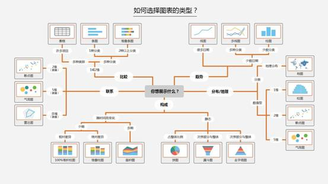

| 序号 | 修改时间  | 修改内容 | 修改人 | 审稿人 |
| ---- | --------- | -------- | ------ | ------ |
| 1    | 2018-8-28 | 创建     | 吴启福 |        |
|      |           |          |        |        |
---

 

# 1    数据可视化理论

## 1.1   视觉理论

详见 《计算机视觉》颜色模型

 

## 1.2   设计心理学：格式塔原理(Gestalt)

格式塔心理学（gestalt psychology），又叫完形心理学，是西方现代心理学的主要学派之一，诞生于德国1912年，后来在美国得到进一步发展。该学派既反对美国构造主义心理学的元素主义，也反对行为主义心理学的刺激—反应公式，主张研究直接经验（即意识）和行为，强调经验和行为的整体性，认为整体不等于并且大于部分之和，主张以整体的动力结构观来研究心理现象。该学派的创始人是[韦特海默](https://baike.baidu.com/item/韦特海默/4025307)，代表人物还有[苛勒](https://baike.baidu.com/item/苛勒/4025357)和[考夫卡](https://baike.baidu.com/item/考夫卡)。

格式塔心理学是由德国心理学家组成的研究小组试图解释人类视觉的工作原理。他们观察了许多重要的视觉现象并对它们编订了目录。其中最基础的发现是人类视觉是整体的：我们的视觉系统自动对视觉输入构建结构，并在神经系统层面上感知整体和统一的形状、图形和物体，而不是只看到互不相连的边、线和区域。“形状”和“图形”在德语中是Gestalt，因此这些理论也称做视觉感知的格式塔原理。

 

格式塔心理学感知理论最基本的法则是简单精练法则，倾向于将事物理解为一个整体，而不是分割成部分。所以格式塔法则又称为完图法则。

格式塔原理(Gestalt)是设计心理学里具备纲领性和指导性的设计法则，我们非常熟悉的设计4原则「对齐、重复、对比、亲密」其实就是格式塔原理的另一种总结。

 

**七大原理：接近性原理；相似性原理；连续性原理；封闭性原理；对称性原理；主体/****背景原理；共同命运原理。**

备注：在现实世界的视觉场景中，各种格式塔原理并不是孤立的，而是共同起作用，在工作中用每一条原理来考量各个设计元素之间的关系是否符合设计初衷。

 

1、接近性原理（注：强调的是位置）

接近性原理说的是物体之间的相对距离会影响我们感知它是否以及如何组织在一起。互相靠近（相对于其它物体）的物体看起来属于一组，而那些距离较远的则自动划为组外。

 

2、相似性原理（注：强调的是内容）

如果其它因素相同，那么相似的物体看起来归属于一组。

3、连续性原理

视觉倾向于感知连续的形式而不是离散的碎片。

4、封闭性原理

视觉系统自动尝试将敞开的图形关闭起来，从而将其感知为完整的物体而不是分散的碎片。

5、对称性原理

我们倾向于分解复杂的场景来降低复杂度。

 
6、主体/背景原理

我们的大脑将视觉区域分为主体和背景。主体包括一个场景中占据我们主要注意力的所有元素，其余则是背景。

7、共同命运

与接近性、相似永生原理相关，都影响我们感知的物体是否成组。指出一起运动的物体被感知为属于一组或者是彼此相关的。

 

## 1.3   交互设计

**产品框架设计理论-****用户体验五要素**

产品框架基于用户体验五要素：战略层、范围层、结构层、框架层、表现层，来进行制定。

 

**产品框架设计理论-7****（±2****）信息块效应**

人类头脑最好的状态能记忆含有7±2项信息块，在记忆了5-9项信息后人类的头脑就开始出错。（假如你的短时记忆像一般人那样,你可能会回忆出5~9个单位，即7±2个，这个有趣的现象就是神奇的7±2效应。这个规律最早是在19世纪中叶，由爱尔兰哲学家威廉汉密尔顿观察到的。

 

**产品框架设计理论-****卡片分类法**

卡片分类法是一种规划和设计互联网产品或者软件产品的信息构架的方法。它属于用户研究中的一种方法，简单来说就是用户来对信息卡片（或者是菜单卡片）进行归类，从而得出信息关联性的一种方法。我们最后把关联性更强的菜单放在一起，就形成了较为科学的一套信息分组。

 

## 1.4   本章参考

[1].   以Apple Music为例，为你解读格式塔7大法则 https://www.uisdc.com/apple-music-example-gestalt-7-law 
[2].   交互七大定律之格式塔原理 https://www.jianshu.com/p/85db79592a9e 
[3].   超全面！交互设计的基础方法和理论总结（上） https://www.uisdc.com/ux-basic-method-theory-summary-1 
[4].   百度百科-格式塔心理学[https://baike.baidu.com/item/%E6%A0%BC%E5%BC%8F%E5%A1%94%E5%BF%83%E7%90%86%E5%AD%A6](https://baike.baidu.com/item/格式塔心理学) 

# 2    可视化图表

## 2.1   图表类型

图 1 如何选择图表的类型

| 分类      | 图表            | 特性                                                         | 应用场景                                                     |
| --------- | --------------- | ------------------------------------------------------------ | ------------------------------------------------------------ |
| 构成      |                 | 包括时序相关的和静态的。  时序相关的如：堆叠面积/柱形  静态的如屏饼状、漏斗和金字塔图 |                                                              |
|           | 饼状图          | 显示各项的大小与各项总和的比例。适用简单的占比比例图，在不要求数据精细的情况适用。 | 单维度的占比分析                                             |
|           | 金字塔          |                                                              |                                                              |
|           | 漏斗            | 优势:在网站分析中，通常用于转化率比较，它不仅能展示用户从进入网站到实现购买的最终转化率，还可以展示每个步骤的转化率，能够直观地发现和说明问题所在。  劣势:单一漏斗图无法评价网站某个关键流程中各步骤转化率的好坏。 | 适用于业务流程多的流程分析，显示各流程的转化率。             |
|           | 面积图          | 延伸图表：堆积面积图、百分比堆积面积图，堆积图可以显示部分与整体之间（或者几个数据变量之间）的关系。 | 强调数量随时间而变化的程度，也可用于引起人们对总值趋势的注意。 |
| 联系      |                 | 维度从二维、五维到多维                                       |                                                              |
|           | 散点图          | 二维或三维。散点图适用于三维数据集，但其中只有两维需要比较。 |                                                              |
|           | 气泡图          | 三或四维，其中只有两维能精确辨识。                           |                                                              |
|           | 雷达图          | 多维。适用于多维数据（四维以上），且每个维度必须可以排序，数据点一般不超过6个。 | 了解公司各项数据指标的变动情形及其好坏趋向。                 |
|           | 词云图          | 优势：很酷炫、很直观的图表。  劣势：使用场景单一，一般用来做词频。 | 显示词频，可以用来做一些用户画像、用户标签的工作。           |
| 趋势/比较 |                 |                                                              |                                                              |
|           | 柱状图/  条形图 | 适合中小规模的二维数据集，但只需比较一个维度。肉眼对柱子高低敏感。  延伸图表：堆积、百分比堆积柱状图 | 用于显示一段时间内的数据变化或显示各项之间的比较情况。       |
|           | 折线图          | 适合二维的大数据集，还适合多个二维数据集的比较。             | 适合数据走势分析                                             |
|           | 指标卡          | 很直观告诉看图者数据的最终结果。只是单一的数据展示。         | 显示某个数据结果&同环比数据。                                |
| 地图      |                 | 适用于有空间位置的数据集。BDP支持地址转经纬度功能，可制作行政地图（面积图）、行政地图（气泡图）、热力地图、轨迹地图等6种经纬度地图。 |                                                              |
|           | 中国地图        | 可以展示全国数据分布，也可以展示区县数据分布。               | **用户地域分析**                                             |
|           | 国家地图        |                                                              |                                                              |
| 双轴图    |                 | 柱状图+折线图的结合                                          | 数据走势、数据同环比对比                                     |
| 其它      |                 |                                                              |                                                              |
|           | 子弹图          |                                                              | **分析多个数据指标的完成进度**                               |
|           | 色块图          | 作用于二维数据的热力图，由小色块代表某个维度的值。特别适合用于数据量较大、且具有连续性的数据进行分析 |                                                              |
|           | 计量图          | 类似进度条，表达效果很明确，数据场景比较单一。               | 一般用来显示项目的完成进度。                                 |
|           | 瀑布图          | 优势：展示两个数据点之间的演变过程，还可以展示数据是如何累计的。  劣势：没有柱状图、条形图的使用场景多。 | 采用绝对值与相对值结合的方式                                 |
|           | 桑基图          | 特定类型的流程图                                             |                                                              |
|           | 旭日图          | 分层看数据很直观，逐层下钻看数据。                           | 可以表达清晰的层级和归属关系                                 |

备注：地图GIS信息有国际标准。

 

表格 1 图元的维度

| 基本图元    | 第1维度  | 第2维度 | 第3维度  | 第r维度      | 第5维度      |
| ----------- | -------- | ------- | -------- | ------------ | ------------ |
| 树形图      | 面积大小 | 颜色    |          |              |              |
| 饼状图/条形 | 扇面大小 |         |          |              |              |
| 折线图      | X轴      | Y轴     | 次坐标轴 | 颜色         |              |
| 面积图      | X轴      | Y轴     | 次坐标轴 | 颜色         |              |
| 柱形图      | X轴      | Y轴     | 次坐标轴 | 颜色         | 宽窄         |
| 散点图      | X轴      | Y轴     | 大小     | 颜色         | （符号）形状 |
| 填充地图    | 坐标位置 | 颜色    |          |              |              |
| 符号地图    | 坐标位置 | 大小    | 颜色     | （符号）形状 |              |
| 雷达图      | 高低     | 颜色    |          |              |              |
| 股份图      | X轴      | Y轴     | 颜色     |              |              |
|             |          |         |          |              |              |

备注：维度次序是按照重要性排列。

 

## 2.2   本章参考

 

# 3    数据类别

## 3.1   BI~自助分析

参见 《BI专题》

## 3.2   地理信息

## 3.3   社交网络数据

 

## 3.4   文本数据

词频：词云wordCloud

词向量：Term Vector，用来计算文档相似性

 

## 3.5   多媒体数据

### 3.5.1 图像

### 3.5.2 音频

 

 

### 3.5.3 视频

## 3.6   本章参考

## 3.7   用数据讲故事

### 3.7.1 故事制作步骤

可分为六步：

一：理解上下文

二：选择合适图表。

三：消除杂乱。使用视觉认知的格式塔原理。

四：引导受众的注意。通过文字、图表的前注意属性如字体大小、颜色。

五：像设计师一样思考。突出内容，无障碍。

六：讲故事。好的叙述结构、清晰的故事逻辑。

### 3.7.2 咨询公司的Deck

咨询公司的deck一般有以下几种使命：
* Proposal——用于投标/竞标/讲标
* Report——用于项目中对客户的汇报
* Deliverable——作为项目的交付品
* Thesis——类似于whitepaper，用于表达观点，pitch客户

归根到底，PPT的使命在于展示咨询顾问们的观点，而这样的使命也就决定了咨询公司的deck与其他PPT（如产品发布会、工作汇报等）有着很大的不同。

 

咨询公司的deck一般由三部分组成：

Part 1 Summary：一些关键性的结论的罗列，具体参考前文展示的BCG的executive summary；除此以外，在正式汇报中，还应把此次汇报的Objective（比如是否需要客户高层做决策）描述清楚，这部分一般不会出现在正式agenda中；

Part 2 正文：

Part 3 附录：主要是对正文内容的一些支撑，有一些繁杂的数据分析、推倒方法等并不适合放在正文中一并汇报，而是放在附录中。

 

咨询公司的slide一般有五大要素：

1. Tagline：标题栏，用简单的话概括整页的内容
2. Illustration：配图，整页的核心，用数据图表或其他类型的图（如流程图、架构图等），说明本页要表达的核心内容
3. Commentary：对配图的描述与解释
4. Notes：对整页slide的补充说明，一般是数据口径、名词定义等内容
5. Source：所有数据及信息的来源

图 2 咨询公司的slide的五大要素

 

Storyline是对整个咨询项目工作的高度总结与概括，决定了所有的信息将会如何呈现在客户眼前。

**PPT****制作的七步骤：**

Setp 1， Storyline

Step 2，分页内容梳理

Step 3，单页内容的相关数据整理，与逻辑梳理

Step 4，在白板或纸面绘制slides草稿，并修改一万遍

Step 5，在电脑上绘制slides，并修改一万遍

Step 6，被老板枪毙，以上过程重来 T_T

Step 7，整合所有slides成为完整的deck，并持续修订

 

**图表**

定量：柱状图、饼图、拆线图、点图、面积图（堆积图、市场地图）、雷达图

定性：图表（主要用于非数据）、Harvey Ball、甘特图、路径图、泳道图

## 3.8   本章参考

[1].   干货 | 讲真，做个专业咨询Deck需要以下3大步骤 http://dy.163.com/v2/article/detail/CQLMEB5T0518C6RU.html 

 

# 4    数据可视化工具

 

  在大数据时代，数据可视化工具必须具有以下特性：

(1)实时性：数据可视化工具必须适应大数据时代数据量的爆炸式增长需求，必须快速的收集分析数据、并对数据信息进行实时更新;

(2)简单操作：数据可视化工具满足快速开发、易于操作的特性，能满足互联网时代信息多变的特点;

(3)更丰富的展现：数据可视化工具需具有更丰富的展现方式，能充分满足数据展现的多维度要求;

(4)多种数据集成支持方式：数据的来源不仅仅局限于数据库，数据可视化工具将支持团队协作数据、数据仓库、文本等多种方式，并能够通过互联网进行展现。

表格 2 数据可视化工具列表

| 工具              | 简介                                                         | 备注                   |
| ----------------- | ------------------------------------------------------------ | ---------------------- |
| Excel             | 是快速分析数据的理想工具，也能创建供内部使用的数据图，但是Excel在颜色、线条和样式上课选择的范围有限，这也意味着用Excel很难制作出能符合专业出版物和网站需要的数据图。 | 入门级工具             |
| Google Chart API  | Google Chart提供了一种非常完美的方式来可视化数据，提供了大量现成的图标类型，从简单的线图表到复杂的分层树地图等。它还内置了动画和用户交互控制。 |                        |
| python matplotlib | 可用来画各种图形。                                           |                        |
| python PIL        | PIL~python图形库，用于python 2.7。  Pillow在PIL基础上，兼容了python 3. |                        |
| Power BI          |                                                              | 全套的BI解决方案。     |
| Tableau           |                                                              | 专业的报表可视化工具。 |
| Superset          |                                                              | 开源的报表可视化工具。 |

 

# 参考资料

**参考书目**

* [数据产品经理必修课：从零经验到令人惊艳 ](https://book.douban.com/subject/30185228/) 李鑫 / 电子工业出版社 / 2018-4
* [人人都是产品经理2.0 : 写给泛产品经理 ](https://book.douban.com/subject/27029547/) 苏杰 / 电子工业出版社 / 2017-5 /
* [用数据讲故事 ](https://book.douban.com/subject/27108685/) [美] Cole Nussbaumer Knaflic / 陆　昊、吴梦颖 / 人民邮电出版社 / 2017-8

 

# 附录

## 图表术语（中英文）

表格 3 图表Graphics/Plots/Diagram的基本名词

| **名词**       | **描述**                                                     |
| -------------- | ------------------------------------------------------------ |
| chart          | 是指一个完整的图表，如折线图，饼图等“基本”图表类型或由基本图表组合而成的“混搭”图表，可能包括坐标轴、图例等 |
| axis           | 直角坐标系中的一个坐标轴，坐标轴可分为类目型、数值型或时间型 |
| xAxis          | 直角坐标系中的横轴，通常并默认为类目型                       |
| yAxis          | 直角坐标系中的纵轴，通常并默认为数值型                       |
| grid           | 直角坐标系中除坐标轴外的绘图网格，用于定义直角系整体布局     |
| legend         | 图例，表述数据和图形的关联                                   |
| dataRange      | 值域选择，常用于展现地域数据时选择值域范围                   |
| dataZoom       | 数据区域缩放，常用于展现大量数据时选择可视范围               |
| roamController | 缩放漫游组件，搭配地图使用                                   |
| toolbox        | 辅助工具箱，辅助功能，如添加标线，框选缩放等                 |
| tooltip        | 气泡提示框，常用于展现更详细的数据                           |
| timeline       | 时间轴，常用于展现同一系列数据在时间维度上的多份数据         |
| series         | 数据系列，一个图表可能包含多个系列，每一个系列可能包含多个数据 |

 

表格 4 图表名词

| **名词**       | **描述**                                                     |
| -------------- | ------------------------------------------------------------ |
| Line Chart     | 折线图，堆积折线图，区域图，堆积区域图。                     |
| bar            | 柱形图（纵向），堆积柱形图，条形图（横向），堆积条形图。     |
| histograms bar | 柱形图（横向）                                               |
| scatter        | 散点图，气泡图。散点图至少需要横纵两个数据，更高维度数据加入时可以映射为颜色或大小，当映射到大小时则为气泡图 |
| k              | K线图，蜡烛图。常用于展现股票交易数据。                      |
| pie            | 饼图，圆环图。饼图支持两种（半径、面积）南丁格尔玫瑰图模式。 |
| radar          | 雷达图，填充雷达图。高维度数据展现的常用图表。               |
| chord          | 和弦图。常用于展现关系数据，外层为圆环图，可体现数据占比关系，内层为各个扇形间相互连接的弦，可体现关系数据 |
| force          | 力导布局图。常用于展现复杂关系网络聚类布局。                 |
| map            | 地图。内置世界地图、中国及中国34个省市自治区地图数据、可通过标准GeoJson扩展地图类型。支持svg扩展类地图应用，如室内地图、运动场、物件构造等。 |
| heatmap        | 热力图。用于展现密度分布信息，支持与地图、百度地图插件联合使用。 |
| gauge          | 仪表盘。用于展现关键指标数据，常见于BI类系统。               |
| funnel         | 漏斗图。用于展现数据经过筛选、过滤等流程处理后发生的数据变化，常见于BI类系统。 |
| evnetRiver     | 事件河流图。常用于展示具有时间属性的多个事件，以及事件随时间的演化。 |
| treemap        | 矩形式树状结构图，简称：矩形树图。用于展示树形数据结构，优势是能最大限度展示节点的尺寸特征。 |
| venn           | 韦恩图。用于展示集合以及它们的交集。                         |
| tree           | 树图。用于展示树形数据结构各节点的层级关系                   |
| wordCloud      | 词云。词云是关键词的视觉化描述，用于汇总用户生成的标签或一个网站的文字内容 |
| processing     | 趋势图  processing/procedures diagram                        |
| processing     | 程序图  processing/procedures diagram                        |
| flowchart      | 流程图  flowchart diagram                                    |
| sequence       | 序列图  sequence diagram                                     |

备注：常用的图表框架有echart、D3.

 