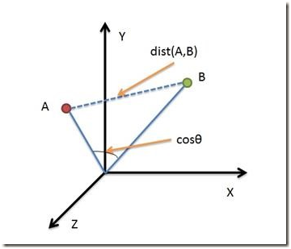
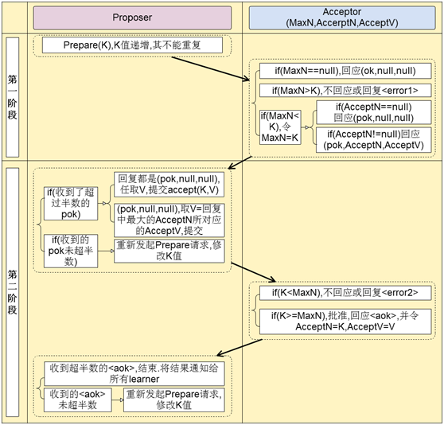
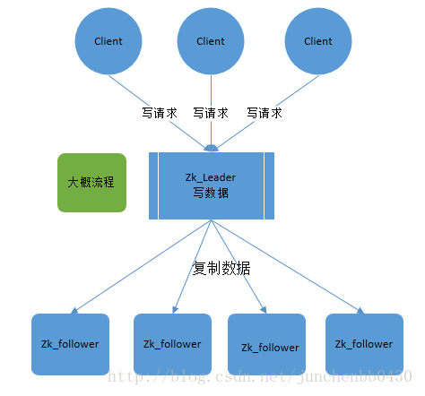
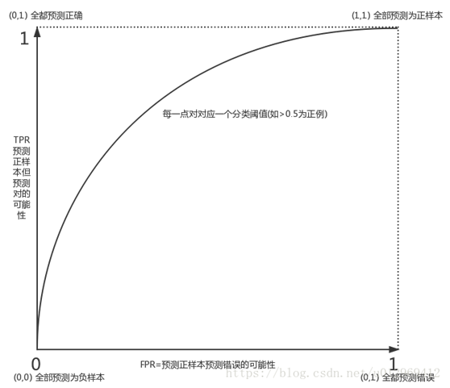
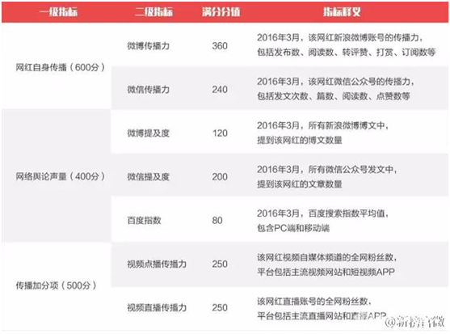
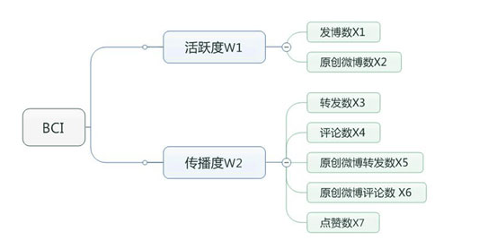
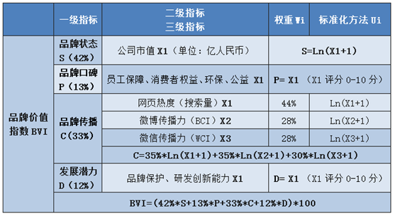
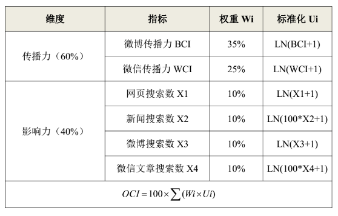

| 序号 | 修改时间   | 修改内容                                             | 修改人 | 审稿人 |
| ---- | ---------- | ---------------------------------------------------- | ------ | ------ |
| 1    | 2018-10-27 | 创建。从算法分析与设计中抽取AI和大数据部分单独成文。 | 吴启福 | 吴启福 |
| 2    | 2019-3-30  | 更新AI仿生学算法。                                   | 同上   |        |
| 3    | 2019-7-27  | 增加分布式系统共识算法章节。                         | 同上   |        |
| 4    | 2019-8-4   | 增加搜索引擎算法章节。                               | 同上   |        |
|      |            |                                                      |        |        |
|      |            |                                                      |        |        |

 

 

 

 

# 目录

[目录... 1](#_Toc15817132)

[1       非数值算法概述... 4](#_Toc15817133)

[1.1        压缩算法... 4](#_Toc15817134)

[1.2        加密算法... 5](#_Toc15817135)

[1.2.1         加密技术概述... 5](#_Toc15817136)

[1.2.2         DES. 7](#_Toc15817137)

[1.2.3         RSA.. 8](#_Toc15817138)

[1.2.4         AES. 9](#_Toc15817139)

[1.2.5         BASE64. 10](#_Toc15817140)

[1.2.6         算法的混合使用... 11](#_Toc15817141)

[1.3        散列算法... 11](#_Toc15817142)

[1.3.1         MD5. 12](#_Toc15817143)

[1.3.2         SHA.. 12](#_Toc15817144)

[1.3.3         HMAC. 12](#_Toc15817145)

[1.4        串的模式匹配算法... 13](#_Toc15817146)

[1.5        图论算法... 13](#_Toc15817147)

[1.6        本章参考... 13](#_Toc15817148)

[2       人工智能算法AI 13](#_Toc15817149)

[2.1        特征工程... 14](#_Toc15817150)

[2.1.1         文本特征... 14](#_Toc15817151)

[2.1.2         图像特征... 14](#_Toc15817152)

[2.1.3         时间序列特征... 14](#_Toc15817153)

[2.1.4         事件流特征... 15](#_Toc15817154)

[2.2        AI通用算法... 15](#_Toc15817155)

[2.2.1         相似度计算... 15](#_Toc15817156)

[2.3        ML机器学习算法比较... 17](#_Toc15817157)

[2.3.1         分类和聚类比较... 17](#_Toc15817158)

[2.4        时序模式算法... 17](#_Toc15817159)

[2.5        仿生学算法系列... 17](#_Toc15817160)

[遗传算法GA.. 19](#_Toc15817161)

[模拟退火算法SA.. 19](#_Toc15817162)

[神经网络算法... 19](#_Toc15817163)

[2.6        本章参考... 20](#_Toc15817164)

[3       大数据算法... 20](#_Toc15817165)

[3.1        并行算法... 20](#_Toc15817166)

[3.2        大数据存储... 20](#_Toc15817167)

[3.3        大数据传输安全... 20](#_Toc15817168)

[4       分布式系统共识算法... 20](#_Toc15817169)

[4.1        分布式共识 Paxos/2PC（1990）... 21](#_Toc15817170)

[4.2        一致性哈希DHT（1997）... 23](#_Toc15817171)

[4.3        拜占庭容错PBFT Quorum.. 24](#_Toc15817172)

[4.4        Raft（2014）... 24](#_Toc15817173)

[4.5        ZAB. 25](#_Toc15817174)

[4.6        本章参考... 26](#_Toc15817175)

[5       搜索引擎算法... 27](#_Toc15817176)

[5.1        中文分词... 27](#_Toc15817177)

[5.2        搜索排序打分... 27](#_Toc15817178)

[Lucene/ES打分... 27](#_Toc15817179)

[5.3        垂直搜索打分... 28](#_Toc15817180)

[音乐搜索权重... 28](#_Toc15817181)

[小说搜索权重... 28](#_Toc15817182)

[整合搜索权重... 29](#_Toc15817183)

[5.4        搜索质量评价... 29](#_Toc15817184)

[准确率-召回率... 29](#_Toc15817185)

[归一化折扣累计增益  NDCG. 30](#_Toc15817186)

[基于日志的反馈学习... 31](#_Toc15817187)

[AUC（Area Under Curve）... 32](#_Toc15817188)

[MAP（Mean Average Precision）... 32](#_Toc15817189)

[5.5        本章参考... 33](#_Toc15817190)

[6       排名算法... 33](#_Toc15817191)

[6.1        网页排名算法... 33](#_Toc15817192)

[6.1.1         网页重要性~PageRank. 33](#_Toc15817193)

[6.1.2         网页权威性~HillTop算法... 34](#_Toc15817194)

[6.2        网站流量排名算法Alexa. 34](#_Toc15817195)

[6.3        投票排名算法... 35](#_Toc15817196)

[6.3.1         电影排名算法... 35](#_Toc15817197)

[6.4        内容价值排名... 36](#_Toc15817198)

[6.4.1         新榜指数newrank.cn. 36](#_Toc15817199)

[6.4.2         清博指数gsdata.cn. 38](#_Toc15817200)

[7       工业界领域特定算法... 42](#_Toc15817201)

[7.1        指数设计... 42](#_Toc15817202)

[7.1.1         股价指数... 43](#_Toc15817203)

[7.2        广告系统... 44](#_Toc15817204)

[7.2.1         广告投放算法... 44](#_Toc15817205)

[Google Adsense. 44](#_Toc15817206)

[7.3        本章参考... 45](#_Toc15817207)

[参考资料... 45](#_Toc15817208)

 

 

**表目录**

[表格 1 加密算法发展史__ 5](#_Toc15817209)

[表格 2 AES密码块工作模式__ 9](#_Toc15817210)

[表格 3 AES填充方式__ 10](#_Toc15817211)

[表格 4 距离度量__ 15](#_Toc15817212)

[表格 5 分类和聚类的区别__ 17](#_Toc15817213)

[表格 6 仿生学算法列表__ 17](#_Toc15817214)

[表格 7 分布式系统算法列表__ 21](#_Toc15817215)

[表格 8 Paxos的概念表__ 21](#_Toc15817216)

[表格 9 混淆矩阵__ 29](#_Toc15817217)

[表格 10 网页常见算法比较__ 33](#_Toc15817218)

[表格 11 混合广告投放中的权重设置__ 44](#_Toc15817219)

 

 

**图目录**

[图 1 加密算法混合使用示例图... 11](#_Toc15817220)

[图 2 欧氏距离和余弦距离的差别... 16](#_Toc15817221)

[图 3 Paxos算法图解... 22](#_Toc15817222)

[图 4 PBFT（拜占庭容错）算法... 24](#_Toc15817223)

[图 5 ZAB协议... 26](#_Toc15817224)

[图 6网红排名算法... 37](#_Toc15817225)

[图 7 微信传播指数WCI（V12.0）... 38](#_Toc15817226)

[图 8 微博传播指数BCI（V9.0）... 39](#_Toc15817227)

[图 9 微博传播指数BCI相关指标与权重... 39](#_Toc15817228)

[图 10 头条号清博指数公式模型TGI 42](#_Toc15817229)

 

 


 

 

# 1       非数值算法概述

算法可粗分为数值算法和非数值算法, 本文主要研究非数值算法.

## 1.1   压缩算法

**原理**： 数据的冗余性, 来自信息论中香农的”熵”.

**概论**： 可分为有损和无损压缩.  无损压缩的模型主要有： Huffman编码, 算术编码, 字节压缩和字典压缩等. 

**里程碑**：

**1948**, 香农在Bell System Technical Journal上发表了《A Mathematical Theory of Communication 》, 提出了”熵”的概念, 为现代信息论的创始人.

**1952**, D.A.Huffman发表论文”A Method for the Construction of Minimum Redundancy Codes”

**1977**, 以色列人 Jacob Ziv 和 Abraham Lempel 发表了论文“顺序数据压缩的一个通用算法”(A Universal Alogrithem for Sequential Data Compression)。简称LZ77.

**1978**, 他们发表了该论文的续篇“通过可变比率编码的独立序列的压缩”(Compression of Individual Sequences via Variable-Rate Coding)。简称LZ78.

**1984**, Terry Welch 发表了名为“高性能数据压缩技术”(A Technique for High-Performance Data Compression)的论文. 简称LZW.

 

压缩技术的概况是：

```
                     压缩技术
                        |
                /------------------------------\
         通用无损数据压缩           多媒体数据压缩(大多为有损压缩)
               |                                |
    /----------------\            /------------------------------------\
基于统计         基于字典    音频压缩        图像压缩                视频压缩
模型的压         模型的压        |              |                       
缩技术           缩技术         MP3等在      /-------------------、      AVI
    |                 |                  二值   灰度   彩色   矢量     MPEG2等
  /------\          /-------------\      图像   图像   图像   图像
Huffman  算术      LZ77   LZ78   LZW       |      |      |      |
编码     编码       \-------------/     传真机  FELICS  GIF    PostScript
 |         |               |            标准    JPEG等  JPEG等 Windows WMF等
UNIX下    接近无损    PKZIP、LHarc、ARJ、
的COMPACT 压缩极限    UNIX下的COMPRESS
程序等    的高级应用  程序等
 
```

## 1.2   加密算法

### 1.2.1   加密技术概述

加密技术是信息安全的核心技术.

**原理**： 大整数的素因子难分解是[RSA算法](http://baike.baidu.com/view/10613.htm)的基础。

**里程碑**：

**1967**年，美国的Horst Feistel在分析传统加密算法的基础上，提出了秘密密钥加密体制的思想。1972年，IBM公司的W. Tuchman和C.Meyers依据秘密密钥加密体制的思想，实现并公开了一个命名为LUCIFER的算法。1977年，美国国家标准化局将此算法作为美国国家标准，命名为数据加密标准（DES－Data Encrypation Standard）。

**1976**年，美国的Diffie和Hallman提出了一种新的加密体制－公开密钥加密体制。RSA算法是公开密钥加密体制的典型算法。该算法由美国的Rivest、Shamir、Adleman三人于1978年提出。(**RSA**)

**2000**年10月，NIST(美国国家标准和技术协会)宣布通过从15种侯选算法中选出的一项新的密匙加密标准。Rijndael被选中成为将 来的AES。 Rijndael是在 1999 年下半年，由研究员 Joan Daemen 和 Vincent Rijmen 创建的。美国标准与技术研究院 (NIST) 于 2002 年 5 月 26 日制定了新的高级加密标准 (AES) 规范。

**2004**年，国际密码学会议(Crypto’2004)上，来自中国山东大学的王小云教授做的破译MD5、HAVAL-128、MD4和RIPEMD算法的报告，意味着这些算法将从应用中淘汰。随后，SHA-1也被宣告被破解。

 

表格 1 加密算法发展史


| 首次   发布 | 算法                                                       | 设计者                                                       | 算法细节                                                     | 备注                                                         |
| ----------- | ---------------------------------------------------------- | ------------------------------------------------------------ | ------------------------------------------------------------ | ------------------------------------------------------------ |
|             | Base64                                                     |                                                              | 64为基的位置计数法                                           | 邮件[MIME](http://zh.wikipedia.org/wiki/MIME)的传输编码，也可作为简单加密。编码后比原来略长，大约为原来的4/3. |
| 1976        | [RSA](http://baike.baidu.com/view/7520.htm)                | Rivest, Shamir,    Adleman (MIT)                             | 极大整数做因数分解                                           | 支持变长密钥，需要加密的文件块的长度也是可变的。             |
| 1977        | [DES](http://zh.wikipedia.org/wiki/DES)                    | IBM                                                          | [密钥](http://zh.wikipedia.org/wiki/密钥)长度 56位    [块长度](http://zh.wikipedia.org/w/index.php?title=块长度&action=edit&redlink=1) 64位    结构 平衡[费斯妥网络](http://zh.wikipedia.org/w/index.php?title=費斯妥网络&action=edit&redlink=1)    重复回数 16 | Digital Signature   Algorithm：数字签名算法，是一种标准的 DSS(数字签名标准)。   1999，EFF用22小时15分完成了破解工作。 |
| 1985        | ECC                                                        | [Neal Koblitz](http://zh.wikipedia.org/w/index.php?title=Neal_Koblitz&action=edit&redlink=1)，   [Victor Miller](http://zh.wikipedia.org/w/index.php?title=Victor_Miller&action=edit&redlink=1) | 基于[椭圆曲线](http://zh.wikipedia.org/wiki/椭圆曲线)[数学](http://zh.wikipedia.org/wiki/数学)的一种[公钥密码](http://zh.wikipedia.org/wiki/公钥密码)的方法 | **Elliptic curve   cryptography,** **椭圆** **圆曲线密码学** |
| 1987        | RC4                                                        | [Ron Rivest](http://en.wikipedia.org/wiki/Ron_Rivest) of [RSA Security](http://en.wikipedia.org/wiki/RSA_Security) |                                                              | 用变长密钥对大量数据进行加密，比 DES 快                      |
| 1990        | MD4                                                        | Ronald Rivest(MIT)                                           |                                                              |                                                              |
| 1992        | MD5                                                        | [Ron   Rivest](http://zh.wikipedia.org/w/index.php?title=Ron_Rivest&action=edit&redlink=1) | [密钥](http://zh.wikipedia.org/wiki/密钥)长度 128            | 2009年Tao Xie和Dengguo   Feng仅用了220.96的时间即破解了MD5的[碰撞抵抗](http://zh.wikipedia.org/w/index.php?title=碰撞抵抗&action=edit&redlink=1) |
| 1993        | [Blowfish](http://en.wikipedia.org/wiki/Blowfish_(cipher)) | [Bruce Schneier](http://en.wikipedia.org/wiki/Bruce_Schneier) | 使用变长的密钥，长度可达448位                                | 运行速度很快                                                 |
| 1998        | AES                                                        | [Vincent Rijmen](http://zh.wikipedia.org/w/index.php?title=Vincent_Rijmen&action=edit&redlink=1), [Joan Daemen](http://zh.wikipedia.org/w/index.php?title=Joan_Daemen&action=edit&redlink=1)、美国标准与技术研究院   (NIST) | [密钥](http://zh.wikipedia.org/wiki/密钥)长度 128, 192   or 256 比特   [块长度](http://zh.wikipedia.org/w/index.php?title=块长度&action=edit&redlink=1) 128 位[[2\]](http://zh.wikipedia.org/wiki/高级加密标准#cite_note-blocksize-1)    结构 [置换组合网络](http://zh.wikipedia.org/w/index.php?title=置換組合網路&action=edit&redlink=1)    重复回数 10, 12 或 14 (视密钥长度而定) | 高级加密标准，速度快，安全级别高。AES 标准的一个实现是   Rijndael 算法。   NIST于 2002 年 5 月 26 日制定了新的高级加密标准   (AES) 规范。 |
| 1999        | 3DES                                                       |                                                              | 基于DES，对一块数据用三个不同的密钥进行三次加密，强度更高。  |                                                              |
|             | PKCS                                                       | RSA                                                          | 一组公钥密码学标准。                                         | The Public-Key   Cryptography Standards                      |
|             | TEA                                                        |                                                              | 安全性不如DES                                                | *Tiny Encryption   Algorithm**，*简单高效的加密算法，加密解密速度快，实现简单。 |
|             | IDEA                                                       |                                                              | [密钥](http://zh.wikipedia.org/wiki/密钥)长度 128            | （International Data Encryption Algorithm）国际数据加密算法  |
|             |                                                            |                                                              |                                                              |                                                              |

备注：[Ron Rivest](http://en.wikipedia.org/wiki/Ron_Rivest)：Known for [Public-key](http://en.wikipedia.org/wiki/Public-key) [RSA](http://en.wikipedia.org/wiki/RSA_(algorithm)), [RC2](http://en.wikipedia.org/wiki/RC2), [RC4](http://en.wikipedia.org/wiki/RC4_(cipher)), [RC5](http://en.wikipedia.org/wiki/RC5), [RC6](http://en.wikipedia.org/wiki/RC6)，[MD2](http://en.wikipedia.org/wiki/MD2_(cryptography)), [MD4](http://en.wikipedia.org/wiki/MD4), [MD5](http://en.wikipedia.org/wiki/MD5), [MD6](http://en.wikipedia.org/wiki/MD6)，2002年[Turing Award](http://en.wikipedia.org/wiki/Turing_Award)获得者之一。

 

**最佳实践：**

l  **签名**：对称加密算法不能实现签名，因此签名只能非对称算法。

l  **速度**：非对称加密算法的运行速度比对称加密算法的速度慢很多.

l  **安全性**：由于公钥密码算法基于未解决的数学难题，在破解上几乎不可能。非对称相对更安全些。

l  **算法结合**：采用非对称加密算法管理对称算法的密钥，然后用对称加密算法加密数据。这样就集成了两类加密算法的优点，既实现了加密速度快的优点，又实现了安全方便管理密钥的优点。

l  **加密压缩**：相对于压缩完加密，先加密再压缩可以节省传输流量。

l  **简单加密**：xor异或操作可作为对称加密。加解密都是用同一函数。

[1、加密/解密示意图](http://web.nuist.edu.cn/courses/jsjwl/cha9/jmjm-s0.htm) 

[2、传统加密算法](http://web.nuist.edu.cn/courses/jsjwl/cha9/jmjm-s1.htm)

[3、秘密密钥加密体制 ](http://web.nuist.edu.cn/courses/jsjwl/cha9/jmjm-s2.htm)

[4、公开密钥加密体制 ](http://web.nuist.edu.cn/courses/jsjwl/cha9/jmjm-s3.htm)

[5、算法的混合使用](http://web.nuist.edu.cn/courses/jsjwl/cha9/jmjm-s4.htm) 

### 1.2.2   DES

**1****、原理和典型实例**


**2****、**[**DES****算法**](http://web.nuist.edu.cn/courses/jsjwl/cha9/jmjm-s2.htm)


 

### 1.2.3   RSA

1976年，美国的Diffie和Hallman提出了一种新的加密体制－公开密钥加密体制。

**1****、基本思想****:**  设计一种新的加密算法，该算法拥有一对不同的加密密钥**E**和解密密钥**D**。使得**E**和**D**之间具有如下性质：

（1）D（E（M））＝M，即对数据M用E加密后再用D解密，应当可以还原为M；

（2）E和D都是易于计算的；

（3）从E难以推导出D的结构。

[**2****、工作原理**](http://web.nuist.edu.cn/courses/jsjwl/cha9/jmjm-s3.htm)


| 1                                                          | 每个用户可以选择一对E和D，并将E公开（称为公开密钥），存入其他用户都可访问的公共存储区，将D（称为秘密密钥）严格保密。 |
| ---------------------------------------------------------- | ------------------------------------------------------------ |
| 2                                                          | 如果A用户希望向B用户发送数据（M），A首先从公共存储区中取得B的加密密钥Eb，并用Eb对数据进行加密，产生Eb（M）传输给B |
| 3                                                          | 根据性质1)，B可对接收的密文用Db进行解密获得明文数据M。根据性质3)，B以外的所有用户都不掌握Db，并且无法从公开的Eb中推导出Db，所以即使攻击者获得了密文，也无法解出相应的明文 |
| 由于这种体制的加密密钥可以公开，因此被称为公开密钥加密体制 |                                                              |

[**3****、****RSA****算法**](http://web.nuist.edu.cn/courses/jsjwl/cha9/jmjm-s32.htm)

RSA算法是公开密钥加密体制的典型算法。该算法由美国的Rivest、Shamir、Adleman三人于1978年提出。 

​    RSA算法的设计依据：可以较容易地获得两个大的质数，而将它们的乘积分解并还原则极为困难，对于RSA算法的密钥选取以及加密和解密的实现描述如下： 


[**4****、****RSA****算法的评价**](http://web.nuist.edu.cn/courses/jsjwl/cha9/jmjm-s3.htm)


| 优点                                                  | RSA算法使用方便，尤其是公开密钥的特征使得用户在数据传输之前无需交换密钥，即使和多个用户进行秘密通信，也无需记忆太多的密钥；原理上，N个用户进行通信，需要N对密钥，但每个用户只需记忆自己的秘密密钥，并去公共存储区中获取其他用户的公开密钥。 |
| ----------------------------------------------------- | ------------------------------------------------------------ |
| 不足之处                                              | 算法的实现依赖于计算机的速度和容量，效率较低。统计表明，对于相同体积的数据块进行加密，DES算法的加密效率比RSA算法的加密效率高上数十倍 |
| 因此，RSA算法仅用于较少数据的加密，常用于数字签名等。 |                                                              |

### 1.2.4   AES

[1、工作原理](http://web.nuist.edu.cn/courses/jsjwl/cha9/jmjm-s3.htm)

AES 算法基于排列和置换运算。排列是对数据重新进行安排，置换是将一个数据单元替换为另一个。AES 使用几种不同的方法来执行排列和置换运算。

　　AES 是一个迭代的、对称密钥分组的密码，它可以使用128、192 和 256 位密钥，并且用 128 位(16字节)分组加密和解密数据。与公共密钥密码使用密钥对不同，对称密钥密码使用相同的密钥加密和解密数据。通过分组密码返回的加密数据的位数与输入 数据相同。迭代加密使用一个循环结构，在该循环中重复置换和替换输入数据。

 

**2****、加密步骤**

**AES****加密主要是几个步骤：**

**1****）.key****变换**

将传入的明文key做变换，AES的key固定为128bit，但变换后的key为加密位数的一倍，128bit的加密变换后key为256bit。注意加密和解密的key变换不一样。

 

**2****）.****加密解密**

选择加密的模式和补齐填充方法生成加密实例，加密得到密文。

 

**3****）.****密码块工作模式**

块密码工作模式(Block cipher mode of operation)，是对于按块处理密码的加密方式的一种扩充，不仅仅适用于AES，包括DES, RSA等加密方法同样适用。

表格 2 AES密码块工作模式


*备注：Java* *标准库javax.crypto**的AES**加密模式缺省是AES/ECB/NoPadding*

 

**4****）.****填充**

填充(Padding)，是对需要按块处理的数据，当数据长度不符合块处理需求时，按照一定方法填充满块长的一种规则。

表格 3 AES填充方式


 

### 1.2.5   BASE64

**Base64****编码原理**

l  将所有字符串转换成ASCII码

l  将ASCII码转换成8位二进制

l  将二进制三位归成一组（不足三位在后边补0），再按每组6位，拆成若干组

l  统一在6位二进制后不足8位的补0

l  将补0后的二进制转换成十进制

l  从Base64编码表取出十进制对应的Base64编码

 

若原数据长度不是3的倍数时且剩下1个输入数据，则在编码结果后加2个=；若剩下2个输入数据，则在编码结果后加1个=

**Base64****编码的特点**

l  可以将任意的二进制数据进行Base64编码。

l  所有的数据都能被编码为并只用65个字符就能表示的文本文件。

l  编码后的65个字符包括AZ,az,0~9,+,/,=

l  对文件或字符串进行Base64编码后将比原始大小增加33%。

l  能够逆运算

l  不够安全，但却被很多加密算法作为编码方式

### 1.2.6   算法的混合使用

理论上，截取的密文越多，破译出密钥的概率越大。

DES算法：高强度和高效率，但密钥的管理复杂且不方便；

RSA算法：有密钥管理方面的优势，但加密效率极低，难以利用RSA算法来加密大批量的数据

实际中人们常将上述两种算法结合使用，以期同时获得公开密钥加密体制的安全优点和秘密密钥加密体制的速度优势。工作过程如下图所示。

​                                                  

图 1 加密算法混合使用示例图

​    秘密密钥加密体制和公开密钥加密体制的结合使用，不但可以简化秘密密钥加密体制中的密钥管理，而且能够做到对应每个明文使用一个不同的密钥（即一次一钥）；由于每个密钥仅仅使用一次，既使在某一次传输中密钥不慎泄露，它也只影响本次交换的信息。

## 1.3   散列算法

散列是*信息的提炼*，通常其长度要比信息小得多，且为一个固定长度。加密性强的散列一定是不可逆的，这就意味着通过散列结果，无法推出任何部分的原始信息。

**特点：**

l  对任意长度的消息散列得到散列值是定长的

l  散列计算速度快，非常高效

l  消息不同，则散列值一定不同

l  消息相同，则散列值一定相同

l  具备单向性，无法逆推计算

 

单向散列函数一般用于产生消息摘要，密钥加密，数字签名等，常见的有MD4、MD5、SHA1、SHA256、SHA512等：

l         MD5（Message Digest Algorithm 5）：是RSA数据安全公司开发的一种单向散列算法。

l         SHA（Secure Hash Algorithm）：可以对任意长度的数据运算生成一个160位的数值。

### 1.3.1   MD5

[MD5算法](http://baike.baidu.com/view/706946.htm)简要叙述：MD5以512位分组来处理输入的信息，且每一分组又被划分为16个32位子分组，经过了一系列的处理后，算法的输出由四个32位分组组成，将这四个32位分组级联后将生成一个128位散列值。

 

**MD5****改进**

可以对MD5进行改进，加大破解的难度，典型的加大解密难度的方式有一下几种：

l  加盐（Salt）：在明文的固定位置插入随机串，然后再进行MD5。

l  先加密，后乱序：先对明文进行MD5，然后对加密得到的MD5串的字符进行乱序。

l  先乱序，后加密：先对明文字符串进行乱序处理，然后对得到的串进行加密。

l  先乱序，再加盐，再MD5等。

### 1.3.2   SHA

安全哈希算法（Secure Hash Algorithm）主要适用于数字签名标准（Digital Signature Standard DSS）里面定义的数字签名算法（Digital Signature Algorithm DSA）。对于长度小于2^64位的消息，SHA1会产生一个160位的消息摘要。该算法经过加密专家多年来的发展和改进已日益完善，并被广泛使用。该算法的思想是接收一段明文，然后以一种不可逆的方式将它转换成一段（通常更小）密文，也可以简单的理解为取一串输入码（称为预映射或信息），并把它们转化为长度较短、位数固定的输出序列即散列值（也称为信息摘要或信息认证代码）的过程。散列函数值可以说是对明文的一种"指纹"或是"摘要"所以对散列值的数字签名就可以视为对此明文的数字签名。

 

### 1.3.3   HMAC

HMAC(Hash Message Authentication Code，散列消息鉴别码，基于密钥的Hash算法的认证协议。

消息鉴别码实现鉴别的原理是，用公开函数和密钥产生一个固定长度的值作为认证标识，用这个标识鉴别消息的完整性。使用一个密钥生成一个固定大小的小数据块，即MAC，并将其加入到消息中，然后传输。接收方利用与发送方共享的密钥进行鉴别认证等。

## 1.4   串的模式匹配算法

**算法**              **预处理时间**         **匹配时间**

朴素算法       0                   O(n-m+1)

KMP              o(m)                     o(n)

注：n表示原串的长度，m为匹配度的长度

 

## 1.5   图论算法

G＝（V，E）  V为顶点集合｛v1,v2...};  E为边集合，E1={vi, vj}

1）显示图

概念： 图的结构显式给出，包括图的顶点，边及权重。 如路径问题，着色问题。

常用术语：权，环，入度，出度，路径，连通图，网络

搜索策略： 穷举搜索包括深度优先和广度优先。

2）隐式图

概念：一些求解，最优化或证明题中，给出初始结点和目标，在解问题过程中使用的搜索空间如子集树或排列树。 

常用术语：子集树（问题在n个元素的子集中进行｝，排列树（问题在n个元素的排列中进行）

搜索策略： 启发式搜索包括回溯和分支限界等。

 

## 1.6   本章参考

**[1]**      [**http****：****//datacompression.info/**](http://datacompression.info/) 

[2]      笨笨数据压缩教程 [http：//wenku.baidu.com/view/c204071555270722192ef701.html](http://wenku.baidu.com/view/c204071555270722192ef701.html) 

[3]      md5解密网站：http://www.cmd5.com 

[4]      JAVA和PYTHON同时实现AES的加密解密操作---且生成的BASE62编码一致https://www.cnblogs.com/aguncn/p/6069349.html 

 

# 2       人工智能算法AI

Artificial Intellignece, Ai是计算机科学的一个分支，是人类智能的计算机模拟。研究方法主要有仿生学和计算机方法。 

l  仿生学算法有模仿蚂蚁群体的蚁群算法，模仿达尔文进化论的遗传算法，模仿热力学中固体降温过程的模拟退火算法等。

l  计算机方法包括数学建模和心理学中的启发式程序。 常规的启发式搜索算法有：回溯和分支限界。

 

**里程碑**：

1953年，Metropolis提出*模拟退火算法**SA*的思想，Kirkpatrick在1983年成功地将其应用在组合最优化问题中。

1975年，美国Michigan大学J.Holland教授提出，并出版专著《Adaptation in Natural and Artificial Systems》。J.Holland教授所提出的GA通常为简单遗传算法（SGA）。

1992年，Marco Dorigo在他的博士论文中引入[蚁群算法](http://baike.baidu.com/view/539346.htm#_blank)(ant colony optimization, ACO)，其灵感来源于蚂蚁在寻找食物过程中发现路径的行为。

 

**实例**： 专家系统，机器人,机器学习，指坟人脸识别等

 

## 2.1   特征工程

### 2.1.1   文本特征

l  词袋(bags of word)：将文本拆分成词的组合。

l  文本向量化：word2vec{词，词频}~最初由google开发，由深度神经网络构成，可将稀疏特征转化为稠密矩阵。实现如python Gensim库。

 

**主题建模**

l  TF-IDF、

l  潜在语义索引（Latent Semantic Analysis, LSA）：使用奇异值分解（SVD），将词语-文档矩阵分解成3个矩阵（T~关联术语和概念、S~奇异值、D~关联文档和概念） 

### 2.1.2   图像特征

颜色模板：RGB、HSL

图像元数据特征：EXIF数据

 

提取物体和形态：边缘检测、复杂形状提取、降维（使用PCA技术）

 

### 2.1.3   时间序列特征

时间序列数据：经典时间序列和点过程

简单时间序列测量指标：平均值、扩散性、离群值和分布性。

高级时间序列特征：自相关性（傅里叶分析~将一个时间序列分解为在一系列频率上的正弦和余弦函数的和）

### 2.1.4   事件流特征

 

## 2.2   AI通用算法 

### 2.2.1   相似度计算

相似度计算常用于文本相似度、。

表格 4 距离度量

| 距离               | 定义                                                         | 应用                                                         |
| ------------------ | ------------------------------------------------------------ | ------------------------------------------------------------ |
| 欧氏距离           | 最常见的距离度量，衡量的是多维空间中各个点之间的绝对距离。   dist(x,y)=   dist1 = np.linalg.norm( x - y )   dist2 = np.sqrt(np.sum(np.square(x -   y))) | 欧氏度量需要保证各维度指标在相同的刻度级别，比如对身高（cm）和体重（kg）两个单位不同的指标使用欧式距离可能使结果失效。 |
| 余弦距离           | 用向量空间中两个向量夹角的余弦值作为衡量两个个体间差异的大小。   sim(x,y)=cos = xy/(\|\|x\|\| \|\|y\|\|)   或 cos(x,y)   = (x*y)/(L(x)*L(y))，即两向量的内积除于两向量的L2范式   实现：   dist1 = 1 - np.dot(x,y)/(np.linalg.norm(x)*np.linalg.norm(y)) | 相比距离度量，余弦相似度更加注重两个向量在方向上的差异，而非距离或长度上。   **余弦值越接近1****，就表明夹角越接近0****度，也就是两个向量越相似。**   **计算文本相似度时要加入词频作为权重。** |
| Jaccard距离        | 用于计算符号度量或者布尔值度量的两个个体之间的相似度，由于个体的特征属性是用符号或者布尔值度量的，所以只能统计包含的共同特征个数。   Jacard(x,y)   = (x 交y)/(x并 y) | 用来衡量两个集合的相似度                                     |
| 编辑距离           | 俄罗斯Vladimir Levenshtein在1965年提出。设有字符串A和B，B为模式串，现给定以下操作：从字符串中删除一个字符；从字符串中插入一个字符；从字符串中替换一个字符。通过以上三种操作，将字符串A编辑为模式串B所需的最小操作数称为A和B的最短编辑距离，记为ED(A,B)。 | 主要用来计算两个字符串的相似度。编辑距离越小，说明两个字符串越相似。反之，越不相似。 |
| SimHash + 汉明距离 | SimHash是谷歌发明的。                                        |                                                              |
| 曼哈顿距离         | 十九世纪的赫尔曼·闵可夫斯基所创，用以标明两个点上在标准坐标系上的绝对轴距总和。 |                                                              |
| 海明距离           | 两个码字的对应比特取值不同的比特数称为这两个码字的海明距离。即两个向量中不同分量的个数。   score = 1 /   (euclideanDistance+1) | 用于编码的检错和纠错                                         |
| 皮尔逊相关系数     |                                                              | 正相关、负相关、毫不相关                                     |
|                    |                                                              |                                                              |

备注：L2范式为向量到原点的欧氏距离，比如x=[1,2,-1]的L2范式为sqrt(1*1+2*2+(-1)(-1))=sqrt(6)

 

   

图 2 欧氏距离和余弦距离的差别

 

 

**皮克逊相关系数pearson****：**

**皮克逊相关系数**广泛用于度量两个变量之间的相关程度。由[卡尔·皮尔逊](http://baike.baidu.com/item/卡尔·皮尔逊)从[弗朗西斯·高尔顿](http://baike.baidu.com/item/弗朗西斯·高尔顿)在19世纪80年代提出的一个相似却又稍有不同的想法演变而来的。它是一个介于 1 和 -1 之间的值，其中，1 表示变量完全正相关，0 表示无关，-1 表示完全负相关。

该相关系数是判断两组数据与某一直线拟合程序的一种试题。它在数据不是很规范的时候，会倾向于给出更好的结果。

公式：可演变成四个，

公式一：两个变量之间的协方差和标准差的商

  Corr(X,Y) = Cov(X,Y)/(DX*DY)  

公式二~四：略

 

## 2.3   ML机器学习算法

参考 《AI笔记》相关章节

### 2.3.1   分类和聚类比较

表格 5 分类和聚类的区别


 

### 2.3.2   异常点检测算法

常见的异常大致可分为三类，分别是异常值、波动点和异常时间序列。

**异常检测方法**

l  基于统计模型：一元正态分布、多元正态分布

l  基于邻近度：KNN

l  基于密度：逆距离、给定半径d内的个数、相对密度

l  独立森林

 

 

## 2.4   时序模式算法 

时间序列一般有以下特殊：趋势性、周期性、季节性和随机性。

表格 6 趋势预测常见算法

| 算法         | 概念                                                         | 算法步骤 | 应用               |
| ------------ | ------------------------------------------------------------ | -------- | ------------------ |
| 移动平均法   | 分为简单移动平均和加权移动平均。                             |          |                    |
| 指数平滑法   | 特殊的加权移动平均法。                                       |          |                    |
| ARIMA模型    | Auto   Regressive Integrated Movig Average, 自回归移动平均模型。 |          | 只能挖掘线性关系。 |
| 神经网络模型 |                                                              |          |                    |

 

## 2.5   仿生学算法系列

仿生学算法有模仿蚂蚁群体的蚁群算法，模仿达尔文进化论的遗传算法，模仿热力学中固体降温过程的模拟退火算法等。

表格 7 仿生学算法列表


**备注：**

 

### 遗传算法GA

**原理**：遗传算法是模拟达尔文的遗传选择和自然淘汰的生物进化过程的计算模型。

**概论**：遗传算法是具有“生存＋检测“迭代过程的搜索算法。 它以一种群体中的所有个体为对象，并利用随机化技术指导一个被编码的参数空间进行高效搜索。 遗传操作有：选择，交叉和变异。 

**应用**：组合优化，函数优化

算法步骤： （标准遗传算法的主要步骤）

1）随机产生一组初始个体构成初始种群，并评价每一个体的适配度（适应度）；

2）判断算法的收敛准则是否满足，若满足则输出搜索结果；否则执行以下步骤；

3）根据适配值大小以一定方式执行**复制**操作；

4）按交叉概率p(c)执行*交叉*操作；

5）按变异概率p(m)执行*变异*操作；

6）返回步骤（2；

 

### 模拟退火算法SA

**原理**：Simulated Annealing, SA的出发点是基于物理中固体物质的退火过程与一般的组合优化问题之间的相似性。 

**概论**：模拟热力学中经典粒子系统的降温过程，来求解规划问题的极值。

**应用**：组合优化如TSP问题

算法步骤：

1）给定初始温度T0及初始点，计算此点的函数值f(x);

2) 计算函数差值 %f ＝ f1(x)-f(x);

3) 若%f <=0，则接受新点作为下一次模拟的初始点；

4) 若%f >0, 则计算新接受点概率。

 

### 神经网络算法

**原理：**人工神经网络是根据人的认识过程而开发出的一种算法。假如我们现在只有一些输入和相应的输出,而对如何由输入得到输出的机理并不清楚,那么我们可以把输入与输出之间的未知过程看成是一个“网络”,通过不断地给这个网络输入和相应的输出来“训练”这个网络,网络根据输入和输出不断地调节自己的各节点之间的权值来满足输入和输出。这样,当训练结束后,我们给定一个输入,网络便会根据自己已调节好的权值计算出一个输出。这就是神经网络的简单原理。

表格 8 神经网络(Neural Network)算法分类

| 分类               | 简述           | 应用场景 |
| ------------------ | -------------- | -------- |
| 卷积CNN            | 前馈神经网络。 |          |
| 深度DNN            | Deep           |          |
| 循环RNN            | Roop           |          |
| 长短期记忆网络LSTM |                |          |
|                    |                |          |

 

 

## 2.6   本章参考

 

# 3       大数据算法

## 3.1   并行算法

**原理**：并行计算机系统处理

**概论**：常用方法是PCAM, 包括划分,通信,组合,映射几个步骤.

**里程碑**：

 

## 3.2   大数据存储

参见  《数据库技术》

 

## 3.3   大数据传输安全

参见  《安全开发》

## 3.4   数据挖掘十大经典算法

详见　**[**1]

\1. [C4.5](http://blog.csdn.net/aladdina/archive/2009/04/30/4141048.aspx)

\2. [The k-means algorithm](http://blog.csdn.net/aladdina/archive/2009/04/30/4141089.aspx) 即K-Means算法

\3. [Support vector machines](http://blog.csdn.net/aladdina/archive/2009/04/30/4141094.aspx)

\4. [The Apriori algorithm](http://blog.csdn.net/aladdina/archive/2009/05/01/4141101.aspx)

Apriori算法是一种最有影响的挖掘布尔关联规则频繁项集的算法。其核心是基于两阶段频集思想的递推算法。该关联规则在分类上属于单维、单层、布尔关联规则。在这里，所有支持度大于最小支持度的项集称为频繁项集，简称频集。

\5. [最大期望(EM)算法](http://blog.csdn.net/aladdina/archive/2009/05/01/4141114.aspx)

\6. [PageRank](http://blog.csdn.net/aladdina/archive/2009/05/01/4141120.aspx)

\7. [AdaBoost](http://blog.csdn.net/aladdina/archive/2009/05/01/4141124.aspx)

\8. [kNN: k-nearest neighbor classification](http://blog.csdn.net/aladdina/archive/2009/05/01/4141127.aspx)

\9. [Naive Bayes](http://blog.csdn.net/aladdina/archive/2009/05/01/4141140.aspx)

\10. [CART: 分类与回归树](http://blog.csdn.net/aladdina/archive/2009/05/01/4141150.aspx)

## 3.5   本章参考

 

# 4       分布式系统共识算法 

**分布式系统常见问题**

1、「拜占庭将军问题」：1982年Lamport提出拜占庭将军问题。多个拜占庭将军要如何在可能有叛徒、信使可能被策反或者暗杀的情况下达成是否要进攻的一致性决定？

2、「拜占庭将军问题简化」：假设将军中没有叛军，信使的信息可靠但有可能被暗杀的情况下，将军们如何达成一致性决定？  解决方案：Paxos、Raft

 

应用场景：领导人选举、关键状态共享、分布式锁

应用案例：ZooKeeper、区块链

一致性常用算法 ：Paxos/2PC(1990)、DHT（1997）、Quorum拜占庭协议、Zab（2010）

Raft（2014）、

表格 9 分布式系统算法列表


备注：ZooKeeper是业界第一个有行业影响力的开源共识系统。

 

## 4.1   分布式共识 Paxos/2PC（1990）

Paxos算法是莱斯利·兰伯特（Leslie Lamport，就是 [LaTeX](https://baike.baidu.com/item/LaTeX) 中的"La"，此人现在在微软研究院）于1990年提出的一种基于消息传递的一致性算法。这个算法被[认为](https://baike.baidu.com/item/认为/1230084)是类似算法中最有效的。

Paxos是用于解决分布式系统中一致性问题的共识算法（Consensus Algorithm），其最基本的功能是为了在多个进程之间对某个值达成一致。通过这个最基本功能，就可以在多个进程之间进行数据库、状态机、账本（区块链）等对象的同步。

Paxos不追求值的正确性、权威性、及时性，只追求一致性。

可能问题：拜占庭式（进程由于BUG或者恶意发送的不正确消息）、非拜占庭式、角斗士

 

**概念术语**

表格 10 Paxos的概念表


说明：Paxos中有三类角色Proposer、Acceptor及Learner，主要交互过程在Proposer和Acceptor之间。

Paxos交互有二个阶段Phase： Prepare(Phase 1)和Propose(Phase 2)。

 

   

图 3 Paxos算法图解

Prepare阶段

​    

A：Proposer选择一个提案编号n，向所有的Acceptor广播Prepare（n）请求。

B：Acceptor收到Prepare（n）请求，若提案编号n比之前接收的Prepare请求都要大，则承诺（Promise，将n记录下来）将不会接收提案编号比n小的提议，并且带上之前Accept的提议中编号小于n的最大的提案value。如果n比之前接受的提案编号小，则不予理会。

Propose阶段

​    

A：Proposer收到Acceptor的Promise

如果未超过半数的accpetor回复承诺（Promise），本次提案失败；

如果超过半数的Acceptor回复承诺，又分为不同情况：

如果（回复承诺的）所有Acceptor都未接收过value（都为null），那么向所有的Acceptor发起（Propose）自己的value和提案编号n。

如果有部分Acceptor接收过value，那么从接受过的value中选择提案编号最大的value作为本次提案的value，提议编号仍然为n（即：此时Proposer不能提议自己的value，只能信任Acceptor通过的value，以达成收敛的效果。）

B：Acceptor接收到提议后，如果该提案编号不等于自身当前承诺的编号（第一阶段记录的），不接受该请求，相等则将提案的value写入本地。

## 4.2   一致性哈希DHT（1997）

​       一致性哈希算法在1997年由麻省理工学院提出的一种分布式哈希（DHT）实现算法，设计目标是为了解决因特网中的热点(Hot spot)问题，初衷和CARP十分类似。一致性哈希修正了CARP使用的简单哈希算法带来的问题，使得分布式哈希（DHT）可以在P2P环境中真正得到应用。 

​    一致性hash算法提出了在动态变化的Cache环境中，判定哈希算法好坏的四个定义：

1、**平衡性**(Balance)：平衡性是指哈希的结果能够尽可能分布到所有的缓冲中去，这样可以使得所有的缓冲空间都得到利用。很多哈希算法都能够满足这一条件。

2、**单调性**(Monotonicity)：单调性是指如果已经有一些内容通过哈希分派到了相应的缓冲中，又有新的缓冲加入到系统中。哈希的结果应能够保证原有已分配的内容可以被映射到原有的或者新的缓冲中去，而不会被映射到旧的缓冲集合中的其他缓冲区。 

3、**分散性**(Spread)：在分布式环境中，终端有可能看不到所有的缓冲，而是只能看到其中的一部分。当终端希望通过哈希过程将内容映射到缓冲上时，由于不同终端所见的缓冲范围有可能不同，从而导致哈希的结果不一致，最终的结果是相同的内容被不同的终端映射到不同的缓冲区中。这种情况显然是应该避免的，因为它导致相同内容被存储到不同缓冲中去，降低了系统存储的效率。分散性的定义就是上述情况发生的严重程度。好的哈希算法应能够尽量避免不一致的情况发生，也就是尽量降低分散性。 

4、**负载**(Load)：负载问题实际上是从另一个角度看待分散性问题。既然不同的终端可能将相同的内容映射到不同的缓冲区中，那么对于一个特定的缓冲区而言，也可能被不同的用户映射为不同 的内容。与分散性一样，这种情况也是应当避免的，因此好的哈希算法应能够尽量降低缓冲的负荷。

 

在分布式集群中，对机器的添加删除，或者机器故障后自动脱离集群这些操作是分布式集群管理最基本的功能。如果采用常用的hash(object)%N算法，那么在有机器添加或者删除后，很多原有的数据就无法找到了，这样严重的违反了单调性原则。

 

## 4.3   拜占庭容错PBFT Quorum

   

图 4 PBFT（拜占庭容错）算法

其中C为发送请求端，0123为服务端，3为宕机的服务端，具体步骤如下：

\1. Request：请求端C发送请求到任意一节点，这里是0

\2. Pre-Prepare：服务端0收到C的请求后进行广播，扩散至123

\3. Prepare：123,收到后记录并再次广播，1->023，2->013，3因为宕机无法广播

\4. Commit：0123节点在Prepare阶段，若收到超过一定数量的相同请求，则进入Commit阶段，广播Commit请求

5.Reply：0123节点在Commit阶段，若收到超过一定数量的相同请求，则对C进行反馈

根据上述流程，在 N ≥ 3F + 1 的情況下一致性是可能解決，N为总计算机数，F为有问题的计算机总数。

备注：拜占庭容错能够容纳将近1/3的错误节点误差，IBM创建的Hyperledger就是使用了该算法作为共识算法。

 

## 4.4   Raft（2014）

Raft是一种管理复制日志的一致性算法。

它的首要设计目的就是易于理解，所以在选主的冲突处理等方式上它都选择了非常简单明了的解决方案。

在Raft中，问题分解为：Leader领导选取、日志复制、安全和成员变化。

复制状态机通过复制日志来实现：

u  日志：每台机器保存一份日志，日志来自于客户端的请求，包含一系列的命令

u  状态机：状态机会按顺序执行这些命令

u  一致性模型：分布式环境下，保证多机的日志是一致的，这样回放到状态机中的状态是一致的.

 

RAFT核心思想很容易理解，如果数个数据库，初始状态一致，只要之后的进行的操作一致，就能保证之后的数据一致。由此RAFT使用的是Log进行同步，并且将服务器分为三中角色：Leader，Follower，Candidate，相互可以互相转换。

RAFT从大的角度看，分为两个过程：

\1. 选举Leader

\2. Leader生成Log，并与Follower进行Headbeats同步

 

## 4.5   ZAB

Zab协议 的全称是 Zookeeper Atomic Broadcast （Zookeeper原子广播），是为ZooKeeper设计的一种支持崩溃恢复的原子广播协议。

**ZAB****的具体实现**

l  ZooKeeper由client、server两部分构成

l  client可以在任何一个server节点上进行读操作

l  client可以在任何一个server节点上发起写请求，非leader节点会把此次写请求转发到leader节点上。由leader节点执行

l  ZooKeeper使用改编的两阶段提交协议来保证server节点的事务一致性

ZKID：ZooKeeper会为每一个事务生成一个唯一且递增长度为64位的ZXID,ZXID由两部分组成：低32位表示计数器(counter)和高32位的纪元号(epoch)。

 

Zookeeper 是通过 Zab 协议来保证分布式事务的最终一致性。

l  Zab协议是为分布式协调服务Zookeeper专门设计的一种 支持崩溃恢复 的 原子广播协议 ，是Zookeeper保证数据一致性的核心算法。Zab借鉴了Paxos算法，但又不像Paxos那样，是一种通用的分布式一致性算法。它是特别为Zookeeper设计的支持崩溃恢复的原子广播协议。

l  在Zookeeper中主要依赖Zab协议来实现数据一致性，基于该协议，zk实现了一种主备模型（即Leader和Follower模型）的系统架构来保证集群中各个副本之间数据的一致性。

 

**Zab** **协议的特性**：
 1）Zab 协议需要确保那些**已经在** **Leader** **服务器上提交（Commit****）的事务最终被所有的服务器提交**。
 2）Zab 协议需要确保**丢弃那些只在** **Leader** **上被提出而没有被提交的事务**。

   

图 5 ZAB协议

 

**Zab****协议原理**

Zab协议要求每个 Leader 都要经历三个阶段：发现，同步，广播。

l  发现：要求zookeeper集群必须选举出一个 Leader 进程，同时 Leader 会维护一个 Follower 可用客户端列表。将来客户端可以和这些 Follower节点进行通信。

l  同步：Leader 要负责将本身的数据与 Follower 完成同步，做到多副本存储。这样也是提现了CAP中的高可用和分区容错。Follower将队列中未处理完的请求消费完成后，写入本地事务日志中。

l  广播：Leader 可以接受客户端新的事务Proposal请求，将新的Proposal请求广播给所有的 Follower。

 

## 4.6   本章参考

[1].    paxos图解, http://coderxy.com/archives/121

[2].    Paxos算法详解, http://coderxy.com/archives/136

[3].    Paxos算法 wiki, [http://zh.wikipedia.org/zh-cn/Paxos%E7%AE%97%E6%B3%95#.E5.AE.9E.E4.BE.8B](http://zh.wikipedia.org/zh-cn/Paxos算法#.E5.AE.9E.E4.BE.8B)

[4].    晦涩的Paxos https://www.jianshu.com/p/ddf0db5d5f52 

[5].    区块链共识算法 PBFT（拜占庭容错）、PAXOS、RAFT简述 https://blog.csdn.net/jerry81333/article/details/74303194

[6].    Raft 《[In search of an Understandable Consensus Algorithm (Extended Version)](https://ramcloud.atlassian.net/wiki/download/attachments/6586375/raft.pdf)》(寻找一种易于理解的一致性算法)

[7].    Raft 一致性算法论文译文 https://www.infoq.cn/article/raft-paper/ 

[8].    聊聊zookeeper的ZAB算法 https://www.jianshu.com/p/400a44edee88 

[9].    Zookeeper——一致性协议:Zab协议 https://www.jianshu.com/p/2bceacd60b8a

[10].[Zab vs. Paxos](https://cwiki.apache.org/confluence/display/ZOOKEEPER/Zab+vs.+Paxos)

[11].[Architecture of ZAB – ZooKeeper Atomic Broadcast protocol](https://distributedalgorithm.wordpress.com/2015/06/20/architecture-of-zab-zookeeper-atomic-broadcast-protocol/)

[12].从分布式一致性算法到区块链共识机制 https://blog.csdn.net/weixin_43970890/article/details/90173996 

# 5       搜索引擎算法

## 5.1   中文分词

详见 《中文分词技术》文档。

 

## 5.2   搜索排序打分

当前的搜索引擎的排序技术有两个不足：语意相关性和排序个性化。前者需要完善的自然语言处理技术，后者需要记录庞大访问者信息和复杂的计算。

### Lucene/ES打分

Elasticsearch的默认打分公式是lucene的打分公式，主要分为两部分的计算，一部分是计算query部分的得分，另一部分是计算field部分的得分，下面给出ES官网给出的打分公式：

score(q,d)  =  queryNorm(q)  · coord(q,d)  · ∑ (tf(t,d) · idf(t)² · t.getBoost() · norm(t,d))  

 

score(q,d)  =  

​            queryNorm(q)      # 查询归一化

​          · coord(q,d)                  # 协调因子

​          · ∑ (           

​                tf(t in d)       # 词频

​              · idf(t)²         # 反文档频率

​              · t.getBoost()     # 词的权重

​              · norm(t,d)      # 查询权重

​            ) (t in q)    

说明：q~查询词，d~文档，t~q分词后的单词。

1.在计算过程中，涉及的变量应该考虑的是document所在的分片而不是整个index。

\2. 相关性打分其实是查询与某个文档的某个字段之间的相关性打分，而不是与文档的相关性；

\3. 根据公式转换，就变成了查询的所有Term与文档中字段的相关性求和，如果某个Term不相关，则需要处理coord系数

l  queryNorm(q)=1 / √sumOfSquaredWeights , sumOfSquaredWeights =(idf(t1)^2+idf(t2) ^2+...+idf(tn) ^2), 对于ES来说分片是1才不影响排序

l  coord(q,d)=overlap/maxoverlap，overlap是检索命中query中term的个数，maxoverlap是query中总共的term个数，指分词后命中词在查询词的比例。

l  tf(t in d) = √frequency，词频即term t在文档中出现的个数。

l  idf(t) = 1 + log ( numDocs / (docFreq + 1))  逆词频数，即召回的文档在总文档中出现过多少次

l  t.getboost():

l  norm(t,d): field的标准化因子，在官方给的解释是field越短，如果召回的话权重越大。

 

## 5.3   垂直搜索打分

### 音乐搜索权重

### 小说搜索权重

说明：小说更新越快，来源站越多，章节数越多，说明小说越受欢迎，权重越高。

**1).****选取指标**：爬取频率freqs、来源站数sources、章节数chapters、

2).指标标准化：

l  f_boost = log(1+ freqs/(freqs+2)   

l  s_boost = 1+sources/(sources+4)  //来源站数标准取4

l  c_boost = 1+chapters/(chapters+4)  //章节数标准取50

3).指标加权：boost = $f_boost*$s_boost*$c_boost

 

**PHP****实现示例：**

$f_boost = dba_fetch($u_key, $dba);

$f_boost = 1+($f_boost/($f_boost+2));

$f_boost = pow($f_boost, 2);   //爬取频率权重

$s_boost = 1+($info['sourcenum']/($info['sourcenum']+4));   //来源站权重，越多权重越高

$c_boost = 1+$info['chapter_total']/($info['chapter_total']+50);  //章节数权重，章节越多权重越高

$boost = round($f_boost*$s_boost*$c_boost, 1);

 

### 整合搜索权重

选择指标：频道权重、查询权重

指标标准化：

指标加权：

 

## 5.4   搜索质量评价

评价一个搜索引擎的指标包括：查全率，查准率和性能。

### 准确率-召回率

信息检索、分类、识别、翻译等领域两个最基本指标是召回率(Recall Rate)和准确率(Precision Rate）。

 

**定义****1****：**

l  召回率(Recall) = 系统检索到的相关文件 / 系统所有相关的文件总数。亦即，预测为真实正例 / 所有真实正例样本的个数。也叫查全率。

l  准确率(Precision，精准率) = 系统检索到的相关文件 / 系统所有检索到的文件总数。亦即，预测为真实正例 / 所有被预测为正例样本的个数。也叫查准率。

l  准确率accuracy是分类正确的样本除以总样本的个数。

   

 

**定义2****：混淆矩阵**

表格 11 混淆矩阵


| pred_label/true_label | positive | negative |
| --------------------- | -------- | -------- |
| positive              | TP       | FP       |
| negative              | FN       | TN       |

上表即为混淆矩阵，其中，行表示预测的label值，列表示真实label值。TP，FP，FN，TN分别表示如下意思：

l  TP（true positive）：表示样本的真实类别为正，最后预测得到的结果也为正；

l  FP（false positive）：表示样本的真实类别为负，最后预测得到的结果却为正；

l  FN（false negative）：表示样本的真实类别为正，最后预测得到的结果却为负；

l  TN（true negative）：表示样本的真实类别为负，最后预测得到的结果也为负.

可以看到，TP和TN是我们预测准确的样本，而FP和FN为我们预测错误的样本。

Ø  **准确率**Accuracy表示的是分类正确的样本数占样本总数的比例，准确率=(TP+TN)/(ALL)

Ø  **精确率Precision**表示预测结果中，预测为正样本的样本中，正确预测为正样本的概率, 公式=TP/(TP+FP)

Ø  **召回率Recall**表示在原始样本的正样本中，最后被正确预测为正样本的概率，公式=TP/(TP+FN)

 

如果是做搜索，那就是保证召回率的情况下提升准确率；如果做疾病检测、反垃圾，则是保证准确率的条件下，提升召回率。所以，在两者都要求高的情况下，可以用F1(或者称为F-score)来衡量。计算公式如下：F1 = (2 × P × R) / (P + R)。

### 归一化折扣累计增益 NDCG

网页满意度评分（0-5）：非常不满意、较不满意、勉强满意、较满意、满意、非常满意

NDCG~归一化折扣累计增益是一种综合考虑排序和真实序列之间关系的指标。

 

**累计增益（CG****）**

　　CG，cumulative gain，是DCG的前身，只考虑到了相关性的关联程度，没有考虑到位置的因素。它是一个搜素结果相关性分数的总和。指定位置p上的CG为：

   

备注：reli 代表i这个位置上的相关度。

 

**折损累计增益（DCG****）**

　　DCG， Discounted 的CG，就是在每一个CG的结果上处以一个折损值，为什么要这么做呢？目的就是为了让排名越靠前的结果越能影响最后的结果(位置相关)。假设排序越往后，价值越低。到第i个位置的时候，它的价值是 1/log2(i+1)，那么第i个结果产生的效益就是 reli * 1/log2(i+1)，所以：

   

 

**归一化折损累计增益（NDCG****）**

　　NDCG， Normalized 的DCG，由于搜索结果随着检索词的不同，返回的数量是不一致的，而DCG是当前排序的折扣累计增益，IDCG是最佳排序时的折扣累计增益。一个累加的值，没法针对两个不同的搜索结果进行比较，因此需要归一化处理，除以IDCG；

   

 

### 基于日志的反馈学习

搜索引擎日志挖掘的主要技术有：统计分析方法、数学模型分析与预测、关联规则分析、聚类分析等。

基于搜索词的分析

l  发现搜索词价值：相关搜索、近义词、热词缓存

l  发现不明意图下的用户行为：搜索引擎本身问题分词歧义和新词识别，可通过搜索日志改善。

 

基于用户点击日志的分析

l  时间与搜索意图的关系

l  地理位置与搜索意图的关系

l  点击日志与同义词：同义词发现

l  点击日志与词语权重：

l  点击日志与新词分类

l  点击日志与知识图谱

l  点击日志与网页重排序

l  点击日志与网页评价

l  基于用户特征分析：用户跟踪、用户群体、用户个体

 

### AUC（Area Under Curve）

   

备注：ROC曲线的下方面积为AUC。

l  横轴为“假正例率”（True Positive Rate,TPR)，又称为“假阳率”； 就是预测为正样本但是预测错了的可能性，显然，我们不希望该指标太高。

l  纵轴为“真正例率”(False Positive Rate,FPR，即召回率)，又称为“真阳率”，

 

假阳率，简单通俗来理解

由于ROC曲线一般都处于y=x这条直线的上方，所以AUC的取值范围在0.5和1之间。使用AUC值作为评价标准是因为很多时候ROC曲线并不能清晰的说明哪个分类器的效果更好，而作为一个数值，对应AUC更大的分类器效果更好。

 

### MAP（Mean Average Precision）

MAP：单个主题的平均准确率是每篇相关文档检索出后的准确率的平均值。

 

 

## 5.5   本章参考

[1].    ElasticSearch打分机制学习 https://blog.csdn.net/ginobefun/article/details/52861660 

[2].    推荐系统遇上深度学习(十六)--详解推荐系统中的常用评测指标 https://blog.csdn.net/jiangjiang_jian/article/details/80728607 

 

# 6       微服务算法

## 6.1   限流算法

表格 1 限流算法比较


备注：漏桶和令牌桶算法最明显的区别就是是否允许突发流量(burst)的处理。

   

图 6 令牌桶算法

 

 

   

图 7 漏洞算法

 

# 7       推荐引擎算法

详见 《推荐系统设计说明书》

 

**推荐系统算法常见分类**

l  关联规则挖掘。基于频繁集的挖掘。范围是所有用户和商品直接挖掘。

l  协同过滤CF~collaborative filtering。基于产品或用户之间的相似性，其中，我们使用余弦相似性。思想是首先利用用户的历史信息**计算相似性**，然后利用与目标用户相似性极高的邻居对其它产品的评价来预测目标用户对特定产品的喜好程序．系统根据这喜好度来对目标用户进行推荐．(产品的评价意见)

u  基于用户-产品的CF（UCF)

u  基于产品-产品的CF（ICF）

u  基于模型的CF：基于矩阵分解，其中，我们使用SVD来分解矩阵。

l  基于内容的推荐Content-based。思想是对用户和产品分别生成配置文件，根据产品使用情况更新用户配置文件，用分类方法来得到用户的关联性．（用户的配置文件）

l  基于记忆的算法

l  基于用户的推荐。范围是用户相似的用户和他们感兴趣的信息。

l  基于协同tag推荐。就是用户的兴趣点和商品特征和匹配对应。(用户-产品)

 

# 8       排名算法

## 8.1   网页排名算法 

表格 12 网页常见算法比较


 

### 8.1.1   网页重要性~PageRank

PageRank，网页排名，又称网页级别、Google左侧排名或佩奇排名，是一种由[搜索引擎](http://zh.wikipedia.org/wiki/搜索引擎)根据[网页](http://zh.wikipedia.org/wiki/网页)之间相互的[超链接](http://zh.wikipedia.org/wiki/超链接)计算的网页排名技術，以[Google公司](http://zh.wikipedia.org/wiki/Google公司)創辦人[拉里·佩奇](http://zh.wikipedia.org/wiki/拉里·佩奇)（Larry Page）之姓來命名。此技術通常和[搜索引擎优化](http://zh.wikipedia.org/wiki/搜索引擎优化)有关，[Google](http://zh.wikipedia.org/wiki/Google)用它来体现网页的相关性和重要性。[Google](http://zh.wikipedia.org/wiki/Google)的创始人[拉里·佩奇](http://zh.wikipedia.org/wiki/拉里·佩奇)和[谢尔盖·布林](http://zh.wikipedia.org/wiki/谢尔盖·布林)於[1998年](http://zh.wikipedia.org/wiki/1998年)在[斯坦福大学](http://zh.wikipedia.org/wiki/斯坦福大学)发明了这项技术**错误！未找到引用源。**。

 

PageRank公式：：

PR(A) = (1-d) + d *( PR(T1)/C(T1) + ... + PR(Tn)/C(Tn) )

公式说明：我们假设*外部站点*T1…Tn指向*网页*A（例如，被引用）。

l  PR(T1)表示该外部链接网站本身的PR分值； 

l  C(T1)表示该外部链接站点T1所拥有的外部链接数量。PR(T1)/C(T1)即为外部站点T1带给网页A的PR分值。

l  参数d是制动因子，使结果在0，1之间。通常d等于0.85。即这个因子的存在是为了保证每个页面有个不为0的初始PR，并且在不断重复计算中还原其真实PR。一个网站的投票权值只有该网站PR分值的0.85，而且这个0.85的权值平均分配给其链接的每个外部网站。

l  参考2：PR(A)表示的是从一个外部链接站点T1上，依据Pagerank为系统给你的网站所增加的PR分值。C(A)定义为网页A指向其它网页的链接数。

**备注**：

l  注意PageRank的形式，分布到各个网页中，因此所有网页的PageRank和是1。

l  这个公式表明外部链接站数量Tn越多，能得到的外部PR分值就越多，最终网页的PR值就高。

l  这项技术的主要缺点是旧的页面等级会比新页面高。因为即使是非常好的新页面也不会有很多上游链接，除非它是某个站点的子站点。

 

这就是PageRank需要多项算法结合的原因。Google经常惩罚恶意提高PageRank的行为，至于其如何区分正常的链接交换和不正常的链接堆积仍然是商业机密。

 

### **8.1.2**   **网页权威性****~****HillTop****算法**

HillTop认为只计算 来自具有相同主题的相关文档(“专家”文档)链接对于搜索者的价值会更大：即主题相关网页之间的链接对于权重计算的贡献比主题不相关的链接价值要更高。

 

## 8.2   网站流量排名算法Alexa

曾经使用的一个排名算法是：

Traffic Rank = Reach ^2 * PV

l  Reach -- Reach per million users, 每百万用户访问人次,现在是全球用户访问比率．全球网民总数约10亿,其中装alexa工具条的估计在100万—1000万之间..

l  PV -- PageViews per user 每用户浏览页面数，简称PV

考虑到中国境内使用Alexa工具条的明显不如欧美地区，可加入到地区权重因子。公式改进为：

Traffic Rank = (Reach*d) ^2 * PV

其中参数d为地区权重因子，欧美地区为1,中国为5.

 

## 8.3   投票排名算法

**CodeProject****文章排名算法**

CodeProject上有对所有文章进行了排名，并公开了自己的排名算法，公式如下：

Rank = Rating * Log10(Votes)   //会员评分权重*标准化投票数

Rating = SUM (Rating*weight)/SUM(weight)   //会员评分权重

可以看出，这个算法在计算排名时，用了投票数取Log10，再乘以得分，这样就避免了3个5分比10000个4.9分排名高的情况，同时，CodeProject的得分，并不是平均分（上面Rating的计算公式），而是考虑根据每个会员的等级，乘以一个系数，也就是说越高级会员，评分的权重会越大。

看起来CodeProject的排名算法还比较简单，不过，这里的Log10和会员权重都是一些经验数据，并没有理论支撑，所以显得不是那么严谨。

 

### **8.3.1**   **电影排名算法**

**IMDb Top 250** [http：//www.imdb.com/chart/top](http://www.imdb.com/chart/top)

成立与1990年的The Internet Movie Database (互联网电影数据库，简称IMDb)是目前全球互联网上最大、最详细的电影及电视剧数据库。作为amazon.com的旗下网站，IMDb除了拥有无比详 细的数据外还有大量忠实的用户。这些忠实用户对每部电影的评分就构成了目前公认最权威的电影排行榜——IMDb Top 250。

IMDB的Top 250电影可是鼎鼎有名, 深受影迷的欢迎，注册的用户可以给任何一部影片打分并加以评述，而网站又会根据影片所得平均分、选票的数目等计算得出影片的加权平 均分并以此进行TOP250（最佳250部影片）和Bottom100（最差100部影片）的排行。 

**Weighted** **Rank (WR) = (v ÷ (v+m)) × R + (m ÷ (v+m)) × C**

其中：

l  v = number of votes for the movie = (votes) （投票人数，需要注意的是，只有经常投票者才会被计算在内）

l  m = minimum votes required to be listed in the top 250 (currently 1250) （进入imdb top 250需要的最小票数，只有三两个人投票的电影就算得满分也没用的）

l  R = average for the movie (mean) = (Rating) （是用普通的方法计算出的平均分）

l  C = the mean vote across the whole report (currently 6.9) （目前所有电影的平均得分）

IMDB的算法其实非常接近于贝叶斯算法，并且取得了相当“可信”的效果（IMDB的Top 250被N多网站引用），可见贝叶斯算法在现实中还是很有价值的。

 

**豆瓣电影250**
 [http：//www.douban.com/movie/top250](http://www.douban.com/movie/top250)

豆瓣采用的简单平均分方法。

 

**迅雷评价最高影片** [http：//movie.xunlei.com/top/top_rating.html](http://movie.xunlei.com/top/top_rating.html)

整体评分=印象×50%+(导演+故事+画面+表演+音乐)×10%

 

## 8.4   内容价值排名

### 8.4.1   新榜指数newrank.cn

新榜指数（New Rank Index，NRI）系由新媒体排行榜（newrank.cn）基于海量数据、用户深度反馈及专家建议而推出，用于衡量中国移动互联网渠道新媒体（主要指两微一端）的传播能力，此指数反映该新媒体主体的热度和发展趋势。 

新榜隶属于上海看榜信息科技有限公司，成立于2014年8月，是一家定位于内容创业服务平台，用以衡量传播价值、品牌价值、投资价值的新榜指数，已经成为中国移动互联网内容价值标准。

2006.5，内容数据服务平台[新榜](http://www.investide.cn/?tag=新榜)宣布获得A+轮融资。本轮由微影资本，真格基金、高榕资本跟投。融得资金将用于提升用户体验，扩大数据服务，打造新媒体全链条的解决方案等。据了解，新榜已遍历1000万个以上微信公众号，并保持每天持续监测超过20万个有影响力的优秀账号。

 

以下算法主要针对微信进行阐述：

 **算法简述**
       新榜指数是由原始数据参照基数通过计算公式推导出来的标量数值，用以衡量原始数据在其所属维度的相对表现。例如，xx点赞数为：379，我们会将这一数据和点赞常数进行比较，以确定其点赞数的相对位置，进而转换为其点赞指数，其余指标以此类推。

 

**该算法相较于常规加权有四大优势：**
       1、不仅显示绝对表现，还能反映所处位置；
       2、标准化后，不同维度的指标之间可以相互比较；
       3、指标之间可以相互运算，从而得到综合考察各维度的新榜指数；
       4、不仅可以用于账号间的比较，也可以用于账号自身的跨期比较。      

 

#### 微信新榜指数

算法         
  **1****、选定指标**
       在微信的计算中，为兼顾其数量与质量，我们使用总阅读数、最高阅读数、平均阅读数、头条阅读数、总点赞数五个指标来对账号进行评估，其中：
 整体指标（总阅读数，R）：指统计周期内所有发布内容的阅读数总和；
 优异指标（最高阅读，Rm)：是指统计周期内所有发布内容中的单篇最高阅读数；
 质量指标（平均阅读数， Ra )：统计周期内所有发布内容的阅读数平均值；
 主动预判指标（头条阅读， Rh  )：统计周期内位置为头条的内容的阅读总数；
 互动指标（总点赞数，Z)：统计周期内所有发布内容的点赞数总和。

**2****、指标标准化**
 基于不同维度指标的差异性，我们首先将所得数据标准化，即通过对各维度原始数据与该维度常数的比值计算，得到该样本各项指标的千分化数值。
 在新榜指数中，以天为最小计算周期，将常规（1天推送一次，每次最多8篇）的公众号为对象在这一时间段内总阅读数、最高阅读数、平均阅读数、头条阅读数和点赞数共五个指标的常数分别记为：

 

#### **网红排名****指数**

网红排行榜中的综合得分暨新榜指数，由各项原始传播数据标准化处理之后，参照权重计算公式推导而得，包括网红自身传播、网络舆论声量、传播加分项三大维度，满分1500分，共计近30个细项指标，算法公式如下：

   

图 8网红排名算法

 

### 8.4.2   清博指数gsdata.cn

#### 微信传播指数WCI（V12.0）

WCI-12.0版本旨在鼓励账号提高单篇文章质量，合理把握推文数量，多做精品、少发“垃圾文”，提高账号的整体传播力和影响力。

   

图 9 微信传播指数WCI（V12.0）

其中，R为评估时间段内所有文章（n）的阅读总数；
 Z为评估时间段内所有文章（n）的点赞总数；
 d为评估时间段所含天数（一般周取7天，月度取30天，年度取365天，其他自定义时间段以真实天数计算）；
 n为评估时间段内账号所发文章数；
 Rmax和Zmax为评估时间段内账号所发文章的最高阅读数和最高点赞数。

 

#### 微博传播指数BCI（V9.0）

微博传播指数BCI（Micro-blog Communication Index）通过微博的活跃度和传播度来反映账 号的传播能力和传播效果。BCI重在评估账号的原发微博传播力，旨在鼓励高质量原创内容。 
 1、指标体系： 采用数据：发博数X1、原创微博数X2、转发数X3、评论数X4、原创微博转发数X5、原创微博 评论数X6、点赞数X7。
 采用指标：主要通过活跃度和传播度两大维度来进行评价。建立如下指标体系：

   

图 10 微博传播指数BCI（V9.0）

 

   

图 11 微博传播指数BCI相关指标与权重

   

 

#### 品牌价值指数BVI

1、市值/估值：名单中包括上市和非上市公司。
 2、品牌口碑、品牌潜力：两项为专家打分。
 3、BCI：微博传播指数BCI（Micro-blog Communication Index）通过微博的活跃度和传播度来反映账 号的传播能力和传播效果。BCI重在评估账号的原发微博传播力，旨在鼓励高质原创内容，详见BCI说明。
 4、WCI：微信传播指数WCI（Wechat Communication Index）是指通过微信公众号推送文章的传播度、覆盖度及账号的成熟度和影响力来反映微信整体热度和公众号的发展走势。WCI用总阅读数、平均阅读数、 最高阅读数、总点赞数、平均点赞数和最高点赞数六个指标对微信公众号进行评估。详见WCI说明。
 5、计算公式如下：

   

 

#### 网红指数OCI（Online Celebrity Index）V2.0

**1****、评价对象：**
 在微博、微信、社区贴吧等互联网平台上具有一定话题度和影响力的“网络红人”，其因在现实或网络生活中的某个事件或行为而被网民关注，并在跨平台传播和全 民娱乐过程中走红。既包括作家、企业家、官员等在现实社会具有一定影响力的人，也包括段子手、美女等草根。本评估主要面向在微博、微信平台上走红的网红。 
 **2****、评估维度：**
 网红指数旨在评估网红在各大网络平台（包括微博、微信、视频、网页等）的综合影响力和传播度，具体包括传播力、影响力、转化力（待定）三大维度。其中，传播力主要考核网红在微博、微信和主流视频平台发布内容的传播情况，通过阅读数、转评数、点击数等流量数据来量化；影响力用以评价网红在各大网络平台的人气 和网络关注度，主要通过网红粉丝数、网民关注度、新闻关注度等指标量化评估；转化力主要考核网红通过导流、营销、创投等方式实现商业价值转化的能力，通过 电商平台的销售数据和融资情况来量化评价。 
 **3****、评估模型：**
 网红指数OCI侧重于对网红传播力和影响力的量化评估，评估模型包括三大维度、十余项项量化指标，通过全网数据的采集，建立基于大数据的开放评估模型，具体的评估模型如下：

   

微博传播力BCI：T时间段内网红账号的官方微博传播力指数（具体见清博指数介绍）； 
 微信传播力WCI：T时间段内网红账号的官方微信公众号传播力指数（具体见清博指数介绍）； 
 网页搜索数X1：T时间段内网红相关（百度）网页搜索数量； 
 新闻搜索数X2：T时间段内网红相关（百度）新闻搜索数量； 
 微博搜索数X3：T时间段内网相关微博讨论/搜索数量； 
 微信文章搜索数X4：T时间段内网红相关微信文章（搜狗平台收录）搜索数量。 
 （其中，T时间段为一周）

 

#### VR网络影响力评估指数V1.0

VR网络影响力指数WII-VR（Web Influence Index of VR）主要面向虚拟现实企业和产品的线上影响力进行评价。

 

#### 头条号清博指数公式模型TGI

头条号清博指数TGI（Toutiao Gsdata Index）通过对头条号账号的活跃度和传播度、互动度来反映账号的传播能力和效果。 
 **1****、指标体系：**
 采用数据：发文量X1、阅读量X2、分享量X3、收藏量X4、评论量X5、订阅量X6。 
 采用指标：主要通过活跃度、传播度和互动度三大维度来进行评价。建立如下指标体系：

**1****、指标体系：**
 采用数据：发文量X1、阅读量X2、分享量X3、收藏量X4、评论量X5、订阅量X6。 
 采用指标：主要通过活跃度、传播度和互动度三大维度来进行评价。建立如下指标体系： 
    

图 12 头条号清博指数公式模型TGI


 **头条号清博指数TGI**
 TGI={10%*Ln(1000*X1+1)+60%*[70%*Ln(X2+1)+30%*Ln(100*X3+1)]+30%*[30%*Ln(X4+1)+40%*Ln(X5+1)+30%*Ln(X6+1)}*100 
 其中，X1为评估时间段内发文总数； 
 X2为评估时间段内发布文章的阅读总数； 
 X3为评估时间段内发布文章的分享总数； 
 X4为评估时间段内发布文章的被收藏总量； 
 X5为评估时间段内发布文章的评论总数； 
 X6为该账号被订阅的数量。

 

## 8.5   本章参考

[1].    新榜指数[**白皮书**](http://www.newrank.cn/public/about/reference.pdf) [http：//www.newrank.cn/public/about/reference.pdf](http://www.newrank.cn/public/about/reference.pdf) 

[2].    新鲜出炉的网红 Top100，你认识几个？ [http：//www.a.com.cn/info/domestic/2016/0415/288116.html](http://www.a.com.cn/info/domestic/2016/0415/288116.html)

[3].    清博指数 [http：//www.gsdata.cn/site/guide](http://www.gsdata.cn/site/guide) 

 

# 9       工业界领域特定算法

## 9.1   指数设计

统计指数的概念有广义和狭义之分，前者是泛指反映社会经济现象变动程度的相对数，后者是指综合反映多种不同事物在不同时间上的总变动的特殊的相对数。

 

根据不同的分类方法，指数主要可分为：个体指数、总指数和组指数；综合指数与平均指数；定基指数与环比指数；数量指标指数与质量指标指数等。

l  按研究对象范围的不同，指数可以分为个体指数、总指数和组指数。个体指数是用于反映总体中某一单个现象动态变化的指数。总指数则是反映被研究现象全体的总动态变化。组指数也称为类指数，是在总指数中通过统计分组计算的反映各个组动态变化的指数。

l  在总指数中，按研究方法的不同，可以分为综合指数与平均指数。综合指数(Synthetic index)的主要特点是：将不可以直接度量的指数化指标，通过同度量因素转化为可以合计的总量指标，然后将不同时期的总量指标进行对比以综合反映现象的动态变化；平均指数(Average index)则是以个体指数为基础，通过*简单平均*或*加权平均*的方法计算总指数。

l  按照对比时采用的基期不同，指数可以分为定基指数与环比指数。从具体计算方法上看，指数是两个时期的指标数值之比，其中作为比较基础的时期称为**基期**(Base term)，而被比较的时期称为**报告期**(Reporting term)或计算期。若在计算指数时，不只是仅把两个时期的数值进行对比，而是随时间推移连续编制指数，这就形成指数数列(Index number series)。在指数数列中，如果各个指数都以某一固定时期作为基期，就得到定基指数(Fixed base index)；如果各个指数都以报告期的前期作为基期，就得到环比指数(Changed base index)。

l  按指数的经济内容和性质不同，可以分为数量指标指数和质量指标指数。数量指标指数(Quantitative index)包括产品产量指数、商品销售量指数等，质量指标指数(Qualitive index)包括产品成本指数(Index of production cost)、劳动生产率指数(Index of labor productivity)、零售物价指数(Index of retail prices)、居民消费品价格指数(Consumption price index)等。

 

指数设计的步骤主要有三步：一是选定指标（若干参数项）；二是标准化指标（常用对数函数LOG/IN转化）；三是指标加权。

 

### 9.1.1   股价指数

股价**平均数**的计算方法主要有三种，即算术平均法、几何平均法和加权平均法。加权平均法权数的选择，可以是股票的成交金额，也可以是它的上市股数。若选择计算期的同度量因素作为权数，则被称为派氏（Paasche）加权法。与前两类方法相比，加权平均股价指数能更真实地反映市场整体走势，因此，加权平均法更适合用于开发股指期货合约的标的指数。

 

**示例：****上证指数**

上证180：根据总市值和成交金额对股票进行综合排名；按照各行业的自由流通调整市值比例分配样本只数，在行业内选取综合排名靠前的180名公司作为样本股。上海证券市场上最具代表性的大型蓝筹股票指数，是投资评价尺度和金融衍生产品标的的基础指数，于2002年7月发布。

 

## 9.2   广告系统

广告可以分为展示广告和点击广告。

 

**广告的计费方式**主要有以下几种： 

l  CPM: Cost Per Miles, 每千人成本，指的是广告投放过程中，听到或者看到某广告的每一人平均分担到多少广告成本。**按访问人次收费已经成为网络广告的惯例。**

l  CPC: Cost Per Click, 每点击成本。以每点击一次计费。这样的方法加上点击率限制可以〖WX)〗加强作弊的难度，而且是宣传网站站点的最优方式。对于不需点击可以看到的广告来说不合理。

l  CPA: Cost Per Action, 每行动成本。指按广告投放实际效果，即按回应的有效问卷或定单来计费，而不限广告投放量。CPA的计价方式对于网站而言有一定的风险，但若广告投放成功，其收益也比CPM的计 价方式要大得多。

l  CPR：(Cost Per Response) 每回应成本，以浏览者的每一个回应计费。这种广告计费充分体现了网络广告“及时反应、直接互动、准 确记录”的特点，但是，这个显然是属于辅助销售的广告模式，对于那些实际只要亮出名字 就已经有一半满足的品牌广告要求，大概所有的网站都会给予拒绝，因为得到广告费的机会 比CPC还要渺茫。

l  CPP：(Cost Per Purchase) 每购买成本 ，广告主为规避广告费用风险，只有在网络用户点击旗帜广告并进行在线交易后，才按销售笔 数付给广告站点费用。

**备注**：无论是CPA还是CPP，广告主都要求发生目标消费者的“点击”，甚至进一步形成购买，才予 付费：CPM则只要求发生“目击”(或称“展露”、“印象”)，就产生广告付费。

 

### 9.2.1   广告投放算法

表格 13 混合广告投放中的权重设置 

| 投放方式                | 权重 | 原理                                             |
| ----------------------- | ---- | ------------------------------------------------ |
| 广告与搜索词相关性      | 0.65 |                                                  |
| 基于USER-BASED协同过滤  | 0.15 | KNN，计算用户相似度，效果较差，常是离线分析。    |
| 基于ITEM-BASED协同过滤  | 0.1  | 基于历史纪录与当前广告相似程度，一般是在线分析。 |
| 基于MODEL-BASED协同过滤 | 0.1  | 综合贝叶斯和LSI，可以实时计算。                  |

备注：

### Google Adsense

**广告收入公式：**

CPM = coverage * depth * CTR * CRC * 1000  （可简化成CPM=CTR*CRC）

l  CPM: Cost Per Mille, 每千次广告展示的收入

l  coverage: 广告覆盖率=出现广告的搜索页面/所有搜索页面，谷歌约为1/3。

l  depth: 平均每页广告数，即页面显示广告位，通常在3以内。

l  CTR: Click-Through-Rate, 广告点击率=点击量/展示量，跟用户相关，谷歌约为3%~4%。

l  CRC: 每次点击所产生的费用，跟广告主相关。谷歌采用的是竞价排名中第二私密竞价模式。

 

**广告质量公式**

广告排名分数 = 最高点击成本 * 广告质量得分CTR

注：广告质量得分即广告点击率。

 

## 9.3   本章参考

[1].    统计指数分析http://taihang.hebau.edu.cn/jingpinke/2009/shengji/tongjixue/kcwz/doc/jy/10.htm

 

# 参考资料

[1].    程度人生 http://www.liuzhongshu.com/page/2 

 