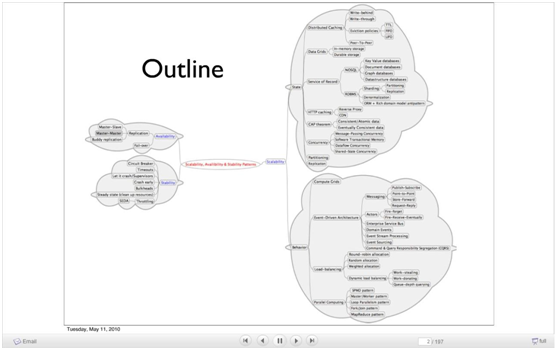
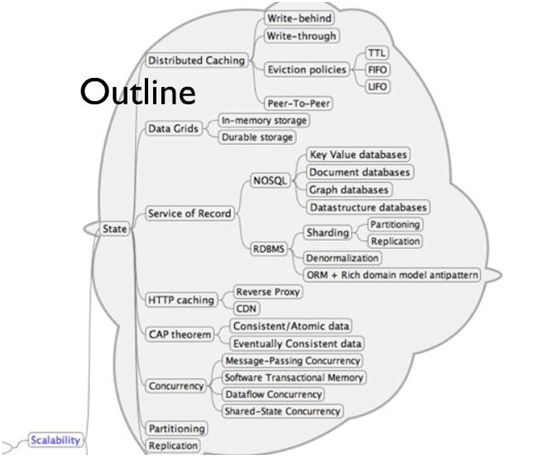
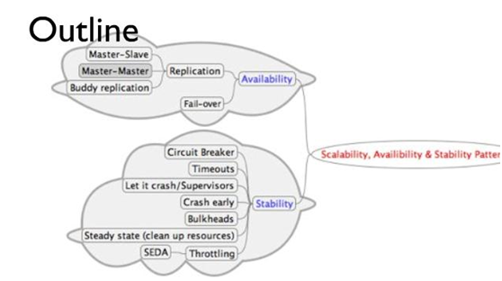
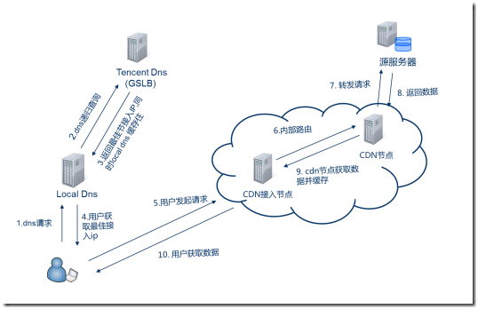
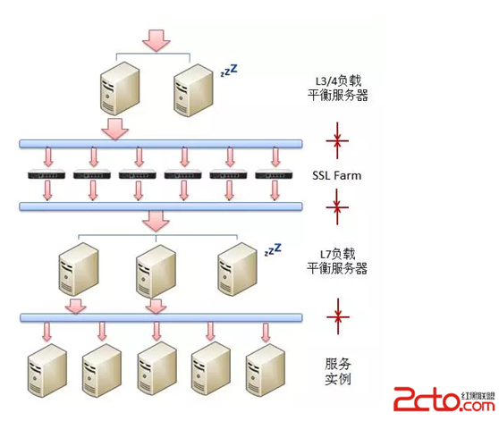
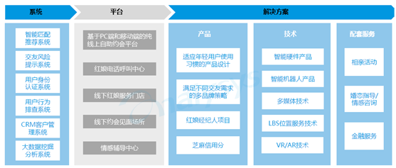
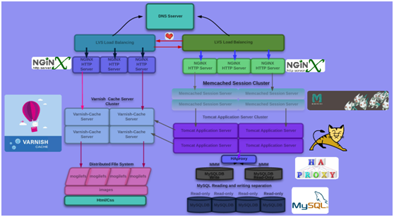

| 序号 | 修改时间   | 修改内容                                                     | 修改人 | 审稿人 |
| ---- | ---------- | ------------------------------------------------------------ | ------ | ------ |
| 1    | 2010-6-6   | 创建                                                         | 吴启福 |        |
| 2    | 2010-7-6   | 增加典型案例如twitter,facebook…                              | 吴启福 |        |
| 3    | 2010-11-17 | 增加PHP缓存部分                                              | 吴启福 |        |
| 4    | 2010-12-10 | 增加性能监控的一些指标参数说明                               | 吴启福 |        |
| 4    | 2013-8-9   | 更新Session和Cookie                                          | 吴启福 |        |
| 5    | 2016-7-8   | 更新缓存                                                     | 同上   |        |
| 6    | 2016-8-27  | 更新社交/社区类别，章节参考                                  | 同上   |        |
| 7    | 2016-10-15 | 调整文档结构，将文档由《SNS社区开发》重命名为<br>《网站开发 （以SNS社区为例）》。 | 同上   |        |
| 8    | 2017-1-4   | 增加测试列表。<br>将文档重命名为《网站架构设计与开发》，调整目录结构。 | 同上   |        |
| 9    | 2018-5-24  | 网站整体优化章节调整。                                       | 同上   |        |
---

 

 

 

# 目录

 

[目录... 1](#_Toc17298127)

[1       网站架构设计... 3](#_Toc17298128)

[1.1        网站常见架构... 3](#_Toc17298129)

[1.1.1         网站系统架构分层... 3](#_Toc17298130)

[1.1.2         LAMP网站架构... 6](#_Toc17298131)

[1.1.3         国内网站架构列表... 7](#_Toc17298132)

[1.1.4         WEB常用框架... 9](#_Toc17298133)

[1.2        网站设计模式... 9](#_Toc17298134)

[1.2.1         Scalablity. 10](#_Toc17298135)

[1.2.2         Availablity and Stability. 11](#_Toc17298136)

[1.3        本章参考... 12](#_Toc17298137)

[2       网站整体优化... 12](#_Toc17298138)

[2.1        网站性能... 12](#_Toc17298139)

[2.2        网站测试... 12](#_Toc17298140)

[2.3        网站缓存技术... 12](#_Toc17298141)

[2.3.1         CDN.. 13](#_Toc17298142)

[2.3.2         前端页面缓存squid/varnish. 15](#_Toc17298143)

[2.3.3         动态内容缓存(PHP) 15](#_Toc17298144)

[2.3.4         浏览器缓存... 15](#_Toc17298145)

[2.3.5         分布式缓存... 19](#_Toc17298146)

[2.3.6         禁止缓存(html/php/asp/jsp) 19](#_Toc17298147)

[2.3.7         本节参考... 20](#_Toc17298148)

[2.4        反向代理... 20](#_Toc17298149)

[2.4.1         Apache的反向代理配置... 21](#_Toc17298150)

[2.4.2         本节参考... 21](#_Toc17298151)

[2.5        负载均衡（Load  Balance）... 22](#_Toc17298152)

[2.5.1         网站的负载均衡... 22](#_Toc17298153)

[2.5.2         分布式系统的负载均衡... 23](#_Toc17298154)

[2.5.3         整体部署架构... 24](#_Toc17298155)

[2.5.4         负载均衡工具比较... 25](#_Toc17298156)

[2.5.5         本节参考... 26](#_Toc17298157)

[2.6        本章参考... 27](#_Toc17298158)

[3       网站工具... 27](#_Toc17298159)

[3.1        网站工具概述... 27](#_Toc17298160)

[3.2        apache. 28](#_Toc17298161)

[3.3        nginx. 28](#_Toc17298162)

[3.4        HAProxy. 28](#_Toc17298163)

[3.5        keepalived. 30](#_Toc17298164)

[3.6        vanish. 30](#_Toc17298165)

[3.7        代理缓存 squid. 31](#_Toc17298166)

[3.8        本章参考... 32](#_Toc17298167)

[4       网站开发：SNS社区... 32](#_Toc17298168)

[4.1        社交及社区简介... 32](#_Toc17298169)

[4.1.1         社交产品分类... 32](#_Toc17298170)

[4.1.2         社区典型产品... 33](#_Toc17298171)

[4.2        SNS社区常见功能... 34](#_Toc17298172)

[4.2.1         婚恋交友社区... 35](#_Toc17298173)

[4.3        本章参考... 36](#_Toc17298174)

[5       网站架构实例... 36](#_Toc17298175)

[5.1        高性能网站参考架构... 36](#_Toc17298176)

[5.2        Twitter架构... 37](#_Toc17298177)

[5.2.1         实现概述... 37](#_Toc17298178)

[5.2.2         Running Component. 38](#_Toc17298179)

[5.2.3         Cache Policy缓存策略... 39](#_Toc17298180)

[5.2.4         scaling twitter. 40](#_Toc17298181)

[5.3        MySpace的六次重构... 40](#_Toc17298182)

[5.4        龙珠直播网站架构... 41](#_Toc17298183)

[5.5        本章参考... 41](#_Toc17298184)

[6       参考资料... 42](#_Toc17298185)

 


# 1       网站架构设计

## 1.1     网站常见架构

### 1.1.1  网站系统架构分层

​                                                  

图 1 网站系统架构分层图

说明：这个网站架构层次，共分为8个层次，其中数据库中心机房架构是上面所有架构的物理基础；安全架构和数据库采集监控架构是贯穿在各个层次的重要保障，这两个架构主要解决五个业务相关层次的安全问题和数据采集监控问题，是一直都需要关注的地方。

**1.****前端架构**

（包括：浏览器优化技术、CDN、动静分离，静态资源独立部署、图片服务、反向代理、DNS等7种技术）

前端指用户请求到达网站应用服务器之前经历的环节，通常不包含网站业务逻辑，不处理动态内容。一般打开网页或界面时，一输入URL就可以看到的信息，就属于这部分，然后再慢慢加载的，就是后面业务层的内容了，因为内容都是静态的，不会发生改变，所有可以在各个地方准备好，放在CDN中，达到瞬时响应的效果。为了实现这样的效果，有下面几种架构技术：

*  **浏览器优化技术：**并不是优化浏览器，而是通过优化响应页面，加快浏览器页面的加载和显示，常用的有页面缓存、合并HTTP减少请求次数、使用页面压缩等。

*  CDN：内容分发网络，部署在网络运营商机房，通过将静态页面内容分发到离用户最近最近的CDN服务器，使用户可以通过最短路径获取内容。

*  **动静分离，静态资源独立部署：**静态资源，如js、CSS等文件部署在专门的服务器集群上，和Web应用动态内容服务分离，并使用专门的（二级）域名。

*  **图片服务：**图片不是指网站Logo、按钮图标等，这些文件属于上面提到的静态资源，应该和JS、CSS部署在一起。这里的图片指用户上传的图片，如产品图片、用户头像等，图片服务同样适用独立部署的图片服务器集群，并使用独立（二级）域名。

*  **反向代理：**部署在网站机房，在应用服务器、静态资源服务器、图片服务器之前，提供页面缓存服务。

*  **DNS****：**域名服务，将域名解析成IP地址，利用DNS可以实现DNS负载均衡，配置CDN也需要修改DNS，使域名解析后指向CDN服务器。

 

**2.****应用层架构**

（包括：开发框架、页面渲染、负载均衡、Session管理、动态页面静态化、业务拆分、虚拟化服务器等7种技术）

应用层是处理网站主要业务逻辑的地方。一般说的使用PHP或则Java等技术实现的网络逻辑和前端框架，就是指这部分的内容，该部分是交互式业务实现的主要层次，相应的架构技术有：

*  开发框架：网站业务是多变的，网站的大部分软件工程师都是在加班加点开发网站业务，一个好的开发框架至关重要。一个号的开发框架应该能够分离关注面，使美工、开发工程师可以各司其事，易于协作。同时还应该内置一些安全策略，防护Web用攻击。
*  页面渲染：将分别开发维护的动态内容和静态页面模板集成起来，组合成最终显示给用户的完整页面。
*  负载均衡：将多台应用服务器组成一个集群，通过负载均衡技术将用户请求分发到不同的服务器上，以应对大量用户同时访问时产生的高并发负载压力。
*  Session管理：为了实现高可用的应用服务器集群，应用服务器通常设计为无状态，不保存用户请求上下文信息，但是网站业务通常需要保持用户会话信息，需要专门的机制管理Session，使集群内甚至跨集群的应用服务器可以共享Session。
*  动态页面静态化：对于访问量特别大而更新又不很频繁的动态页面，可以将其静态化，即生成一个静态页面，利用静态页面的优化手段加速用户访问，如反向代理、CDN、浏览器缓存等。
*  业务拆分：将复杂而庞大的业务拆分开来，形成多个规模较小的产品，独立开发、部署、维护，除了降低系统耦合度，也便于数据库业务分库。按业务对关系数据库进行拆分，技术难度相对较小，而效果又相对较好。
*  虚拟化服务器：将一台物理服务器虚拟化成多态虚拟服务器，对于并发访问较低的业务，更容易用较少的资源构架高可用的应用服务器集群。


**3.****服务层架构**

（包括：分布式消息、分布式服务、分布式缓存、分布式配置等4种技术）

提供基础服务，供应用层调用，完成网站业务。服务层介于应用层和存储层之间，顾名思义就是为应用层提供各种服务的，而服务层本身内容的来源，又可能与存储层有关，比如缓存就是将存储层中的一部分数据做以加工和展现，供应用层快速调用的。服务层的架构技术主要是几种分布式的服务功能：
*  分布式消息：利用消息队列机制，实现业务和业务、业务和服务之间的异步消息发送及低耦合的业务关系。
*  分布式服务：提供高性能、低耦合、易复用、易管理的分布式服务，在网站实现面向服务架构（SOA）。
*  分布式缓存：通过可伸缩的服务器集群提供大规模热点数据的缓存服务，是网站性能优化的重要手段。
*  分布式配置：系统运行需要配置许多参数，如果这些参数需要修改，比如分布式缓存集群加入新的缓存服务器，需要修改应用程序客户端的缓存服务器列表配置，并重启应用程序服务器。分布式配置在系统运行期提供配置动态推送服务，将配置修改实时推送到应用系统，无需重启服务器。


**4.****存储层架构**

（包括：分布式文件、关系数据库、NoSQL数据库、数据同步等4种技术）

提供数据、文件的持久化存储访问与管理服务。该层次也是一般意义上的数据库层，主要用来存放各种数据的，当然在大型网站中数据层的概念，不仅包括传统关系型数据库，还包括分布式文件数据，nosql数据库以及数据同步技术。

 

**5.****后台架构**

（包括：搜索引擎、数据仓库、推荐系统等3种技术）

网站应用中，除了要处理用户的实时访问请求外，还有一些后台非实时数据分析要处理。后台架构主要是进行一些非实时操作，对前端业务处理提供支撑。

 

**6.****数据采集与监控**

（包括：浏览器数据采集、服务器业务数据采集、服务器性能数据采集、系统监控、系统报警等5种技术）

监控网站访问情况与系统运行情况，为网站运营决策和运维管理提供支持保障。数据采集与监控存在于整个业务架构的生命周期，在业务上线后，业务运行状态是否正常，运维人员日常做的主要工作，就是数据采集与监控，在业务系统发生故障或者性能问题时，也需要改系统进行支持和问题定位，进而解决问题。该层次的主要架构技术有：

*  浏览器数据采集：通过在网站页面中嵌入JS脚本采集用户浏览器环境与操作记录，分析用户行为。
*  服务器业务数据采集：服务器业务数据包括两种，一种是采集在服务器端记录的用户请求操作日志；一种是采集应用程序运行期业务数据，比如待处理消息数目等。
*  服务器性能数据采集：采集服务器性能数据，如系统负载、内存使用率、网卡流量等。
*  系统监控：将前述采集的数据以图表的方式展示，以便运营和运维人员监控网站运行状况，做到这一步仅仅是系统监视。更先进的做法是根据采集的数据进行自动化运维，自动处理系统异常状况，是吸纳自动化控制。
*  系统报警：如果采集来的数据超过预设的正常情况的阀值，比如系统负载过高，就通过邮件、短信、语音电话等方式发出警报信号，等待工程师干预。


**7.****安全架构**

（包括：Web攻击、数据保护等2种技术）

保护网站免遭攻击及敏感信息泄露。安全也业务能够正常运行的一个非常重要的问题，安全主要有两方面，一是来自外边的攻击与防护，会影响到网站业务的可用性和性能；二是网站内部的数据安装和保护，会影响到数据层总的敏感信息。安全架构技术主要有：

**Web****攻击：**

以HTTP请求的方式发起的攻击，危害最大的就是XSS和SQL注入攻击。但是只要措施得当，这两种攻击都是比较容易防范的。

**数据保护：**

敏感信息加密传输与存储，保护网站和用户资产。

 

**8.****数据中心机房架构**

（包括：机房架构、机柜架构、服务器架构等3种技术）

大型网站需要的服务器规模数以十万计，机房物理架构也需要关注。对于大型网络系统来说，物理服务器数量必然是非常巨大的，这样在机房、机柜、服务器等层次都要有相应的规划，这样才能比较好的支撑上面的各个层次。

**机房架构：**

对于一个拥有十万台服务器的大型网站，每台服务器耗电（包括服务器本身耗电及空调耗电）每年大约需要人民币2000元，那么网站每年机房电费就需要两亿人民币。数据中心能耗问题日趋严重，Google、Facebook选择数据中心地理位置的时候趋向选择散热良好，供电充裕的地方。

**机柜架构：**

包括机柜大小，网线布局、指示灯规格、不间断电源、电压规格（是48V直流电还是220V民用交流电）等一系列问题。

**服务器架构：**

  大型网站由于服务器采购规模庞大，大都采用定制服务器的方式代替购买服务器整机。根据网站应用需求，定制硬盘、内存、甚至CPU，同时去除不必要的外设接口（显示器输出接口，鼠标、键盘输入接口），并使空间结构利于散热。

 

### 1.1.2  LAMP网站架构

传统的开源网站架构:　LAMP( Linux + Apache + MySQL + PHP)

 

**高性能**的开源网站架构:　LLMP (Linux-gentoo + Lighty + MySQL + Python)

LLMP选择过程:  (OS + web server + DB + Script lang)

|               | 首选                                                | 其它                              |
| ------------- | --------------------------------------------------- | --------------------------------- |
| OS            | Linux-gentoo, 特点是高可定制性.                     | freebsd,  unix                    |
| web   server  | lighty(lighttpd), 特点是轻量性，不像Apache那么臃肿. | Apache, nginx, lighttpd           |
| DB            | MySQL                                               | postgresql,   barkeley DB, sqlite |
| Script   lang | python，特点是与 lighty 结合的脚本语言中性能最好。  | ruby,   php, per*                 |

说明 ：1. DB
*  MySQL: 多线程，多处理器，高性能，5.0以上支持事务，丰富数据类型和sql语法，跨平台。
*  postgresql: 面向对象，集成web，支持事务，使用进程，速度略慢于MySQL。
*  berkeley db: 嵌入式，数据操作通过接口完成，跨语言。
*  sqlite: 与php集成，支持ACID特性，支持大并发量，库锁

2. 能与 lighty 结合的脚本语言，主要有 ruby, php, python, perl。方式主要是通过 fast-cgi 来访问。通过性能测试（http://www.timestretch.com/FractalBenchmark.html）, python最佳.

 

**小结**：

通常大型的网站架构是: Linux + MySQL + php/asp/html/cgi + Apache(LAMP)
 其中可用nginx,lighttpd来替换Apache, 动态页面使用memcached缓存,用fastcgi替换cgi;

数据量大时,(数据库集群和库表散列) 对用户id按照hash选择服务器,或者按照功能划分(分布式存储), 或者Master-Slave模式-读写数据库分开,主写备读;

为了安全可使用代理squid.

 

### 1.1.3  国内网站架构列表

查看方式：$ curl –head [net-site]

注：参看 [4],　很多信息已经过时。2010-7-5 

综合类，大多是Apache.

| **Site**          | **WebServer**                             | **Cache**                   |      |
| ----------------- | ----------------------------------------- | --------------------------- | ---- |
| www.baidu.com     | BWS/1.0                                   | N/A                         |      |
| www.qq.com        | Apache                                    | squid/2.6.STABLE5           |      |
| www.sina.com.cn   | Apache/2.0.54   (Unix)                    | N/A                         |      |
| www.sohu.com      | Apache/1.3.37 (Unix)   mod_gzip/1.3.26.1a | squid                       |      |
| www.163.com       | Apache/2.2.6   (Unix)                     | N/A                         |      |
| www.taobao.com    | Apache                                    | N/A                         |      |
| www.google.cn     | gws                                       | N/A                         |      |
| www.tom.com       | Apache                                    | NetCache   NetApp/6.1.1D4   |      |
| www.soso.com      | Apache                                    | N/A                         |      |
| www.youku.com     | Apache                                    | N/A                         |      |
| www.xunlei.com    | Apache/2.2.8   (Unix)                     | N/A                         |      |
| www.eastmoney.com | Microsoft-IIS/6.0                         | N/A                         |      |
| www.56.com        | nginx/0.5.33                              | squid/2.6.STABLE12-20070426 |      |
| www.6.cn          | nginx/0.6.14                              | squid/3.0.STABLE1.dev       |      |
| www.51.com        | Apache                                    | N/A                         |      |
| www.yahoo.cn      | 4EWS                                      | N/A                         |      |
| www.poco.cn       | Apache                                    | N/A                         |      |
| www.sogou.com     | Apache/2.0.61   (Unix)                    | Resin/3.0.24                |      |

博客类：

| **Site**         | **WebServer**                             | **Cache**               |      |
| ---------------- | ----------------------------------------- | ----------------------- | ---- |
| blog.sina.com.cn | nginx/0.5.35                              | N/A                     |      |
| hi.baidu.com     | Apache 1.1.23.2                           | N/A                     |      |
| qzone.qq.com     | Apache                                    | N/A                     |      |
| blog.sohu.com    | Apache                                    | squid                   |      |
| www.bokee.com    | Apache/1.3.31   (Unix) mod_gzip/1.3.26.1a | N/A                     |      |
| www.blogcn.com   | Microsoft-IIS/6.0                         | Cdn Cache Server   V2.0 |      |

社区类，这里面相当大的比例用了 M$ IIS，奇怪：

| **Site**           | **WebServer**                   | **Cache**         |      |
| ------------------ | ------------------------------- | ----------------- | ---- |
| www.mop.com        | lighttpd                        | N/A               |      |
| www.cyworld.com.cn | Apache                          | N/A               |      |
| bbs.qq.com         | Apache                          | N/A               |      |
| www.tianyaclub.com | Microsoft-IIS/5.0               | N/A               |      |
| bbs.csdn.net       | Microsoft-IIS/6.0               | Longrujun?        |      |
| club.xilu.com      | Apache/2.2.0   (Unix) PHP/5.2.1 | N/A               |      |
| www.tiexue.net     | Microsoft-IIS/6.0               | N/A               |      |
| www.xici.net       | Microsoft-IIS/6.0               | N/A               |      |
| bbs.sina.com.cn    | Apache/2.0.54   (Unix)          | N/A               |      |
| www.newsmth.net    | nginx/0.5.35                    | squid/3.0.STABLE1 |      |

视频类，之所以选择这个类别，是因为视频类对前端要求数据量和流量特别大，连接数特别多，这些特征也能反映出一些问题。从结果看也普遍采用了比较轻快的lighttpd 或 nginx，另外用 squid 或cdn之类做cache：

| **Site**       | **WebServer**                                 | **Cache**                         |      |
| -------------- | --------------------------------------------- | --------------------------------- | ---- |
| www.6.cn       | nginx/0.6.14(网页)    nginx/0.6.14(视频)      | squid/3.0.STABLE1.dev(网页)       |      |
| www.youku.com  | Apache(网页)    lighttpd(视 频)               | N/A                               |      |
| www.56.com     | nginx/0.5.33(网页)    56.com flv server(视频) | squid/2.6.STABLE12-20070426(网页) |      |
| www.ku6.com    | Apache(网页)    nginx/0.5.35(视 频)           | CDN(视频)                         |      |
| www.tudou.com  | Apache(网页)    Cdn Cache Server V2.0(视频)   | chinanetcenter.com(视频)          |      |
| www.pomoho.com | Microsoft-IIS/5.0                             | N/A                               |      |

 

### 1.1.4  WEB常用框架

详见：另作《WEB框架分析》。

 

## 1.2     网站设计模式

[Scalability, Availability & Stability Patterns](http://www.slideshare.net/jboner/scalability-availability-stability-patterns)

http://www.slideshare.net/jboner/scalability-availability-stability-patterns

   

### 1.2.1  Scalablity

   

 

   


说明：stete，指构成可扩展的各种组件状态。behavior指组件形为。 

### 1.2.2  Availablity and Stability

   

说明：可用性包括容错和复制Replication。复制包括master-slave主从，双主, Tree和Buddy.

 

## 1.3     本章参考 

# 2       网站整体优化

## 2.1     网站性能

详见：本人另文《运维专题》系统性能章节。

 

**性能黄金法则**

只有10%-20%的最终用户响应时间花在接收请求的HTML文档上，剩下的80%-90%时间花在HTML文档所引用的所有组件(图片，script，css，flash等等)进行的HTTP请求上。

 

**常见前端优化技术：**

**1****）减少****HTTP****请求****:**  

*  **图片地图**

*  **CSS Sprites****:** 通过使用合并图片，通过指定css的backgroud-image(background:url)和backgroud-position来显示元素。

*  **合并脚本和样式表**

2）使用缓存：CDN、动态页面缓存等等。

3）last-modified和etags配合使用，减少传输数据。

4）JS和CSS：精简或混淆JS

5）图片：JPG和PNG的选择。

 

**其它：**

1、HTML静态化 

其实大家都知道，效率最高、消耗最小的就是纯静态化的html页面，所以我们尽可能使我们的网站上的页面采用静态页面来实现。

2、图片服务器分离

## 2.2     网站测试

详见 本人另文 《测试框架分析.docx》WEB测试章节

## 2.3     网站缓存技术

表格 1 各种缓存技术列表

| 缓存技术                    | 简介                                                         | 主要用途                                                     | 备注                      |
| --------------------------- | ------------------------------------------------------------ | ------------------------------------------------------------ | ------------------------- |
| CDN                         | （Content   Deliver Network，内容分发网络）是一组分布在多个不同地理位置的Web服务器，通过将网站的资源发布到最接近用户的网络”边缘“，供用户就近取得所需内容。 | 一种缓存代理，主要用于对静态资源（如图片，css，js等）的缓存。 | 需服务器异地布署。        |
| 动态内容缓存（PHP）         | 动态内容静态化。                                             | 包括编译缓存、文件缓存。                                     | 主要由开发人员来实现。    |
| 浏览器缓存                  |                                                              | 常缓存CCS， Script, 公共图片等。                             | 如Firefox:    about:cache |
| 前端页面缓存squid / varnish |                                                              | 用于缓存前端的图片、静态页。                                 | **varnish****更流行**     |
| 分布式缓存                  | 使用分布式数据库如memcache.                                  |                                                              |                           |
| 数据项缓存                  | 使用K-V数据库。                                              |                                                              |                           |
| 镜像                        | 镜像是大型网站常采用的提高性能和数据安全性的方式，镜像的技术可以解决不同网络接入商和地域带来的用户访问速度差异，比如ChinaNet和 EduNet之间的差异就促使了很多网站在教育网内搭建镜像站点，数据进行定时更新或者实时更新。 |                                                              |                           |
|                             |                                                              |                                                              |                           |

 

### 2.3.1  CDN

CDN（Content Deliver Network，内容分发网络）是一组分布在多个不同地理位置的Web服务器，通过将网站的资源发布到最接近用户的网络”边缘“，供用户就近取得所需内容。CDN可以看作一种缓存代理，主要用于对静态资源（如图片，css，js等）的缓存。

CDN目前依赖于负载均衡技术、动态内容分发与复制技术、缓存技术等。
 

**CDN****的网络架构**

CDN的网络架构主要分为中心和边缘两个部分，中心服务器主要负责DNS解析和全局负载均衡；而边缘服务器指异地节点，作为CDN分发的载体，包括 负载均衡和高速缓存。边缘服务器的负载均衡负责缓存内容的负载均衡，保证节点的工作效率，同时还负责与中心服务器通信，实现整个系统的负载均衡。边缘服务 器的高速缓存负责存储从客户源服务器获取的资源，并提供给本地用户访问。

 

**CDN****工作流程如下：**

1.浏览器获得需要访问的资源的域名;

2.通过域名解析得到该域名指向CDN的一个CNAME;

3.为了获得IP地址，需要对CNAME进行域名解析，这时请求就会被发送到CDN的中心服务器，全局负载均衡通过预先设定的规则，同时根据用户访问的地理位置信息，把最合适的边缘服务器IP地址返回；

4.浏览器获得IP地址后，就向边缘服务器发出请求；

5.边缘服务器根据访问域名，首先搜索缓存，查看资源是否存在，存在则直接返回资源给浏览器，直接完成整个资源请求过程，否则就根据缓存内部的DNS解析得到资源实际IP地址（即客户的服务器IP地址），向该IP地址发起资源请求；

6.边缘服务器向客户服务器请求资源成功后，就把该资源加入本身的高速缓存中，并把资源发送给用户。

 

   

图 2 腾讯CDN 架构图

由上图可见，使用CDN缓存后的网站访问过程演变为：

1)         用户在浏览器中输入目标域名

2)         浏览器向本地域名解析系统（LocalDNS）发出解析请求

3)         经过DNS递归查询，请求被转移至TencentDNS（GSLB，GlobalServerLoadBalance，全局负载均衡）系统，此时还没有产生Cache层

4)         GSLB返回最佳CDN接入节点的IP，同时LocalDNS缓存此接入节点（在此过程中，会根据客户端的IP地址，地理位置，入网类型电信还是网通，返回最佳接入节点）

5)         用户对此CDN接入节点发起请求，CDN网络经过内部路由，并转发请求至源服务器

6)         源服务器返回响应的数据，CDN节点将数据返回至CDN接入节点

7)         CDN接入节点将数据返回给用户，同时缓存数据

 

**CDN****的工作原理**

除了一些大型互联网公司拥有自己的CDN，其他公司基本都会选择CDN运营商合作。

所以作为ICP，需要把域名解释权交给CDN运营商，操作时ICP修改自己的域名解析部分，一般用CNAME的方式，将自己的静态资源域名指向一个CDN提供的CNAME。

而作为CDN运营商，需要对CNAME提供专用DNS解析，同时需要维护客户服务器的域名和IP地址映射列表。

 

**CDN** **的应用场景**

以 PPTV 视频网站来说，同一时间，不同城市的人都在使用客户端观看。向众多用户提供内容是由一个专门的网络完成的，这个网络我们叫它内容分发网络（CDN）。

另外，CDN 加速应用主要应用在以下 5 种场景：

*  网站静态加速：包括图片、CSS、JS 等静态文件的加速
*  全站加速：静态加速与动态加速结合，智能路由调度实现业务 0 改动全面加速整个网站访问速度
*  下载服务：大文件下载，如游戏安装包和素材，APK 更新等
*  图片服务：运用于 UGC 类社交图片应用
*  流媒体：包括视频点播、视频直播、音视频通信、安防监控


### 2.3.2  前端页面缓存squid/varnish

**varnish**可用于取代squid，作前端页面缓存。

### 2.3.3  动态内容缓存(PHP)

动态内容静态化。

说明：PHP是解释性语言，每个文件在运行时要编译后执行，很多页面生成要访问数据库。因此只编译一次，缓存编译中间结果的有编译缓存；缓存数据库查询的局部SQL缓存；全局页面*squid**缓存*；还有缓存代码块执行结果的局部代码块缓存，如使用memcached扩展缓存某个计算后的结果。
*  文件缓存：serialize, JSON, include/require
*  sqlite 缓存：嵌入式数据库
*  编译与OPCODE缓存 ：如APC: Alternative PHP Cache，eAccelerator和Zend Optimizer.
*  XCache: opcode 缓存器/优化器, 使用共享内存，加快页面生成。
*  memcached缓存：不仅可以缓存字符串，还可缓存对象和数组。


**php.ini**

extension_dir=

extension=xxx.so

 

### 2.3.4  浏览器缓存

Firefox:  about:cache

常缓存CCS， Script, 公共图片等。

 

浏览器缓存分为**强缓存**和**协商缓存**，浏览器加载一个页面的简单流程如下：
1.  浏览器先根据这个资源的http头信息来判断是否命中强缓存。如果命中则直接加在缓存中的资源，并不会将请求发送到服务器。
2.  如果未命中强缓存，则浏览器会将资源加载请求发送到服务器。服务器来判断浏览器本地缓存是否失效。若可以使用，则服务器并不会返回资源信息，浏览器继续从缓存加载资源。
3.  如果未命中协商缓存，则服务器会将完整的资源返回给浏览器，浏览器加载新资源，并更新缓存。 

 

**强缓存**

命中强缓存时，浏览器并不会将请求发送给服务器。在Chrome的开发者工具中看到http的返回码是200，但是在Size列会显示为(from cache)。

强缓存是利用http的返回头中的**Expires**或者**Cache-Control**两个字段来控制的，用来表示资源的缓存时间。

 

**协商缓存**

若未命中强缓存，则浏览器会将请求发送至服务器。服务器根据http头信息中的Last-Modify/If-Modify-Since或Etag/If-None-Match来判断是否命中协商缓存。如果命中，则http返回码为**304**（未修改），浏览器从缓存中加载资源。

 

#### 2.3.4.1 会话机制


​         HTTP协议本身是无状态的，无状态的意思是浏览器发起的每个HTTP请求，对于服务端而言都是彼此独立的，即服务端无法直接通过HTTP协议将用户的多次HTTP请求联系在一起。 然而在Web应用的很多场景下需要维护用户状态才能正常工作。典型的应用就是购物车。浏览器必须通过某种机制识别出你发出的所有HTTP请求是来自同个计算机的同个浏览器，或者来自同一个账户。否则服务器就没办法将购物车里的商品跟某个人联系起来，因此也无法实现购物车功能。这种维持HTTP状态的机制就是会话机制。

会话机制一般有两种实现方案，一种是基于Session实现，一种是基于Cookie实现。这两种方案的本质区别是前者是将用户状态信息保存在服务端，后者是将用户状态信息保存在客户端。那么什么又是用户状态信息呢？以前面的购物车为例，状态信息就是商品信息。

##### 2.3.4.1.1       Session实现

Session**定义**：Session指的就是用户在浏览某个网站时，从进入网站到浏览器关闭所经过的这段时间，也就是用户浏览这个网站所花费的时间。从上述的定义中我们可以看到，Session实际上是一个*特定的时间概念。*

​         基于Session实现会话保持的原理是：在会话的开始（即客户端第一次向服务器发送HTTP请求时），服务器会将会话状态保存起来（一般保存在本机内存，当然也可以保存在其他存储系统），然后分配一个会话标识（也叫SessionId）给客户端，这个会话标识一般保存在浏览Cookie里，以后每次浏览器发送HTTP请求的时候，都会带上这个会话标识到服务器，服务器拿到这个会话标识之后就可以把之前存储在服务端的状态信息与该会话联系起来，因此也就实现了会话保持。当然如果遇到浏览器禁用了Cookie的情况，则可以通过url重写的方式将会话标识放在url的参数里，这样也可以实现会话保持。

 

**1)**       **SESSION****工作原理**

在客户端（如浏览器）登录网站时，被访问的 PHP 页面可以使用 session_start() 打开 SESSION，这样就会产生客户端的唯一标识 SESSION ID（此 ID 可通过函数 session_id() 获取/设置）。SESSION ID 可以通过两种方式保留在客户端，使得请求不同的页面时，PHP 程序可以获知客户端的 SESSION ID；一种是将 SESSION ID 自动加入到 GET 的 URL 中，或者 POST 的表单中，默认情况下，变量名为 PHPSESSID；另一种是通过 COOKIE，将 SESSION ID 保存在 COOKIE 中，默认情况下，这个 COOKIE 的名字为 PHPSESSID。

php3本身是没有实现session功能的，我们只有用其他的方法来实现,这其中最有名的要算phplib了。phplib最基本的功能包括用户认证、Session管理、权限及数据库的抽象化。php4的session也靠cookies保存session id,用文件系统保存变量(默认情况下),因此,它的session变量不能保存对象。

默认情况下，php.ini 中设置的 SESSION 保存方式是 files（session.save_handler = files），即使用读写文件的方式保存 SESSION 数据，而 SESSION 文件保存的目录由 session.save_path 指定，文件名以 sess_ 为前缀，后跟 SESSION ID，如：sess_c72665af28a8b14c0fe11afe3b59b51b。

 

**2)**       **SESSION****用途**

一般来说，在网站上某一个页面中的变量(指服务器端变量，下同)是不能在下一页中用的，有了session就好办了。session中注册的变量可以作为全局变量使用。这样我们就可以将session用于用户身份认证,程序状态记录,页面之间参数传递。

##### 2.3.4.1.2       Cookie实现

**Cookie**

Cookie是在HTTP协议下，服务器或脚本可以维护客户工作站上信息的一种方式。Cookie是由Web服务器保存在用户浏览器上的小文件，它可以包 含有关用户的信息（如身份识别号码、密码、用户在Web站点购物的方式或用户访问该站点的次数）。无论何时用户链接到服务器，Web站点都可以访问 Cookie信息。

 

​         基于Cookie实现会话保持与上述基于Session实现会话保持的最主要区别是前者完全将会话状态信息存储在浏览器Cookie中，这样一来每次浏览器发送HTTP请求的时候都会带上状态信息，因此也就可以实现状态保持。以上述购物车应用为例，服务端可以将商品信息加密（也可以不加密，但为了安全性，一般会此对状态信息进行加密处理）后保存在浏览器的Cookie中，这样一来服务端就能知道你在浏览的过程中添加了哪些商品到购物车中了。

 

**PHP****示例：****(****检验码验正****)**

$login_check_number  =  strval(rand("1111","9999")); 
         session_register("login_check_number"); 
         //这里是使用了SESSION来保存校验码. 
         //当然也可以用COOKIE，不推荐，COOKIE不提供安全验证
         //setcookie("login_check_number",$login_check_number);

 

##### 2.3.4.1.3       session/cookie比较

基于Session的会话保持的优点是具有安全性，因为状态信息是保存在服务端的，缺点是不便于服务器的水平扩展。大型网站的后台一般都不止一台服务器，可能几台甚至上百台，浏览器发送的HTTP请求一般要先通过负载均衡器才能到达具体的后台服务器，这就会导致每次HTTP请求可能落到不同的服务器上，比如说第一次HTTP请求落到server1上，第二次HTTP请求落到server2上。而Session默认是存储在服务器本机内存的，当多次请求落到不同的服务器上时，上述方案就不能实现会话保持了。（可以用NoSQL来做全局性会话ID）

 

基于Cookie的会话保持的优点是服务器不用保存状态信息，减轻服务端存储压力，也便于服务端做水平扩展。缺点是不够安全，因为状态信息是存储在客户端的，这意味着不能在会话中保存机密数据，另一个缺点是每次HTTP请求都需要发送额外的Cookie到服务端，会消耗更多带宽。

 

**小结**：Session的生命周期在WEB服务器可以设置，一般是20分钟．时间过期后，Session失效．服务器将会重新分析一个SessionID,　原Session变量无效．这通常用于控制浏览一个页面的时间．浏览器保存网站登陆状态，则是用本地Cookie来实现的．Session可以保存在服务器也可以在客户端，而Cookie只保存在客户端．

#### 2.3.4.2  HTTP协议中的get和post

Http定义了与服务器交互的不同方法，最基本的方法有4种，分别是GET，POST，PUT，DELETE

HTTP-GET和HTTP-POST是使用HTTP的标准协议动词，用于编码和传送变量名/变量值对参数，并且使用相关的请求语义。

一般在浏览器中输入网址访问资源都是通过GET方式；在FORM提交中，可以通过Method指定提交方式为GET或者POST，默认为GET提交 

 

**表单提交中****get****和****post****方式的区别：**

1. get是从服务器上获取数据，post是向服务器传送数据。
2. get是把参数数据队列加到提交表单的ACTION属性所指的URL中，值和表单内各个字段一一对应，在URL中可以看到。post是通过HTTP post机制，将表单内各个字段与其内容放置在HTML HEADER内一起传送到ACTION属性所指的URL地址。用户看不到这个过程。
3. 对于get方式，服务器端用Request.QueryString获取变量的值，对于post方式，服务器端用Request.Form获取提交的数据。
4. get传送的数据量较小，不能大于2KB。post传送的数据量较大，一般被默认为不受限制。但理论上，IIS4中最大量为80KB，IIS5中为100KB。
5. get安全性非常低，post安全性较高。


 

 

### 2.3.5  分布式缓存

使用memcached、Redis.

读写分离。

### 2.3.6  禁止缓存(html/php/asp/jsp)

HTML:

```html
<META HTTP-EQUIV="pragma" CONTENT="no-cache">
<META HTTP-EQUIV="Cache-Control" CONTENT="no-cache, must-revalidate">
<META HTTP-EQUIV="expires" CONTENT="Wed, 26 Feb 1997 08:21:57 GMT">
<META HTTP-EQUIV="expires" CONTENT="0">

```

PHP:

```php
header("Expires: Mon, 26 Jul 1997 05:00:00 GMT");
header("Cache-Control: no-cache, must-revalidate");
header("Pragma: no-cache");
```


ASP:

```asp
 Response.Buffer = True
 Response.Expires = -1
 Response.ExpiresAbsolute = Now() - 1
 Response.Expires = 0
 Response.CacheControl = "no-cache"
```

JSP:

```jsp
response.addHeader("Cache-Control", "no-cache");
 response.addHeader("Expires", "Thu, 01 Jan 1970 00:00:01 GMT");
```


### 2.3.7  本节参考

[1].     CDN 技术详解（DNS，GSLB，Cache）http://www.cnblogs.com/SkySoot/p/6119356.html

[2].     [PHP缓存相关知识学习笔记](http://lanbolee.com/blog/html/2010/08/08/1042.html)http://lanbolee.com/blog/html/2010/08/08/1042.html/comment-page-1 

[3].     [简单说说PHP优化](http://www.php100.com/html/webkaifa/PHP/PHPyingyong/2010/0206/3940.html)http://www.php100.com/html/webkaifa/PHP/PHPyingyong/2010/0206/3940.html 

[4].     php instal*  http://php.net/manual/en/install.php 

[5].     php extension windows: http://downloads.php.net/pierre/

[6].     php extension Linux:  http://pecl.php.net/ 

[7].     谈谈HTTP状态保持 https://blog.csdn.net/hzjjames/article/details/81143934


## 2.4     反向代理

代理方式有两种：正向代理和反向代理。

*  正向代理：又叫传统代理。用户隐藏在代理服务器之后。为客户端转发请求，各客户端将请求交给正向代理服务器，正向代理服务器再负责转发给服务端，响应时服务端先响应给正向代理服务器，正向代理服务器再转发给对应的客户端。也就是说，正向代理是为局域网内客户端做代理，它扮演的角色类似于NAT。

*  反向代理：WEB服务器隐藏在代理服务器之后。Web服务器称之为后端Back-end Server，而反向代理服务器称为Front-end Server。为服务端转发请求，客户端将请求发送至反向代理服务器，反向代理服务器再将请求转发给真正的服务器以处理请求，响应时后端真正的服务器将处理结果发送给反向代理，再由反向代理构建响应并响应给客户端。

 

**反向代理的目的**：

*  安全、高可用、负载均衡、
*  集中授权/认证。
*  前后端分离、
*  基于缓存的加速。

### 2.4.1  Apache的反向代理配置

\# 简单代理：ProxyPass指令用于映射请求到后端服务器；ProxyPassReverse 重定向

```shell
# 简单代理：ProxyPass指令用于映射请求到后端服务器；ProxyPassReverse 重定向
ProxyPass "/"  "http://www.example.com/"
ProxyPassReverse "/"  "http://www.example.com/"
ProxyPassMatch "^/((?i).*\.php)$" "fcgi://127.0.0.1:9000/var/www/a.com/$1"

# 负载均衡
<Proxy balancer://myset>
    BalancerMember http://www2.example.com:8080
    BalancerMember http://www3.example.com:8080
    BalancerMember http://www3.example.com:8080 status=+H
    ProxySet lbmethod=bytraffic
</Proxy>

ProxyPass "/images/"  "balancer://myset/"
ProxyPassReverse "/images/"  "balancer://myset/"

```

说明：

1. httpd有3种复杂均衡算法：

- - byrequests：默认。基于请求数量计算权重。

​    -- bytraffic：基于I/O流量大小计算权重。

​    -- bybusyness：基于挂起的请求(排队暂未处理)数量计算权重。

2.  备份节点：状态设置为"H"，表示hot-standby。当所有负载节点都不健康时，将转发请求给备份节点，并由备份节点处理请求

 

**提供负载状态显示页面**

<Location "/bm">

​    SetHandler balancer-manager

​    Require host localhost

​    Require ip 192.168.100

</Location>


 

### 2.4.2  本节参考

[1].     Apache httpd反向代理使用详细分析 https://www.linuxidc.com/Linux/2017-10/147534.htm

## 2.5     负载均衡（Load Balance）

### 2.5.1  网站的负载均衡

负载均衡将是大型网站解决高负荷访问和大量并发请求采用的终极解决办法。

负载均衡建立在现有网络结构之上，它提供了一种廉价、有效、透明的方法扩展网络设备和服务器的带宽、增加吞吐量、加强网络数据处理能力、提高网络的灵活性和可用性。

 

主要的负载均衡的技术有如下这些：

*  DNS 负载均衡：它是最早的负载均衡技术，通过 DNS 来实现，在 DNS 中为多个地址配置同一个名字，因而查询这个名字的客户机将得到其中某一个地址，从而使得不同的客户访问不同的服务器，达到负载均衡的目的。DNS 负载均衡是一种简单而有效的方法，但是它不能区分服务器的差异，也不能反映服务器的当前运行状态。

*  代理服务器负载均衡：使用代理服务器，可以将请求转发给内部的服务器，使用这种加速模式显然可以提升静态网页的访问速度。然而，也可以考虑这样一种技术，使用代理服务器将请求均匀转发给多台服务器，从而达到负载均衡的目的。

*  **地址转换网关负载均衡**：支持负载均衡的地址转换网关，可以将一个外部 IP 地址映射为多个内部 IP 地址，对每次 TCP 连接请求动态使用其中一个内部地址，达到负载均衡的目的。

*  **协议内部支持负载均衡**：除了这三种负载均衡方式之外，有的协议内部支持与负载均衡相关的功能，例如 HTTP 协议中的重定向能力等，HTTP 运行于 TCP 连接的最高层。

*  反向代理负载均衡：普通代理方式是代理内部网络用户访问 internet 上服务器的连接请求，客户端必须指定代理服务器，并将本来要直接发送到 internet 上服务器的连接请求发送给代理服务器处理。反向代理（Reverse Proxy）方式是指以代理服务器来接受 internet 上的连接请求，然后将请求转发给内部网络上的服务器，并将从服务器上得到的结果返回给 internet 上请求连接的客户端，此时代理服务器对外就表现为一个服务器。

*  **混合型负载均衡**：在有些大型网络，由于多个服务器群内硬件设备、各自的规模、提供的服务等的差异，可以考虑给每个服务器群采用最合适的负载均衡方式，然后又在这多个服务器群间再一次负载均衡或群集起来以一个整体向外界提供服务（即把这多个服务器群当做一个新的服务器群），从而达到最佳的性能。此种方式有时也用于单台均衡设备的性能不能满足大量连接请求的情况下。

 

​    负载均衡从应用的地理结构上又分为本地负载均衡（Local Load Balance）和全局负载均衡（Global Load Balance）。

n  本地负载均衡：能有效地解决数据流量过大、网络负荷过重的问题，并且不需花费昂贵开支购置性能卓越的服务器，充分利用现有设备，避免服务器单点故障造成数据流量的损失。其有灵活多样的均衡策略把数据流量合理地分配给集群内的服务器共同负担。即使是再给现有服务器扩充升级，也只是简单地增加一个新的服务器到集群中，而不需改变现有网络结构、停止现有的服务。 它关注一个地理位置上的设备群，是微观的。

n  全局负载均衡：主要用于在一个多区域拥有自己服务器的站点，为了使全球用户只以一个 IP 地址或域名就能访问到离自己最近的服务器，从而获得最快的访问速度。它关注的是一个网络的整体，是对放在不同位置、为完成同一个任务的设备群体做负载均衡，是宏观的。全局负载均衡有以下的特点：

u  实现地理位置无关性，能够远距离为用户提供完全的透明服务

u  除了能避免服务器、数据中心等的单点失效，也能避免由于 ISP 专线故障引起的单点失效

u  解决网络拥塞问题，提高服务器响应速度，服务就近提供，达到更好的访问质量

 

   负载均衡又分为硬件均衡服务器和软件均衡服务器：

n  硬件服务器：就是直接购买独立的服务器作为负载均衡服务器，硬件负载均衡效率高，但是价格贵，例如，阿里云已经提供。

n  软件服务器：使用具有代理功能的软件作为转发服务器，比如 Nginx，HAProxy，LVS 等等，软件负载均衡系统价格较低或者免费，效率较硬件负载均衡系统低。

 

**WEB****负载均衡可考虑的方法如下：**

*  HTTP重定向
*  DNS负载均衡
*  反射代理负载均衡
*  Ip负载均衡
*  直接路由
*  IP隧道

 

### 2.5.2  分布式系统的负载均衡

GLB: 全局负载均衡。

负载均衡是分布式系统中的一个最最基本的问题。

*  网关需要把请求分发给不同的Tomcat；

*  Tomcat需要把收到的请求，分发给不同的Service；

这都需要负载均衡。

一句话：凡是请求从一个入口进来，需要分发给后端不同的机器时，就需要负载均衡。

 

**局域网负载均衡**

在上图中，负载均衡发生在局域网内部。在这里，常用的网关软件有Nginx/HAProxy/F5/LVS/各种云上的SLB等。

 

**广域网负载均衡**

在上图之外，还有广域网负载均衡。这通常发生在域名服务器上，而不是局域网内部。

同1个域名，映射到不同的局域网集群。常用的还有CDN。

常用的负载均衡算法：随机，轮询（Round Robin)，最小资源数，hash。

 

### 2.5.3  整体部署架构

   

说明：

* L3/L4：指TCP/IP层。包括硬件四层交换如F5；软件四层交换如LVS,  *  DNS*  *  轮循*  *  .
* L7：指*  *  HTTP*  *  层。如*  *  nginx*  *  （使用*  *  keepalive*  *  实现*  *  nginx*  *  集群）
* DNS轮询：客户通过DNS指向一个集群。

 

   

说明：优化层级（自上而下，用户到应用服务器）

CDN -- 域名（DNS轮询）

-- LVS （L4 TCP层）-

\- KeepAlive - -Nginx（L7 HTTP层） 

--  连接池 -- 应用服务器或DB

### 2.5.4  负载均衡工具比较

使用nginx, lightttp,fastcgi提升性能和构造分布式服务。

表格 2 主流负载均衡工具(nginx/haproxy/lvs)比较


备注: nginx的http会话的直接保持，可通过ip_hash解决，但这样就不能自动剔除后端服务器故障（轮询）。

 

三大主流软件负载均衡器适用业务场景：
 1、网站建设初期，可以选用Nigix/HAproxy作为反向代理负载均衡（或者流量不大都可以不选用负载均衡），因为其配置简单，性能也能满足一般的业务场景。如果考虑到负载均衡器是有单点问题，可以采用Nginx+Keepalived/HAproxy+Keepalived避免负载均衡器自身的单点问题。
 2、网站并发达到一定程度之后，为了提高稳定性和转发效率，可以使用LVS。毕竟LVS比Nginx/HAproxy要更稳定，转发效率也更高。不过维护LVS对维护人员的要求也会更高，投入成本也更大。

 

### 2.5.5  本节参考

[1].     三大主流软件负载均衡器对比(LVS VS Nginx VS Haproxy) https://www.cnblogs.com/zjoch/p/6409411.html 

[2].     集群 & 负载均衡 https://www.cnblogs.com/SkySoot/p/6119968.html 

[3].     负载均衡之总结篇 https://www.2cto.com/kf/201601/485537.html 

[4].     LB 负载均衡的层次结构 https://www.cnblogs.com/mindwind/p/5339657.html

[5].     HAProxy Documentation. [HAProxy Management Guide](http://www.haproxy.org/download/1.6/doc/management.txt)

[6].     Willy Tarreau. [Making applications scalable with Load Balancing](http://1wt.eu/articles/2006_lb/index.html)

[7].     LVS wiki. [Load balancing](http://kb.linuxvirtualserver.org/wiki/Load_balancing)

[8].     Wikipedia. [Virtual Router Redundancy Protocol](https://en.wikipedia.org/wiki/Virtual_Router_Redundancy_Protocol)

[9].     shuming. [LVS 工作模式以及工作原理](http://blog.csdn.net/caoshuming_500/article/details/8291940)

[10]. LVS负载均衡（LVS简介、三种工作模式、十种调度算法） https://blog.csdn.net/weixin_40470303/article/details/80541639 

## 2.6     本章参考 

[1].     大型网站架构技术一览 http://blog.csdn.net/yumushui/article/details/45563527 

[2].     服务器系统架构分析日志http://www.sudone.com/

[3].     浏览器缓存知识归纳 http://www.kuqin.com/shuoit/20160309/351077.html

[4].     国内网站WebServer和所用Cache类型统计 http://www.cnbeta.com/articles/56551.htm

[5].     Web站点数据库分布存储浅谈 http://blog.csdn.net/heiyeshuwu/archive/2007/11/18/1891639.aspx

[6].     http://www.alrond.com/en/2007/jan/25/performance-test-of-6-leading-frameworks/

**[7].**     [**Web****前端性能优化**](http://www.chinaz.com/tags/Webqianduanxingnengyouhua.shtml) 

[8].     《高性能网站建设》

 

# 3       网站工具

## 3.1     网站工具概述

表格 3 WEB类工具列表


 

## 3.2     apache

## 3.3     nginx

详见 《nginx用户手册》

可用于反向代理、后端服务器的负载均衡。

## 3.4     HAProxy

**HAProxy**是一个使用C语言编写的自由及开放源代码软件。

（1）HAProxy 是一款提供高可用性、负载均衡以及基于TCP（第四层）和HTTP（第七层）应用的代理软件，支持虚拟主机，它是免费、快速并且可靠的一种解决方案。HAProxy特别适用于那些负载特大的web站点，这些站点通常又需要会话保持或七层处理。HAProxy运行在当前的硬件上，完全可以支持数以万计的并发连接。并且它的运行模式使得它可以很简单安全的整合进您当前的架构中， 同时可以保护你的web服务器不被暴露到网络上。

（2）HAProxy实现了一种[**事件驱动**](https://baike.baidu.com/item/事件驱动/9597519), **单一进程**模型，此模型支持非常大的并发连接数。多进程或多线程模型受内存限制 、系统调度器限制以及无处不在的锁限制，很少能处理数千并发连接。[事件驱动模型](https://baike.baidu.com/item/事件驱动模型/1419787)因为在有更好的资源和时间管理的用户空间(User-Space) 实现所有这些任务，所以没有这些问题。此模型的弊端是，在多核系统上，这些程序通常扩展性较差。这就是为什么他们必须进行优化以 使每个CPU时间片(Cycle)做更多的工作。

（3）HAProxy 支持连接拒绝 : 因为维护一个连接的打开的开销是很低的，有时我们很需要限制攻击蠕虫（attack bots），也就是说限制它们的连接打开从而限制它们的危害。 这个已经为一个陷于小型DDoS攻击的网站开发了而且已经拯救

了很多站点，这个优点也是其它负载均衡器没有的。

（4）HAProxy 支持全透明代理（已具备硬件防火墙的典型特点）: 可以用客户端IP地址或者任何其他地址来连接后端服务器. 这个特性仅在[Linux](http://www.ttlsa.com/linux/) 2.4/2.6内核打了cttproxy补丁后才可以使用. 这个特性也使得为某特殊服务器处理部分流量同时又不修改服务器的地址成为可能。

 

**性能**

HAProxy借助于OS上几种常见的技术来实现性能的最大化。

1，单进程、事件驱动模型显著降低了上下文切换的开销及内存占用。

2，O(1)事件检查器(event checker)允许其在高并发连接中对任何连接的任何事件实现即时探测。

3，在任何可用的情况下，单缓冲(single buffering)机制能以不复制任何数据的方式完成读写操作，这会节约大量的CPU时钟周期及内存带宽；

4，借助于Linux 2.6 (>= 2.6.27.19)上的splice()系统调用，HAProxy可以实现零复制转发(Zero-copy forwarding)，在Linux 3.5及以上的OS中还可以实现零复制启动(zero-starting)；

5，内存分配器在固定大小的内存池中可实现即时内存分配，这能够显著减少创建一个会话的时长；

6，树型存储：侧重于使用作者多年前开发的弹性二叉树，实现了以O(log(N))的低开销来保持计时器命令、保持运行队列命令及管理轮询及最少连接队列；

7，优化的HTTP首部分析：优化的首部分析功能避免了在HTTP首部分析过程中重读任何内存区域；

8，精心地降低了昂贵的系统调用，大部分工作都在用户空间完成，如时间读取、缓冲聚合及文件描述符的启用和禁用等；

所有的这些细微之处的优化实现了在中等规模负载之上依然有着相当低的CPU负载，甚至于在非常高的负载场景中，5%的用户空间占用率和95%的系统空间占用率也是非常普遍的现象，这意味着HAProxy进程消耗比系统空间消耗低20倍以上。因此，对OS进行性能调优是非常重要的。即使用户空间的占用率提高一倍，其CPU占用率也仅为10%，这也解释了为何7层处理对性能影响有限这一现象。由此，在高端系统上HAProxy的7层性能可轻易超过硬件负载均衡设备。

在生产环境中，在7层处理上使用HAProxy作为昂贵的高端硬件负载均衡设备故障故障时的紧急解决方案也时长可见。硬件负载均衡设备在“报文”级别处理请求，这在支持跨报文请求(request across multiple packets)有着较高的难度，并且它们不缓冲任何数据，因此有着较长的响应时间。对应地，软件负载均衡设备使用TCP缓冲，可建立极长的请求，且有着较大的响应时间。

 

HAProxy目前主要有三个版本： 1.3 ， 1.4 ，1.5，CentOS6.6 自带的RPM包为 1.5 的。

 

**配置HAProxy Session****亲缘性的三种方式**

haproxy负载均衡保持客户端和服务器Session亲缘性的三种方式:

**1****).****用户IP** **识别**

haproxy 将用户IP经过hash计算后 指定到固定的真实服务器上（类似于nginx 的IP hash 指令）

配置指令 balance source

**2** **).cookie** **识别**

haproxy 将WEB服务端发送给客户端的cookie中插入(或添加前缀)haproxy定义的后端的服务器COOKIE ID。

配置指令例举 cookie SESSION_COOKIE insert indirect nocache

用firebug可以观察到用户的请求头的cookie里 有类似" Cookie jsessionid=0bc588656ca05ecf7588c65f9be214f5; SESSION_COOKIE=app1" SESSION_COOKIE=app1就是haproxy添加的内容

**3****). session** **识别**

haproxy 将后端服务器产生的session和后端服务器标识存在haproxy中的一张表里。客户端请求时先查询这张表。

配置指令例举 appsession JSESSIONID len 64 timeout 5h request-learn

 

**配置Haproxy****~haproxy.cfg**

​    Haproxy配置中分成五部分内容，当然这些组件不是必选的，可以根据需要选择作为配置。
*  global：参数是进程级的，通常和操作系统(OS)相关。这些参数一般只设置一次，如果配置无误，就不需要再次配置进行修改；
*  default：配置默认参数的，这些参数可以被利用配置到frontend，backend，listen组件；
*  frontend：接收请求的前端虚拟节点，Frontend可以根据规则直接指定具体使用后端的backend(可动态选择)；
*  backend：后端服务集群的配置，是真实的服务器，一个Backend对应一个或者多个实体服务器；
*  listen：Frontend和Backend的组合体。


## 3.5     keepalived

 

## 3.6     vanish

​          varnish是一款高性能且开源的方向代理服务器和HTTP加速器，它的开发者poul-Henning kamp FreeBSD 核心的开发人员之一。varnish采用全新的软件体系机构，和现在的硬件体系配合紧密，
​          varnish是一个轻量级的cache和反向代理软件。先进的设计理念和成熟的设计框架式varnish的主要特点。现在的varnish总共代码量不大，虽然功能在不断改进，但是还需要继续丰富加强。

 

**varnish****的特点：**

1、基于内存进行缓存，重启后数据将消失。
2、利用虚拟内存方式，I\O性能好。
3、支持设置0~60秒的精确缓存时间。
4、VCL配置管理比较灵活。
5、具有强大的管理功能，例如top、stat、admin、list 等。
6、状态机设计巧妙、结构清晰。
7、利用二叉堆管理缓存文件，可达到积极删除目的。

 

   

图 3 vanish系统架构

varnish主要运行两个进程：Management进程和Child进程(也叫Cache进程)。

* Management进程主要实现应用新的配置、编译VCL、监控varnish、初始化varnish以及提供一个命令行接口等。Management进程会每隔几秒钟探测一下Child进程以判断其是否正常运行，如果在指定的时长内未得到Child进程的回应，Management将会重启此Child进程。
* Child进程包含多种类型的线程，常见的如：
* Acceptor线程：接收新的连接请求并响应；
* Worker线程：child进程会为每个会话启动一个worker线程，因此，在高并发的场景中可能会出现数百个worker线程甚至更多；
* Expiry线程：从缓存中清理过期内容；

Varnish依赖“工作区(workspace)”以降低线程在申请或修改内存时出现竞争的可能性。在varnish内部有多种不同的工作区，其中最关键的当属用于管理会话数据的session工作区。

 

## 3.7     代理缓存 squid

Squid是一个高性能的代理缓存服务器，Squid支持FTP、gopher、HTTPS和HTTP协议。和一般的代理缓存软件不同，Squid用一个单独的、非模块化的、I/O驱动的进程来处理所有的客户端请求。

squid缓存的**原理**：缓存请求页，如果是动态页面，则并没有减少实际的操作。因此只适用于静态页面? 动态页面缓存要做一些参数调整，否则命中率不高。

## 3.8     OpenResty

基于Nginx开发的WEB应用。

 

## 3.9     本章参考 

[1].     Vanish 详解 https://www.cnblogs.com/xiaocen/p/3711513.html 

[2].     [Squid中文权威指南](http://home.arcor.de/pangj/squid/) 

[3].     HAProxy官网 http://www.haproxy.org/ 

[4].     HAProxy用法详解 [www.ttlsa.com/linux/haproxy-study-tutorial/](http://www.ttlsa.com/linux/haproxy-study-tutorial/) 

# 4       网站开发：SNS社区

## 4.1     社交及社区简介

Web1.0 服务商提供内容，如国内三大新闻网站sina, sohu, 163.

Web2.0 用户参与创造内容，如blog, wiki, 播客，网摘，图片, 社区等。

Web3.0 还是概念...

可参看 <<CSDN2007年增刊-国内外web2.0资源汇总>> 文档.

### 4.1.1  社交产品分类

表格 4基于使用目的的社交产品分类


| 类型          | 简介                            | 典型产品                                 |
| ------------- | ------------------------------- | ---------------------------------------- |
| 即时通信      | 使用率最高占90%。用户黏性最高。 | QQ、微信、陌陌、阿里旺旺、QT语音         |
| 综合社交      |                                 | QQ空间、新浪微博、人人网                 |
| 图片/视频社交 |                                 | 美拍、优酷、秒拍、优酷拍客、足记         |
| 社区社交      | 包括垂直社交和BBS论坛。         | 百度贴吧、知乎、豆瓣、天涯社区、         |
| 婚恋/交友     |                                 | 世纪佳缘、百合、珍爱、58交友、赶集婚恋、 |
| 职场社交      |                                 | 脉脉、领英、猎聘秘书                     |

 

   

​      

图表 1 2015年中国社交应用分类及代表应用

 

表格 5 基于用户链的社交产品分类

| 类别            | 简介                                                         | 典型产品                                 |
| --------------- | ------------------------------------------------------------ | ---------------------------------------- |
| 轻熟人/熟人社交 | 熟人、半熟人因某种目的建立的社交联系。                       | 微信 微博 脉脉 奶酪 鉴鉴                 |
| 陌生人社交      | 不相识的人间因相似位置、兴趣而建立的不以约会恋爱为目的的交友关系。 | 陌陌 探探 请吃饭 友加 比邻               |
| 婚恋交友        | 以约会、恋爱、择偶为目的的交友关系                           | 世纪佳缘、百合、珍爱、58交友、赶集婚恋、 |
| 情侣互动        | 恋人、情侣间加深感情的社交应用。                             | 小恩爱 微爱 QQ情侣 想你 恋爱记           |
| 同性交友        | 针对同志群体的交友。                                         | Blued  The L热拉 Aloha 拉拉公园 zank     |

备注：陌陌从一个陌生人社交的约软应用软件发展为三四线城市的轻熟人社交。

 

### 4.1.2  社区典型产品

facebook //全球最大的开放实名社区,注册人数
 myspace //全球最大的开放匿名社区
 youtube //全球最大的在线视频
 qq //中国最大的即时通讯,注册人数2亿多,活跃在线人数1千多万
 online games //同时在线人数有高达百万的
 qq.com //大型门户站点, pageview过5亿
 google //全球最大的通用搜索, pageview过亿,每秒查询约千次

社区产品时间表

| 产品        | introduced                                                   | Launched           | Website                                        | note                                                         |
| ----------- | ------------------------------------------------------------ | ------------------ | ---------------------------------------------- | ------------------------------------------------------------ |
| craigslist. | [online classified advertisements](http://en.wikipedia.org/wiki/Online_classified_advertising) | 1995               | www.craigslist.org                             |                                                              |
| qq          | a   Chinese instant messaging program                        | 1999 -2-11         | http://im.qq.com/                              | owner: tencent                                               |
| LiveJournal | Opensource   project. A service for creating and customizing a journal on the web. | 1999               | [Livejournal.com](http://www.livejournal.com/) |                                                              |
| blogger     | a [blog](http://en.wikipedia.org/wiki/Blog) [storage   service](http://en.wikipedia.org/wiki/Weblog_software) | August   23, 1999  |                                                | owner: google                                                |
| LinkedIn    | a   business-oriented [social networking site](http://en.wikipedia.org/wiki/Social_network_service). | May   2003         | [www.linkedin.com](http://www.linkedin.com/)   |                                                              |
| myspace     | 同上                                                         | August   2003      | [www.myspace.com](http://www.myspace.com/)     | owner:   [News   Corporation](http://en.wikipedia.org/wiki/News_Corporation) |
| facebook    | a [social networking](http://en.wikipedia.org/wiki/Social_network_service) website | February   4, 2004 | [facebook.com](http://www.facebook.com/)       |                                                              |
| flicker     | a   digital photo sharing    website   and service           | February   2004    | [www.flickr.com](http://www.flickr.com/)       | owner: YAHOO                                                 |
| youtube     | a [video-sharing](http://en.wikipedia.org/wiki/Video_hosting_service) [website](http://en.wikipedia.org/wiki/Website) | February   2005    | [www.youtube.com](http://www.youtube.com/)     | owner: google                                                |
| xiaonei     | a [Chinese](http://en.wikipedia.org/wiki/China) [social networking site](http://en.wikipedia.org/wiki/Social_networking_site) | December   2005    | http://renren.com                              |                                                              |
| twitter     | a [social networking](http://en.wikipedia.org/wiki/Social_network_service)    and [microblogging](http://en.wikipedia.org/wiki/Microblogging)   service | July   2006        | [www.twitter.com](http://twitter.com/)         |                                                              |
| conduit     | an   online marketing platform                               |                    |                                                |                                                              |
|             |                                                              |                    |                                                |                                                              |
|             |                                                              |                    |                                                |                                                              |

 

**Twitter****的创新**

*  消息发布：良好的用户体验
*  消息接收：控制消息来源
*  消息传播：六度空间应用


## 4.2     SNS社区常见功能

引用来自：[1] 见下方 

1. Tag标签功能块

Tag(中文叫做"标签") 是一种新的组织和管理在线信息的方式。

它不同于传统的、针对文件本身的关键字检索，而是一种模糊化、智能化的分类。（与其说是功能块倒不如说是一种内容导航和内容组织形式）。 

好处是：Tag是人的意志和趋向的体现，Tag可以帮助你找到兴趣相投的人。

 

2. RSS订阅功能块

RSS是在线共享内容的一种简易方式（也叫聚合内容，Really Simple Syndication）。通常在时效性比较强的内容上使用RSS订阅能更快速获取信息，网站提供RSS输出，有利于让用户获取网站内容的最新更新。网络用户可以在客户端借助于支持RSS的聚合工具软件（例如SharpReader,NewzCrawler、FeedDemon），在不打开网站内容页面的情况下阅读支持RSS输出的网站内容。 

好处是：定向投递，也就是说RSS机制更能体现用户的意愿和个性，获取信息的方式也最直接和简单。

 

3. 推荐和收藏功能块

　　说到推荐功能，不仅web2.0网站在大量使用，传统的以cms平台为代表的内容模式的网站也在大量使用，推荐功能主要是指向一些网摘或者聚合类门户网站推荐自己所浏览到的网页。当然，一种变相的推荐就是阅读者的自我收藏行为，在共享的模式下也能起到推荐的作用。 

 

4. 评论和留言功能块

web2.0强调参与性，强调发挥用户的主导作用，这里的参与性除了所谓的订阅、推荐功能外更多地体现在用户对内容的评价和态度，这就要靠评论功能块来完成.

 

5. 站内搜索功能块

对于web2.0网站，站内搜索以标题或者Tag为搜索域都能起到好的效果，但本人不建议使用内容搜索域，因为这不符合搜索的高效性原则。

 

6. 群组功能块 

博客也好、播客也好、点评也好，抑或是网摘、聚合门户，他们都强调人的参与性。物以类聚、人以群分，每个参与者都有自己的兴趣趋向，web2.0网站的另一主要功能就是帮助这些人找到同样兴趣的人并形成一个活跃的群体，这是web2.0网站的根本。

 

总结：web2.0网站倡导的是集体创作、共享资源，靠的是人气，体现的是参与性，一个没有参与性的web2.0网站都不足以成为web2.0。以上提到的这几个功能块就是以吸引用户参与和引导用户参与为目的的，真正的web2.0不是什么深奥的东西，只有一点，那就是如何让浏览者沸腾起来。

 

### 4.2.1  婚恋交友社区

   

图表 2婚恋交友社区的服务体系

 

 

## 4.3     本章参考 

[1].     大型Web2.0站点构建技术初探 http://blog.csdn.net/guxianga/archive/2007/09/19/1791131.aspx

 

# 5       网站架构实例

注：下面的架构实指概念性运行视图。

## 5.1     高性能网站参考架构

   

图 4 日均千万PVweb站点架构示例

1、前端DNS，非常简陋负载均衡器；不过并不影响日均千万PV访问网站的效果。

2、**LVS**具有很好的伸缩缩性、可靠性和管埋性，通过LVS要实现的最终目标是：利用linux 操作系统和LVS集群软件实现一个高可用、高性能，低成本的服务器应用集群。keepalived：LVS 必备装备；所以前端LVS应该是双机热备的架构； 

3、官方测试**Nginx**在24G内存的机器上，能够处理的并发请求连接数达到过200万。由于Nginx使用基于事件驱动的架构能够并发处理百万级别的TCP连接，高度模块化 的设计和自由的许可证使得扩展Nginx功能的第三方模块层出不穷，而且优秀的设计带来了极佳的稳定性，因此其作为Web服务器的反向代理被广泛应用到大流量的网站上，包括腾讯、新浪、网 易、淘宝等访问量巨大的网站。

4、使用NGINX将网页内容动静分离；可以使NGINX能够一心一意处理静态内容的请求；官方测试NGINX处理用户连接；以及处理静态网页内容都是无与伦比的速度；

5、缓存的引入**varnish**是一款高性能的web-cache server，内存缓存数据；强大的vcl语言，让用户能够随心所欲对缓存数据进行过滤； 注释："比如像一些用户私密的数据呀，更新比较频繁的数据..都不应该缓存"

6、如今由于用户并发访问量比较大，动辄就10万、20万并发都是比较常见的；高并发对于传统的共享存储,比如：网络文件系统NFS、或者集群文件系统、它们都属于集中式存储；用户并发量一上来；必定会产生操作系统文件锁的机制；性能底下。分布式文件系统的引入:mogilefs 是一款分布式文件系统；适用于处理海量小文件 详情请参考[分布式文件系统 ~MogileFS~](http://www.cnblogs.com/xiaocen/p/3721390.html)

7、构建session集群；为什么需要构建session集群?想象一个场景；当你在购物时，你狂购了一下午的商品，结果你不小心刷新了一下；购物车中的商品全部消失了；你会怎么想?

8、使用**haproxy** 调度MySQL MMM ，使用MMM将用户的请求读写分离至MySQL DB； 一般的网站；都是8分读2分写；所以使用mysql 读写分离的机制会大大提高网站性能的；

9、其实我们可以将部分动态内容的计算结果进行缓存，并在随后需要的时候直接从varnish 缓存服务器取出返回给用户，对于动态网页来说，缓存的内容实际上就是动态网页的输出的html，我们称为页面缓存(page cache) 比如:"像一些新闻信息；广告..."

10、多级缓存机制；我们还可以在NGINX上做缓存。

 

## 5.2     Twitter架构

### 5.2.1  实现概述

2006年5月Twitter刚上线时，其结构采用Ruby-On-Rails，典型的三层架构（PLD: Presentaion—Logic—DataStore）。其中DataStore可设置为三个表：

1. 用户表user：用户ID，姓名，登录名和密码，状态（在线与否）。
2. 短信表tweets：短信ID，作者ID，正文（定长，140字），时间戳。
3. 用户关系表releation (记录追与被追的关系)：用户ID，他追的用户IDs (Following)，追他的用户IDs (Be followed)。

 

TWITTER核心功能：跟随Following和被跟随Be followed。

**业务流程**：[3]

1)         为每一个注册用户订制一个Be-followed的表，主要内容是每一个follower的ID。同时，也订制一个Following的表，主要内容是每 一个following作者的ID。

2)         当用户打开自己的个人空间时，Twitter先查阅Following表，找到所有following的作者的ID。然后去数据库读取每一位作者最近写的 短信。汇总后按时间顺序显示在用户的个人主页上。

3)         当用户写了一则短信时，Twitter先查阅Be-followed表，找到所有followers的IDs。然后逐个更新那些followers的主 页。

如果有follower正在阅读他的Twitter个人主页，主页里暗含的JavaScript会自动每隔几十秒，访问一下Twitter服务器， 检查正在看的这个个人主页是否有更新。如果有更新，立刻下载新的主页内容。这样follower就能读到最新发表的短信了。

从作者发表到读者获取，中间的延迟，取决于*JavaScript**更新的间隔*，以及Twitter服务器更新每个follower的主页的时间。

 

**实现流程：**

假设有两个作者，通过浏览器，在Twitter网站上发表短信。有一个读者，也通过浏览器，访问网站并阅读他们写的短信。

1. 作者的浏览器与网站建立连接，Apache Web Server分配一个进程(Worker Process)。作者登录，Twitter查找作者的ID，并作为Cookie，记忆在HTTP邮包的头属性里。
2. 浏览器上传作者新写的短信(Tweet)，Apache收到短信后，把短信连同作者ID，转发给Mongrel Rails Server。然后Apache进程进入空循环，等待Mongrel的回复，以便更新作者主页，把新写的短信添加上去。
3. Mongrel收到短信后，给短信分配一个ID，然后把短信ID与作者ID，缓存到Vector MemCached服务器上去。
同时，Mongrel让Vector MemCached查找，有哪些读者“追”这位作者。如果Vector MemCached没有缓存这些信息，Vector MemCached自动去MySQL数据库查找，得到结果后，缓存起来，以备日后所需。然后，把读者IDs回复给Mongrel。
接着，Mongrel把短信ID与短信正文，缓存到Row MemCached服务器上去。
4. Mongrel通知Kestrel消息队列服务器，为每个作者及读者开设一个队列，队列的名称中隐含用户ID。如果Kestrel服务器中已经存在这些队 列，那就延用以往的队列。
对应于每个短信，Mongrel已经从Vector MemCached那里知道，有哪些读者追这条短信的作者。Mongrel把这条短信的ID，逐个放进每位读者的队列，以及作者本人的队列。
5. 同一台Mongrel Server，或者另一台Mongrel Server，在处理某个Kestrel队列中的消息前，从这个队列的名称中解析出相应的用户ID，这个用户，既可能是读者，也可能是作者。
然后Mongrel从Kestrel队列中，逐个提取消息，解析消息中包含的短信ID。并从Row MemCached缓存器中，查找对应于这个短信ID的短信正文。
这时，Mongrel既得到了用户的ID，也得到了短信正文。接下去Mongrel就着手更新用户的主页，添加上这条短信的正文。
6. Mongrel把更新后的作者的主页，传递给正在空循环的Apache的进程。该进程把作者主页主动传送(push)给作者的浏览器。
如果读者的浏览器事先已经登录Twitter网站，建立连接，那么Apache给该读者也分配了一个进程，该进程也处于空循环状态。Mongrel 把更新后的读者的主页，传递给相应进程，该进程把读者主页主动传递给读者的浏览器。
说明：每个访问Twitter网站的浏览器，都与网站保持长连接。目的是一旦有人发表新的短信，Twitter网站在500ms以内，把新短信push给他的读 者。问题是：不更新的长连接会浪费资源。


### 5.2.2  Running Component

Twitter使用的大部分工具都是开源的。[5]其结构是用Rails作**前端**，C，Scala和Java组成中间的**业务层**，使用MySQL**存储**数据。所有的东 西都保存在RAM里，而数据库只是用作备份。优化主要基于三个方面：缓存，MQ以及Memcached客户端。

**Running Component:  PLD (front-end~~** middware**~~back-end)**

| component      | run where                 | usage                                      |
| -------------- | ------------------------- | ------------------------------------------ |
| Rails on Ruby  | front-end   (Presentaion) | rendering   cache compositon   db querying |
| Memached       | Logic                     |                                            |
| Varnish(cache) | Logic                     | search cacheing                            |
| Kestrel(MQ)    | Logic                     | MQ                                         |
| commet server  | Logic                     |                                            |
| MySQL          | DataStore                 | presistence                                |
|                |                           |                                            |

 

### **5.2.3**   **Cache Policy**缓存策略

每个tweet平均被126个用户跟踪.

第一个架构改动是创建一个直写式**向量缓存**包含了一个tweet ID的数组，tweet ID是序列化的64位整数。这一缓存的命中率是99%。(ID数组)

第二个改动是加入另一个直写式**行缓存**，它包含了数据库记录：用户和tweets。

第三个改动是引入了一个直读式的**碎片缓存**，它包含了通过API客户端访问到的tweets的序列化版本，这些tweets可以被打包成 JSON，XML或者是Atom的格式，有着同样是95%的命中率。

   

缓存说明：

Vector cache: 新发表的短信的IDs，以及被频繁阅读的热门短信的IDs，相关作者的IDs，以及订阅这些作者的读者的IDs.

Row cache:  短信正文

Fragment cache: 　Fragment指除短信外的其它部分。

Pape cahe: home page

搜索缓存：开源项目Varnish

 

### 5.2.4  scaling twitter

   

Cassandra: key-value数据库，保存所有tweets，可容错，有高的写通过率。

 

相关资料：

2010年Twitter相关会议PPT　http://www.slideshare.net/tag/chirp
*  [Scaling Twitter with Cassandra](http://www.slideshare.net/ryansking/scaling-twitter-with-cassandra)　
*  [Scaling Twitter](http://www.slideshare.net/netik/billions-of-hits-scaling-twitter)
*  [The Why and How of Scala at Twitter](http://www.slideshare.net/al3x/the-how-and-why-of-scala-at-twitter)
*  [Big Data in Real-Time at Twitter](http://www.slideshare.net/nkallen/q-con-3770885)
*  [NoSQL at Twitter (NoSQL EU 2010)](http://www.slideshare.net/kevinweil/nosql-at-twitter-nosql-eu-2010)


## 5.3     MySpace的六次重构

开发模式：milestore

1. 里程碑一：50万账户 （2004年早期）

情况：两台Web服务器和一个数据库服务器。那时使用的是Dell双CPU、4G内存的系统。

问题：单个数据库就意味着所有数据都存储在一个地方，再由两台Web服务器分担处理用户请求的工作量。WEB服务器不堪访问。

应急措施：不断增加WEB服务器。

 

2. 里程碑二：1-2百万账户 （2004年中期）

问题：MySpace注册数到达1百万至2百万区间后，数据库服务器开始受制于I/O容量--即它们存取数据的速度。

应急措施：数据库架构按照垂直分割模式设计，不同的数据库服务于站点的不同功能，如登录、用户资料和博客。当用户要求增加新功能时，MySpace将投入新的数据库予以支持它。并使用了SAN。

 

3. 里程碑三：3百万账户 (2004年晚期）

情况：尽管站点的各个应用被设计得高度独立，但有些信息必须共享。

面临Web开发者称之为"向上扩展"对"向外扩展"（译者注：Scale Up和Scale Out，也称硬件扩展和软件扩展）的抉择。

问题：多个数据库的事务操作完整性；

应急措施：水平分割用户。每组数据库服务一百万用户。另外还是有一个特殊数据库保存了所有账户的名称和密码。

 

4. 里程碑四：9百万到1千7百万账户 （2005年早期）

软件开发环境变更，使用C#编写的ASP.NET替代ColdFusion.

问题：数据库访问瓶颈。

应急措施：增加缓存服务器

 

5. 里程碑五：2千6百万账户 （2005年中期）

问题：数据库访问瓶颈。7月某个周日晚上，MySpace总部所在地洛杉矶停电，造成整个系统停运12小时。

应急措施：切换到了还处于beta测试的SQL Server 2005，使用64位数据库可以使用更多内存。多个数据中心来应付不确定因素。

 

6. 里程碑六：

问题：Now...

应急措施：Now...

 

## 5.4     龙珠直播网站架构

龙珠官网的应用架构采用典型互联网应用架构，前端使用Nginx负载均衡，应用程序服务器为IIS，数据库为MySQL，中间加入Redis、Mongo 做的缓存服务，应用支撑的平台包括PHP、Java和.Net，每个应用平均日访问量超过200万次，最高的应用日访问量超过1000万次。

 

## 5.5     本章参考 

[1].     如何构建日均千万PV Web站点 (一) https://www.cnblogs.com/xiaocen/p/3723839.html 

[2].     Twitter API中文文档http://www.20ju.com/content/V144546.htm

[3].     解剖twitter　 http://www.alibuybuy.com/16841.html

[4].     http://highscalability.com/blog/category/example

[5].     [Twitter, an Evolving Architecture](http://www.infoq.com/news/2009/06/Twitter-Architecture;jsessionid=BBA13D358BAE14B4A85492924E221BF0)　http://www.infoq.com/news/2009/06/Twitter-Architecture;jsessionid=BBA13D358BAE14B4A85492924E221BF0

[6].     揭秘 | 百万并发直播网站龙珠的性能秘籍 http://www.thinkphp.cn/topic/35187.html

[7].     京东咚咚架构演进 https://www.cnblogs.com/mindwind/p/5017591.html 

 

# 6       参考资料

[1].     互联网常见Open API文档资源http://www.williamlong.info/archives/2144.html

[2].     架构研究室　http://www.hiadmin.com/?cat=30

[3].     A high-performance, general-purposed, distributed memory object caching system.
 (http://www.danga.com/memcached/)

[4].     http://en.wikipedia.org/wiki/Facebook

[5].     Varnish, a high-performance HTTP accelerator.
 (http://varnish.projects.linpro.no/)

 

 

图书
*  《高性能网站建设》
*  郭欣著 《构建高性能站点》　电子工业出版社　2009.8
