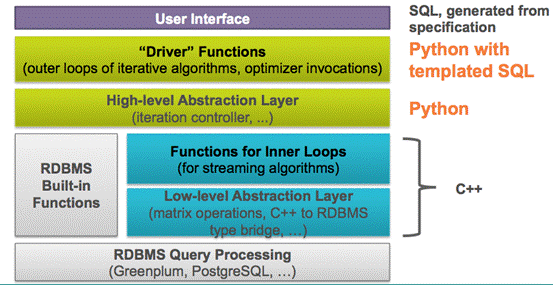
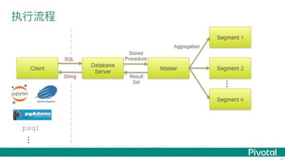
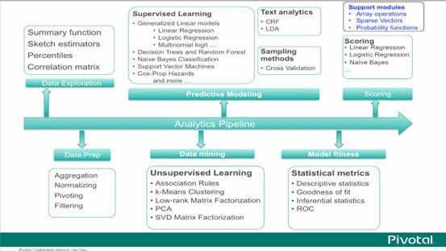

| 序号 | 修改时间   | 修改内容 | 修改人 | 审稿人 |
| ---- | ---------- | -------- | ------ | ------ |
| 1    | 2018-11-18 | 创建     | 吴启福 |   |
|      |       |     |   |   |
---

 

# 目录
```
[目录... 1](#_Toc2550155)
[1  AI框架概述... 2](#_Toc2550156)
[1.1   python常用AI库... 2](#_Toc2550157)
[1.1.1    科学计算常用库的方法... 2](#_Toc2550158)
[1.1.2    NLP. 3](#_Toc2550159)
[1.1.3    vision 计算机视觉... 4](#_Toc2550160)
[1.2   ML. 4](#_Toc2550161)
[1.3   本章参考... 5](#_Toc2550162)
[2  OpenCV. 5](#_Toc2550163)
[2.1   本章参考... 5](#_Toc2550164)
[3  Tensorflow.. 5](#_Toc2550165)
[3.1   简介... 5](#_Toc2550166)
[3.2   本章参考... 5](#_Toc2550167)
[4  大数据的机器学习库... 6](#_Toc2550168)
[4.1   Apache MADlib. 6](#_Toc2550169)
[4.1.1    MADlib架构... 6](#_Toc2550170)
[4.1.2    MADlib支持的模型类型... 7](#_Toc2550171)
[4.2   Apache Mahout. 8](#_Toc2550172)
[4.3   本章参考... 8](#_Toc2550173)
[5  DM工具... 8](#_Toc2550174)
[5.1   DM工具比较... 8](#_Toc2550175)
[5.2   weka. 10](#_Toc2550176)
[5.2.1    weka使用... 10](#_Toc2550177)
[5.2.2    Package Hierarchies. 11](#_Toc2550178)
[5.2.3    weka development. 12](#_Toc2550179)
[5.2.4    本节参考... 12](#_Toc2550180)
[5.3   RapidMiner. 12](#_Toc2550181)
[5.4   本章参考... 13](#_Toc2550182)
[参考资料... 13](#_Toc2550183)
```


# 1  AI框架概述
## 1.1     python常用AI库
表格 1 python常用AI库列表

| **类别**     | 库名                                                         | 介绍                                                         |
| ------------ | ------------------------------------------------------------ | ------------------------------------------------------------ |
| **机器学习** | numpy                                                        | 数学函数库，提供数组、一组与线性代数相关的函数以及傅里叶变换函数。 |
| pandas       | a powerful data  analysis and manipulation library for Python |                                                              |
| scipy        | 提供矩阵支持，以及矩阵相关的数值计算模块                     |                                                              |
|              | statsModels                                                  | 统计建模和计量经济学                                         |
|              | sckit-Learn                                                  | 强大的机器学习库，支持回归、分类、聚类。                     |
|              | keras                                                        | 深度学习库，用于建立神经网络以及深度学习模型。windows下速度会变慢。依赖库有numpy/scipy/theano。 |
|              | libsvm                                                       | 机器学习库，SVM                                              |
|              | Gensim                                                       | 用来作文本主题挖掘的库                                       |
|              | jieba                                                        | 中文分词                                                     |
|              | mmseg                                                        | 中文分词                                                     |
| **可视化**   | PIL                                                          | Python Imaging  Library，图像生成和处理库。  pillow          |
|              | matplotlib                                                   | 绘图库                                                       |
|              | wordcloud                                                    | 词云                                                         |


### 1.1.1  科学计算常用库的方法

表格 2 pandas库方法

| 功能       | 主要方法                                                | 备注                                             |
| ---------- | ------------------------------------------------------- | ------------------------------------------------ |
| 统计特征   | sum、mean var std corr cov skew kurt describe           | 统计学基础                                       |
| 拓展统计   | cumsum cumprod  cummax cmumin rolling_sum rolling_xxx   | 累积统计                                         |
| 统计作图   | plot pie hist boxplot  plot(logy=True) plot(yerr=error) | 饼图、拆线图、直方图、箱形图、对数图、误差条形图 |
| 数据预处理 | unique isnull  notnull                                  |                                                  |
|            |                                                         |                                                  |

表格 3 sklearn(scikit-learn)库方法

| 功能       | 函数                    | 主要方法或方法简介                                           | 备注     |
| ---------- | ----------------------- | ------------------------------------------------------------ | -------- |
| 分类       |                         | linear_model svm  tree ensemable naive_bayes                 | classify |
| 聚类       |                         | kmeans                                                       | cluster  |
|            | kmeans                  | K均值聚类                                                    |          |
|            | affinityPropagation     | 吸引力传播聚类，2007年提出，几乎优于所有其它方法，不需要指定聚类数，但运行效率低。 |          |
|            | meanshift               | 均值漂移聚类                                                 |          |
|            | spectralClustering      | 谱聚类                                                       |          |
|            | AgglomerativeClustering | 层次聚类                                                     |          |
|            | DBSCAN                  | 具有噪声的基于密度的聚类方法。                               |          |
|            | BIRCH                   | 综合的层次聚类算法，可以处理大规模数据的聚类。               |          |
| 数据预处理 | PCA                     | 主成分分析                                                   |          |


表格 4 其它科学计算库用途

| 函数名      | 函数功能     | 库名  |
| ----------- | ------------ | ----- |
| interpolate | 数据插值     | scipy |
| random      | 生成随机矩阵 | numpy |
|             |              |       |


### 1.1.2  NLP
处理人类语言问题的库。
*  NLTK -编写Python程序来处理人类语言数据的最好平台。
*  Pattern – Python的网络挖掘模块。他有自然语言处理工具，机器学习以及其它。
*  TextBlob – 为深入自然语言处理任务提供了一致的API。是基于NLTK以及Pattern的巨人之肩上发展的。
*  jieba – 中文分词工具。
*  SnowNLP – 中文文本处理库。
*  loso – 另一个中文分词库。
*  genius – 基于条件随机域的中文分词。
*  langid.py – 独立的语言识别系统。
*  Korean – 一个韩文形态库。
*  pymorphy2 – 俄语形态分析器（词性标注+词形变化引擎）。
*  PyPLN – 用Python编写的分布式自然语言处理通道。这个项目的目标是创建一种简单的方法使用NLTK通过网络接口处理大语言库。


### 1.1.3  vision 计算机视觉 

*  OpenCV – 开源计算机视觉库。
*  SimpleCV – 用于照相机、图像处理、特征提取、格式转换的简介，可读性强的接口（基于OpenCV）。
*  mahotas – 快速计算机图像处理算法（完全使用 C++ 实现），完全基于 numpy 的数组作为它的数据类型。


表格 5 计算机视觉常用库

| 库名       | 简介                                                         | 应用场景 |
| ---------- | ------------------------------------------------------------ | -------- |
| opencv     | 1999年由[Intel](https://baike.baidu.com/item/Intel)建立。基于BSD许可发行的跨平台计算机视觉库，可以运行在[Linux](https://baike.baidu.com/item/Linux)、[Windows](https://baike.baidu.com/item/Windows)和[Mac   OS](https://baike.baidu.com/item/Mac OS)操作系统上。 |          |
| tensorflow | [谷歌](https://baike.baidu.com/item/谷歌)基于DistBelief进行研发的第二代[人工智能](https://baike.baidu.com/item/人工智能/9180)[学习系统](https://baike.baidu.com/item/学习系统)，其命名来源于本身的运行原理。 |          |


## 1.2  ML框架

表格 6 AI主流框架比较

| 比较项   | Caffe         | Torch        | Theano          | TensorFlow     | MXNet             |
| -------- | ------------- | ------------ | --------------- | -------------- | ----------------- |
| 主语言   | C++/cuda      | C++/Lua/cuda | Python/c++/cuda | C++/cuda       | C++/cuda          |
| 从语言   | Python/Matlab | -            | -               | Python         | Python/R/Julia/Go |
| 硬件     | CPU/GPU       | CPU/GPU/FPGA | CPU/GPU         | CPU/GPU/Mobile | CPU/GPU/Mobile    |
| 分布式   | N             | N            | N               | Y              | Y                 |
| 速度     | 快            | 快           | 中等            | 中等           | 快                |
| 灵活性   | 一般          | 好           | 好              | 好             | 好                |
| 文档     | 全面          | 全面         | 中等            | 中等           | 全面              |
| 适合模型 | CNN           | CNN/RNN      | CNN/RNN         | CNN/RNN        | CNN/RNN?          |
| 操作系统 | 所有系统      | Linux, OSX   | 所有系统        | Linux, OSX     | 所有系统          |
| 命令式   | N             | Y            | N               | N              | Y                 |
| 声明式   | Y             | N            | Y               | Y              | Y                 |
| 接口     | protobuf      | Lua          | Python          | C++/Python     | Python/R/Julia/Go |
| 网络结构 | 分层方法      | 分层方法     | 符号张量图      | 符号张量图     | ?                 |

 

## 1.3     本章参考


# 2  OpenCV

OpenCV于1999年由[Intel](https://baike.baidu.com/item/Intel)建立，如今由Willow Garage提供支持。OpenCV是一个基于BSD许可[1]  （开源）发行的跨平台计算机视觉库，可以运行在[Linux](https://baike.baidu.com/item/Linux)、[Windows](https://baike.baidu.com/item/Windows)和[Mac OS](https://baike.baidu.com/item/Mac OS)操作系统上。它轻量级而且高效——由一系列 C 函数和少量 C++ 类构成，同时提供了Python、Ruby、MATLAB等语言的接口，实现了[图像处理](https://baike.baidu.com/item/图像处理)和计算机视觉方面的很多通用算法。最新版本是3.3 ，2017年8月3日发布。
OpenCV 拥有包括 500 多个C函数的跨平台的中、高层 API。它不依赖于其它的外部库——尽管也可以使用某些外部库。

## 2.1     本章参考
[1].     opencv https://baike.baidu.com/item/opencv 


# 3  Tensorflow

## 3.1     简介
​    TensorFlow是[谷歌](https://baike.baidu.com/item/谷歌)基于DistBelief进行研发的第二代[人工智能](https://baike.baidu.com/item/人工智能/9180)[学习系统](https://baike.baidu.com/item/学习系统)，其命名来源于本身的运行原理。Tensor（张量）意味着N维数组，Flow（流）意味着基于数据流图的计算，TensorFlow为张量从流图的一端流动到另一端计算过程。TensorFlow是将复杂的数据结构传输至人工智能神经网中进行分析和处理过程的系统。
​    TensorFlow可被用于[语音识别](https://baike.baidu.com/item/语音识别)或[图像识别](https://baike.baidu.com/item/图像识别)等多项机器深度学习领域，对2011年开发的深度学习基础架构DistBelief进行了各方面的改进，它可在小到一部智能手机、大到数千台数据中心服务器的各种设备上运行。TensorFlow将完全开源，任何人都可以用。
​    TensorFlow由谷歌[人工智能](https://baike.baidu.com/item/人工智能/9180)团队[谷歌大脑](https://baike.baidu.com/item/谷歌大脑/4649855)（Google Brain）开发和维护，拥有包括TensorFlow Hub、TensorFlow Lite、TensorFlow Research Cloud在内的多个项目以及各类[应用程序接口](https://baike.baidu.com/item/应用程序接口/10418844)API。自2015年11月9日起，TensorFlow依据[阿帕奇授权协议](https://baike.baidu.com/item/阿帕奇授权协议/1642155)（Apache 2.0 open source license）开放源代码。

**什么是张量(tensor)**
对于张量这个概念的理解很不容易。我看介绍TensorFlow的说明上说张量就是N维数组，百度百科上说它是一个可用来表示在一些矢量、标量和其他张量之间的线性关系的多线性函数。在不同的领域，张量有不同的理解。我认为这句话讲得比较好：张量是不随坐标系而改变的物理系统内在的量。在机器视觉领域，我个人理解为在不同坐标系/参考系下变的CV特征。


## 3.2   本章参考

[1].     TensorFlow中文社区  http://www.tensorfly.cn/


# 4  大数据的机器学习库

表格 7 大数据的机器学习库

|                                            | 语言 | 简介                                                         | 特性                                                    |
| ------------------------------------------ | ---- | ------------------------------------------------------------ | ------------------------------------------------------- |
| Apache [MADlib](http://madlib.apache.org/) | Java | Pivotal公司与伯克利大学合作开发的一个开源机器学习库,提供了多种数据转换、数据探索、统计、数据挖掘和机器学习方法。  2015年7月开始孵化；2018.5，成为Apache TLP。  其当前最新版本为MADlib 1.12。 | 可以与PostgreSQL、Greenplum和HAWQ等数据库系统无缝集成。 |
| Apache Mahout                              | Java | Apache 上的旗舰机器学习框架。Mahout 可用来进行分类、聚类和推荐。 | 支持Spark SQL                                           |


## 4.1   Apache MADlib

MADlib具有与上述工具完全不同的设计理念，它不是面向程序员的，而是面向数据库开发或DBA的。如果用一句话说明什么是MADlib，那就是“SQL中的大数据机器学习库”。
### 4.1.1  MADlib架构

图 1 MADlib架构
MADlib系统架构自上至下由以下四个主要组件构成：
*  Python调用SQL模板实现的驱动函数
*  Python实现的高级抽象层
*  C++实现的核心函数
*  C++实现的低级数据库抽象层


**设计思想**
驱动MADlib架构的主要设计思想与Hadoop是一致的，体现在以下方面：

*  操作数据库内的本地数据，不在多个运行时环境中进行不必要的数据移动。
*  充分利用数据库引擎功能，但将数据挖掘逻辑从特定数据库的实现细节中分离出来。
*  利用MPP无共享技术提供的并行性和可扩展性，如Greenplum或HAWQ数据库系统。
*  执行的维护活动对Apache社区和正在进行的学术研究开放。


图 2 madlib


### 4.1.2  MADlib支持的模型类型

   MADlib支持以下常用的数据挖掘与机器学习模型类型，其中大部分模型都包含训练和预测两组函数。
支持的模型有：回归、分类、聚类、关联规则挖掘、主题建模、描述性统计和模型验证。


图 3 MADlib功能

## 4.2     Apache Mahout


## 4.3  本章参考

[1].     madlib http://madlib.apache.org/
[2].     Greenplum上的机器学习——MADlib简介与应用实例 http://blog.sina.com.cn/s/blog_12c856e4c0102yjem.html 
[3].     用SQL玩转数据挖掘之MADlib（一）——安装https://www.cnblogs.com/chenergougou/p/7107985.html
[4].     MADlib——基于SQL的数据挖掘解决方案（2）——MADlib基础 https://blog.csdn.net/wzy0623/article/details/78845020 


# 5  DM工具

## 5.1     DM工具比较
表格 8 DM工具比较1

| 工具名 | 功能                                                         | 特点                                                         | 适用场景                                                     |
| ------ | ------------------------------------------------------------ | ------------------------------------------------------------ | ------------------------------------------------------------ |
| MATLAB | 不仅具有较强的数据统计、科学计算功能，还具有金融、经济等众多的行业应用工具箱。 | 擅长矩阵计算和仿真模拟；  具有丰富的数学函数，适合算法开发或自主的程序开发；  具有强大的绘图功能。 | 适合学习研究算法和灵活的产品开发。                           |
| SAS    | 功能强大的统计分析软件。                                     | 具有较强的大数据处理能力；  支持二次开发。                   | 有一些行业标准，适合工业使用。                               |
| SPSS   | 侧重统计分析。                                               | 使用方便，但不适合自己开发代码，就是说扩展上受限，如果要求不高，已经足够。 | 界面友好，使用简单，但功能强大，也可以编程，能解决大部分统计学问题，适合初学者。 |
| WEKA   | 具有丰富数据挖掘函数，包括分类、聚类、关联分析等主流算法。   | Java开发的开源数据分析、机器学习工具。                       | 适合于具有一定程序开发经验的工程师，尤其适合于用Java进行二次开发。 |
| R      | 类似MATLAB，具有丰富的数学和统计分析函数。                   | 开源并支持二次开发。                                         | 适合算法学习、小项目的产品研发。                             |


表格 9 数据挖掘常用工具

| 工具       | 简介                                                         |
| ---------- | ------------------------------------------------------------ |
| TipDM      | (顶尖数据挖掘平台)使用JAVA语言开发，能从各种数据源获取数据，建立各种不同的数据挖掘模型（目前已集成数十种预测算法和分析技术，基本覆盖了国外主流挖掘系统支持的算法）。工具支持数据挖掘流程所需的主要过程：数据探索（相关性分析、主成分分析、周期性分析）；数据预处理（属性选择、特征提取、坏数据处理、空值处理）；预测建模（参数设置、交叉验证、模型训练、模型验证、模型预测）；聚类分析、关联规则挖掘等一系列功能。 |
| RapidMiner | 也叫YALE，提供了图形化界面，采用了类似Windows资源管理器中的树状结构来组织分析组件，树上每个节点表示不同的运算符（operator）。YALE中提供了大量的运算符，包括数据处理、变换、探索、建模、评估等各个环节。YALE是用Java开发的，基于Weka来构建，也就是说它可以调用Weka中的各种分析组件。 |
| KNIME      | (Konstanz  InformationMiner)，基于Java开发的，可以扩展使用Weka中的挖掘算法。KNIME采用的是类似数据流（data flow）的方式来建立分析挖掘流程，挖掘流程由一系列功能节点组成，每个节点有输入/输出端口，用于接收数据或模型、导出结果。 |
| WEKA       | Waikato  Environment for Knowledge Analysis，是一款知名度较高的开源机器学习和数据挖掘软件。高级用户可以通过Java编程和命令行来调用其分析组件。同时，WEKA也为普通用户提供了图形化界面，称为WEKA Knowledge Flow Environment和WEKA Explorer，可以实现预处理、分类、聚类、关联规则、文本挖掘、可视化等。 |


## 5.2     weka

### 5.2.1  weka使用
**简介**
WEKA的全名是怀卡托智能分析环境（Waikato Environment for Knowledge Analysis），同时weka也是新西兰的一种鸟名，而WEKA的主要开发者来自新西兰。

WEKA作为一个公开的数据挖掘工作平台，集合了大量能承担数据挖掘任务的机器学习算法，包括对数据进行预处理，分类，回归、聚类、关联规则以及在新的交互式界面上的可视化。

**数据格式**
WEKA存储数据的格式是ARFF（Attribute-Relation File Format）文件，这是一种ASCII文本文件。示例如下：
```
% ARFF file for the weather data with some numric features`
 `%`
 `@relation weather
@attribute outlook {sunny, overcast, rainy}`
 `@attribute temperature real
@data`
 `% 3 instances`
 `sunny,85,85,FALSE,no`
 `sunny,80,90,TRUE,no`
 `overcast,83,86,FALSE,yes
```
`说明：如上所示，一个数据集类似一个``excel``表格，列为``attribute,``行为``data``或``instance. attribute``声明格式为`@attribute <attribute-name> <datatype>，datatype有4种，分别是numberic, norminal, string, date。

**1）数据预处理preprocess**
包括属性离散化Discretize, 过滤filter等。

**2）关联规则（购物篮分析）**Associate
默认关联规则分析是用Apriori算法. 

**3）分类与回归 Classification & Regression**
在WEKA中，待预测的目标（输出）被称作Class属性，这应该是来自分类任务的“类”。一般的，若Class属性是分类型时我们的任务才叫分类，Class属性是数值型时我们的任务叫回归。分类质量指标：P（正确度），R（召回率），F值。
*  训练集trainset: 用来建立模型
*  测试集testset: 用来验证模型
*  测试：模型建立后，若用训练集进行验证，叫封闭测试；若用测试集验证，则为开放测试。
*  模型：训练后得到的模型，包括算法，各类参数等

**常用算法**：NB…
**运行结果分析：**
//说明：正确率，越大越好
Correctly Classified Instances     25     50      % 

**1)聚类分析cluster**
有以下度量：
*  空间距离
*  欧氏距离：通常用于数值的属性。
**常用算法**：KNN…
**运行结果分析：**
//说明：衡量标准，越小越好
Within cluster sum of squared errors: 540.7387788014682 

**2)命令行工具simple CLT**
```sh
//-p [num]指被预测属性的位置; -l 模型路径; -T 测试集路径; -t 训练集路径 -d 生成模型路径
//trainset
java weka.classifiers.trees.J48 -C 0.25 -M 2 -t D:\my_install\Weka-3-6\data-test\bank.arff -d D:\my_install\Weka-3-6\data-test\bank.model 
//testset：
java weka.classifiers.trees.J48 -p 9 -l D:\my_install\Weka-3-6\data-test\bank.model -T D:\my_install\Weka-3-6\data-test\bank-test.arff
```

### 5.2.2  Package Hierarchies

|   Packages                | Desc           |
| ------------------------------------------------------------ | ----------------------------- |
| [weka.associations](http://weka.sourceforge.net/doc/weka/associations/package-summary.html) | 关联规则, 缺省使用Apriori算法 |
| [weka.associations.tertius](http://weka.sourceforge.net/doc/weka/associations/tertius/package-summary.html) |           |
| [weka.attributeSelection](http://weka.sourceforge.net/doc/weka/attributeSelection/package-summary.html) |           |
| [weka.classifiers](http://weka.sourceforge.net/doc/weka/classifiers/package-summary.html) | 分类器         |
| [weka.classifiers.bayes](http://weka.sourceforge.net/doc/weka/classifiers/bayes/package-summary.html) | 贝叶斯方法：native, net  |
| [weka.classifiers.evaluation](http://weka.sourceforge.net/doc/weka/classifiers/evaluation/package-summary.html) |           |
| [weka.classifiers.functions](http://weka.sourceforge.net/doc/weka/classifiers/functions/package-summary.html) |           |
| [weka.classifiers.functions.neural](http://weka.sourceforge.net/doc/weka/classifiers/functions/neural/package-summary.html) |           |
| [weka.classifiers.functions.pace](http://weka.sourceforge.net/doc/weka/classifiers/functions/pace/package-summary.html) |           |
| [weka.classifiers.functions.supportVector](http://weka.sourceforge.net/doc/weka/classifiers/functions/supportVector/package-summary.html) | SVM            |
| [weka.classifiers.lazy](http://weka.sourceforge.net/doc/weka/classifiers/lazy/package-summary.html) |           |
| [weka.classifiers.meta](http://weka.sourceforge.net/doc/weka/classifiers/meta/package-summary.html) |           |
| [weka.classifiers.misc](http://weka.sourceforge.net/doc/weka/classifiers/misc/package-summary.html) |           |
| [weka.classifiers.rules](http://weka.sourceforge.net/doc/weka/classifiers/rules/package-summary.html) |           |
| [weka.classifiers.trees](http://weka.sourceforge.net/doc/weka/classifiers/trees/package-summary.html) |           |
| [weka.classifiers.trees.adtree](http://weka.sourceforge.net/doc/weka/classifiers/trees/adtree/package-summary.html) | 决策树Dtree算法     |
| [weka.classifiers.trees.j48](http://weka.sourceforge.net/doc/weka/classifiers/trees/j48/package-summary.html) |           |
| [weka.classifiers.trees.lmt](http://weka.sourceforge.net/doc/weka/classifiers/trees/lmt/package-summary.html) |           |
| [weka.classifiers.trees.m5](http://weka.sourceforge.net/doc/weka/classifiers/trees/m5/package-summary.html) |           |
|                      |           |
| [weka.clusterers](http://weka.sourceforge.net/doc/weka/clusterers/package-summary.html) | 包括SimpleKMeans算法     |
| [weka.core](http://weka.sourceforge.net/doc/weka/core/package-summary.html) |           |
| [weka.filters](http://weka.sourceforge.net/doc/weka/filters/package-summary.html) |           |
| [weka.gui](http://weka.sourceforge.net/doc/weka/gui/package-summary.html) |           |

### 5.2.3  weka development
在WEKA的安装目录中找到weka-src.jar，用winrar之类的解压缩软件打开，即是一个完好的JAVA Application项目。主类可选择weka.gui.GUIChoosew然后出现二进制程序所显示的界面了。
开发示例：http://weka.wikispaces.com/MessageClassifier 
在classpath未设置好的情况下，编码和运行需指定classpath, 如下：

```shell
# compile:  
## classpath: –classpath ./weka.jar;./
$java –classpath ./weka.jar;./ MessageClassifier -m email1.txt -c miss -t messageclassifier.model

# training:
java MessageClassifier -m email1.txt -c miss -t messageclassifier.model

# classify:
java MessageClassifier -m email1023.txt -t messageclassifier.model
```

### 5.2.4  本节参考
[1].     http://rapid-i.com/content/view/64/74/lang,en/
[2].     http://www.cs.waikato.ac.nz/~ml/index.html
[3].     http://forum.wekacn.org/viewtopic.php?f=2&t=9 
[4].     weka学习总结 http://www.sciencenet.cn/m/user_content.aspx?id=262955


## 5.3  RapidMiner 

[RapidMiner](http://rapid-i.com/)是世界领先的数据挖掘解决方案，在一个非常大的程度上有着先进技术。它数据挖掘任务涉及范围广泛，包括各种数据艺术，能简化数据挖掘过程的设计和评价。
**功能和特点**
*  免费提供数据挖掘技术和库
*  100%用Java代码（可运行在操作系统）
*  数据挖掘过程简单，强大和直观
*  内部XML保证了标准化的格式来表示交换数据挖掘过程
*  可以用简单脚本语言自动进行大规模进程
*  多层次的数据视图，确保有效和透明的数据
*  图形用户界面的互动原型
*  命令行（批处理模式）自动大规模应用
*  Java API（应用编程接口）
*  简单的插件和推广机制
*  强大的可视化引擎，许多尖端的高维数据的可视化建模
*  400多个数据挖掘运营商支持
*  耶鲁大学已成功地应用在许多不同的应用领域，包括文本挖掘，多媒体挖掘，功能设计，数据流挖掘，集成开发的方法和分布式数据挖掘。


## 5.4     本章参考


# 参考资料