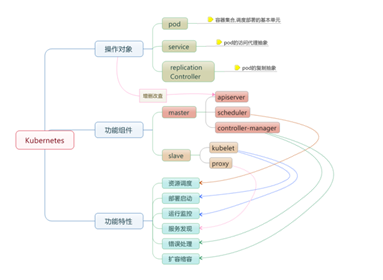
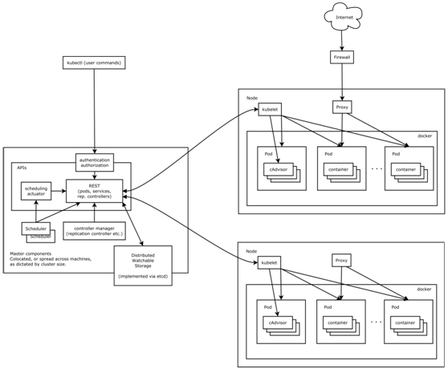
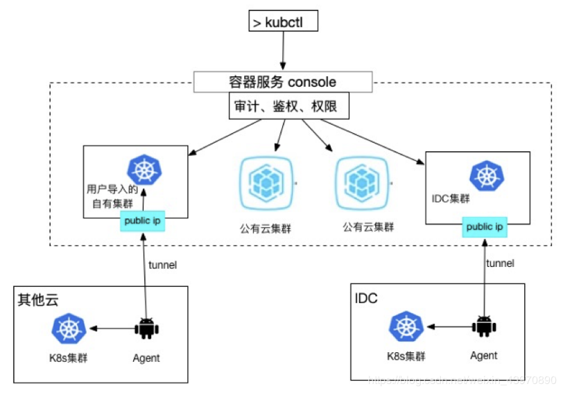

| 序号 | 修改时间 | 修改内容                     | 修改人 | 审稿人 |
| ---- | -------- | ---------------------------- | ------ | ------ |
| 1    | 2018-8-4 | 创建。从《微服务架构》拆分。 | 吴启福 |        |
|   2   |   2019-12-28       | Docker章节迁移另文。                           |  同上      |        |
---


# 目录

[目录... 1](#_Toc25398466)

[1       CNCF项目列表... 4](#_Toc25398467)

[2       容器部署 Docker. 5](#_Toc25398468)

[2.7        本章参考... 22](#_Toc25398483)

[3       Kubernetes. 23](#_Toc25398484)

[3.1        概述... 23](#_Toc25398485)

[3.1.1         简介... 23](#_Toc25398486)

[3.1.2         K8s术语... 25](#_Toc25398487)

[3.2        架构篇... 27](#_Toc25398488)

[3.2.1         Borg. 27](#_Toc25398489)

[3.2.2         Kubernetes架构... 28](#_Toc25398490)

[3.2.3         多集群架构... 31](#_Toc25398491)

[3.3        安装篇... 31](#_Toc25398492)

[3.3.1         安装准备... 32](#_Toc25398493)

[3.3.2         本地Docker方案... 33](#_Toc25398494)

[3.3.3         vagrant创建单节点集群... 34](#_Toc25398495)

[3.4        使用篇... 35](#_Toc25398496)

[3.4.1         kubectl 35](#_Toc25398497)

[3.5        本章参考... 35](#_Toc25398498)

[4       Prometheus. 35](#_Toc25398499)

[4.1        架构... 36](#_Toc25398500)

[4.2        本章参考... 37](#_Toc25398501)

[5       gRPC. 38](#_Toc25398502)

[5.1        简介... 38](#_Toc25398503)

[5.2        架构... 39](#_Toc25398504)

[5.3        本章参考... 39](#_Toc25398505)

[6       Etcd. 39](#_Toc25398506)

[6.1        本章参考... 40](#_Toc25398507)

[7       Istio. 40](#_Toc25398508)

[参考资料... 40](#_Toc25398509)

 

[TOC]


---


# 1 CNCF项目列表

CNCF（Cloud Native Computing Foundation）于 2015 年 7 月成立，隶属于 Linux 基金会，初衷围绕“云原生”服务云计算，致力于维护和集成开源技术，支持编排容器化微服务架构应用。

CNCF 还帮助项目建立了治理结构。CNCF 提出了成熟度级别的概念：沙箱、孵化和毕业。这些级别分别对应下图中的创新者、早期采用者和早期大众。

 

表格 1 CNCF项目列表

|      | 项目        | 简介                                                         | 备注                          |
| ---- | ----------- | ------------------------------------------------------------ | ----------------------------- |
| 2015 | Kubernetes  | google于2014年创建，2015年开源，集群中管理跨多台主机容器化应用的开源系统； | K8S最热门的容器编排平台。     |
|      | Prometheus  | SoundCloud于2012年创建。专注于时间序列数据，为客户端依赖及第三方数据消费提供广泛集成支持的开源监控解决方案； | 系统及服务监控工具。          |
|      | OpenTracing | 与厂商无关的分布式追踪开源标准；                             |                               |
|      | Fluentd     | 创建统一日志层的开源数据收集器。                             | ElasticSearch公司开源。       |
| 2017 | Linkerd     | 为微服务提供可靠性支持、自动化负载均衡、服务发现和运行时可恢复性的开源“服务网格”项目 | 优步创建。   透明式服务网络。 |
|      | gRPC        | google开源，现代化高性能开源远程调用框架                     |                               |
|      | CoreDNS     | 快速灵活的构建 DNS 服务器的方案                              |                               |
|      | rkt         | 帮助开发者打包应用和依赖包，简化搭环境等部署工作，提高容器安全性和易用性的容器引擎。 | Pod原生容器引擎。             |
| ?    | Envoy       | 为云原生应用程序设计的开源边缘和服务代理。Envoy是一种高性能C++分布式代理，专为单一服务和应用程序设计，还是一种为大型微服务服务网格架构设计的通信总线和通用数据平面。 | Lyft创建。                    |
|      | Jaeger      | 开源端到端分布式跟踪系统。                                   | 分布式跟踪。                  |
|      | Helm        | Kubernetes的包管理器。                                       |                               |
|      | Etcd        | 可靠的分布式键值存储项目，可用于存储分布式系统中关键的数据。 | 分布式键值存储                |
|      | CRI-O       | 遵守开放容器倡议(OCI)的情况下实现了Kubernetes运行时接口。    | 针对K8s的轻量运行时           |
| 2019 | KubeEdge    | 3月，华为云开源智能边缘项目KubeEdge加入CNCF社区，成为CNCF在智能边缘领域的首个正式项目。 |                               |

备注：

 

# 2 容器Docker

详见 [Docker用户手册](../toolbox.工具/Docker用户手册.md)


# 3 Kubernetes

## 3.1  概述

### 3.1.1  简介

​         **Kubernetes**的名字来自希腊语，意思是“*舵手**”* 或 “*领航员”*。*K8s*是将8个字母“ubernete”替换为“8”的缩写。是一个开源的，用于管理云平台中多个主机上的容器化的应用，Kubernetes的目标是让部署容器化的应用简单并且高效（powerful）,Kubernetes提供了应用部署，规划，更新，维护的一种机制。

​         Kubernetes是Google 2014年创建管理的，是Google 10多年大规模容器管理技术Borg的开源版本。    

​         在Kubernetes中，我们可以创建多个容器，每个容器里面运行一个应用实例，然后通过内置的负载均衡策略，实现对这一组应用实例的管理、发现、访问，而这些细节都不需要运维人员去进行复杂的手工配置和处理。

​         Kubernetes 属于主从的分布式集群架构，包含 Master 和 Node：Master 作为控制节点，调度管理整个系统；Node 是运行节点，运行业务容器。

 

**Kubernetes** **特点**

*  可移植: 支持公有云，私有云，混合云，多重云（multi-cloud）

*  可扩展: 模块化，插件化，可挂载，可组合

*  自动化: 自动部署，自动重启，自动复制，自动伸缩/扩展

 

**容器优势总结：**

- 快速创建/部署应用：与VM虚拟机相比，容器镜像的创建更加容易。
- 持续开发、集成和部署：提供可靠且频繁的容器镜像构建/部署，并使用快速和简单的回滚(由于镜像不可变性)。
- 开发和运行相分离：在build或者release阶段创建容器镜像，使得应用和基础设施解耦。
- 开发，测试和生产环境一致性：在本地或外网（生产环境）运行的一致性。
- 云平台或其他操作系统：可以在 Ubuntu、RHEL、 CoreOS、on-prem、Google      Container Engine或其它任何环境中运行。
- Loosely coupled，分布式，弹性，微服务化：应用程序分为更小的、独立的部件，可以动态部署和管理。
- 资源隔离
- 资源利用：更高效

 

 

 

   图 4 K8s组件


### 3.1.2  K8s术语

表格 4 K8s关键术语


| 名词                   | 释义                                                         | 设计理念                                                     |
| ---------------------- | ------------------------------------------------------------ | ------------------------------------------------------------ |
| API对象                | K8s集群中的管理操作单元。K8s集群系统每支持一项新功能，引入一项新技术，一定会新引入对应的API对象，支持对该功能的管理操作。 | K8s中所有的配置都是通过API对象的spec去设置的。即所有的操作都是声明式（Declarative）的而不是命令式（Imperative）的。 |
| Pod                    | 微服务。K8s集群中运行部署应用或服务的最小单元，它是可以支持多容器的。Pod是K8s集群中所有业务类型的基础，可以看作运行在K8s集群中的小机器人，不同类型的业务就需要不同类型的小机器人去执行。 | 支持多个容器在一个Pod中共享网络地址和文件系统，可以通过进程间通信和文件共享这种简单高效的方式组合完成服务。 |
| 复制控制器 RC          | （Replication Controller，RC），RC是K8s集群中最早的保证Pod高可用的API对象。 | 通过监控运行中的Pod来保证集群中运行指定数目的Pod副本（1~多个）。 |
| 副本集 RS              | （Replica Set，RS）新一代RC，提供同样的高可用能力，区别主要在于RS后来居上，能支持更多种类的匹配模式。 | 副本集对象一般不单独使用，而是作为Deployment的理想状态参数使用。 |
| 部署(Deployment)       | 部署表示用户对K8s集群的一次更新操作。部署是一个比RS应用模式更广的API对象，可以是创建/更新/滚动升级新服务 |                                                              |
| 服务（Service）        | 在K8s集群中，客户端需要访问的服务就是Service对象。在K8s集群中微服务的负载均衡是由Kube-proxy实现的。 | 每个Service会对应一个集群内部有效的虚拟IP，集群内部通过虚拟IP访问一个服务。 |
| 任务（Job）            | Job是K8s用来控制批处理型任务的API对象。                      | Job管理的Pod根据用户的设置把任务成功完成就自动退出了。       |
| 后台支撑服务集         | （DaemonSet）后台支撑型服务的核心关注点在K8s集群中的节点（物理机或虚拟机），要保证每个节点上都有一个此类Pod运行。 |                                                              |
| 有状态服务集（PetSet） | PetSet用来控制有状态服务，PetSet中的每个Pod的名字都是事先确定的，不能更改。 | 适合于PetSet的业务包括数据库服务MySQL和PostgreSQL，集群化管理服务Zookeeper、etcd等有状态服务。 |
| 集群联邦               | （Federation）为提供跨Region跨服务商K8s集群服务而设计的。    |                                                              |
| 存储卷                 | （Volume）K8s的存储卷的生命周期和作用范围是一个Pod。         |                                                              |
|                        | 持久存储卷（Persistent Volume，PV）和持久存储卷声明（Persistent Volume Claim，PVC） |                                                              |
| 节点（Node）           | K8s集群中的计算能力由Node提供。 Node可以是物理机也可以是虚拟机。 | K8s集群中的Node也就等同于Mesos集群中的Slave节点，是所有Pod运行所在的工作主机。 |
| 名字空间（Namespace）  | 名字空间为K8s集群提供虚拟的隔离作用，K8s集群初始有两个名字空间，分别是默认名字空间default和系统名字空间kube-system | 管理员可以可以创建新的名字空间满足需要。                     |
| RBAC访问授权           | 基于角色的访问控制（Role-based Access Control，RBAC）的授权模式。RBAC主要是引入了角色（Role）和角色绑定（RoleBinding）的抽象概念。 | RBAC中，访问策略可以跟某个角色关联，具体的用户在跟一个或多个角色相关联 |
|                        |                                                              |                                                              |

备注：其它常用术语还有密钥对象（Secret）、用户帐户（User Account）和服务帐户（Service Account）。从K8s的系统架构、技术概念和设计理念，我们可以看到K8s系统最核心的两个设计理念：一个是容错性，一个是易扩展性。容错性实际是保证K8s系统稳定性和安全性的基础，易扩展性是保证K8s对变更友好，可以快速迭代增加新功能的基础。

1. API对象。每个API对象都有3大类属性：元数据metadata、规范spec和状态status。  
   1. 元数据是用来标识API对象的，每个对象都至少有3个元数据：namespace，name和uid；除此以外还有各种各样的标签labels用来标识和匹配不同的对象，例如用户可以用标签env来标识区分不同的服务部署环境，分别用env=dev、env=testing、env=production来标识开发、测试、生产的不同服务。
   2. 规范描述了用户期望K8s集群中的分布式系统达到的理想状态（Desired State），例如用户可以通过复制控制器Replication Controller设置期望的Pod副本数为3；
   3. status描述了系统实际当前达到的状态（Status），例如系统当前实际的Pod副本数为2；那么复制控制器当前的程序逻辑就是自动启动新的Pod，争取达到副本数为3。

2. Pod: 目前K8s中的业务主要可以分为长期伺服型（long-running）、批处理型（batch）、节点后台支撑型（node-daemon）和有状态应用型（stateful application）；分别对应的小机器人控制器为Deployment、Job、DaemonSet和PetSet.

3. RC、RS和Deployment只是保证了支撑服务的微服务Pod的数量，但是没有解决如何访问这些服务的问题。Service解决服务访问的问题。RC和RS主要是控制提供无状态服务的，其所控制的Pod的名字是随机设置的，名字不重要，重要的是Pod总数。
4. 在云计算环境中，服务的作用距离范围从近到远一般可以有：同主机（Host，Node）、跨主机同可用区（Available Zone）、跨可用区同地区（Region）、跨地区同服务商（Cloud Service Provider）、跨云平台。K8s的设计定位是单一集群在同一个地域内，因为同一个地区的网络性能才能满足K8s的调度和计算存储连接要求。而联合集群服务就是为提供跨Region跨服务商K8s集群服务而设计的。


## 3.2  架构篇

### 3.2.1  Borg

Borg是谷歌内部的大规模集群管理系统，负责对谷歌内部很多核心服务的调度和管理。Borg的目的是让用户能够不必操心资源管理的问题，让他们专注于自己的核心业务，并且做到跨多个数据中心的资源利用率最大化。

Borg主要由BorgMaster、Borglet、borgcfg和Scheduler组成，如下图所示

   

图 5 google_Borg架构

*  BorgMaster是整个集群的大脑，负责维护整个集群的状态，并将数据持久化到Paxos存储中；

*  Scheduer负责任务的调度，根据应用的特点将其调度到具体的机器上去；

*  Borglet负责真正运行任务（在容器中）；

*  borgcfg是Borg的命令行工具，用于跟Borg系统交互，一般通过一个配置文件来提交任务。

### 3.2.2  Kubernetes架构

Kubernetes借鉴了Borg的设计理念，比如Pod、Service、Labels和单Pod单IP等。Kubernetes的整体架构跟Borg非常像，如下图所示

   

图 6 Kubernetes架构


备注：K8s master由四部分组成，分别是API Server、Scheduler、Controller和etcd。

   

Kubernetes主要由以下几个核心组件组成：

*  etcd保存了整个集群的状态；
*  apiserver提供了资源操作的唯一入口，并提供认证、授权、访问控制、API注册和发现等机制；
*  controller manager负责维护集群的状态，比如故障检测、自动扩展、滚动更新等；
*  scheduler负责资源的调度，按照预定的调度策略将Pod调度到相应的机器上；
*  kubelet负责维护容器的生命周期，同时也负责Volume（CVI）和网络（CNI）的管理；
*  Container runtime负责镜像管理以及Pod和容器的真正运行（CRI）；
*  kube-proxy负责为Service提供cluster内部的服务发现和负载均衡；

除了核心组件，还有一些推荐的Add-ons：

*  kube-dns负责为整个集群提供DNS服务
*  Ingress Controller为服务提供外网入口
*  Heapster提供资源监控
*  Dashboard提供GUI
*  Federation提供跨可用区的集群
*  Fluentd-elasticsearch提供集群日志采集、存储与查询


**分层架构**

Kubernetes设计理念和功能其实就是一个类似Linux的分层架构，如下图所示

   

图 7 K8s分层架构

- 核心层：Kubernetes最核心的功能，对外提供API构建高层的应用，对内提供插件式应用执行环境

- 应用层：部署（无状态应用、有状态应用、批处理任务、集群应用等）和路由（服务发现、DNS解析等）

- 管理层：系统度量（如基础设施、容器和网络的度量），自动化（如自动扩展、动态Provision等）以及策略管理（[RBAC](http://docs.kubernetes.org.cn/148.html)、Quota、PSP、NetworkPolicy等）

- 接口层：[kubectl命令行工具](http://docs.kubernetes.org.cn/61.html)、客户端SDK以及集群联邦

- 生态系统：在接口层之上的庞大容器集群管理调度的生态系统，可以划分为两个范畴 

- - Kubernetes外部：日志、监控、配置管理、CI、CD、Workflow、FaaS、OTS应用、ChatOps等
  - Kubernetes内部：CRI、CNI、CVI、镜像仓库、Cloud Provider、集群自身的配置和管理等

 

### 3.2.3  多集群架构

*  全世界数据中心的统一 API

*  多集群时代的 “ The Platform for Platform”

 

Kubernetes 和它所推崇的声明式[容器编排与管理体系](https://yq.aliyun.com/go/articleRenderRedirect?url=https%3A%2F%2Fwww.infoq.cn%2Farticle%2FR1p3H3_29f4TYImExsyw)，让软件交付本身变得越来越标准化和统一化，并且实现了与底层基础设施的完全解耦；而另一方面，云原生技术体系在所有公有云和大量数据中心里的落地，使得软件面向一个统一的 API 实现“一次定义，到处部署”成为了可能。

Kubernetes 项目的本质其实是 Platform for Platform，也就是一个用来构建“平台”的“平台”。 相比于 Mesos 和 Swarm 等容器管理平台，Kubernetes 项目最大的优势和关注点，在于它始终专注于如何帮助用户基于 Kubernetes 的声明式 API ，快速、便捷的构建健壮的分布式应用，并且按照统一的模型（容器设计模式和控制器机制）来驱动应用的实际状态向期望状态逼近和收敛。

   

图 8 多集群 K8s 隧道架构

如图所示，其核心分为两层，下层是被托管的集群，在其中会有一个 Agent，Agent 一方面在被托管的集群中运行，可以轻易的在内网访问被托管的集群，另一方面它通过公网与公有云接入层中的节点 (Stub) 构建一个隧道 (tunnel)。在上层，用户通过公有云统一的方式接入审计、鉴权、权限相关功能，通过访问 Stub，再通过隧道由 Agent 向用户自己的 Kubernetes 集群转发命令。

## 3.3  安装篇

工具Vagrant & VirtualBox 详见 《运维专题》


### 3.3.1  安装准备

Kubernetes可以在多种平台运行，从笔记本电脑，到云服务商的虚拟机，再到机架上的裸机服务器。要创建一个Kubernetes集群，根据不同场景需要做的也不尽相同，可能是运行一条命令，也可能是配置自己的定制集群。

*  本地服务器方案：包括三种，分别是本地Docker、Vagrant和无虚拟机本地集群（Linux）。基于Docker的本地方案：是众多能够完成快速搭建的本地集群方案中的一种，但是局限于单台机器。
*  托管解决方案（如Google Container Engine）是最容易搭建和维护的。当你准备好扩展到多台机器和更高可用性时。
*  全套云端方案（如AWS、Azure等）：只需要少数几个命令就可以在更多的云服务提供商搭建Kubernetes。
*  定制方案 需要花费更多的精力，但是覆盖了从零开始搭建Kubernetes集群的通用建议到分步骤的细节指引。


表格 5 Kubernatess发行版

| 发行版                                                       | 简介                                                         | 许可和定价模型                             | 安装                                                         |
| ------------------------------------------------------------ | ------------------------------------------------------------ | ------------------------------------------ | ------------------------------------------------------------ |
| 原版开源 Kubernetes                                          | Kubernetes 由 Cloud Native Computing Foundation（云原生计算资金会）和 Kubernetes 用户组成的多样化社区支持，也是第一个从 CNCF 毕业的项目。 | 开源且 100％免费                           |                                                              |
| 红帽 [OpenShift](https://www.redhat.com/en/technologies/cloud-computing/openshift) | 在 Kubernetes 之前，OpenShift 作为一个单独项目并使用完全不同的技术运行。后来，红帽意识到 Kubernetes 的能力越来越强大，因此在第 3 版中明智地将其作为 OpenShift 的核心。 | 三种定价模式：                             | 不是很复杂，但需要特定配置。                                 |
| CoreOS  [Tectonic](https://coreos.com/tectonic/)             | 由 CoreOS 创建，CoreOS 是一家致力于发展容器技术公司，但已被红帽收购，目前正在与红帽集成。优势功能如下：易于设置、用户友好的 Web UI、用户管理 对供应商的支持 | 拥有商业许可模式，最多可免费提供 10 个节点 | 可以通过安装程序或 Terraform 安装。                          |
| Stackube                                                     | 以 Kubernetes 为中心的 OpenStack 发行版。可根据所用容器运行时环境提供不同程度的多租户机制，用户可选择 Docker 或者虚拟机进行配置。 | KDC 和 Containerum 平台都是 100％开源      | 设置相对容易                                                 |
| [Rancher](https://rancher.com/kubernetes/)                   | 包含 Kubernetes 的容器管理平台。主要特点如下：跨供应商集群部署、用户管理 Web、用户界面、集成CI/CD管道。 | 100％开源，该公司可提供咨询和支持服务      | 可使用名为 RKE 的 Kubernetes 安装工具。                      |
| Canonical  Distribution of Kubernetes（[CDK](https://ubuntu.com/kubernetes)） | 由 Linux 发行版 Ubuntu 背后的公司 Canonical 支持，相当于是一个可在主流公有云提供商和 OpenStack 等私有云解决方案上轻松部署的  vanilla Kubernetes，能够轻松设置并管理跨供应商的 Kubernetes 集群，用户界面是官方 Kubernetes 仪表板。 | 完全免费。但是，每个虚拟节点有几个支持包   | 可使用 Canonical 开发的部署工具 Conjure-up 或 Juju 来完成安装。 |
| [Docker ](https://www.docker.com/products/kubernetes)社区版 /企业版 | Docker  Enterprise 3.0添加了Docker Kubernetes服务            |                                            |                                                              |
| Pivotal 容器服务 ([PKS](https://pivotal.io/cn/platform/pivotal-container-service)) | 突出的特性是与VMware虚拟机堆栈紧密集成                       |                                            |                                                              |
| [SUSE ](https://www.suse.com/products/caas-platform/)容器服务平台 | SUSE CaaS平台让人想起CoreOS Tectonic，它结合了运行容器的裸机“微型”操作系统、Kubernetes、内置的镜像仓库和集群配置工具。 |                                            |                                                              |

 

**下载并解压** **Kubernetes** **二进制文件**

$ git clone https://github.com/kubernetes/kubernetes.git

 $ ./kubernetes/cluster/get-kube-binaries.sh

./kubernetes/server/bin/kube-apiserver.tar  # 目标二进制文件

 

**选择镜像**

使用谷歌容器仓库（GCR）上托管的镜像 gcr.io/

 

### 3.3.2  本地Docker方案

说明: 本地docker方案需要linux环境。

   

图 9 K8s集群~本地Docker方案

 

**第一步：运行Etcd**

`docker run --net=host -d gcr.io/google_containers/etcd:2.0.12 /usr/local/bin/etcd --addr=127.0.0.1:4001 --bind-addr=0.0.0.0:4001 --data-dir=/var/etcd/data`

 

**第二步：启动master**

```shell
docker run \
    --volume=/:/rootfs:ro \
    --volume=/sys:/sys:ro \
    --volume=/dev:/dev \
    --volume=/var/lib/docker/:/var/lib/docker:ro \
    --volume=/var/lib/kubelet/:/var/lib/kubelet:rw \
    --volume=/var/run:/var/run:rw \
    --net=host \
    --pid=host \
    --privileged=true \
    -d \
    gcr.io/google_containers/hyperkube:v1.0.1 \
    /hyperkube kubelet --containerized --hostname-override=&quot;127.0.0.1&quot; --address=&quot;0.0.0.0&quot; --api-servers=h

```


**第三步：运行service proxy**
```shell
docker run -d --net=host --privileged gcr.io/google_containers/hyperkube:v1.0.1 /hyperkube proxy --master=http://127.0.0.1:8080 
```

**测试**
```shell
$ kubectl get nodes
```


### 3.3.3  vagrant创建单节点集群

\# vagrant启动每个虚拟机约需1G内存。get.k8s.ios可能需翻墙访问。

**法1：脚本部署**
```shell
export KUBERNATES_PROVIDER=vagrant 
export NUM_MINIORS=2
curl -s3 https://get.k8s.io/ |bash
```


**法2：docker-compose部署**

1）下载安装docker docker-compose

2）进入虚拟机 /vagrant目录，执行下列命令

```shell
$docker-compose -f k8s.yml up -d
$docker ps
$./kubectl get nodes
```

## 3.4  使用篇

### 3.4.1  kubectl

kubectl用于运行Kubernetes集群命令的管理工具。
```shell
kubectl [command] [TYPE] [NAME] [flags]
```


## 3.5  本章参考

[1].     Kubernetes中文社区 | 中文文档 http://docs.kubernetes.org.cn/
[2].     容器十年 ——一部软件交付编年史 https://blog.csdn.net/weixin_43970890/article/details/94569105
[3].     云原生时代， Kubernetes 多集群架构初探 https://blog.csdn.net/weixin_43970890/article/details/98959354 
[4].     解锁云原生 AI 技能|在 Kubernetes 上构建机器学习系统 https://blog.csdn.net/weixin_43970890/article/details/97134534 
[5].     云原生应用 Kubernetes 监控与弹性实践 https://blog.csdn.net/weixin_43970890/article/details/94570862 
[6].     阿里云 PB 级 Kubernetes 日志平台建设实践 https://blog.csdn.net/weixin_43970890/article/details/89883335 
[7].     10个业界最流行的Kubernetes发行版 https://blog.csdn.net/RancherLabs/article/details/98478755
[8].     基于Docker本地运行Kubernetes https://www.kubernetes.org.cn/doc-5 


# 4  Prometheus

Prometheus 是一套开源的监控、报警和时间序列数据库的组合，成立于 2012 年，由 SoundCloud 公司开发，此后许多组织接受和采用了 Prometheus，遂将其独立为开源项目。该项目使用 Go 语言开发，社区氛围非常活跃。

 

**关键功能包括：**

*  多维数据模型：metric，labels
*  灵活的查询语言：PromQL， 在同一个查询语句，可以对多个 metrics 进行乘法、加法、连接、取分数位等操作。
*  可独立部署，拆箱即用，不依赖分布式存储
*  通过Http pull的采集方式
*  通过push gateway来做push方式的兼容
*  通过静态配置或服务发现获取监控项
*  支持图表和dashboard等多种方式

## 4.1  架构

   

图 10 Prometheus组件架构

*  Prometheus Server： 采集和存储时序数据
*  client库： 用于对接 Prometheus Server, 可以查询和上报数据
*  push gateway处理短暂任务：用于批量，短期的监控数据的汇总节点，主要用于业务数据汇报等
*  定制化的exporters,比如：HAProxy， StatsD，Graphite等等， 汇报机器数据的插件
*  告警管理：Prometheus 可以配置 rules，然后定时查询数据，当条件触发的时候，会将 alert 推送到配置的 Alertmanager
*  多种多样的支持工具

 

   

图 11 Prometheus的整体技术架构

Prometheus的整体技术架构可以分为几个重要模块：
*  Main function：作为入口承担着各个组件的启动，连接，管理。以Actor-Like的模式协调组件的运行
*  Configuration：配置项的解析，验证，加载
*  Scrape discovery manager：服务发现管理器同抓取服务器通过同步channel通信，当配置改变时需要重启服务生效。
*  Scrape manager：抓取指标并发送到存储组件
*  Storage：
* Fanout Storage：存储的代理抽象层，屏蔽底层local storage和remote storage细节，samples向下双写，合并读取。
*  Remote Storage：Remote Storage创建了一个Queue管理器，基于负载轮流发送，读取客户端merge来自远端的数据。
* Local Storage：基于本地磁盘的轻量级时序数据库。
*  PromQL engine：查询表达式解析为抽象语法树和可执行查询，以Lazy Load的方式加载数据。
*  Rule manager：告警规则管理
*  Notifier：通知派发管理器
*  Notifier discovery：通知服务发现
*  Web UI and API：内嵌的管控界面，可运行查询表达式解析，结果展示。

## 4.2     本章参考

[1].     时序数据库连载系列：指标届的独角兽Prometheus https://blog.csdn.net/weixin_43970890/article/details/87938347 


# 5  gRPC

## 5.1  简介

[gRPC](http://www.oschina.net/p/grpc-framework) 是一个高性能、开源和通用的 RPC 框架，面向移动和 HTTP/2 设计。目前提供 C、Java 和 Go 语言版本，分别是：grpc, grpc-java, grpc-go. 其中 C 版本支持 C, C++, Node.js, Python, Ruby, Objective-C, PHP 和 C# 支持.

gRPC 基于 HTTP/2 标准设计，带来诸如双向流、流控、头部压缩、单 TCP 连接上的多复用请求等特。这些特性使得其在移动设备上表现更好，更省电和节省空间占用。

 

gRPC 一开始由 google 开发，是一款语言中立、平台中立、开源的远程过程调用(RPC)系统。

在 gRPC 里客户端应用可以像调用本地对象一样直接调用另一台不同的机器上服务端应用的方法，使得您能够更容易地创建分布式应用和服务。

   

图 12 gRPC简图

 

**特性**

*  基于HTTP/2

HTTP/2 提供了连接多路复用、双向流、服务器推送、请求优先级、首部压缩等机制。可以节省带宽、降低TCP链接次数、节省CPU，帮助移动设备延长电池寿命等。gRPC 的协议设计上使用了HTTP2 现有的语义，请求和响应的数据使用HTTP Body 发送，其他的控制信息则用Header 表示。

*  IDL使用ProtoBuf

gRPC使用ProtoBuf来定义服务，ProtoBuf是由Google开发的一种数据序列化协议（类似于XML、JSON、hessian）。ProtoBuf能够将数据进行序列化，并广泛应用在数据存储、通信协议等方面。压缩和传输效率高，语法简单，表达力强。

*  多语言支持（C, C++, Python, PHP, Nodejs, C#, Objective-C、Golang、Java）

gRPC支持多种语言，并能够基于语言自动生成客户端和服务端功能库。目前已提供了C版本grpc、Java版本grpc-java 和 Go版本grpc-go，其它语言的版本正在积极开发中，其中，grpc支持C、C++、Node.js、Python、Ruby、Objective-C、PHP和C#等语言，grpc-java已经支持Android开发。

 

**优点：**

*  protobuf二进制消息，性能好/效率高（空间和时间效率都很不错）
*  proto文件生成目标代码，简单易用
*  序列化反序列化直接对应程序中的数据类，不需要解析后在进行映射(XML,JSON都是这种方式)
*  支持向前兼容（新加字段采用默认值）和向后兼容（忽略新加字段），简化升级
*  支持多种语言（可以把proto文件看做IDL文件）
*  Netty等一些框架集成


**缺点：**
*  GRPC尚未提供连接池，需要自行实现
*  尚未提供“服务发现”、“负载均衡”机制
*  因为基于HTTP2，绝大部多数HTTP Server、Nginx都尚不支持，即Nginx不能将GRPC请求作为HTTP请求来负载均衡，而是作为普通的TCP请求。（nginx1.9版本已支持）
*  Protobuf二进制可读性差（貌似提供了Text_Fromat功能）。默认不具备动态特性（可以通过动态定义生成消息类型或者动态编译支持）


## 5.2  架构


## 5.3  本章参考

[1].     gRPC 官方文档中文版 http://doc.oschina.net/grpc  

[2].     gRPC https://blog.csdn.net/xuduorui/article/details/78278808 

[3].     RPC框架性能基本比较测试 [www.useopen.net/blog/2015/rpc-performance.html](http://www.useopen.net/blog/2015/rpc-performance.html) 

 

# 6  Etcd

Etcd是CoreOS 基于 Raft 开发的分布式 key-value 存储，可用于服务发现、共享配置以及一致性保障（如数据库选主、分布式锁等）。

etcd作为一个受到ZooKeeper与doozer启发而催生的项目，除了拥有与之类似的功能外，更专注于以下四点。

*  简单：基于HTTP+JSON的API让你用curl就可以轻松使用。

*  安全：可选SSL客户认证机制。

*  快速：每个实例每秒支持一千次写操作。

*  可信：使用Raft算法充分实现了分布式。

   

 

## 6.1  本章参考

[1].     ETCD 简介+使用 https://blog.csdn.net/bbwangj/article/details/82584988 

 


# 7 Istio

 


# 参考资料

