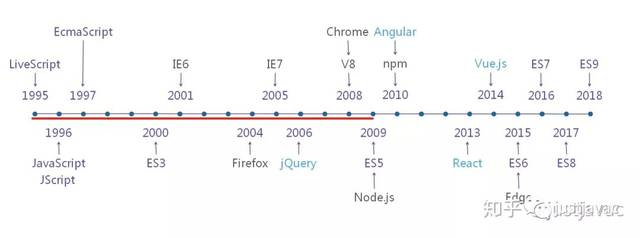
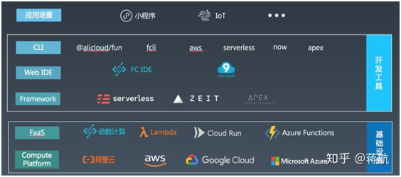
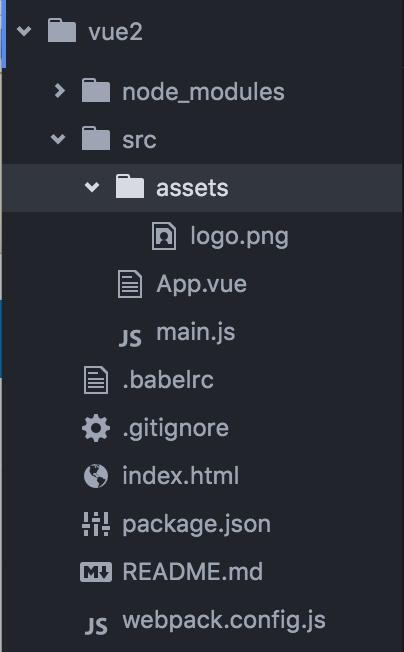
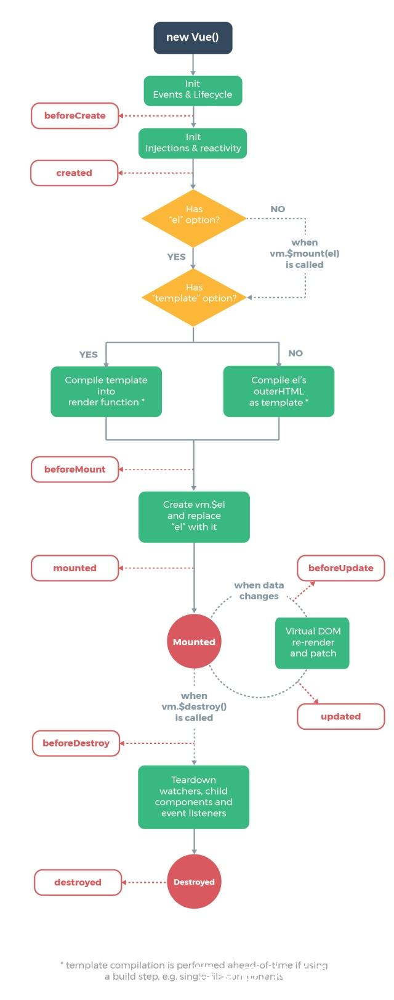

| 序号 | 修改时间   | 修改内容            | 修改人 | 审稿人 |
| ---- | ---------- | ------------------------------------- | ------ | ------ |
| 1    | 2019-12-15 | 创建。从《web框架》相关章节迁移成文。 | 吴启福 | 吴启福 |
|   |      |                  |     |     |
---


**目录**

[1 前端概述... 1](#_Toc27424406)

[前端开发史... 2](#_Toc27424407)

[前端架构... 3](#_Toc27424408)

[Serverless. 3](#_Toc27424409)

[前端工程化... 4](#_Toc27424410)

[前端工具... 4](#_Toc27424411)

[npm... 5](#_Toc27424412)

[Bable.. 7](#_Toc27424413)

[术语... 8](#_Toc27424414)

[本章参考... 10](#_Toc27424415)

[2 前端框架... 10](#_Toc27424416)

[2.1 前端框架概述... 11](#_Toc27424417)

[2.2 模板引擎... 11](#_Toc27424418)

[2.2.1 Smarty（PHP）... 11](#_Toc27424419)

[2.2.2 Jiaja2 (Python). 13](#_Toc27424420)

[2.3 AJAX.. 14](#_Toc27424421)

[2.3.1 Prototype.. 14](#_Toc27424422)

[2.3.2 JQuery. 16](#_Toc27424423)

[2.4 Bootstrap.. 17](#_Toc27424424)

[2.5 View层-数据可视化... 17](#_Toc27424425)

[2.5.1 React. 17](#_Toc27424426)

[2.5.2 Vue.. 19](#_Toc27424427)

[2.5.3 D3/nvd3.. 20](#_Toc27424428)

[2.5.4 Echarts. 21](#_Toc27424429)

[2.7 本章参考... 21](#_Toc27424430)

[Node.js. 22](#_Toc27424431)

[简介... 22](#_Toc27424432)

[入门实例... 23](#_Toc27424433)

[安装篇... 23](#_Toc27424434)

[示例1：hello world.. 25](#_Toc27424435)

[示例2：sacdl-project. 25](#_Toc27424436)

[技术原理篇... 26](#_Toc27424437)

[并发处理：事件和回调... 26](#_Toc27424438)

[全局对象和模块... 27](#_Toc27424439)

[相关框架：Express. 28](#_Toc27424440)

[本章参考... 29](#_Toc27424441)

[Vue.. 29](#_Toc27424442)

[vue-cli. 29](#_Toc27424443)

[vue项目结构... 30](#_Toc27424444)

[本章参考... 31](#_Toc27424445)

[参考资料... 31](#_Toc27424446)

 

[TOC]


---

# 1  前端概述

前端开发包括

* 前端页面展现：HTML/CSS/JavaScript

* 后端业务逻辑处理：PHP/ASP/Python/...

* 数据库访问：ADO/MYSQL/ORM/...

 狭义的前端只能前端页面层，广义的前端则包括了页面+后端逻辑。


**易用性是网页开发质量的一个重要组成。**

前端基础可简单认为：html + css + JavaScript

进一步扩展，则

* html, xhtml, xml,  
* css -> xsl
* JavaScript, browser script; ….

 

## 前端开发史



前端开发模式的演进，主要有四个阶段。

1. 基于模板渲染的动态页面：此阶段无前后端的分离。

2. 基于 AJAX 的前后端分离：2015年AJAX出现，开始出现前端工程师职位。

3. 基于 Node.js 的前端工程化：2009年Node.js出现，随着 Node.js 一同出现的还有 CommonJS 规范和 npm 包管理机制。随后也出现了 Grunt、Gulp、Webpack 等一系列基于 Node.js 的前端开发构建工具。2013 年前后，前端三大框架 React.js/Angular/Vue.js 相继发布第一个版本。前端开发开始变得规范化、标准化、工程化。

4. 基于 Node.js 的全栈开发。随着微服务的兴起，在微服务和前端中间，加了一个 BFF（Backend For Frontend） 层，由 BFF 对接口进行聚合、裁剪后，再输出给前端。


表格  淘宝的前端开发史

| 年代   | 简介                     | 主要技能                       |
| --------- | --------------------------------------------------- | ------------------------------------------------------------ |
| 2003~2006 | 静态页面、嵌套表格、单一浏览器、兼职开发 | HTML/CSS/JS，SEO |
| 2006~2007 | 增加了交互、视觉设计，专门设立WEB前端工程师职位。 | 新增：标准兼容（W3C/HTML4/JS）、调试工具（Firebug）、用户体验 |
| 2007~2008 | 大量使用AJAX，内容剧增 | 新增：栅格化、库/框架(YUI2/tbra)、部署（jslint/YC/ant)、组件库、性能优化 |
| 2009-2010 | 前端性能问题、组件本地化、多人协作/前端架构的模块化 | 新增：前端架构(yui3、kissy) |
| 2010~2011 | 移动终端、大屏、OPOA（单页应用） | 新增：前端MVC、HTML5/CSS3、移动终端 |
| 2012~ | FSAS~函数作为服务。云计算时代的前端。 | |


## 前端架构

###  SAP

SAP~Single Page Application，单页面应用。将渲染HTML的工作全部交给前端。

SAP相对于 之前的MAP（多页应用），有以下不同：

优点

* 前端掌控路由，用户体验更佳。
* 可移植，可离线使用。
* 服务器端提供的是干净数据接口，具备高度的可复用性。
* HTML资源作为静态资源，易于部署。
* 前后端完全分离，各自维护源码，无须而合。

**缺点**

* SEO不友好，难度较高
* 前进后退管理麻烦
* 初次加载消耗高（白屏时间）。

**优化**

*　SEO用 #!来替换 #，因为google会采集 带#!的URL
*　记录浏览历史路由，来管理前进后退。
*　加载优化：页面压缩；渐次加载。


SPA 前端实现方式  通常有2种：      

* 修改 url 中 Hash：通过hashchange事件，监听#后字符变化

* 利用 H5 中的 history： back(), forward(), go()，pushState()和 replaceState()


### Serverless

Serverless = FAAS+ BAAS。

*  FAAS（Function as a Service） 就是一些运行函数的平台，比如阿里云的函数计算、AWS 的 Lambda 等。
*  BAAS（Backend as a Service）则是一些后端云服务，比如云数据库、对象存储、消息队列等。利用 BAAS，可以极大简化我们的应用开发难度。

Serverless 的主要特点有：

* 事件驱动

* 函数在 FAAS平台中，需要通过一系列的事件来驱动函数执行。

* 无状态

* 因为每次函数执行，可能使用的都是不同的容器，无法进行内存或数据共享。如果要共享数据，则只能通过第三方服务，比如 Redis 等。

* 无运维

* 使用 Serverless 我们不需要关心服务器，不需要关心运维。这也是 Serverless 思想的核心。

* 低成本

* 使用 Serverless 成本很低，因为我们只需要为每次函数的运行付费。函数不运行，则不花钱，也不会浪费服务器资源

  

图 1 Serverless 服务中的前端解决方案架构图

​          

## 前端工程化

前端开发过程产生的问题

1.　ECMAScript（ES）规范与浏览器兼容性不一致：想使用最新的ECMAScript规范进行开发，但受限于浏览器实现，需要适配旧规范。
2.　CSS的弱编程能力：想使用LESS/SASS等预编译语法或者PostCSS自动处理hack。
3.　资源定位：本地开发静态资源引用的是本地相对路径，上线前需要修改为真实URL。
4. 考虑产品性能：需要压缩静态资源，图片压缩/BASE64内嵌/CSS Sprites。
5.　模块依赖分析和压缩打包：模块化开发，提高维护效率。上线前模块需要进行依赖分析和合并打包。
6.　协作层面：前端依赖后端数据
7.　部署层面：静态文件（JS/CSS/图片）与动态文件(HTML模板)仍然存在于同一项目，前端部分资源仍然需要后端工程师部署。

说明：针对上面七大问题。前面五大是开发问题。


前端工程化流水线要经过大概四个阶段：脚手架 --> 构建 --> 本地开发服务器 --> 部署

| 阶段           | 目的                                                         | 功能                                                         | 工具                        |
| -------------- | ------------------------------------------------------------ | ------------------------------------------------------------ | --------------------------- |
| 脚手架         | 快速搭建前端基本环境，以聚焦业务。                           | 包括自动安装、统一工具栈等。                                 | [Yeoman](http://yeoman.io/) |
| 构建<br>       | 也叫编译。将源代码中转化成宿主浏览器能执行的代码。解决前端七大问题中的开发问题。 | 解决依赖打包、资源嵌入、文件压缩、HASH指纹等。构建还包括构建需要解决3类问题，分别是语言、优化和部署。 | webpack                     |
| 本地开发服务器 | 本地服务器最典型的应用是MOCK服务，通过模拟接口和数据解决前端JS对数据API的依赖问题，从而实现前后端并行开发。 | MOCK服务。<br>支持SSR（服务器端渲染）。<br>动态构建。        |                             |
| 部署           |                                                              |                                                              |                             |


表格 构建步骤的前端资源变化

| 源资源                  | 构建后产出资源 | 构建动作       |
| -------------------------------------------- | -------------- | -------------------- |
| 领先于浏览器实现的ECMAScript规范编写的JS代码 (xx.es) | JS       | ECMAScript规范编转译 |
| LESS/SAAS预编译语法编写的CSS代码 (xx.less) | CSS      | CSS预编译语法转译    |
| Jade/EJS/Mustache等模板语法编写的HTML代码 (xx.jade) | html     | HTML模板渲染      |

  

## 前端工具

表格 前端常用工具

| 工具名  | 用途                        | 备注   |
| :--------- | ------------------------------------------------------------ | --------- |
| [npm](https://www.npmjs.cn/) | NPM是随同NodeJS一起安装的包管理工具，能解决NodeJS代码部署上的很多问题 | 管理模块  |
| [webpack](https://www.webpackjs.com) | 构建工具。                     |     |
| [Bable](https://www.babeljs.cn/) | Babel 是一个 JavaScript 编译器，是一个工具链，主要用于将 ECMAScript 2015+ 版本的代码转换为向后兼容的 JavaScript 语法，以便能够运行在当前和旧版本的浏览器或其他环境中。（ES转译） | 用NPM安装 |
| [PostCSS](https://www.postcss.com.cn/) | CSS预编译器。支持未来 CSS 语法、模块化、代码检测等。 |     |
| [LESS](https://www.bootcss.com/p/lesscss/)/[SASS](https://www.sasscss.com/) | CSS预编译语法转换。 | |
| CommonJS   | 面向浏览器以外的JavaScript模块化规范。原名ServeJS，2019年改现名，被Nodejs采纳为默认的模块化规范。 | 弃     |
| AMD/CMD    | CommonJS的变种，主要针对浏览器环境的模板化规范。       | 弃     |
| ES6 Module | 规范的静态模块体系。                 | 标准   |
| [Gulp](https://www.gulpjs.com.cn/) | 基于流(stream)的自动化构建工具。Grunt 采用配置文件的方式执行任务，而 [Gulp](https://www.gulpjs.com.cn/) 一切都通过代码实现。 |  |
| [Grunt](http://www.gruntjs.net/) | Grunt 是基于 Node.js 的项目构建工具。它可以自动运行你所设定的任务。Grunt 拥有数量庞大的插件，几乎任何你所要做的事情都可以用 Grunt 实现。 |  |
| [ESLint](https://cn.eslint.org/) | ESLint 是一个插件化并且可配置的 JavaScript 语法规则和代码风格的检查工具。ESLint 能够帮你轻松写出高质量的 JavaScript 代码。 |  |

备注：模块化规范有三种分别是CommonJS、AMD/CMD和ES6 Module，任选其一即可。在ES6 Module推出后，另外二种退出舞台。


表格 7 node.js常用工具列表

| 工具        | 简介                                                         | 安装                                                         | 使用                                   |
| ----------- | ------------------------------------------------------------ | ------------------------------------------------------------ | -------------------------------------- |
| node.js     | 建立在谷歌Chrome的JavaScript引擎(V8引擎)的Web应用程序框架。  | `nvm install 5.1.0`   或者<br>`apt-get install nodejs`       | node -v                                |
| npm/   cnpm | 用来安装npm包。cnpm为中国区。                                | `npm install -g cnpm --registry=https://registry.npm.taobao.org` | npm -v   npm install   [xxx]           |
| nvm         | node.js的包管理工具。                                        | curl  -o https://raw.githubusercontent.com/creationix/nvm/v0.33.1/install.sh \| bash | nvm  --version   nvm install [version] |
| bower       | npm包，前端管理工具，专门用来管理WEB前端依赖包（JS/CSS/IMAGES/fonts） | npm  install bower<br>bower init 初始化生成bower.json        | bower install xx                       |
| gulp        | nodejs代码部署发布工具。                                     | npm install gulp -g                                          | gulp [js_pipe]   gulp deploy           |
| grunt       | 脚手架，用来自动化构建                                       | npm install -g grunt-cli                                     |                                        |
| webpack     | 打包                                                         | npm install webpack@xx -g                                    |                                        |
| n           | 用来管理nodejs版本。<br>查看nodejs版本：n lsr                | npm install -g n                                             | 安装指定版本：n xx                     |

备注：cnpm类似npm，只是源在中国。


### npm&cnpm

npm是随同NodeJS一起安装的包管理工具，能解决NodeJS代码部署上的很多问题，常见的使用场景有以下几种：

- 允许用户从NPM服务器下载别人编写的第三方包到本地使用。

- 允许用户从NPM服务器下载并安装别人编写的命令行程序到本地使用。

- 允许用户将自己编写的包或命令行程序上传到NPM服务器供别人使用。

  ```sh
  # 查看当前版本
  $ npm -v
  
  # install后空是根据当前目录下的package.json安装；否则安装指定包，@版本号
  npm install
  npm install xx
  
  # 升级旧包
  $ npm install npm -g
  ```

**cnpm**:  淘宝镜像的npm, 中国区用户速度更快

```shell
# 安装cnpm
$ npm install -g cnpm --registry=https://registry.npm.taobao.org 
```


**npm安装扩展模块**
npm 的包安装分为本地安装（local）、全局安装（global）两种，从敲的命令行来看，差别只是有没有 -g 而已。本地安装放在 ./node_modules 下（运行 npm 命令时所在的目录）。

示例安装 express

`$ cnpm install -g express`

npm配置文件 [.npmrc ](https://www.npmjs.cn/files/npmrc/)

```ini
prefix=~\nodejs\node_global
cache=~\nodejs\node_cache
registry=https://registry.npm.taobao.org/
```


表格 npm常用扩展模块

| 模块名        | 说明                                                         | 安装                          | 使用                                                       |
| ------------- | ------------------------------------------------------------ | ----------------------------- | ---------------------------------------------------------- |
| express       | 基于node.js的框架。脚手架。<br>它提供了一套强大的功能来开发Web和移动应用程序。 | npm install express--save-dev | var express = require('express');<br/>var app = express(); |
| babel-runtime |                                                              |                               |                                                            |
| vue-cli       | 脚手架，快速搭建开发环境。用来生成模板的vue工程。            |                               | import Vue from 'vue'                                      |
| vue-router    | 单页应用。                                                   |                               | import VueRouter from "vue-router"                         |
| vue-resource  |                                                              |                               | import VueResource from 'vue-resource'                     |
| D3.js         | 数据可视化前端开发包。                                       | bower install d3 --save       |                                                            |
| eCharts       | 百度开源的数据可视化前端开发包。                             |                               |                                                            |
| Yeoman        | 脚手架。                                                     | npm install -g yo             |                                                            |
| ejs           | 模板引擎                                                     |                               |                                                            |
| github        | github   api                                                 |                               |                                                            |
| cross-env     | 设置环境变量，兼容windows和linux                             | npm install cross-env         | cross-env NODE-ENV=prod                                    |

备注：参数选项--save-dev为保存到开发目录，-g 保存到全局目录。

1. npm包安装： npm/cnpm install [npm]--save-dev

2. 前端相关的包安装:  bower install [npm] --saves


**npm命令**

```sh
$ npm --help

Usage: npm <command>

where <command> is one of:
    access, adduser, audit, bin, bugs, c, cache, ci, cit,
    clean-install, clean-install-test, completion, config,
    create, ddp, dedupe, deprecate, dist-tag, docs, doctor,
    edit, explore, fund, get, help, help-search, hook, i, init,
    install, install-ci-test, install-test, it, link, list, ln,
    login, logout, ls, orgtdated, owner, pack, ping, prefix,
    profile, prune, publish, rb, rebuild, repo, restart, root,
    run, run-script, s, se, search, set, shrinkwrap, star,
    stars, start, stop, t, team, test, token, tst, un,
    uninstall, unpublish, unstar, up, update, v, version, view,
    whoami

npm <command> -h  quick help on <command>
npm -l      display full usage info
npm help <term>   search for help on <term>
npm help npm   involved overview

Specify configs in the ini-formatted file:
    C:\Users\keefe\.npmrc
or on the command line via: npm <command> --key value
Config info can be viewed via: npm help config

npm@6.13.2 C:\Users\keefe\AppData\Roaming\npm\node_modules\npm
```

备注： 

* npm init会产生初始的package.json

* npm run xx 是最常用，用来启动各种命令如dev build lint ...

* npm install  注意是--save-dev 还是 -g

* npm list/npm show -g  列出npm所有安装的包, 

* npm show xxx  列出某个包的详细情况 


### webpack

前端项目构建。


### Bable

JavaScript编译，将浏览器未实现的ECMAScript规范语法转化成可运行的低版本语法 。

我们使用 `@babel/cli` 从终端运行 Babel，利用 `@babel/polyfill` 来模拟所有新的 JavaScript 功能，而 `env` preset 只对我们所使用的并且目标浏览器中缺失的功能进行代码转换和加载 polyfill。

1. 安装

```sh
npm install --save-dev @babel/core @babel/cli @babel/preset-env
npm install --save @babel/polyfill
```

2. 配置：配置文件有多种  

   * .babelrc：适用于单个软件包的配置

  ```js
  {
    "presets": [...],
    "plugins": [...]
  }
  ```

   * .babelrc.js： 与 [`.babelrc`](https://www.babeljs.cn/docs/configuration#babelrc) 的配置相同，但你可以使用 JavaScript 编写。

  ```js
  const presets = [ ... ];
  const plugins = [ ... ];
  
  module.exports = { presets, plugins };
  ```

   * `babel.config.js`：项目根目录下，可编译node_modules目录下的模块。内容如下，

  ```js
  const presets = [
    [
      "@babel/env",
      {
     targets: {
       edge: "17",
       firefox: "60",
       chrome: "67",
       safari: "11.1",
     },
     useBuiltIns: "usage",
      },
    ],
  ];
  
  module.exports = { presets };
  ```

3. 运行此命令将 `src` 目录下的所有代码编译到 `lib` 目录： 

   `./node_modules/.bin/babel src --out-dir lib`


### gulp

https://www.gulpjs.com.cn/

gulp.js - 基于流(stream)的自动化构建工具。Grunt 采用配置文件的方式执行任务，而 [Gulp](https://www.gulpjs.com.cn/) 一切都通过代码实现。


##  本章参考

[1]: https://zhuanlan.zhihu.com/p/65914436 "知乎ServerLess"


# 2  前端框架

## 2.1  前端框架概述

前端框架主要指HTML+CSS+JS组成的框架库。此外还包括模板引擎。

前端框架模式： MVC+MVP+MVVM

1. MVC：Model(模型)+View(视图)+controller(控制器)，主要是基于分层的目的，让彼此的职责分开。

View通过Controller来和Model联系，Controller是View和Model的协调者，View和Model不直接联系，基本联系都是单向的。用户User通过控制器Controller来操作模板Model从而达到视图View的变化。

2. MVP：是从MVC模式演变而来的，都是通过Controller/Presenter负责逻辑的处理+Model提供数据+View负责显示。

在MVP中，Presenter完全把View和Model进行了分离，主要的程序逻辑在Presenter里实现。

并且，Presenter和View是没有直接关联的，是通过定义好的接口进行交互，从而使得在变更View的时候可以保持Presenter不变。

MVP模式的框架：Riot,js。

3. MVVM：MVVM是把MVC里的Controller和MVP里的Presenter改成了ViewModel。Model+View+ViewModel。

View的变化会自动更新到Model, Model的变化也会自动同步到View上显示。

这种自动同步是因为ViewModel中的属性实现了Observer，当属性变更时都能触发对应的操作。


### 前端框架列表

表格 6 前端框架列表（基于编程语言）

| 语言   | 框架名称                   | 简介                        | 特性                        |
| ------ | ----------------------------------------------------- | ------------------------------------------------------------ | ------------------------------------------------------------ |
| php    | Smarty                     | 一个php模板引擎。更准确的说,它分开了逻辑程序和外在的内容,提供了一种易于管理的方法。 |                          |
| python | Jinja2                     | 设计思想来源于[Django](https://baike.baidu.com/item/Django/61531)的模板引擎，并扩展了其语法和一系列强大的功能。 | 完全支持[unicode](https://baike.baidu.com/item/unicode)，并具有集成的沙箱执行环境 |
| J2EE   | [Freemarker](https://baike.baidu.com/item/Freemarker) |                          |                          |
| JS  | Bootstrap                  | 来自 Twitter，目前最受欢迎的前端框架。           |                          |
| JS  | JQuery                     | 轻量级好用的AJAX开发框架。              |                          |
| JS  | Prototype                  | 轻量级好用的AJAX开发框架。              | 功能实用而且尺寸较小，适合中小型的Web应用。         |
| JS  | D3                      | Data-Driven Documents，数据可视化框架。          |                          |
| JS  | React                      | 起源于 Facebook，用来构建UI。              |                          |
| JS  | Vue                     | 构建用户界面的渐进式框架。              | 只关注视图层， 采用自底向上增量开发的设计。         |
| JS  | ECharts                    | 百度开源的商业级数据图表。缩写来自Enterprise Charts。     |                          |

 

### 前端框架比较

表格 前端主要框架比较

| 框架名称      | 主要 平台 | 基础技术           | 布局 | CSS 版式 | 控件   | 特效   | 风格设置         |
| ------------- | --------- | ------------------ | ---- | -------- | ------ | ------ | ---------------- |
| Bootstrap     | 桌面端    | jQuery, LESS       | 丰富 | 丰富     | 丰富   | 丰富   | 手动配置         |
| jQuery        | 桌面端    | jQuery             | -    | -        | 丰富   | 丰富   | 预置/可视化配置  |
| jQuery Mobile | 移动端    | jQuery             | 丰富 | -        | 丰富   | 丰富   | 预置/可视化配置  |
| SenchaExtJS   | 桌面端    | Ext JS, Sass       | 丰富 | -        | 极丰富 | 极丰富 | 预置             |
| Sencha Touch  | 移动端    | HTML5              | 丰富 | -        | 丰富   | 丰富   | -                |
| Sencha GXT    | 桌面端    | Java, HTML5        | 丰富 | -        | 丰富   | 丰富   | -                |
| Dojo          | 桌面端    | Dojo Nano          | 丰富 | 丰富     | 极丰富 | 极丰富 | CSS 代码         |
| Dojo Mobile   | 移动端    | Dojo Nano          | 丰富 | -        | 丰富   | 丰富   | 内置与移动端匹配 |
| Mootools      | 桌面端    | Mootools Core      | -    | -        | 少量   | 少量   | -                |
| Prototype     | 桌面端    | Prototype          | -    | -        | 少量   | 丰富   | -                |
| YUI           | 桌面端    | YUI                | 丰富 | -        | 丰富   | 丰富   |                  |
| Foudation     | 移动端    | jQuery/Zepto, Sass | 丰富 | 丰富     | 丰富   | 丰富   |                  |
| Kissy         | 桌面端    | Kissy Core         | -    | -        | 丰富   | 少     | -                |
| Kissy Mobile  | 移动端    | Kissy              | -    | -        | 少     | 少     | -                |
| QWrap         | 桌面端    | QWrap              | -    | -        | -      | 少     |                  |
| Tangram       | 桌面端    | Tangram            | -    | -        | 少     | 少     |                  |


表格 前端经典框架比较（Angular/Bootstrap/React/Vue）

| 框架      | 支持商   | 简介                                                         | 优点         | 缺点                                                 |
| --------- | -------- | ------------------------------------------------------------ | ------------ | ---------------------------------------------------- |
| Angular   |          |                                                              |              | 学习成本 较高。<br>性能上AngularJS依赖对数据做脏检查 |
| Bootstrap | Twitter  | 2011 年8月开源。BBootstrap 主要针对桌面端市场，Bootstrap3 提出移动优先。<br>Bootstrap 主要基于 jQuery 进行 JavaScript 处理，支持 LESS 来做 CSS 的扩展。 | jQuery+LESS  | IE6/7不友好                                          |
| React     | Facebook | React 是一个用于构建用户界面的 JavaScript 库。React主要用于构建UI. |              |                                                      |
| Vue.js    |          | 基于 Vue.js 进行快速开发的完整系统.                          | 上手最容易。 |                                                      |


表格  前端三大框架比较

|          | Angular  |  React   | Vue      |
| :------: | :------: | :------: | -------- |
| 组织方式 |   MVC    |  模块化  | 模块化   |
| *数据绑定* | 双向绑定 | *单向绑定* | 双向绑定 |
| 模板能力 |   强大   |   自由   | 自由     |
|  自由度  |   较小   |    大    | 较大     |
|   路由   | 静态路由 | 动态路由 | 动态路由 |
| 背景     | Google | Facebook | 阿里巴巴 |
| 开源时间 | 2010 | 2013.5 | 2014 |
| 文档     | 英文   | 英文     | 多语言   |
| 上手难度 | ⭐⭐⭐    | ⭐⭐⭐      | ⭐⭐       |
| App方案  | lonic  | RN       | Weex     |

* 模块化：一切都是组件，组件实例之间可以嵌套。
* 模板：React模板就是JSX，JSX语法相当于一个变量，相当灵活。Vue支持模板语法和JSX语法。
* 路由：React使用React-router，Vue使用Vue-router，Angular中是静态的路由，而React4.x开始使用动态路由，Vue2.2之后也可以使用addRoutes来创建动态路由。
* React依赖Virtual DOM, 而Vue.js使用的是DOM模板。


## 2.2  模板引擎

### Smarty (PHP)

  Smarty的特点之一是"模板编译"。意思是Smarty读取模板文件然后用他们创建php脚本。这些脚本创建以后将被执行。因此并没有花费模板文件的语法解析,同时每个模板可以享受到诸如Zend加速器(http://www.zend.com ) 或者PHP加速器(http://www.php-accelerator.co.uk )。这样的php编译器高速缓存解决方案。

Smaty的一些特点:

*  非常非常的快!

*  用php分析器干这个苦差事是有效的

*  不需要多余的模板语法解析,仅仅是编译一次
*  仅对修改过的模板文件进行重新编译
*  可以编辑'自定义函数'和自定义'变量',因此这种模板语言完全可以扩展
*  可以自行设置模板定界符,所以你可以使用{}, {{}}, <!--{}-->, 等等
*  诸如 if/elseif/else/endif 语句可以被传递到php语法解析器,所以 {if ...} 表达式是简单的或者是复合的,随你喜欢啦
*  如果允许的话,section之间可以无限嵌套
*  引擎是可以定制的.可以内嵌php代码到你的模板文件中,虽然这可能并不需要(不推荐)
*  内建缓存支持
*  独立模板文件
*  可自定义缓存处理函数
*  插件体系结构

 

安装Smarty发行版在/libs/目录

**Smarty库文件**

Smarty.class.php

Smarty_Compiler.class.php

Config_File.class.php

debug.tpl

/core/*.php (all of them)

/plugins/*.php (all of them)

 

**一个smarty的应用实例：**

法1：使用全路径

`require('/usr/local/lib/php/Smarty/Smarty.class.php');`

法2：使用'SMARTY_DIR'的php常量作为它的系统库目录

```php
define('SMARTY_DIR','/usr/local/lib/php/Smarty/');
require(SMARTY_DIR.'Smarty.class.php');
```

法3：使用库路径

```php
require('Smarty.class.php');
$smarty = new Smarty;
```

创建index.tpl文件让smarty载入.这个文件放在 $template_dir目录里

{* Smarty *}

Hello, {$name}!

说明：{* *}为注释。

实例：

```php
require('Smarty.class.php');
$smarty = new Smarty;
$smarty->assign('name','Ned');
$smarty->display('index.tpl');
```

结果：

在浏览器打开 index.php,你应该看到"Hello, Porky!"

### Jiaja2 (Python)

Jinja2是基于[python](https://baike.baidu.com/item/python)的[模板引擎](https://baike.baidu.com/item/模板引擎)，功能比较类似于于[PHP](https://baike.baidu.com/item/PHP/9337)的[smarty](https://baike.baidu.com/item/smarty)，[J2ee](https://baike.baidu.com/item/J2ee)的[Freemarker](https://baike.baidu.com/item/Freemarker)和[velocity](https://baike.baidu.com/item/velocity)。 它能完全支持[unicode](https://baike.baidu.com/item/unicode)，并具有集成的沙箱执行环境，应用广泛。jinja2使用[BSD](https://baike.baidu.com/item/BSD)授权。

Jinja2是Python下一个被广泛应用的模版引擎，他的设计思想来源于[Django](https://baike.baidu.com/item/Django/61531)的模板引擎，并扩展了其语法和一系列强大的功能。其中最显著的一个是增加了沙箱执行功能和可选的自动转义功能，这对大多应用的安全性来说是非常重要的。

Jinja is Beautiful

```jinja2


  <ul>
  
    <li><a href="{{ user.url }}">{{ user.username }}</a></li>
  
  </ul>

```

 

### Liquid

Jekyll的模板语言。详见  [Jekyll用户手册](../tools.工具/Jekyll用户手册.md)

https://liquid.bootcss.com/


## 2.3  AJAX

### 2.3.1   Prototype

Prototype是目前应用广泛的AJAX开发框架，其的特点是功能实用而且尺寸较小，非常适合在中小型的Web应用中使用。

[Prototype.js](http://baike.baidu.com/view/1112205.htm)是由Sam Stephenson写的一个JavaScript类库。该框架的设计思路巧妙，而且兼容标准的类库，能够帮助开发人员轻松建立有交互性]良好的web2.0特性[富客户端](http://baike.baidu.com/view/1330363.htm)页面。

开发Ajax应用需要编写大量的客户端JavaScript脚本，而Prototype框架可以大大地简化JavaScript代码的编写工作。更难得的是，Prototype具备兼容各个浏览器的优秀特性，使用该框架可以不必考虑[浏览器兼容性](http://baike.baidu.com/subview/6746126/6874381.htm)的问题。

Prototype对JavaScript的内置对象（如“String”对象、“Array”对象等）进行了很多有用的扩展，同时该框架中也新增了不少自定义的对象，包括对Ajax开发的支持等都是在自定义对象中实现的。Prototype可以帮助开发人员实现以下的目标：

（1）对字符串进行各种处理

（2）使用枚举的方式访问集合对象

（3）以更简单的方式进行常见的DOM操作

（4）使用CSS选择符定位页面元素

（5）发起Ajax方式的HTTP请求并对响应进行处理

（6）监听DOM事件并对事件进行处理
 　　“Prototype”框架功能详解—使用实用函数，“Prototype”框架的实现仅仅包含一个JavaScript即可，1.6版本的“[Prototype.js](http://baike.baidu.com/subview/1112205/1112205.htm)”的文件大小为127K字节，约4220行。在页面中应用的语法类似于：

```html
<script
type=”text/JavaScript” src=”inc"js"Prototype.js” ></script>
```

然后就可以在后继的脚本中享受该框架带来的便利了。

 

该框架中有很多预定义的对象和实用函数，可以将程序员从重复的打字中解放出来。

（1）使用“$()”函数。

（2）使用“$F()”函数。此函数是另一个大受欢迎的“快捷键”，能用于返回任何表单输入控件的值，比如多行文本框和下拉列表框等控件。此个方法也能用元素id或元素本身做为参数。

（3）使用“$A()”函数。此函数能将其接收到的单个的参数转换成一个Array对象。

（4）使用“$H()”函数。此函数把一些对象转换成一个可枚举的和联合数组类似的Hash对象。

（5）使用“$R()”函数。此函数是“new ObjectRange(lowBound,upperBound,excludeBounds)”的缩写，用于建立一个范围对象。

（6）使用“Try.these()”函数。“Try.these()” 方法用于调用不同的方法直到其中的一个成功。此函数把一系列的方法作为参数，并且按顺序的一个一个的执行这些方法，直到其中的一个成功执行。返回成功执行 的那个方法的返回值。“Try.these()”函数可以用于处理兼容性问题。

 

### 2.3.2   JQuery

JQuery是继[Prototype](http://baike.baidu.com/view/1217697.htm)之后又一个优秀的[JavaScript](http://baike.baidu.com/view/16168.htm)库。它是轻量级的js库 ，它兼容[CSS3](http://baike.baidu.com/view/1713027.htm)，还兼容各种浏览器（[IE](http://baike.baidu.com/subview/703/10271308.htm) 6.0+, [FF](http://baike.baidu.com/subview/31049/5089479.htm) 1.5+, [Safari](http://baike.baidu.com/subview/110484/5036395.htm) 2.0+, [Opera](http://baike.baidu.com/subview/10019/7098372.htm) 9.0+），JQuery2.0及后续版本将不再支持IE6/7/8浏览器。JQuery使用户能更方便地处理[HTML](http://baike.baidu.com/view/692.htm)（[标准通用标记语言](http://baike.baidu.com/view/5286041.htm)下的一个应用）、events、实现动画效果，并且方便地为网站提供[AJAX](http://baike.baidu.com/subview/1641/5762264.htm)交互。JQuery还有一个比较大的优势是，它的文档说明很全，而且各种应用也说得很详细，同时还有许多成熟的插件可供选择。JQuery能够使用户的html页面保持代码和html内容分离，也就是说，不用再在html里面插入一堆js来调用命令了，只需要定义id即可。

JQuery是一个兼容多浏览器的JavaScript库，核心理念是write less,do more(写得更少,做得更多)。JQuery在2006年1月由美国人John Resig在纽约的barcamp发布，吸引了来自世界各地的众多JavaScript高手加入，由Dave Methvin率领团队进行开发。如今，JQuery已经成为最流行的JavaScript库，在世界前10000个访问最多的网站中，有超过55%在使用JQuery。

JQuery是免费、开源的，使用MIT许可协议。JQuery的语法设计可以使开发更加便捷，例如操作文档对象、选择DOM元素、制作动画效果、事件处理、使用[Ajax](http://baike.baidu.com/view/1641.htm)以及其他功能。除此以外，JQuery提供API让开发者编写插件。其模块化的使用方式使开发者可以很轻松的开发出功能强大的静态或动态网页。

JQuery，顾名思义，也就是JavaScript和查询（Query），即是辅助JavaScript开发的库。

 

 

## 2.4  前端经典框架

### Angular (2010) 


### Bootstrap (2011)

Bootstrap来自 Twitter，是目前最受欢迎的前端框架。Bootstrap 是基于 HTML、CSS、JavaScript 的，它简洁灵活，使得 Web 开发更加快捷。用于开发响应式布局、移动设备优先的 WEB 项目。

Bootstrap 是 2011 年8月在 GitHub 上发布的开源产品。

**Bootstrap 包的内容**

- **基本结构**：Bootstrap 提供了一个带有网格系统、链接样式、背景的基本结构。这将在 **Bootstrap 基本结构** 部分详细讲解。

- **CSS**：Bootstrap 自带以下特性：全局的 CSS 设置、定义基本的 HTML 元素样式、可扩展的 class，以及一个先进的网格系统。这将在 **Bootstrap CSS** 部分详细讲解。

- **组件**：Bootstrap 包含了十几个可重用的组件，用于创建图像、下拉菜单、导航、警告框、弹出框等等。这将在 **布局组件** 部分详细讲解。

- JavaScript 插件：Bootstrap 包含了十几个自定义的 jQuery 插件。您可以直接包含所有的插件，也可以逐个包含这些插件。

- **定制**：您可以定制 Bootstrap 的组件、LESS 变量和 jQuery 插件来得到您自己的版本。

  

### React (2013)

React 是一个用于构建用户界面的 JavaScript 库。React主要用于构建UI，很多人认为 React 是 MVC 中的 V（视图）。

React 起源于 Facebook 的内部项目，用来架设 Instagram 的网站，并于 2013 年 5 月开源。

React 拥有较高的性能，代码逻辑非常简单，越来越多的人已开始关注和使用它。

 

**React** **特点**

1. 声明式设计  −React采用声明范式，可以轻松描述应用。
2. 高效  −React通过对DOM的模拟，最大限度地减少与DOM的交互。
3. 灵活  −React可以与已知的库或框架很好地配合。
4. JSX  −JSX 是 JavaScript 语法的扩展。React 开发不一定使用 JSX ，但我们建议使用它。
5. 组件Component   −通过 React 构建组件，使得代码更加容易得到复用，能够很好的应用在大项目的开发中。
6. 单向响应的数据流  −React 实现了单向响应（父组件流向子组件）的数据流，从而减少了重复代码，这也是它为什么比传统数据绑定更简单。通过prop和state来实现。

 

第一个例子
```xml
<!DOCTYPE html>
<html>
  <head>
    <meta charset="UTF-8" />
    <title>Hello React!</title>
    <script src="https://cdn.bootcss.com/react/15.4.2/react.min.js"></script>
    <script src="https://cdn.bootcss.com/react/15.4.2/react-dom.min.js"></script>
    <script src="https://cdn.bootcss.com/babel-standalone/6.22.1/babel.min.js"></script>
  </head>
  <body>
    <div id="example"></div>
    <script type="text/babel">
   ReactDOM.render(
     <h1>Hello world!</h1>,
     document.getElementById('example')
   );
    </script>
  </body>
</html>
```


### Vue.js (2014)

Vue.js（读音 /vjuː/, 类似于 view），简称Vue，是一套构建用户界面的渐进式框架。

Vue 只关注视图层， 采用自底向上增量开发的设计。

Vue 的目标是通过尽可能简单的 API 实现响应的数据绑定和组合的视图组件。


第一个例子

```html
<!DOCTYPE html>
<html>
<head>
<meta charset="utf-8">
<title>Vue 测试实例 - 菜鸟教程(runoob.com)</title>
<script src="https://cdn.bootcss.com/vue/2.2.2/vue.min.js"></script>
</head>
<body>
<div id="app">
  <p>{{ message }}</p>
</div>

<script>
new Vue({
  el: '#app',
  data: {
    message: 'Hello Vue.js!'
  }
})
</script>
</body>
</html>
```


## 2.5 数据可视化（图表）

### D3/NVD3

D3 的全称是（Data-Driven Documents），顾名思义可以知道是一个**被数据驱动的文档**。听名字有点抽象，说简单一点，其实就是一个 JavaScript 的函数库，使用它主要是用来做数据可视化的。

D3 是一个开源项目，作者是纽约时报的工程师。D3 项目的代码托管于 GitHub。

引用D3

```js
<script src="http://d3js.org/d3.v3.min.js"
charset="utf-8"></script>
```

NVD3是基于D3的实现。

 

### Echarts

http://echarts.baidu.com/echarts2/doc/doc.html

ECharts，缩写来自Enterprise Charts，由百度开源。商业级数据图表，一个纯JavaScript的图表库，可以流畅的运行在PC和移动设备上，兼容当前绝大部分浏览器（IE6/7/8/9/10/11，chrome，firefox，Safari等），底层依赖轻量级的Canvas类库[ZRender](http://ecomfe.github.io/zrender/)，提供直观，生动，可交互，可高度个性化定制的数据可视化图表。创新的拖拽重计算、数据视图、值域漫游等特性大大增强了用户体验，赋予了用户对数据进行挖掘、整合的能力。

支持折线图（区域图）、柱状图（条状图）、散点图（气泡图）、K线图、饼图（环形图）、雷达图（填充雷达图）、和弦图、力导向布局图、地图、仪表盘、漏斗图、事件河流图等12类图表，同时提供标题，详情气泡、图例、值域、数据区域、时间轴、工具箱等7个可交互组件，支持多图表、组件的联动和混搭展现。

 

​             

### Charts

https://chartjs.bootcss.com/

开源的HTML5图表工具。Chart.js 是为设计和开发人员准备的简单、灵活的 JavaScript 图表工具。


## 2.6 其它框架

### Express

Express的特点

- 实现了路由功能
- 中间件功能
- 扩展了req和res对象
- 可以集成其他模版引擎

 

## 本章参考

*  Bootstrap   https://www.bootcss.com/  
*  Bootstrap  [http://www.runoob.com/try/Bootstrap](http://www.runoob.com/try/bootstrap) 
*  react http://react-china.org/ 
*  React 教程 http://www.runoob.com/react/react-tutorial.html 
*  vue http://www.runoob.com/vue2/vue-tutorial.html 
*  前端开发框架对比 https://www.cnblogs.com/liangxiaofeng/p/5253103.html
*  前端三大框架的对比 https://www.jianshu.com/p/64dad076dace  


# 3  Node.js

## 入门篇

### 简介

Node.js是建立在谷歌Chrome的JavaScript引擎(V8引擎)的Web应用程序框架。Node.js在[官方网站](https://nodejs.org/)的定义文件内容如下：

Node.js® is a platform built on [Chrome's JavaScript runtime](http://code.google.com/p/v8/) for easily building fast, scalable network applications. Node.js uses an event-driven, non-blocking I/O model that makes it lightweight and efficient, perfect for data-intensive real-time applications that run across distributed devices.

Node.js自带运行时环境可在JavaScript脚本的基础上可以解释和执行(这类似于JVM的Java字节码)。这个运行时允许在浏览器以外的任何机器上执行JavaScript代码。由于这种运行时在Node.js上，所以JavaScript现在可以在服务器上执行。

Node.js还提供了各种丰富的JavaScript模块库，它极大简化了使用Node.js来扩展Web应用程序的研究与开发。

**Node.js =** **运行环境+ JavaScript库**

 

下图描述了 Node.js 的一些重要组成部分

   

图 2 Node.js Concept

 

**在哪里可以使用Node.js？**

以下是Node.js证明自己完美的技术的合作伙伴的领域。

*  I/O 绑定应用程序
*  数据流应用
*  数据密集型实时应用(DIRT)
*  JSON API的应用程序
*  单页面应用

 

**在哪些地方不要使用Node.js？**

不建议使用Node.js的就是针对CPU密集型应用。

 

**与node.js** **相关的工具**

*  gulp 基于 node 实现 Web 前端自动化开发的工具，利用它能够极大的提高开发效率。

*  ghost  node.js和ghost安装配置工具

*  grunt  node.js自动化项目构建工具


### 版本

nodejs的版本兼容性较差，因此要熟悉各个版本的差异。

详细参见 https://nodejs.org/zh-cn/download/releases/

表格 nodejs版本说明

| Version         | LTS     | Date       | V8         | npm     | N-M-V |                                                              |
| --------------- | ------- | ---------- | ---------- | ------- | ----- | ------------------------------------------------------------ |
| Node.js 16.4.0  |         | 2021-06-23 | 9.1.269.36 | 7.18.1  | 93    | [下载 ](https://nodejs.org/download/release/v16.4.0/)[更新日志 ](https://github.com/nodejs/node/blob/master/doc/changelogs/CHANGELOG_V16.md#16.4.0)[文档](https://nodejs.org/dist/v16.4.0/docs/api/) |
| Node.js 16.0.0  |         | 2021-04-20 | 9.0.257.17 | 7.10.0  | 93    | [下载 ](https://nodejs.org/download/release/v16.0.0/)[更新日志 ](https://github.com/nodejs/node/blob/master/doc/changelogs/CHANGELOG_V16.md#16.0.0)[文档](https://nodejs.org/dist/v16.0.0/docs/api/) |
| Node.js 15.0.0  |         | 2020-10-20 | 8.6.395.16 | 7.0.2   | 88    | [下载 ](https://nodejs.org/download/release/v15.0.0/)[更新日志 ](https://github.com/nodejs/node/blob/master/doc/changelogs/CHANGELOG_V15.md#15.0.0)[文档](https://nodejs.org/dist/v15.0.0/docs/api/) |
| Node.js 14.17.1 | Fermium | 2021-06-15 | 8.4.371.23 | 6.14.13 | 83    | [下载 ](https://nodejs.org/download/release/v14.17.1/)[更新日志 ](https://github.com/nodejs/node/blob/master/doc/changelogs/CHANGELOG_V14.md#14.17.1)[文档](https://nodejs.org/dist/v14.17.1/docs/api/) |
| Node.js 14.0.0  |         | 2020-04-21 | 8.1.307.30 | 6.14.4  | 83    | [下载 ](https://nodejs.org/download/release/v14.0.0/)[更新日志 ](https://github.com/nodejs/node/blob/master/doc/changelogs/CHANGELOG_V14.md#14.0.0)[文档](https://nodejs.org/dist/v14.0.0/docs/api/) |
| Node.js 13.0.0  |         | 2019-10-22 | 7.8.279.17 | 6.12.0  | 79    | [下载 ](https://nodejs.org/download/release/v13.0.0/)[更新日志 ](https://github.com/nodejs/node/blob/master/doc/changelogs/CHANGELOG_V13.md#13.0.0)[文档](https://nodejs.org/dist/v13.0.0/docs/api/) |
| Node.js 12.22.1 | Erbium  | 2021-04-06 | 7.8.279.23 | 6.14.12 | 72    | [下载 ](https://nodejs.org/download/release/v12.22.1/)[更新日志 ](https://github.com/nodejs/node/blob/master/doc/changelogs/CHANGELOG_V12.md#12.22.1)[文档](https://nodejs.org/dist/v12.22.1/docs/api/) |
| Node.js 12.0.0  |         | 2019-04-23 | 7.4.288.21 | 6.9.0   | 72    | [下载 ](https://nodejs.org/download/release/v12.0.0/)[更新日志 ](https://github.com/nodejs/node/blob/master/doc/changelogs/CHANGELOG_V12.md#12.0.0)[文档](https://nodejs.org/dist/v12.0.0/docs/api/) |
| Node.js 11.0.0  |         | 2018-10-23 | 7.0.276.28 | 6.4.1   | 67    | [下载 ](https://nodejs.org/download/release/v11.0.0/)[更新日志 ](https://github.com/nodejs/node/blob/master/doc/changelogs/CHANGELOG_V11.md#11.0.0)[文档](https://nodejs.org/dist/v11.0.0/docs/api/) |
| Node.js 10.24.1 | Dubnium | 2021-04-06 | 6.8.275.32 | 6.14.12 | 64    | [下载 ](https://nodejs.org/download/release/v10.24.1/)[更新日志 ](https://github.com/nodejs/node/blob/master/doc/changelogs/CHANGELOG_V10.md#10.24.1)[文档](https://nodejs.org/dist/v10.24.1/docs/api/) |
| Node.js 10.0.0  |         | 2018-04-24 | 6.6.346.24 | 5.6.0   | 64    | [下载 ](https://nodejs.org/download/release/v10.0.0/)[更新日志 ](https://github.com/nodejs/node/blob/master/doc/changelogs/CHANGELOG_V10.md#10.0.0)[文档](https://nodejs.org/dist/v10.0.0/docs/api/) |
| Node.js 9.0.0   |         | 2017-10-31 | 6.2.414.32 | 5.5.1   | 59    | [下载 ](https://nodejs.org/download/release/v9.0.0/)[更新日志 ](https://github.com/nodejs/node/blob/master/doc/changelogs/CHANGELOG_V9.md#9.0.0)[文档](https://nodejs.org/dist/v9.0.0/docs/api/) |
| Node.js 8.17.0  | Carbon  | 2019-12-17 | 6.2.414.78 | 6.13.4  | 57    | [下载 ](https://nodejs.org/download/release/v8.17.0/)[更新日志 ](https://github.com/nodejs/node/blob/master/doc/changelogs/CHANGELOG_V8.md#8.17.0)[文档](https://nodejs.org/dist/v8.17.0/docs/api/) |
| ...             |         |            |            |         |       |                                                              |
| io.js 1.0.0     |         | 2015-01-14 | 3.31.74.1  | 2.1.18  | 42    | [下载 ](https://iojs.org/download/release/v1.0.0/)[更新日志 ](https://github.com/nodejs/node/blob/master/doc/changelogs/CHANGELOG_IOJS.md#1.0.0)[文档](https://iojs.org/dist/v1.0.0/docs/api/) |
| Node.js 0.1.14  |         | 2011-08-26 | 1.3.15.0   |         |       | [下载 ](https://nodejs.org/download/release/v0.1.14/)[更新日志 ](https://github.com/nodejs/node-v0.x-archive/blob/v0.1.14/ChangeLog)[文档](https://nodejs.org/docs/v0.1.14/api.html) |

版本更新规律：大概每月一个小版本，每年一个大版本。4.x开始首位偶数版本有LTS版本。N-M-V指NODE_MODULE_VERSION。


### 安装

linux用nvm安装和管理Node.js

nodejs在线更新

```shell
# 查看node版本
node -v

# 安装n模块
npm install -g n

# 查看可安装版本
n lsr -all

# 安装提定版本，如12.22.1
n 12.22.1

# 检查版本
node -v
```


### 示例1：hello world

Node.js应用程序由以下三个重要部分组成：

*  导入所需模块: 使用require指令来加载JavaScript模块
*  创建一个服务器: 服务器这将听监听在Apache HTTP服务器客户端的请求。
*  读取请求并返回响应： 在前面的步骤中创建的服务器将响应读取由客户机发出的HTTP请求(可以是一个浏览器或控制台)并返回响应。

 文件 helloworld.js

```javascript
var http = require("http")
http.createServer(function (request, response) {  
   response.writeHead(200, {'Content-Type': 'text/plain'});  
   response.end('Hello World\n');
}).listen(8081);
console.log('Server running at http://127.0.0.1:8081/');
```


现在执行helloworld.js来启动服务器，如下：

`$ node helloworld.js`

在任何浏览器中打开地址：http://127.0.0.1:8081/，看看下面的结果。

 

### 示例2：sacdl-project

源码：https://github.com/imfly/sacdl-project 

演示：http://imfly.github.io/sacdl-project/ 

SDCDL是加密货币开发语言统计分析, Statistical Analysis of Cryptocurrency Development Languages，是[《Nodejs开发加密货币》](https://github.com/imfly/bitcoin-on-nodejs) 入门部门实例程序。是一个基于gihub的Api进行二次开发的统计分析工具。

 

**功能**

*  自定义搜索。可以代替github针对版本库的高级搜索，自定义搜索任何关键字（不限于加密货币）;

*  数据可视化。可以输出列表、柱状图、矩阵图等交互性视图，方便、直观;

*  扩展性能好。集成了d3.js，可以根据自己喜好，添加和定制任何视图样式; ...

*  开发

 ```shell
# 安装依赖包
git clone https://github.com/imfly/sacdl-project.git
cd sacdl-project
npm install   # 自动查找package.json里依赖包并安装
bower install

# 构建代码
gulp 
# 部署到 gh-pages
gulp deploy
 ```


## 技术原理篇

### 并发处理：事件和回调

Node JS是单线程应用程序，但它通过事件和回调概念，支持并发。 由于Node JS每一个API是异步的，作为一个单独的线程，它使用异步函数调用，以保持并发性。Node JS使用观察者模式。Node线程保持一个事件循环，每当任何任务得到完成，它触发这标志着该事件侦听器函数执行相应的事件。

 

**什么是回调?**

回调是一个异步等效的功能。在完成特定任务回调函数被调用。 Node大量使用了回调。Node的所有的API都支持回调这样的一种方式。

 

**事件**

Node.js运行在一个单线程模式，但它使用一个事件驱动范例来处理并发。它还有助于创建子进程，以充分利用并行处理的多核CPU系统。

子进程总是有三个流child.stdin，child.stdout和child.stderr这可能与父进程stdio流共享。

Node提供child_process模块，该模块具有以下三个主要的方法来创建子进程。

*  exec - child_process.exec方法在shell/控制台运行一个命令并缓冲输出。
*  spawn - child_process.spawn启动一个新的过程，一个给定的指令
*  fork - child_process.fork方法是指定spawn()来创建子进程的一个特例。

 

### 全局对象和模块

Node.js的全局对象是具有全局性的，它们可在所有的模块中应用。我们并不需要包括这些对象在应用中，而可以直接使用它们。这些对象的模块，函数，字符串和对象本身，如下所述。

表格 9 node.js全局对象列表

| 全局对象      | 简介                        | 备注 |
| ------------------- | ------------------------------------------------------------ | ---- |
| __filename    | 表示正在执行的代码的文件名，解析绝对路径。          |   |
| __dirname     | 表示当前正在执行的脚本所在目录的名称。           |   |
| setTimeout(cb, ms)  | 用于至少毫秒毫秒后运行回调cb。实际延迟取决于外部因素，如OS计时器粒度和系统负载。计时器不能跨越超过24.8天。 |   |
| clearTimeout(t)  | 用来停止以前用的setTimeout()创建一个定时器。这里t是由setTimeout()函数返回的计时器。 |   |
| setInterval(cb, ms) | 用来至少毫秒后重复运行回调cb。实际延迟取决于外部因素，如OS计时器粒度和系统负载。计时器不能跨越超过24.8天。 |   |
|         |                          |   |

 

表格 10 node.js内置模块列表

| 模块    | 简介                       | 备注 |
| ------- | ----------------------------------------------------------- | ---- |
| Console | 用于打印输出和错误信息                 |   |
| Process | 用于获取当前进程的信息。提供处理活动有关的多个事件    |   |
| OS   | 提供基本的操作系统相关的实用功能             |   |
| Path    | 提供工具，用于处理和转换文件的路径           |   |
| NET  | 提供服务器和客户端的数据流。充当网络包装        |   |
| DNS  | 提供做实际DNS查询的功能，以及使用底层操作系统的名称解析功能 |   |
| Domain  | 提供一个方式来处理多个不同的I/O操作，作为一个组       |   |

 

## 相关框架：Express

**Express**

Express是一个最小的，灵活的Node.js Web应用程序框架，它提供了一套强大的功能来开发Web和移动应用程序。 它有助于基于Node Web应用程序的快速开发。下面是一些Express框架的核心功能：

*  允许设立中间件响应HTTP请求

*  定义了用于执行基于HTTP方法和URL不同动作的路由表

*  允许动态渲染基于参数传递给模板HTML页面

 

## 本章参考

[1]:  https://www.runoob.com/nodejs/nodejs-tutorial.html  "Node.js 教程"


# 4  Vue.js

vue官方文档：https://cn.vuejs.org/v2/guide/

vue资源精选：http://vue.awesometiny.com/

vue GitHub地址：https://github.com/vuejs/vue

Vue2.x 框架配置：vue-cli + vue-router + vuex

## 入门篇

### vue-cli

安装：

```shell
# 全局安装 vue-cli
cnpm install vue-cli -g
# 创建一个基于 webpack 模板的新项目
$ vue init webpack [my-project]
```


Vue CLI 是一个基于 Vue.js 进行快速开发的完整系统，提供：

- 通过 `@vue/cli` 搭建交互式的项目脚手架。
- 通过 `@vue/cli` + `@vue/cli-service-global` 快速开始零配置原型开发。
- 一个运行时依赖 (@vue/cli-service)，该依赖：
  - 可升级；
  - 基于 webpack 构建，并带有合理的默认配置；
  - 可以通过项目内的配置文件进行配置；
  - 可以通过插件进行扩展。
- 一个丰富的官方插件集合，集成了前端生态中最好的工具。
- 一套完全图形化的创建和管理 Vue.js 项目的用户界面。

CLI 服务是构建于 [webpack](http://webpack.js.org/)[ ](http://webpack.js.org/) 和 [webpack-dev-server](https://github.com/webpack/webpack-dev-server)[ ](https://github.com/webpack/webpack-dev-server) 之上的。它包含了：

- 加载其它 CLI 插件的核心服务；
- 一个针对绝大部分应用优化过的内部的 webpack 配置；
- 项目内部的 `vue-cli-service` 命令，提供 `serve`、`build` 和 `inspect` 命令。


### vue项目结构   

**package.json** :  npm init产生。本地项目的包定义文件。

```json
{ 
 "author": "keefe <wuqifu@gmail.com>", 
 "name": "hello", 
 "description": "A example for write a module", 
 "version": "0.0.1", 
 "repository": { 
 "url": ""
 }, 
 "main": "hello.js", 
 "engines": { 
 "node": "*"
 }, 
 "dependencies": {}, 
 "devDependencies": {} 
} 
```

nodejs/vue项目典型结构如下图




vue项目结构说明表

| 一级目录或文件    | 二级目录或文件 | 说明                        |
| ----------------- | -------------- | ------------------------------------------------------------ |
| node_modules   |       | 项目全局模块目录 -g                  |
| src      |       |                          |
|          | assets      | 静态资源目录                      |
|          | component   | 组件目录，里面文件类似app.vue格式             |
|          | app.vue     | 项目入口文件。定义vue的template、script、style      |
|          | main.js     | 项目的核心文件                    |
| .babelrc    |       | JS构建。                       |
| package.json   |       | 项目的包定义文件，包括依赖组件、脚本等。npm init [proj] 时初始化。 |
| package-lock.json |       | `npm install`时候生成一份文件，用以记录当前状态下实际安装的各个npm package的具体来源和版本号。不能update依赖组件。 |
| webpack.config.js |       |                          |
|          |       |                          |

```vue
# App.uve, 导入其它地方定义的vue组件 
<script>
import firstcomponent from './component/firstcomponent.vue'
</script>
```


VUE项目的目录文件详细说明

```
├── build                      # 构建相关
├── static                     # 静态资源
│   │── img                    # 图片
│   │── favicon.ico            # favicon图标
│   └── index.html             # html模板
│   │── Tinymce                # 富文本
├── src                        # 源代码
│   ├── api                    # 所有请求
│   ├── assets                 # 主题 字体等静态资源
│   ├── components             # 全局公用组件
│   ├── directive              # 全局指令
│   ├── icons                  # 项目所有 svg icons
│   ├── lang                   # 国际化 language
│   ├── layout                 # 全局 layout
│   ├── router                 # 路由
│   ├── store                  # 全局 store管理
│   ├── styles                 # 全局样式
│   ├── utils                  # 全局公用方法
│   ├── views                  # views 所有页面
│   ├── App.vue                # 入口页面,根组件
│   ├── main.js                # 入口文件 加载组件 初始化等
│   └── permission.js          # 权限管理
├── tests                      # 测试
├── .env.xxx                   # 环境变量配置
├── .eslintrc.js               # eslint 配置项
├── .gitignore                 # git忽略项
├── .babelrc                   # babel-loader 配置
├── .travis.yml                # 自动化CI配置
├── vue.config.js              # vue-cli 配置
└── package.json               # 项目基本信息，如依赖模块
```

说明：一个.vue文件就是一个组件。


## 技术原理篇

1. Vue的生命周期



vue生命周期示意图


2.  VUE数据双向绑定，MVVM架构模式。

Vue.js 是采用 Object.defineProperty 的 getter 和 setter，并结合观察者模式来实现数据绑定的。当把一个普通 Javascript 对象传给 Vue 实例来作为它的 data 选项时，Vue 将遍历它的属性，用 Object.defineProperty 将它们转为 getter/setter。用户看不到 getter/setter，但是在内部它们让 Vue 追踪依赖，在属性被访问和修改时通知变化。


* *Observer* 数据监听器，能够对数据对象的所有属性进行监听，如有变动可拿到最新值并通知订阅者，内部采用Object.defineProperty的getter和setter来实现。

* **Compile** 指令解析器，它的作用对每个元素节点的指令进行扫描和解析，根据指令模板替换数据，以及绑定相应的更新函数。

* **Watcher** 订阅者， 作为连接 Observer 和 Compile 的桥梁，能够订阅并收到每个属性变动的通知，执行指令绑定的相应回调函数。

* **Dep** 消息订阅器，内部维护了一个数组，用来收集订阅者（Watcher），数据变动触发notify 函数，再调用订阅者的 update 方法。


## 本章参考

[1]:  https://cn.vuejs.org/  " 官网文档"
[2]:  https://www.runoob.com/w3cnote/vue2-start-coding.html  "Vue2.0 新手入门 — 从环境搭建到发布"
[3]: https://www.cnblogs.com/ppap/p/11189092.html "pycharm新建Vue项目"
[4]:  https://panjiachen.github.io/vue-element-admin-site/zh/ "基于vue和element构建的后台前端解决方案"


#  参考资料

官网

* https://www.babeljs.cn/  "Babel"
* https://cli.vuejs.org  "Vue JS"


开发站点

* [SlideShare - Share PPT](http://www.slideshare.net/) —— 在线PPT分享，资源丰富
* [Google Doctype](http://code.google.com/doctype/) —— Web开发人员的百科全书 
* [IBM Developers中国](http://www.ibm.com/developerworks/cn/web/) ([Web 前端开发技术专题](http://www.ibm.com/developerworks/cn/web/wa-front/)) 
* [WebKit](http://webkit.org/)
* [网页设计师](http://www.w3cn.org) http://www.w3cn.org/ (too old, until 200602)
* 站长工具 http://tool.chinaz.com/ 


# 附录

## 前端术语


表格  前端术语列表

| 缩写       | 简述                                                        | 详述                                                         |
| ---------- | ----------------------------------------------------------- | ------------------------------------------------------------ |
| XHTML      | 可扩展HTML（Extensible HTML）                               | XHTML 使用XML重新定义了HTML 4.01的语法。XHTML 1.0是HTML的下一个版本。更多的[请参考我们的XHTML 指南](http://www.leftworld.net/online/xml/xhtml/index.htm)。 |
| CSS        | 层叠样式表单（Cascading Style Sheets）                      | CSS 样式单可以为XML文档添加显示信息。                        |
| PostCSS    |                                                             | CSS预编译，补称作CSS的Babel。                                |
| XSL        | 可扩展样式单语言（Extensible Style Sheet Language）         | XSL由三部分组成: XML文档转换（XML Document Transformation ，又叫XSLT）,模式匹配语法（ a pattern matching syntax ，又叫XPath),  格式话对象（ a formatting object  interpretation，XSL FO）。 |
| DOM        | 文档对象模型（Document Object Model）                       | DOM定义了XML文档的接口、属性和方法。 [更多请参考 DOM 指南](http://www.leftworld.net/online/xml/dom/index.htm)。 |
| BOM        | 浏览器对象模型 (BrowserObjectModel)                         | 用于描述这种对象与对象之间层次关系的模型，浏览器对象模型提供了独立于内容的、可以与浏览器窗口进行互动的对象结构。BOM由多个对象组成，其中代表浏览器窗口的Window对象是BOM的顶层对象，其他对象都是该对象的子对象。 |
| XPath      | XML匹配模式（XML Pattern Matching）                         | XPath是一种用于标识XML文档各个部分的语言。这是一种为了XSLT 和 XPointer而设计出来的语言。XPath是用于在XML文件上寻找信息的一种语言。XPath用于操纵XML文件上的元素和属性。 |
| Namespaces | 命名空间                                                    | XML命名空间提供了一种可以把元素、属性、名字和URL地址引用相互关联的方法。 |
| RDF        | 资源描述框架 (RDF)                                          | 描述网络中资源的 W3C  标准。  RDF 是一个框架，用来描述网络资源，诸如网页的标题、作者、修改日期、内容以及版权信息等。 |
| SVG        | 可缩放矢量图形（Scalable  Vector Graphics）。               | SVG 使用 XML 格式定义图像。                                  |
| AJAX       | Asynchronous JavaScript and XML（异步的 JavaScript 和 XML） | AJAX 不是新的编程语言，而是一种使用现有标准的新方法。        |
| ECMAScript |                                                             | ECMAScript是一种由Ecma国际（前身为欧洲计算机制造商协会，European Computer Manufacturers Association）通过ECMA-262标准化的脚本程序设计语言。ECMAScript最初由网景的布兰登·艾克开发，原命名为Mocha，后改名为LiveScript，最后重命名为JavaScript。JavaScript、微软的JScript和Adobe的ActionScript都是ECMAScript的实现子集。<br>1995年12月，升阳与网景联合发表了JavaScript。1999年12月，ECMAScript 3.0版发布，成为JavaScript的通行标准，得到了广泛支持。2015年6月17日，ECMAScript 6发布正式版本，即*ECMAScript 2015*。 |
| SSR        | Server Side Render（服务器端渲染）                          | MOCK服务提供服务器端渲染所需的页面初始数据。                 |

备注： [统一资源定位符](https://baike.baidu.com/item/统一资源定位符/4438100)（Uniform Resource Locator，URL）,[统一资源名称](https://baike.baidu.com/item/统一资源名称/4437154)（Uniform Resource Name，URN）是URI（Uniform Resource Identifier）的子集。

URI的格式如下：
`[协议名]://[用户名]:[密码]@[服务器地址]:[服务器端口号]/[路径]?[查询字符串]#[片段ID]`