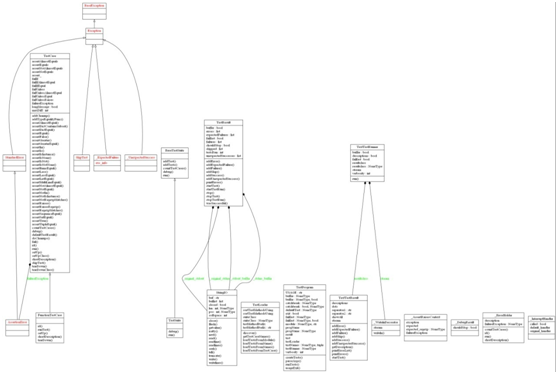
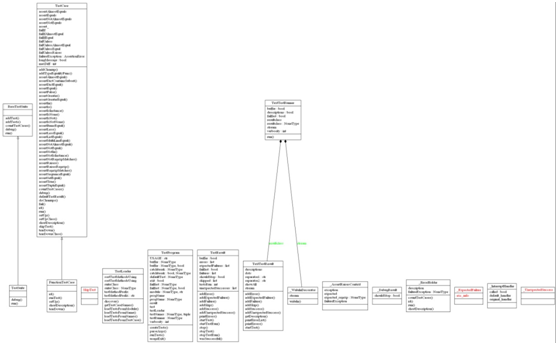

| 序号 | 修改时间  | 修改内容                                        | 修改人 | 审稿人 |
| ---- | --------- | ----------------------------------------------- | ------ | ------ |
| 1    | 2017-1-13 | 创建测试相关框架。                              | 吴启福 | 吴启福 |
| 2    | 2019-3-2  | 增加TDD/BDD框架                                 | 同上   |        |
| 3    | 2019-8-21 | 将其它文章的WEB测试工具、UI/API工具迁移到本文。 | 同上   |        |
|      |           |                                                 |        |        |
---

 

 

 

# 目录

[目录... 1](#_Toc17297257)

[1       测试框架概述... 2](#_Toc17297258)

[2       单元测试... 3](#_Toc17297259)

[2.1        cppunit 3](#_Toc17297260)

[2.2        pyunit: unittest 3](#_Toc17297261)

[3       API测试... 6](#_Toc17297262)

[3.1        postman. 6](#_Toc17297263)

[3.2        本章参考... 6](#_Toc17297264)

[4       UI测试... 6](#_Toc17297265)

[4.1        selenium.. 6](#_Toc17297266)

[4.2        本章参考... 7](#_Toc17297267)

[5       TDD.. 7](#_Toc17297268)

[6       BDD.. 7](#_Toc17297269)

[6.1        Specipy. 8](#_Toc17297270)

[6.2        本章参考... 8](#_Toc17297271)

[7       A/B测试框架... 8](#_Toc17297272)

[8       性能测试框架... 8](#_Toc17297273)

[9       压力测试框架... 9](#_Toc17297274)

[10         WEB测试... 9](#_Toc17297275)

[10.1          测试工具... 9](#_Toc17297276)

[10.2      siege. 9](#_Toc17297277)

[10.3          本章参考... 9](#_Toc17297278)

[参考资料... 10](#_Toc17297279)

 


# 1       测试框架概述

表格 1 测试框架列表

| softwareName | Desc                                                         | currnet   version | Copyright(c)  | License | Note                                 |
| ------------ | ------------------------------------------------------------ | ----------------- | ------------- | ------- | ------------------------------------ |
| googletest   | Google's framework for writing C++ tests on a variety of platforms | 1.5.0             | 2008   google | BSD     | http://code.google.com/p/googletest/ |
| cppunit      |                                                              |                   |               |         |                                      |
| pyunit       |                                                              |                   |               |         |                                      |
|              |                                                              |                   |               |         |                                      |

 

# 2       单元测试

## 2.1     cppunit

​                                                                                                           

 

## 2.2     pyunit: unittest

NAME

​    unittest

 

FILE

​    c:\dev\python27_x86\lib\unittest\__init__.py

 

DESCRIPTION

​    Python unit testing framework, based on Erich Gamma's JUnit and Kent Beck's

​    Smalltalk testing framework.

​    

​    This module contains the core framework classes that form the basis of

​    specific test cases and suites (TestCase, TestSuite etc.), and also a

​    text-based utility class for running the tests and reporting the results

​     (TextTestRunner).

 

PACKAGE CONTENTS

​    __main__

​    case

​    loader

​    main

​    result

​    runner

​    signals

​    suite

​    test (package)

util

 

CLASSES

​    __builtin__.object

​        unittest.case.TestCase  #测试用例，定义方法中调用被调用类的方法

​            unittest.case.FunctionTestCase

​        unittest.loader.TestLoader  #测试加载器

​        unittest.main.TestProgram  #测试主程序，构造函数中会调用runTest()

​        unittest.result.TestResult  #测试结果

​            unittest.runner.TextTestResult

​        unittest.runner.TextTestRunner  

​    exceptions.Exception(exceptions.BaseException)

​        unittest.case.SkipTest

​    unittest.suite.BaseTestSuite(__builtin__.object)  #测试组合

​        unittest.suite.TestSuite

 

说明：TestProgram构造时，加载TestLoader，去分析TestCase和TestSuite（多个TestCase或TestCase中的方法的组合）。TestResult保存测试结果并最后统计输出。  

 

 

 

   

图 1 pyunit包括父类和关联的类图

 

   

图 2 pyunit

说明：TestCase

 

 

   

图 3 pyunit只含类名的类图（不含类的成员属性和方法）

 

 

# 3       API测试

## 3.1     postman

Postman 原本是一个 Chrome 浏览器的插件，现在已经提供了 Windows、MacOS 和Linux 的独立安装版本。

Web 接口的定义来决定测试内容

*  Method：GET POST PUT DELETE

*  URL: 接口的地址

*  请求参数：每个参数名字，参数的类型，参数的范围，参数是否可选，参数是否有默认值 

²  等价类：有效等价的参数，无效等价的参数

²  边界值：离点，上点，内点

²  正交试验法：×因子 ×状态

²  有的时候，参数之间关联：省，市，县（区），尤其注意非法（无效）的关联

*  断言：检查响应的内容 

²  正文：正文是否包含某些字符

²  正文：JSON 或者 XML 的键值对检查，数量检查 xx.length

²  响应的状态码：200, 403

²  响应的时间: 100ms, 200ms 

²  认证：你是否有权限访问接口

*  接口的实质对象：数据~格式和内容

 

## 3.2     本章参考

# 4       UI测试

## 4.1     selenium  

selenium 是一个web的自动化测试工具。

*  免费

*  支持多语言：C、 java、ruby、python和C#

*  支持多平台：windows、linux、MAC ，支持多浏览器：ie、ff、safari、opera、chrome

*  支持分布式测试用例的执行，可以把测试用例分布到不同的测试机器的执行，相当于分发机的功能。

 

**Selenium** **套件**

u  Selenium是一套完整的Web应用程序测试系统，它包含了测试的录制（Selenium IDE）、编写及运行（Selenium Remote Control）和测试的并行处理（Selenium Grid）。Selenium的核心Selenium Core基于JsUnit，完全由JavaScript编写，因此可运行于任何支持JavaScript的浏览器上。 

u  Selenium Core：Selenium的核心部分,它由一些纯js代码组成， 可以运行在windows/linux的不同browser上，而IDE是在core的基础上的一种应用, 通过UI实现类似QTP/Winner的脚本录制回放功能，它是Selenium IDE 和 Selenium RC 的引擎。 

u  Selenium IDE： FireFox 的一个插件，支持脚本录制。 

u  Selenium RC： Selenium Remote Control，是客户端利用各种编程语言，通过网络向Selenium Server发送指令，Selenium Server接收到测试指令后，启动浏览器并向其发出JavaScript调用实现对Html页面的全面追踪,并通过网络把执行结果返回给调用者。 

u  Selenium WD： Selenium WebDriver。Web驱动。 

u  Selenium Grid：允许同时并行地、在不同的环境上运行多个测试任务，极大地加快 Web 应用的功能测试。

 

示例1：Chromei引擎

```python
from selenium import webdriver
driver = webdriver.Chrome()
driver.get('http://radar.kuaibo.com')
print driver.title
driver.quit()

```

 

## 4.2     本章参考

 

# 5       TDD

TDD，驱动测试开发。测试先于代码开发。

# 6       BDD

BDD，形为驱动开发。鼓励开发者、QA和非技术业务互动。

 

**常见的BDD框架：**

- C – Cspec
- C++ –      CppSpec, Spec-CPP
- .Net –      NBehave, NSpecify, SpecFlow
- Groovy –      GSpec, easyb, Cuke4Duke
- PHP – PHPSpec
- Python –      Specipy
- Ruby – RSpec,      Shoulda, Cucumber

**与Java相关的BDD测试工具：**

- JBehave –      Java annotations based, Test frameworks agnostic
- Cuke4duke –      Cucumber support for JVM
- JDave – RSpec      (Ruby) inspired, Mojo 2 & Hamcrest based
- beanSpec –      Java based
- easyb – Java      based, Specifications written in Groovy
- instinct –      BDD framework for Java, providing annotations for contexts. Inspired by      Rspec
- BDoc -      Extracts behaviour from unit tests

 

## 6.1     Specipy

## 6.2     本章参考

 

# 7       A/B测试框架

A/B测试是将流量分为两部分，20%导向待测试系统A，余下流量仍指向原系统B。

运行一段时间后，比较A是否有提高。

 

# 8       性能测试框架

 

# 9       压力测试框架

 

# 10             WEB测试

## 10.1        测试工具

表格 2 web测试工具列表

| 工具           | 目的 | 测试命令                                  |
| -------------- | ---- | ----------------------------------------- |
| Apache Beac~ab |      | -c 并发数；-n 请求总数                    |
|                |      | ab -c 5 -n 1000 http://project.com/       |
|                |      | ab -c 100 -n 10000 http://project.com/    |
| http_load      |      | http_load -rate 10 -seconds 5 project.com |
| siege          |      | -c 并发数                                 |
|                |      | siege -d1 -t1M -c50 project.com           |
|                |      | siege -d1 -t1M -c200 project.com          |
|                |      | siege -d1 -t1M -c300 project.com          |

备注：1. 每一次执行命令行，需要重启测试框架，以清除上次测试影响。

\2. 测试主要关注项：(ps aux: VSZ, RSS, %CPU, %MEM).

## 10.2        siege

siege - An HTTP/HTTPS stress tester. 

Siege is a multi-threaded http load testing and benchmarking utility.  It was designed to let web developers measure the performance of their code under duress.  It allows one to hit a web server with a configurable number of concurrent simulated users. Those users place the webserver "under siege."  Performance measures include elapsed time, total data transferred, server response time, its transaction rate, its throughput, its concurrency and the number of times it returned OK. These measures are quantified and reported at the end of each run.  Their meaning and significance is discussed below.  Siege has essentially three modes of operation: regression (when invoked by bombardment), internet simulation and brute force.

 

## 10.3        本章参考

[1].    6种Web框架测评 http://www.alrond.com/en/2007/jan/25/performance-test-of-6-leading-frameworks/ 

[2].    [kenjis / php-framework-benchmark ](https://github.com/kenjis/php-framework-benchmark) https://github.com/kenjis/php-framework-benchmark 

 

# 参考资料