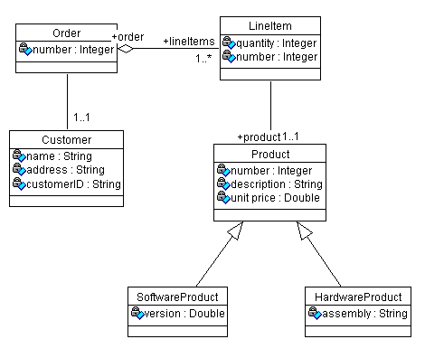
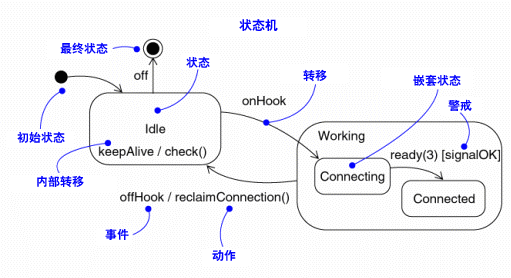
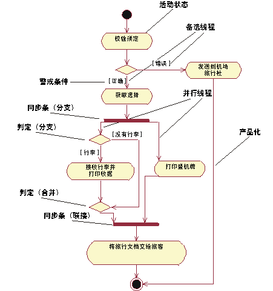
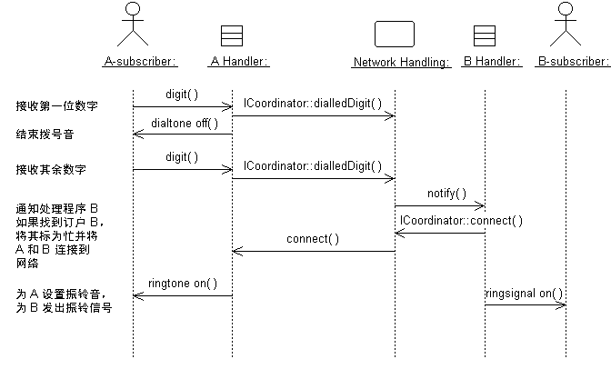
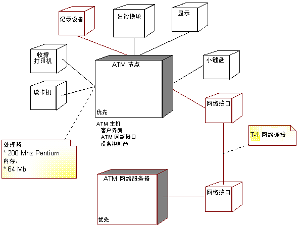

| 序号 | 修改时间  | 修改内容      | 修改人 | 审稿人 |
| ---- | --------- | ------------------ | ------ | ------ |
| 1    | 2006-2007 | 创建     | 吴启福 | 吴启福 |
| 2    | 2012-4-27 | 增加组件图说明     | 同上   |   |
| 3    | 2017-1-10 | 规范文档和目录调整 | 同上   |   |
| 4    | 2017-9-17 | 增加建模工具章节   | 同上   |   |

 

 

 

---

# 目录

[目录... 1](#_Toc493375000)

[1  用例视图UseCase View.. 2](#_Toc493375001)

[1.1   用例图UseCase Diagram.. 2](#_Toc493375002)

[1.1.1    用例图关系(难点) 2](#_Toc493375003)

[1.1.2    示例... 2](#_Toc493375004)

[2  逻辑视图Logic. 4](#_Toc493375005)

[2.1   类图 Class Diagram.. 4](#_Toc493375006)

[2.1.1    类图关系(难点) 4](#_Toc493375007)

[2.2   状态图 StateChart Diagram.. 5](#_Toc493375008)

[2.2.1    状态... 5](#_Toc493375009)

[2.3   活动图 Activity Diagram.. 6](#_Toc493375010)

[2.3.1    使用泳道... 7](#_Toc493375011)

[2.4   序列图... 7](#_Toc493375012)

[2.4.1    序列图的内容... 8](#_Toc493375013)

[3  组件视图Component 8](#_Toc493375014)

[3.1   双向工程... 8](#_Toc493375015)

[3.2   组件图... 9](#_Toc493375016)

[3.3   对象图... 10](#_Toc493375017)

[4  部署视图Develoyment 10](#_Toc493375018)

[4.1   deployment diagram.. 10](#_Toc493375019)

[5  小结... 11](#_Toc493375020)

[5.1   Rose的九种图... 11](#_Toc493375021)

[5.2   Rose图在软件工程各阶段的使用... 12](#_Toc493375022)

[5.3   Discuss 12](#_Toc493375023)

[6  附录... 13](#_Toc493375024)

[6.1   参考资料... 13](#_Toc493375025)

[6.2   常见建模工具... 13](#_Toc493375026)

 

[TOC]

 

 

# 1  用例视图UseCase View

[需求](file:///D:\STUDY\RationalUnifiedProcess.zh_cn\process\workflow\ovu_req.htm)工作流程中使用了名为用例视图的[构架视图](file:///D:\STUDY\RationalUnifiedProcess.zh_cn\process\workflow\ana_desi\co_swarch.htm)，用例视图是其它视图的核心，它的内容直接驱动其它视图的开发。它主要是作为需求分析阶段的一个主要利器，是外部用户所能观察到的功能。 

## 1.1    用例图UseCase Diagram

角色(Role)： 参与者， 用例     

参与者之间的关系： 泛化(超类)

参与者与用例的关系：关联association，实例化

用例之间的关系：关联association，相识(包含include与扩展exterd), 泛化generalization

### 1.1.1     用例图关系(难点)

[包含关系](file:///D:\STUDY\RationalUnifiedProcess.zh_cn\process\modguide\md_incl.htm)：如果基本用例中有一部分功能，该用例的执行与否由它的结果唯一决定，而不是由产生该结果的方法来决定，则可以将这一部分功能分离出来，放到一个附加用例中。采用包含关系，可以将附加用例显式插入基本用例中。

[扩展关系](file:///D:\STUDY\RationalUnifiedProcess.zh_cn\process\modguide\md_exrel.htm)：如果基本用例的一部分是可选的，或对于理解该用例的主要目的来说不是必需的，那么您可以将这部分分离出来，形成一个附加用例，以简化基本用例的结构。利用扩展关系，可以将附加用例隐式插入基本用例中。

[泛化关系](file:///D:\STUDY\RationalUnifiedProcess.zh_cn\process\modguide\md_ucgen.htm)：基本用例(父用例)与附加用例(子用例)之间的关系，之间使用继承。

### 1.1.2     示例

以订单管理系统的用例模型部分为例进行说明。

在本图中，具体用例分别是“电话订购”（由客户主角发出）和“Internet 订购”（由 Internet 客户发出）。这些用例都是更普通的“订购”用例的变形。在本示例中，“订购”用例是一个抽象用例。“索要目录”用例代表一个可选行为段，它不是“订购”用例主要目标的组成部分。它已经被分离出来，形成了一个抽象用例，用于简化“订购”用例。“提供客户数据”用例是一个已分离出的行为段。它之所以被分离出来，是因为它是一个独立功能，只有它的结果才能影响“订购”用例。“提供客户数据”用例还可以在其他用例中复用。“索要目录”用例和“提供客户数据”用例在本示例中都属于抽象用例。

（批注：什么是抽象用例? 父用例通常是抽象用例。抽象用例是把相似的部分从几个用例中抽象出一个,单独作为用例,该用例与其它用例形成包含关系.[?或者泛化关系]）

本用例图显示订单管理系统的用户模型部分。

下表显示了三个不同用例关系之间更详细的比较：

| 问题       | 扩展关系      | 包含关系              | 泛化关系           |
| ------------------------ | ---------------------- | ------------------------------------------------------------ | ------------------------------------------ |
| 该关系有什么方向？  | 附加用例引用基本用例。 | 基本用例引用附加用例。              | 附加用例（子用例）引用基本用例（父用例）。 |
| 关系是否存在多重性？     | 是，在附加用例一方。   | 否。如果您希望不只一次包含相同的行为段，则必须在基本用例中声明。 | 否。              |
| 该关系是否存在某个条件？ | 是。         | 否。如果您希望在该包含关系中表达某个条件，则必须在基本用例中明确说明。 | 否。              |
| 附加用例是否为抽象用例？ | 通常是，但不一定。     | 是。                 | 通常不是，但也有可能        |

 

# 2    逻辑视图Logic

逻辑视图用来描述用例视图中提出的系统功能的实现，该视图以图形方式说明关键的用例实现、子系统、包和类，它们包含了在构架方面具有重要意义的行为。逻辑视图在每次迭代过程中都会加以改进，主要是作为概要设计，详细设计阶段的主要利器。

## 2.1    类图 Class Diagram 

类图显示了一组说明性（静态）的模型元素，例如：类、包以及它们的内容和关系。

 

边界类用于对一个或多个主角与系统之间的交互进行建模。

实体类代表受控的信息单元；

抽象类和具体类：如果某个类未被实例化，并且只是为了让其他类继承它而存在，那么它就是抽象类。而实际上被实例化的类则是具体类。请注意，抽象类要成为有用的类，必须至少有一个后代。

### 2.1.1   类图关系(难点)

关联关系: 关联关系表示不同类的对象之间的结构关系，它在一段时间内将多个类的实例连接在一起（这与依赖关系不同，依赖关系表示两个实例之间的临时关联关系）。有时，对象必须相互引用才能实现交互，例如互相发送消息。

 

聚合关系: 聚合关系用于对模型元素之间的组装关系进行建模。有许多组成关系的示例：图书馆包括大量的书籍，公司部门由雇员组成，计算机由许多设备组成。如果对此进行建模，那么聚合关系体（部门）与其组成部分（雇员）之间存在聚合关系关联关系。在关联关系路径上，用位于聚合关系体端的空心菱形来表示聚合。

 

泛化关系: 泛化关系表示一个类对另一个类的继承。继承而得的类称为后代。被继承的类称为祖先。

 

聚合关系或者关联关系？ 

仅当类之间存在组装关系（即一个类由其他的类组成，或者“部分”游离于整体之外就会显得不完全）时才能使用聚合关系。以订单为例：如果订单为“空”或不包含任何内容，那么订单就毫无意义。对于所有聚合关系来说也是如此：部门必须有雇员，家庭必须有家庭成员，等等。

如果类脱离其他类所形成的环境后仍可能有自己的身份，或者类不是某个更大整体的部分，则应使用关联关系。此外，在没有把握的情况下，关联关系将更为合适；而聚合关系一般比较明显，所以选择聚合关系仅仅是为了更加明确。这对建模工作的成败并不具有决定性的意义。

 

描述关联关系和聚合关系的类图示例如下：

 

## 2.2    状态图 StateChart Diagram

状态图显示一个状态机。状态机是一种行为，说明一个对象在其生命期中对事件进行响应而经过的一系列状态及其响应和操作。

### 2.2.1   状态 

状态是对象执行某项活动或等待某个事件时的条件。对象可能会在有限的时间长度内保持某一状态。状态具有以下几项特征：

| 名称        | 将一个状态与其他状态区分开来的文本字符串；状态也可能是匿名的，这表示它没有名称。 |
| ------------------------- | ------------------------------------------------------------ |
| 进入/退出操作 | 在进入和退出状态时所执行的操作。         |
| 内部转移    | 在不使状态发生变更的情况下进行的转移。        |
| 子状态      | 状态的嵌套结构，包括不相连的（依次处于活动状态的）或并行的（同时处于活动状态的）子状态。 |
| 延迟的事件       | 未在该状态中处理但被延迟处理（即列队等待由另一个状态中的对象来处理）的一系列事件。 |

如图 1 所示，可以为对象的状态机定义两种特殊的状态。初始状态指示状态机或子状态的默认起始位置。初始状态被描绘为黑色的实心圆。终止状态指示状态机的执行过程已完成，或者包含状态已完成。终止状态被描绘为外套空圆的黑色实心圆。初始状态和终止状态实际上是伪状态。除了名称外，它们都没有常规状态通常所具有的部分。从初始状态到终止状态的转移可以具有全部特性（包括警戒条件和操作），但也可能没有触发事件。

图 1：状态机符号

 

## 2.3    活动图 Activity Diagram

活动图是状态图的一种特殊形式。其中所有或多数状态都是活动状态，而且所有或多数转移都在源状态中的活动完成时立即触发。活动图支持嵌套。

一个活动图可能包括以下元素： 

* 活动状态表示在工作流程中执行某个活动或步骤。 

* 转移表示各种活动状态的先后顺序。这种转移可称为完成转移。它不同于一般的转移，因为它不需要明显的触发器事件，而是通过完成活动（用活动状态表示）来触发。 

* 决策，为其定义了一组警戒条件。这些警戒条件决定在活动完成后将执行一组备选转移中的哪一个转移。您也可以使用判定图标来表示线程重新合并的位置。决策和警戒条件使您能够显示业务用例的工作流程中的备选线程。 

* 同步示意条用于显示平行分支流。同步示意条使您能够显示业务用例的工作流程中的并行线程。 

“机场登记”业务用例模型中“个人登记”业务用例的活动图

### 2.3.1     使用泳道 

可以使用垂直实线将活动图划分为泳道。每条泳道代表整个工作流程的某个部分的职责，该职责由组织的某个部门来执行。泳道最终可以由组织单元或者业务对象模型中的一组类来实施。

 

## 2.4    序列图

多数情况下，我们使用序列图来阐明用例实现。在典型的组织结构中，主事件流将有一个序列图，而每个独立的用例分支流都分别有一个序列图。序列图显示了消息的明确顺序，所以更适用于实时的规约和复杂的场景。

### 2.4.1   序列图的内容 

  在序列图中可以有对象和主角实例，以及说明它们如何交互的消息。序列图描述了在参与交互的对象中所发生的事件（从激活的角度来说明），以及这些对象如何通过相互发送消息进行通信。您可以为用例事件流的各种不同形式制作序列图。

以上序列图描述了一个简单的电话交换机中的用例拨打本地电话的部分事件流。

 

# 3    组件视图Component

  组件视图(component view)，体现了系统实现的结构和行为特征，也称为实现模型视图(implementation model view), 在本视图中，可使用ROSE强大的代码与模型转化的功能，进行用模型生成代码的正向工程，也可由代码生成模型的逆向工程．

## 3.1    双向工程

1).正向工程： 根据模型框图生成指定语言的代码

步骤：需要在组件图（component view）中创建一个组件（component），设置好需要进行转换的组件的信息，open Sepcification...-->Realizes -->assign（选择要生成代码的类），最后Generate Code确定后就生成代码了．

 

2).逆向工程产生模型：根据选择开发应用程序的语言生成对应的程序的代码。 

步骤：需要在组件图（component view）中创建一个组件（component），设置好需要进行转换的组件的信息，也就是该组件的语言、所包含的文件、文件所在的路径、文件后缀等等信息，然后Reverse Engineer就可以根据给定的信息将代码转换成类图．

 

说明：A->B，在箭头方向，＋表示A类有B类的一个对象，反之用－．聚集符号的聚集一方表示是多数，整体；若箭头无方向，则表示是一种相互关联关系，通常是交叉关联，不太好的一种关联．

## 3.2    组件图

组件：表示代码的物理模块。组件可以包括代码库和运行文件。组件之间的关系只有依赖性关系。依赖性要求一个类要在另一个类之前编译。

组件图component diagram，描述了实现系统的元素的组织.

在UML2之前，组件图中的组件是作为类的一种特殊形式存在。

 

组件图的组成元素：

(1)、组件

Rose中的组件即一般意义上的组件。也可以用构造型来指定组件类型(如ActiveX、Applet、Application、DLL和Executable等)。

(2)、main program主程序

主程序是包含程序根的文件。 

(3)、subprog子程序规范，子程序体

子程序规范(SubprogramSpecification)通常是一组子程序集合名，子程序中不包括类定义。

子程序体

(4)、package包规范，包体

包是类的实现方法。包规范(PackageSpecification)是类的头文件，包含类中函数的原型信息，包体(PackageBody)包含类操作代码。在C++中，包规范就是.h文件，包体就是.cpp文件。

(5)、task任务规范，任务体

UML组件图中任务表示具有独立控制线程的包。可执行文件通常表示为扩展名为.exe的任务规范。

(6)、数据库

数据库可能含有一个或几个结构。

(7)　其它：虚包，虚子程序，接口

小结：组件图中的xx规范通常是指文件声明，如.h，xx体则是操作文件，如.cpp。

 

组件图示例：

 

## 3.3   对象图

 

# 4    部署视图Develoyment

配置/部署视图(deployment view)，体现了系统实现环境的结构和行为特征，也称为环境模型视图（environment model view）或物理视图(physical view)。

 

## 4.1    deployment diagram

系统只有一个部署视图，它以图形方式说明了处理活动在系统中各节点的分布，包括进程和线程的物理分布。部署视图在每次迭代过程中都会加以改进。*只有在分布式系统中才需要该视图。*

部署视图表示了处理活动在系统中的物理分布。

 

# 5    小结

## 5.1    Rose的九种图

表格 1 ROSE里的UML图比较

| UML图diagram    | 功能                | 应用场景     |
| -------------------- | ------------------------------------------------------ | ---------------------- |
| 用例图use case  | 从用户角度，描述系统功能。         | 需求分析      |
| 类图class       | 描述系统的静态结构            | 概要设计、详细设计 |
| 对象图object diagram | 描述系统在某个时刻的静态结构            | 概要设计      |
| 序列图sequence  | 按时间顺序描述系统元素间的交互          | 概要设计、详细设计 |
| 协作图Collaboration  | 按照时间和空间顺序描述系统元素间的交互和它们之间的关系 | 概要设计      |
| 状态图state     | 描述了系统元素的状态条件和响应          | 概要设计      |
| 活动图activity  | 描述了系统元素的活动          | 概要设计、详细设计 |
| 组件图component      | 描述了实现系统的元素的组织         | 编码和测试    |
| 配置图deployment     | 描述了环境元素的配置并把实现系统的元素映射到配置上     | 发布上线      |

备注：根据它们在不同架构视图的应用，可以把9 种图分成五类（UML五类图）：
* 用户模型视图：用例图
* 结构模型视图：类图、对象图
* 行为模型视图：序列图、协作图、状态图、活动图（动态图）
* 实现模型视图：组件图
* 环境模型视图：配置图

 

## 5.2    Rose图在软件工程各阶段的使用

表格 2 ROSE在软件工程各阶段的使用框图

| 阶段      | 任务                 | UML图               |
| -------------- | ------------------------------------------------------------ | -------------------------------------------- |
| 需求分析  | 建立用户需求和功能模块，确定系统中的角色和使用案例。利用ROSE，生成角色，使用案例和生成用例图 | 用例图              |
| 概要设计  | 通过分析Use-Case Diagrams ，得到所用到的类，分析这些类的属性、操作和它们之间的关系。 | 概要类图，概要序列图，协作图，状态图，活动图 |
| 详细设计  | 细化和个性Use-Case 的描述 ，如类的操作和对象之间的消息相对应，填充参数及复杂的类的设计。 | 详细类图，详细序列图，活动图       |
| 编码和测试 | 进行软件的开发和测试，生成组件框图。          | 组件框图            |
| 发布上线  | 根据机器设备，网络状况布置软件           | 布置视图            |

 

## 5.3   Discuss

  在现实世界的软件开发中，很多人没有形成设计的概念，而不同的人对设计又有其理解．一般而言，大家可以根据自己的需要制订在各阶段所需的图，通常不可缺少的是需求分析的用例图，设计时的类图，活动图（用来描述较复杂的算法逻辑），序列图，状态图（如果出现了自动机模型）．

 

一些个人理解（欢仰拍砖）：

1）对象类与类图基本类似，通常一个类就是一个对象，所以类又称为对象类．对象图基本可免。在Java语言里，对象是抽象类；在C++语言里，对象与类没有明显区分。

2）在UML2.0规定的13种图中，ROSE提供了9种，没提供的其它几种也可由其它图表示出来，也就是说，这些图可以通用，只是在某些特殊场合才作详细区分．

 

# 附录

## 参考资料

[1]      RationalUnifiedProcess    IBM   2005

[2]      建模工具Rose 的学习.pdf     

[3]      利用Rational Rose进行C++代码和数据库结构分析  2006.6

[4]      http://www.ibm.com/developerworks/cn/rational/r-shenzj/

[5]      UML建模三个工具: StarUML ,Telelogic TAU 和 Rose http://www.cnblogs.com/tearer/archive/2010/07/30/1788990.html 

[6]      解析十二个优秀的开源UML工具用法 [http://www.makaidong.com/%E5%8D%9A%E5%AE%A2%E5%9B%AD%E9%97%AE%E7%AD%94/7438.shtml](http://www.makaidong.com/博客园问答/7438.shtml) 

 

 
