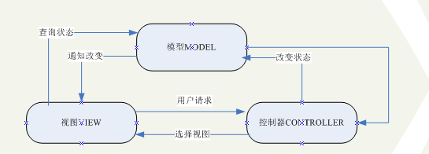
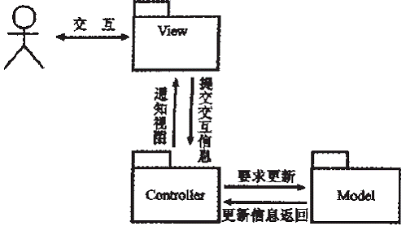
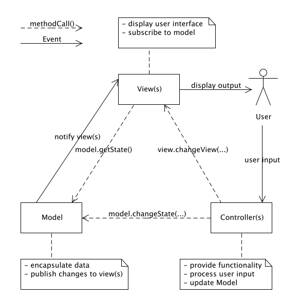
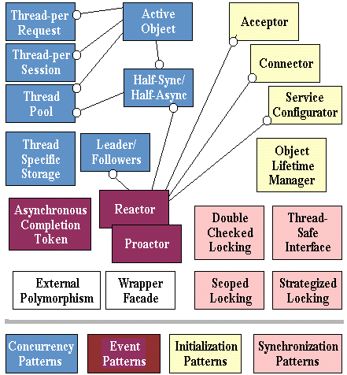
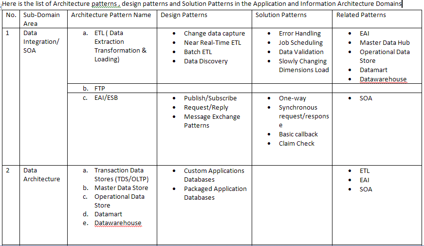

| 序号 | 修改时间   | 修改内容                       | 修改人 | 审稿人 |
| ---- | ---------- | ------------------------------------------------------- | ------ | ------ |
| 1    | 2009-7     | 创建                           | 吴启福 | 吴启福 |
| 2    | 2009-12-26 | 增加了AOP, MDA的内容。                   | 同上   |        |
| 3    | 2010-1-5   | 将软件架构方面的知识集中到《软件架构》文档,增加中间件。 | 同上   |        |
| 4    | 2010-5-15  | 将网站架构部分移动到 《SNS社区开发》文档。         | 同上   |        |
| 5    | 2010-5-19  | 增加架构与模式的关系，MVC模式章节。           | 同上   |        |
| 6    | 2010-11-17 | 增加分布式模式POSA4章节。                | 同上   |        |
| 7    | 2017-2-11  | 调整目录结构，增加软件设计理论/工具章节            | 同上   |        |
| 8    | 2017-9-28  | 增加软件设计工具章节                | 同上   |        |
| 9    | 2018-3-15  | 增加ORM章节                    | 同上   |        |
| 10   | 2018-7-14  | 增加模式集合章节                    | 同上   |        |
|      |       |                           |        |        |
---


 目录................................................................................................................................ 1

1..... 概述......................................................................................................................... 3

1.1     基本概念....................................................................................................... 3

1.2     软件复用粒度................................................................................................ 4

2..... 软件设计模式(Design Pattern)................................................................................. 4

2.1     设计模式使用规则......................................................................................... 5

2.2     常见设计模式................................................................................................ 6

1)    GoF 23种模式.......................................................................................... 6

2)    AOP—面向方面的编程............................................................................. 8

3)    MVC模式................................................................................................. 8

4)    ORM对象关系映射................................................................................. 12

5)    prefork模式............................................................................................ 13

2.3     POSA面向模式的体系结构.......................................................................... 13

1)    并发和网络化对象模式 (POSA2)............................................................ 13

2)    资源管理模式 (POSA3).......................................................................... 15

3)    分布式模式(POSA4)................................................................................ 15

4)    模式与模式语言(POSA5)......................................................................... 15

2.4     云原生的设计模式....................................................................................... 16

2.5     模式集合..................................................................................................... 16

2.5.1    模式集合的组织方式.......................................................................... 16

2.5.2    领域架构的模式列表.......................................................................... 17

2.6     本章参考..................................................................................................... 20

3..... 软件体系结构(Software Architecture)..................................................................... 20

4..... 软件设计理论........................................................................................................ 21

4.1     软件三原则.................................................................................................. 21

4.2     面向对象的设计OO..................................................................................... 21

4.2.1    SOLID原则........................................................................................ 21

4.2.2    GRASP原则....................................................................................... 22

4.3     面向构件的设计........................................................................................... 23

4.4     UML建模.................................................................................................... 24

4.5     数据流图..................................................................................................... 25

4.6     本章参考..................................................................................................... 25

5..... 软件设计工具........................................................................................................ 25

5.1     ROSE.......................................................................................................... 26

5.2     Visio............................................................................................................ 26

5.3     EA.............................................................................................................. 26

参考资料Reference....................................................................................................... 26

参考链接................................................................................................................. 26

参考书目................................................................................................................. 26

附录.............................................................................................................................. 28

软件开发大事记...................................................................................................... 28

模式列表................................................................................................................. 28

 

**表目录**

[表格 1 名词定义表__ 3](#_Toc25486082)

[表格 2 GOF 23种模式分类列表__ 6](#_Toc25486083)

[表格 3 常见ORM产品列表__ 12](#_Toc25486084)

[表格 4 POSA2的4组场景列表__ 13](#_Toc25486085)

[表格 5 POSA3的模式列表__ 15](#_Toc25486086)

[表格 6 模式集合的组织方式列表__ 16](#_Toc25486087)

[表格 7 意图组织的流派分类__ 16](#_Toc25486088)

[表格 8 架构模式（维基百科2018版）__ 17](#_Toc25486089)

[表格 9 SOLID原则详解__ 21](#_Toc25486090)

[表格 10 GRASP原则详解__ 22](#_Toc25486091)

[表格 11 UML版本变化史__ 24](#_Toc25486092)

[表格 12 UML五类别图详述__ 24](#_Toc25486093)

[表格 13 软件设计工具列表__ 25](#_Toc25486094)

------

[TOC]


# 1       概述
## 1.1   基本概念
软件工程过程中包括软件的分析和设计。其中软件分析是为了知道做什么，根据需求得出模型。 而软件设计则是要怎么做，在前面基础上做出软件的体系结构，并对模型进行算法填充和数据结构支持。

表格 1 名词定义表

| 名词            | 定义                           |
| ------------------------- | ------------------------------------------------------------ |
| 设计模式        |                                |
| 体系结构/架构Architecture | 架构不等同于设计，但包括设计，体系结构不仅要考虑技术结构，还要考虑服务结构，就是开发内外都要兼及。 |
| 软件工程        | 参考了建筑学的模式， 数学的建模， 经济学中的成本估算， 工程学中的产品周期。 |
| 用例            | usecase是[软件工程](http://zh.wikipedia.org/zh-cn/软件工程)或[系统工程](http://zh.wikipedia.org/zh-cn/系统工程)中对系统如何反应外界请求的描述，是一种通过用户的使用场景来获取需求的技术。 每个用例提供了一个或多个场景，该场景说明了系统是如何同最终用户或其它系统交互(interact)的，也就是谁可以用系统做什么，从而获得一个明确的业务目标。 |
| 功能            | function，工程学上定义为一个特性/属性的用途。     [Function (biology)](http://en.wikipedia.org/wiki/Function_(biology)),   explaining why a feature survived selection      [Function   (mathematics)](http://en.wikipedia.org/wiki/Function_(mathematics)), an abstract entity that associates an input to a   corresponding output according to some rule      [Function   (engineering)](http://en.wikipedia.org/wiki/Function_(engineering)), related to the utility/goal of a property      [Function   (computer science)](http://en.wikipedia.org/wiki/Function_(computer_science)), or subroutine, a portion of code within a larger   program, performs a specific task |
| 中间件           | 中间件处在[操作系统](http://www.qqread.com/tag/1182/index.html#_blank)和更高一级应用程序之间。他充当的功能是将应用程序运行环境与操作系统隔离，从而实现应用程序开发者不必为更多系统问题忧虑，而直接关注该应用程序在解决问题上的能力。如容器的概念就是中间件的一种，包括WEB服务器, EJB容器。 |

软件工程和软件体系结构
* 软件工程参考了建筑学的模式，数学的建模，经济学中的成本估算，工程学中的产品周期。
软件体系结构虽然脱胎于软件工程，但形成中也参考了计算机的体系结构，网络的体系结构。


## 1.2   软件复用粒度

如何评价软件质量?
主要准则是：模块化、抽象、低耦合、高内聚等。

复用粒度：体系结构 > 框架framework > 设计模式design model > 子程序


# 2  软件设计模式(Design Pattern)

Design Pattern Definition 
Patterns are a recent software engineering problem-solving discipline that emerged from the object-oriented community. Patterns have roots in many disciplines, including literate programming, and most notably in Alexander's work on urban planning and building architecture. (Alexander, 1977).

The goal of the pattern community is to build a body of literature to support design and development in general. There is less focus on technology than on a culture to document and support sound design. Software patterns first became popular with the object-oriented [Design Patterns book](http://hillside.net/books) (Gamma et. al., 1995). But patterns have been used for domains as diverse as development organization and process, exposition and teaching, and software architecture. At this writing, the software community is using patterns largely for software architecture and design.

定义1：（GOF95）三元组｛problem, context, solutions }
设计模式描述规范Description 
```shell
Name:
Problem:
Context：
Forces:
Solution:
Resulting Context:
Releation:
```
设计模式可用三元组来说明，模式＝｛problem, context, solutions } = {问题，语境，解}。
如facade, Adapter这两种模式的类图都一样，即解相同，但因于这者用来解决的问题和语境不同，facade是为了提供一个用户易用的接口，将内部实现隐藏，简化用户使用；而adapter是为了重用另一个接口的实现。所以这两种是两种模式。

定义2：（POSA96）组件-连接-组件
软件架构模式描述的是在一定设计上下文中反复出现的某个特定的设计问题，并提出一个已被证明的解决方案的一般性结构。此解决方案包括对主要组件的描述，组件的职责和关系，以及组件之间协作的方式。

设计模式用于应用程序、工具箱和框架。
* 应用程序是软件一级了，要用软件模式来考虑其可维护，可扩充性，具体可参观软件架构。
* 工具箱强调代码复用，要避免假设和依赖，能适应各种硬件平台，操作的变化（子程序库，提供通用功能，可被应用层轻易调用）。
* 框架是一组相互协作的类，常用于某个领域的解决方案。
## 2.1   设计模式使用规则
1）模型用途和分类
模式声明了类可使用的数据和操作。
模式分类，一是范围准则，凡是类的使用继承机制来达到对象的创建或者对象的某些操作延迟到子类中实现，这是编译时确定，为静态关系；凡是对象多使用委托等 多种组合方式，为运行时动态确定．二是目的准则，创建型与对象的创建相关，结构型处理类或对象的组合，行为型描述类或对象之间的交互。

2）C++两大机制－－继承和多态
* 继承－编译时静态确定。
* 多态－运行时动态确定。
多态的实现方式：
a).C++中的虚表和虚指针; 
b).small talk中的按函数名查表。

3）复用机制
* 继承–继承就是类间继承关系，编译时确定的静态结构；
* 组合–组合包括了委托（对象和对象指针引用），聚集（整体和部分），依赖（用虚线表示），相识（可以认为是委托的别名，箭头是有向的），这是运行时刻确实的，多态的一种体现．
* 参数化类型–即模板，非严格的面向对象。

4）面向对象的基本概念
a). 类的结构分类：可分成抽象类，具体类。具体类中不可实例化的则是混合类。
b). 类的用途分类：边界类，控制类和业务类，eg：MVC中的V－C－M（视图，控制，模型）。
c). 类之间的关系：继承 + 组合（聚集+委托+依赖，其中箭头都是有向的）。

* 委托:就是对象引用或对象指针引用,相识也是这个概念，箭头是有向的。
* 聚集：就是整体和部分非常密切的关系，如书籍和书，书的集合只能是书籍，书籍只能是书的集合，在实现中，常表现为整体对象使用了部分对象的基类。

5) 几个经验
a).多个对象模式：composite, observer
b).针对接口编程，而非实现，因此要尽量使用抽象类声明的接口。

## 2.2   常见设计模式

| 模式   | 简介                           | 编程语言             | 应用场景              | 框架            |
| ------ | ------------------------------------------------------------ | ------------------------------ | ------------------------------- | ------------------------- |
| GOF 23 | 最早来自GOF四 人帮的书。                 | OO语言如C++/Java/smalltalk/... |                  |            |
| AOP    | 面向切面Aspect的编程。OOP的延续。考虑业务之外的横向功能如安全、事务处理等等。使用了代理模式。 | Java            | 用以J2EE容器服务器。       | Java   Spring        |
| IOC    | 控制反转，Inversion of Control。使用了工厂方法。        | Java            | 比如用xml配置文件配置依赖组件。 | Java   Spring |
| MVC    |                                | Java/Python/JS            | 各种WEB框架           | Java   Struts        |
| ORM    | OO和DB之间的映射。                       | Java、Python     |                  | Hibrnate、iBATIS、TopLink、SQLAlchemy |
|        |                                |                 |                  |            |

### GoF 23种模式
下表来自 [1] 
表格 2 GOF 23种模式分类列表

|      | 创建型                         | 结构型                         | 行为型                         |
| ---- | ------------------------------------------------------------ | ------------------------------------------------------------ | ------------------------------------------------------------ |
| 类   | [Factory Method](mk:@MSITStore:D:设计模式迷你手册.chm::/设计模式迷你手册.htm#FactoryMethod%23FactoryMethod) | [Adapter_Class](mk:@MSITStore:D:设计模式迷你手册.chm::/设计模式迷你手册.htm#Adapter_Class%23Adapter_Class) | [Interpreter](mk:@MSITStore:D:设计模式迷你手册.chm::/设计模式迷你手册.htm#Interpreter%23Interpreter)    [Template Method](mk:@MSITStore:D:设计模式迷你手册.chm::/设计模式迷你手册.htm#TemplateMethod%23TemplateMethod) |
| 对象 | [Abstract Factory](mk:@MSITStore:D:设计模式迷你手册.chm::/设计模式迷你手册.htm#AbstractFactory%23AbstractFactory)    [Builder](mk:@MSITStore:D:设计模式迷你手册.chm::/设计模式迷你手册.htm#Builder%23Builder)    [Prototype](mk:@MSITStore:D:设计模式迷你手册.chm::/设计模式迷你手册.htm#Prototype%23Prototype)    [Singleton](mk:@MSITStore:D:设计模式迷你手册.chm::/设计模式迷你手册.htm#Singleton%23Singleton) | [Adapter_Object](mk:@MSITStore:D:设计模式迷你手册.chm::/设计模式迷你手册.htm#Adapter_Object%23Adapter_Object)    [Bridge](mk:@MSITStore:D:设计模式迷你手册.chm::/设计模式迷你手册.htm#Bridge%23Bridge)    [Composite](mk:@MSITStore:D:设计模式迷你手册.chm::/设计模式迷你手册.htm#Composite%23Composite)    [Decorator](mk:@MSITStore:D:设计模式迷你手册.chm::/设计模式迷你手册.htm#Decorator%23Decorator)    [Facade](mk:@MSITStore:D:设计模式迷你手册.chm::/设计模式迷你手册.htm#Facade%23Facade)    [Flyweight](mk:@MSITStore:D:设计模式迷你手册.chm::/设计模式迷你手册.htm#Flyweight%23Flyweight)    [Proxy](mk:@MSITStore:D:设计模式迷你手册.chm::/设计模式迷你手册.htm#Proxy%23Proxy) | [Chain of Responsibility](mk:@MSITStore:D:设计模式迷你手册.chm::/设计模式迷你手册.htm#ChainofResponsibility%23ChainofResponsibility)    [Command](mk:@MSITStore:D:设计模式迷你手册.chm::/设计模式迷你手册.htm#Command%23Command)    [Iterator](mk:@MSITStore:D:设计模式迷你手册.chm::/设计模式迷你手册.htm#Iterator%23Iterator)    [Mediator](mk:@MSITStore:D:设计模式迷你手册.chm::/设计模式迷你手册.htm#Mediator%23Mediator)    [Memento](mk:@MSITStore:D:设计模式迷你手册.chm::/设计模式迷你手册.htm#Memento%23Memento)    [Observer](mk:@MSITStore:D:设计模式迷你手册.chm::/设计模式迷你手册.htm#Observer%23Observer)    [State](mk:@MSITStore:D:设计模式迷你手册.chm::/设计模式迷你手册.htm#State%23State)    [Strategy](mk:@MSITStore:D:设计模式迷你手册.chm::/设计模式迷你手册.htm#Strategy%23Strategy)    [Visitor](mk:@MSITStore:D:设计模式迷你手册.chm::/设计模式迷你手册.htm#Visitor%23Visitor) |

5 create type
* factory mehod： 用一个类来直接创建对象，对象的实例化可以延续到子类，所用的就是创建类;
* abstract factory： 用一个对象提供的接口来间接创建对象.使用对象为就是抽象工厂
* builer： 将复杂对象的构造与表示相分离，director是个复杂对象，它的创建由builder来创建，builder创建各种对象，然后这些对象就组成 director(整体与部分的关系)，区别abstract factory在于抽象工厂只提供创建外部对象的接口。
* prototype： 不用对象的构造函数，直接clone现有对象。
* singleton： 保证唯一对象存在，使用static 自身对象指针。

 8 struct type
* adapter： 典型的组合方式，一是类中使用对象或对象指针引用adapter_object;二是多重继承adapter_class。
* bridge： 将抽象部分与实现部分分离，用brideg用抽象与实现分离开，此为模式名来源。
* composite： 单个对象和组合对象使用具有一致性。
* decorator： 比子类继承更灵活的添加额外功能???
* facade：
* proxy： 通过对象引用，让另外一个对象来使用另外一个对象的方法.与adapter_object很类似， 不过，adapter_object引用的可以是没有任何关系的对象，可以认为proxy是adapter_object的一种特殊情形。
* flyweight：　共享技术，将属性中可能大量存在相同值保存在别的容器中，并用一个对象去管理它，如一本书的出版社，作者。

11 action type
* temple method： 将一个操作分为几步，通过调用类的若干个成员保护函数，而成员保护函数可以在派生类中重载，达到了某些操作延迟到子类效果，常用于改变算法步骤而不改变整个算法的情形。
* chains： 通过自身函数的重载，virtual， 实现请求能被不同对象接收，并最终处理。
* command： 将请求封装为对象，引入接收者可将请求参数化。
* memento： 用一个对象来保存另外一个对象的状态，应用实例：redo，undo操作。
* iterator： STL中6大组件之一，访问容器而不暴露容器的表示。
* observer： 监视一个对象，当对象发生改变时，所有监视者也都改变，监视者通过构造函数传入一个被监视者的对象指针;而被监视者则拥有一个监视者的对象指针数组(或对象指针的其它集合方式)，如ＩＭ中在线状态通知。
* state：　很简单就是使用委托的方式来改变另外一个类的数据成员状态或者说把状态当成对象，如动态改变交通灯，红，绿灯为状态对象。
* stratery： 同state，不过是把算法作为一个对象，使用委托方式来动态改变使用哪种算法。
* visitor：　双分派，一种操作要两个对象来表示visitor+element，其实就是两个对象相互依赖，相互关联了，常被认为是很糟糕的关系。
* interpreter：
* mediator： 用这个类来进行其它对象的交互工作，这个类可能很难维护，要谨慎使用。


### AOP—面向方面的编程
AOP是OOP的延续，是Aspect Oriented Programming的缩写，意思是面向方面（或切面）编程。AOP实际是GoF设计模式的延续，设计模式孜孜不倦追求的是调用者和被调用者之间的解耦，AOP可以说也是这种目标的一种实现。
AOP非常适合开发J2EE容器服务器，目前JBoss 4.0正是使用AOP框架进行开发。

定义了四大术语：
* 接合点 (Joinpoint) — 代码中定义明确的可识别的点。
* 切点 (Pointcut) — 通过配置或编码指定接合点的一种方法。
* 通知 (Advice) — 表示需要执行交叉切割动作的一种方法
* 混入 (Mixin) — 通过将一个类的实例混入目标类的实例引入新行为。
在代码调用一个方法时，发生调用的那一点被认为是一个接合点。
切点用于指定或定义希望在程序流中截获的接合点。切点还包含一个通知，该通知在到达接合点时发生。因此，如果在一个调用的特定方法上定义一个切点，那么在调用该方法或接合点时，AOP 框架将截获该切点，同时还将执行切点的通知。
通知有几种类型，但是最常见的情况是将其看作要调用的另一个方法。在调用一个带有切点的方法时，要执行的通知将是另一个要调用的方法。要调用的这个通知或方法可以是对象中被截获的方法，也可以是混入的另一个对象中的方法。

### MVC模式
MVC：Model-View-Control, 一种软件设计模式，体现了表现和逻辑分离的思想. 最初是Smalltalk语言用来创建用户界面的方法，后来在JSP开发中渐渐得到广泛应用，并且成为Sun公司推荐的J2EE平台的设计模式。
M/V/C三个部分相互独立。一个模型可能对应多个视图，一个视图可能对应多个模型。
* M模型层：对业务流程/状态的处理及业务规则的制定。模型接受视图请求的数据，，并返回最终的处理结果。业务模型的设计是MVC的核心。
* V视图层：代表用户交互界面。MVC中视图仅限于视图上数据的采集和处理，以及用户的请求，而不包括在视图上的业务流程的处理。
* C控制层：从用户接收请求，将模型与视图匹配在一起，共同完成用户的请求。

 
​    


图 1 MVC工作方式1（MV只通过C交互，较少出现）
备注：上图用户（或浏览器）只与VIEW模块交互。此模型中VIEW和MODEL通过控制器进行交互。


 
图 2 MVC System


 
图 3 MVC Structure - Model 1 (from Smalltalk - GUI Applications)


​    
图 4 MVC Structure - Model 2 (from Java - Web Applications)


[MVC VS MVP]
The MVC pattern is a UI presentation pattern that focuses on separating the UI (View) from its business layer (Model).
The MVP pattern is a UI presentation pattern based on the concepts of the MVC pattern.

### ORM对象关系映射
ORM：Object-Relational Mapping，对象关系映射。ORM面向对象编程语言和关系型数据库之间的桥梁，此类框架完成面向对象编程语言到关系数据库之间的映射，可以利用OO语言的简单易用性，又可利用关系数据库的技术优势。
表格 3 常见ORM产品列表

| 产品      | 简介                           | 备注       |
| --------- | ------------------------------------------------------------ | ---------- |
| JPA       | 一种IPA规范，并不是ORM产品。JPA最大优势在于是J2EE规范标准，具有通用性。 |       |
| Hibernate | JBoss的持久层解决方案，RedHat组织一员。目前最流行的ORM框架。 | 流行。     |
| iBATIS    | Apache项目，是一种SQL Mapping框架。因为不支持纯粹OO，渐被取代。 | 已不太用。 |
| TopLink   | Oracle公司的产品，现在主要作为JPA实现。            |       |
备注：

### prefork模式
perfork是一种服务端编程模型，Nginx，Gunicorn，uWSGI都是这种模型的实现， 简单的说perfok就是master进程启动注册一堆信号处理函数， 创建listen socket fd， fork出多个worker子进程，子进程执行accept循环处理请求（这里简化IO模型，包括select、epoll多路复用），master进程只负责监控worker进程状态， 通过pipeline通信来控制worker进程。


## 2.3   POSA面向模式的体系结构
模式：描述某个特定的设计上下文中反复出现的设计问题，以及经过证明的该问题的解决方案。此解决方案描述了其各个组成部分的角色、职责和关系，以及它们是如何协作的。
### 并发和网络化对象模式 (POSA2)
来自  [4] 
表格 4 POSA2的4组场景列表

| 场景      | 定义      | 模式                           |
| -------------- | -------------- | ------------------------------------------------------------ |
| 服务访问和配置 | 组件间的访问   | 1）wrapperFacade   2)                    |
| 事件处理       | 事件驱动机制   | 1).reactor   2).主动器   3).异步完成标记   4).接受器－连接器 |
| 并发      | 进程，线程模型 |                                |
| 同步      | 锁机制    |                                |
如下图所示

   
图 5 并发的设计模式
说明：并发的设计模式，用于派发/分离IO操作事件。
 1). reactor：反应，用于同步操作，回调handler时，表示IO设备可以进行某个操作(can read or can write)，handler这个时候开始提交操作。relation
 2). proactor, for asynchronous I/O, 当回调handler时，表示IO操作已经完成
 3). [leader follower模式](http://www.cppblog.com/kevinlynx/archive/2008/06/04/52127.html#_blank)(LF):
 4). 半同步/半异步 half-sync/half-async(HSHA)

线程池模式
* leader follower(LF)：预创建N个线程,N个线程不断监听事件状态. 工作时从取一个线程(leader)为worker.(learder线程由抢到task mutex的线程担当,呵,这说明learder也是从follower中竞争而出的)
- half-sync/half-async(HSHA)：使用libevent库, 模式包括同步层＋异步层;
- epoll’s mode
   1) Edge Triggered(简称ET)：仅当状态发生变化时才会通知,所谓状态变化指对方socket建连接触发EPOLLIN,发数据触发EPOLLIN,关闭连接也会触发EPOLLIN,而EPOLLOUT是本地写数据,要内部设置.
   如果设置了ET模式,则要read/write一直处理到数据都完成或错误为止,否则可能会只处理部分数据.
   2) Level Triggered(简称LT)：类似于原来的select/poll操作,只要还有没有处理的事件就会一直通知.
### 资源管理模式 (POSA3)
模式场景分三组，分别是资源获取、资源生命周期、资源释放。
来自 [4]  http://posa3.org/
表格 5 POSA3的模式列表

| Requirement              | Pattern References                   |
| -------------------------------------- | ------------------------------------------------------------ |
| User Interfaces              | Interaction Patterns in User Interfaces [[WeTr00\]](http://www.posa3.org/workshops/ThreeTierPatterns/#[WeTr00]),   Pattern Language for User Interface Design [[CoLe96\]](http://www.posa3.org/workshops/ThreeTierPatterns/#[CoLe96]) |
| Persistent Storage           | Mapping Objects to Tables：A Pattern Language [[Kell97\]](http://www.posa3.org/workshops/ThreeTierPatterns/#[Kell97]),   Relational Database Access Layer [[KeCo97\]](http://www.posa3.org/workshops/ThreeTierPatterns/#[KeCo97]) |
| Adaptive Business Logic           | Component Pattern Language [[Voel01\]](http://www.posa3.org/workshops/ThreeTierPatterns/#[Voel01]),   Component Configurator [[POSA\]](http://www.posa3.org/workshops/ThreeTierPatterns/#[POSA]) |
| Data Consistency             | Monitor Object [[POSA2\]](http://www.posa3.org/workshops/ThreeTierPatterns/#[POSA2]),   De-Centralized Locking [[Schu01\]](http://www.posa3.org/workshops/ThreeTierPatterns/#[Schu01]) |
| Fault Tolerance              | Reliable Hybrid [[Dani97\]](http://www.posa3.org/workshops/ThreeTierPatterns/#[Dani97]),   Master-Slave [[POSA1\]](http://www.posa3.org/workshops/ThreeTierPatterns/#[POSA1]),   Object Group [[Maff96\]](http://www.posa3.org/workshops/ThreeTierPatterns/#[Maff96]) |
| Lifecycle   and Resource    Management | Leasing   [[POSA3\]](http://www.posa3.org/workshops/ThreeTierPatterns/#[POSA3]),   Evictor [[POSA3\]](http://www.posa3.org/workshops/ThreeTierPatterns/#[POSA3]),   Lazy Acquisition [[POSA3\]](http://www.posa3.org/workshops/ThreeTierPatterns/#[POSA3]),   Eager Acquisition [[POSA3\]](http://www.posa3.org/workshops/ThreeTierPatterns/#[POSA3]) |
| Security                | Authenticator [[BrFe99\]](http://www.posa3.org/workshops/ThreeTierPatterns/#[BrFe99]),   Architectural Patterns for Enabling Application Security [[YoBa97\]](http://www.posa3.org/workshops/ThreeTierPatterns/#[YoBa97]),   Pattern Language for Cryptographic Software [[BRD98\]](http://www.posa3.org/workshops/ThreeTierPatterns/#[BRD98]) |
### 分布式模式(POSA4)
本书包括114个模式，划分为13组意图（问题域），多由前面三本的模式抽取、改名而成。

### 模式与模式语言(POSA5)
第一部分：模式剖析。单个模式。
第二部分：模式之间的关系。模式之间可以是组合、竞争或者互补。模式也可以排列作为一个整体来使用。最后是模式集合及其组织方式。
第三部分：模式语言。

模式与模式语言的区别主要在于它们的范围、重点和意图。

|      | 模式                           | 模式语言                            |
| ---- | ------------------------------------------------------------ | ------------------------------------------------------------ |
| 定义 | 描述某个特定的设计上下文中反复出现的设计问题，以及经过证明的该问题的解决方案。 | 一个相互关联的模式网络，它定义了系统化地解决软件开发问题的过程。 |
| 范围 | 相对窄。所有模式都是独立的。                  | 模式语言是一个整体。                     |
| 重点 | 深度上实现解决方案的细节。                    | 关注于模式网络。                    |
| 意图 | 每个模式关注一个特定的问题及与之相对应的解决方案。      | 描述如何将模式族应用到构建系统或某个领域的解决方案中。       |
备注：1. 模式网络：定义了系统化解决相关且相互依赖的一系列软件开发问题的流程。

## 2.4   云原生的设计模式
详见 《CNCF云原生框架分析》


## 2.5   模式集合

在实际中，模式是要组合使用的，可称为模式集合。模式集合是任何一组模式的组织形式。
### 2.5.1   模式集合的组织方式
模式可能有几千种。将模式按照一定的规律组合起来，有利于更好地分享。一般可按下面几种方式组织模式：

表格 6 模式集合的组织方式列表

| 组织方式        | 简介                           | 优缺点                         |
| -------------------- | ------------------------------------------------------------ | ------------------------------------------------------------ |
| 即时组织    Ad hoc   | 相当于一个模式列表，整体上类似拼凑            | 组织很难从中获益                    |
| 层次组织        | 按照复用粒度划分，惯用法-框架-架构。如POSA1        | 模式可能跨越多层，如MVC                  |
| 领域组织   Domain    | 分问题（应用）领域和解决方案领域。这两个也是相辅相成的。领域可以看成是系统或者系统开发过程中相关属性（如技术、流程、业务）的反映。 | 视角过窄或者约束过严。                   |
| 分区组织   Partition | 按照模式属于架构的哪个部分进行划分。如层layer、阶分tier、组件和包。 | 比领域划分更窄。                    |
| 意图组织   Intention | 按照共同的意图来组织。这个意图可以确定架构特征、共同的目标或职责等。 | 反思模式意图，模式的意图并不是唯一的，而且也不是完全客观的。 |

表格 7 意图组织的流派分类

| 模式流派 | 意图                           | 备注 |
| -------- | ------------------------------------------------------------ | ---- |
| POSA     | POSA2（4组）：服务访问和配置、事件处理、同步、并发   POSA3（3组）：资源获取、资源生命周期、资源释放   POSA4（13组）：模式多从POSA1~POSA3抽取 |      |
| GOF      | 3组：创建型、结构型、行为型。                 |      |
| DDD      |                                |      |

### 2.5.2   领域架构的模式列表
Here is a list of architecture patterns, and corresponding [design patterns](https://en.m.wikipedia.org/wiki/Design_pattern) and [solution patterns](https://en.m.wikipedia.org/w/index.php?title=Solution_pattern&action=edit&redlink=1).

表格 8 架构模式（维基百科2018版）

| Sub-domain area                      | Architecture pattern                 | Design patterns                      | Solution patterns                    | Related patterns                     |
| ------------------------------------------------------------ | ------------------------------------------------------------ | ------------------------------------------------------------ | ------------------------------------------------------------ | ------------------------------------------------------------ |
| [Data integration](https://en.m.wikipedia.org/wiki/Data_integration)/[SOA](https://en.m.wikipedia.org/wiki/Service-oriented_architecture) | [ETL (data extraction transformation and        loading)](https://en.m.wikipedia.org/wiki/Extract,_transform,_load) | [Change data capture](https://en.m.wikipedia.org/wiki/Change_data_capture)    Near        real-time ET*   Batch ET*   [Data discovery](https://en.m.wikipedia.org/wiki/Data_discovery) | [Error handling](https://en.m.wikipedia.org/wiki/Error_handling)    [Job scheduling](https://en.m.wikipedia.org/wiki/Job_scheduling)    [Data validation](https://en.m.wikipedia.org/wiki/Data_validation)    [Slowly changing dimensions load](https://en.m.wikipedia.org/wiki/Slowly_changing_dimension) | [EAI](https://en.m.wikipedia.org/wiki/Enterprise_application_integration)    Master data        hub    [Operational data store](https://en.m.wikipedia.org/wiki/Operational_data_store) (ODS)    [Data        mart](https://en.m.wikipedia.org/wiki/Data_mart)    [Data warehouse](https://en.m.wikipedia.org/wiki/Data_warehouse) |
| [MFT](https://en.m.wikipedia.org/wiki/Managed_file_transfer) |                                |                                |                                |                                |
| [EAI](https://en.m.wikipedia.org/wiki/Enterprise_application_integration)/[ESB](https://en.m.wikipedia.org/wiki/Enterprise_service_bus) | [Publish/subscribe](https://en.m.wikipedia.org/wiki/Publish/subscribe)    [Request/reply](https://en.m.wikipedia.org/wiki/Request-response)    [Message exchange patterns](https://en.m.wikipedia.org/wiki/Messaging_pattern) | One-way    Synchronous        request/response    Basic        callback    Claim check | [SOA](https://en.m.wikipedia.org/wiki/Service-oriented_architecture) |                                |
| [Data architecture](https://en.m.wikipedia.org/wiki/Data_architecture) | [Transaction data stores](https://en.m.wikipedia.org/wiki/Online_transaction_processing)        (TDS/OLTP)    [Master data store](https://en.m.wikipedia.org/wiki/Master_data_management)    [Operational data store](https://en.m.wikipedia.org/wiki/Operational_data_store)    [Data        mart](https://en.m.wikipedia.org/wiki/Data_mart)    [Data warehouse](https://en.m.wikipedia.org/wiki/Data_warehouse) | Custom        applications databases    Packaged        application databases |                                | ET*   EAI    SOA                        |
| analytics and [business intelligence](https://en.m.wikipedia.org/wiki/Business_intelligence) | Transactiona*       reporting    Operationa*       analytics    Business        analytics    Predictive        analytics    Prescriptive        analytics    Streaming        analytics    Data science        and advanced analytics    NLP | Transactiona*       reporting data access    Operationa*       reporting data access    Analytical reporting        data access    Analytica*       dashboard data access    Operationa*       dashboard data access    [Data        mining](https://en.m.wikipedia.org/wiki/Data_mining) | Real-time        dashboards    In-memory        analytics    Statistica*       analysis    [Predictive analytics](https://en.m.wikipedia.org/wiki/Predictive_analytics) | ET*   EAI    TDS    Operationa*       data store    Data mart |
| [Master data management](https://en.m.wikipedia.org/wiki/Master_data_management) | Master data        hub                   | Master data        replication    Master data        services    Master data        synchronization |                                | [Change data capture](https://en.m.wikipedia.org/wiki/Change_data_capture)    EAI    STD |
| [Data   modeling](https://en.m.wikipedia.org/wiki/Data_modeling) | [Dimensional data modeling](https://en.m.wikipedia.org/wiki/Dimensional_modeling)    [E-R data modeling](https://en.m.wikipedia.org/wiki/Entity–relationship_model) | Modeling        standards    Naming        conventions       |                                |                                |
| [Artificial intelligence](https://en.m.wikipedia.org/wiki/Artificial_intelligence) | Decision management    Speech        recognition    Text        analytics and NLP    Natura*       language generation    Classic        machine learning    Deep learning    Robotic        process automation    Image and        video analysis |                                |                                |                                |


   

  
图 6 架构模式（维基百科2012版）


## 2.6   本章参考
[1]       Architectural pattern https://en.m.wikipedia.org/wiki/Architectural_pattern 
[2]       [List of software architecture styles and patterns](https://en.m.wikipedia.org/wiki/List_of_software_architecture_styles_and_patterns)


# 3  软件体系结构(Software Architecture)

详见 《软件架构设计》、《软件架构实例》。

软件体系结构也称软件架构。
架构定义：主要有组成派[1]和决策派。
架构设计方法：主有要ADD属性驱动，DDD领域驱动，MDD模型驱动 和 敏捷设计。
架构设计过程：从架构描述、架构评审、架构编档到架构验证。


# 4  软件设计理论

## 4.1  软件三原则
软件三原则是适用于在软件设计的各个层面的。它不仅适用于面向对象的设计，也适用于面向过程的程序设计；不仅适用于类的设计，也适用于模块、子系统的设计。
* DRY：Don't Repeat Yourself，不要重复自身。减少重复，可通过软件复用技术（如库、模式、架构等等)和面向对象设计的原则。
* KISS：Keep It Simple & Stupid, 保持简单易懂。降低复杂度也意味着维护变得简单。Martin Flower在《重构》中有一句经典的话："任何一个傻瓜都能写出计算机可以理解的程序，只有写出人类容易理解的程序才是优秀的程序员。其实不光是程序，这个原则也可以延伸到产品的设计，业务的设计，项目结构的设计上。
* YAGNI - You Ain’t Gonna Need It, 你将不会需要它。不要过度设计，过度设计往往会延缓开发迭代的速度。
## 4.2   面向对象的设计OO
OO的设计目标是达成高内聚，低耦合。
面向对象的基本概念Concept
面向对象设计中，要求软件的设计可重用，系统可扩充。
OO的三个基本特性
* Encapsulation 封装：为了隐藏信息，如使用访问限制符private/protect/public， friend
* Inheritance 继承：代码重用，总是父类的形为，会产生向上映射upcast危机
* Polymorphism多态：派生类有自己的实现，用virtual函数实现
其它如
* Overroad 重载，允许函数名相同，而参数不同。

面向对象的设计原则Principle主要有SOLID和GRASP。
### 4.2.1   SOLID原则
SOLID原则由Robert C. Martin提出。
表格 9 SOLID原则详解

| 原则                | 中文    | 含义                           | 示例                   |
| --------------------------------------- | ------------ | ------------------------------------------------------------ | ------------------------------------- |
| Single   Responsibility Principle (SRP) | 单一职责原则 | 单一职责原则                        |                   |
| Open/closed   Principle(OCP)       | 开放封闭原则 | 扩展是开放open的，修改是封闭close的。              | 如JAVA中的Beans。可用组合或继承实现。 |
| Liskov   Substitution Principle (LSP)   | 里氏替换原则 | 派生类可完全替换父类（upcast）。              |                   |
| Interface   Segregation Principle (ISP) | 接口分离原则 |                                |                   |
| Dependency   Inversion Principle (DIP)  | 依赖倒置原则 | 高层不依赖于低层，二者应该依赖于抽象。   抽象不依赖于细节，细节应该依赖于抽象。 |                   |

### 4.2.2   GRASP原则
GRASP ，General Responsibility Assignment Software Principles（通用职责分配软件原则），它由《UML和模式应用》(Applying UML and Patterns)一书作者Craig Larman提出。其核心思想是职责分配(Responsibility Assignment)，用职责设计对象(Designing Objects with Responsibilities)。它包含如下9个基本模式：
表格 10 GRASP原则详解

| 模式            | 问题                           | 解决方式                            | 分析（模式)                         |
| ------------------------------ | ------------------------------------------------------------ | ------------------------------------------------------------ | ------------------------------------------------------------ |
| Information Expert 信息专家    | 给对象分配职责的通用原则是什么？              | 将职责分配给拥有履行一个职责所必需信息的类，即信息专家。     | 信息专家模式是面向对象设计的最基本原则。信息专家模式对应于SOLID原则中的单一职责原则SRP。 |
| Creator    创建者         | 谁应该负责产生类的实例？                 |                                | 创建者模式与各种工厂模式（简单工厂模式、工厂方法模式和抽象工厂模式）相对应。 |
| Controller    控制者      | 谁应该负责处理一个输入系统事件？              | 把接收或者处理系统事件消息的职责分配给一个类。          | 一个控制器是负责接收或者处理系统事件的非图形用户界面对象。MVC是一种比设计模式更加高级的架构模式。 |
| Low Coupling   低耦合     | 怎样支持低的依赖性，减少变更带来的影响，提高重用性？    | 分配一个职责，使得保持低耦合度。              | 耦合是评价一个系统中各个元素之间连接或依赖强弱关系的尺度，具有低耦合的元素不过多依赖其他元素。 |
| High Cohesion   高内聚    | 怎样使得复杂性可管理？                   | 分配一个职责，使得保持高内聚。                | 内聚是评价一个元素的职责被关联和关注强弱的尺度。如果一个元素具有很多紧密相关的职责，而且只完成有限的功能，则这个元素就具有高内聚性。此处的元素可以是类，也可以是模块、子系统或者系统。 |
| Polymorphism   多态       | 如何处理基于类型的不同选择？如何创建可嵌入的软件组件？       | 当相关选择或行为随类型（类）变化而变化时，用多态操作为行为变化的类型分配职责。 | 多态模式在多个GoF设计模式中都有所体现，如适配器模式、命令模式、组合模式、观察者模式、策略模式等等。 |
| Pure Fabrication   纯虚构      | 当不想破坏高内聚和低耦合的设计原则时，谁来负责处理这种情况？ | 将一组高内聚的职责分配给一个虚构的或处理方便的“行为”类，它并不是问题域中的概念，而是虚构的事务，以达到支持高内聚、低耦合和重用的目的。 | 纯虚构模式用于解决高内聚和低耦合之间的矛盾，它要求将一部分类的职责转移到纯虚构类中。在很多设计模式中都体现了纯虚构模式，例如适配器模式、策略模式等等。 |
| Indirection 中介          | 如何分配职责以避免两个（或多个）事物之间的直接耦合？如何解耦对象以降低耦合度并提高系统的重用性？ | 分配职责给中间对象以协调组件或服务之间的操作，使得它们不直接耦合。中间对象就是在其他组件之间建立的中介。 | 中介模式对应于面向对象设计原则中的迪米特法则，在外观模式、代理模式、中介者模式等设计模式中都体现了中介模式。 |
| Protected Variations受保护变化 | 如何分配职责给对象、子系统和系统，使得这些元素中的变化或不稳定的点不会对其他元素产生不利影响？ | 找出预计有变化或不稳定的元素，为其创建稳定的“接口”而分配职责。 | 受保护变化模式简称PV，它是大多数编程和设计的基础，是模式的基本动机之一，它使系统能够适应和隔离变化。它与SOLID的OCP原则对应，大多数设计原则和GoF模式都是受保护变化模式的体现。 |
说明：GRASP原则包括了一些常用的设计模式。

## 4.3   面向构件的设计 
详见 《软件架构设计》章节构件模型。
构件的定义：包括接口，定义，描述。软件复用的一种方法。
构件的特点：有用性，封装性，描述性，可替换，可扩展。
主流的软件构件技术标准规范有：
* OMG CORBA
* J2EE/EJB
* COM/DCOM

构件技术和面向对象的区别
1) 面向对象通过继承实现软件重用，而构件没有继承机制。
2) 面向对象与具体的编程语言相关，而构件是设计概念的一种体现，与具体编程语言无关。

## 4.4   UML建模
​       Unified Modeling Language (UML)又称统一建模语言或[标准建模语言](http://baike.baidu.com/view/3458435.htm)，是始于1997年一个[OMG](http://baike.baidu.com/subview/138917/5088704.htm)标准，它是一个支持模型化和软件系统开发的图形化语言，为软件开发的所有阶段提供模型化和可视化支持，包括由需求分析到规格，到构造和配置。 面向对象的分析与设计(OOA&D，OOAD)方法的发展在80年代末至90年代中出现了一个高潮，[UML](http://baike.baidu.com/view/23396.htm)是这个高潮的产物。它不仅统一了Booch、Rumbaugh和Jacobson的表示方法，而且对其作了进一步的发展，并最终统一为大众所接受的[标准建模语言](http://baike.baidu.com/view/3458435.htm)。
​       
表格 11 UML版本变化史

| 版本    | 简介                           | 特点                       |
| ------- | ------------------------------------------------------------ | ---------------------------------------------- |
| 0.9     | 3位面向对象（OO，Object-Oriented）方法学家Booch、Rumbaugh和Jacobson共同努力，形成了UML0.9. | 定义了5类图，10种模型图。            |
| 1.0/1.1 | 公司的联合行动，由十几家公司（DEC、HP、I-Logix、IBM、Microsoft、Oracle、TI、RationalSoftware等）组成了UML成员协会，将各自意见加入UML，以完善和促进UML的定义工作，形成了UML1.0和1.1，并向对象管理组织（OMG，ObjectManagementGroup）申请成为建模语言规范的提案. | 在UML1.1版本中，包图不再看作一种独立的模型图。 |
| 1.3     | 在OMG控制下对版本的不断修订和改进，其中UML1.3是较为重要的修订版。 |                       |
| 2.0     |                                | 定义了13种模型图。              |

​       UML由3个要素构成：UML的基本构造块、支配这些构造块如何放置在一起的规则和运用于整个语言的公用机制。
​       UML有3种基本的构造块：事物、关系和图。
* 事物：是对模型中最具有代表性的成分的抽象，包括结构事物，如类（Class）、接口（Interface）、协作（Collaboration）、用例（UseCase）、主动类（ActiveClass）、组件（Component）和节点（Node）；行为事物，如交互（Interaction）、态机（Statemachine）、分组事物（包，Package）、注释事物（注解，Note）。
* 关系：用来把事物结合在一起，包括依赖、关联、泛化和实现关系。
* 图：UML定义了5类，10种模型图。
表格 12 UML五类别图详述

| 类别 | 定义                           | 模型图                         |
| ---- | ------------------------------------------------------------ | ------------------------------------------------------------ |
| 用例 | 从用户角度描述系统功能，并指各功能的操作者。            | 1图~用例图                          |
| 静态 | 包括类图，包图，对象图。   在UML1.1版本中，包图不再看作一种独立的模型图。 | 3图~类图：描述系统中类的静态结构   包图：是包和类组成的，表示包与包之间的关系，包图描述系统的分层结构。   对象图：是类图的实例 |
| 行为 | 描述系统动态模型和对象组成的交换关系。             | 2图~活动图：   状态图：是描述状态到状态控制流，常用于动态特性建模 |
| 交互 | 描述对象之间的交互关系。                 | 2图~顺序图：对象之间的动态合作关系，强调对象发送消息的顺序，同时显示对象之间的交互   合作图：描述对象之间的协助关系 |
| 实现 |                                | 1图~配置图：定义系统中软硬件的物理体系结构         |

​       常用的UML建模工具有ROSE、visio、staruml和umlbrello。


## 4.5  数据流图

数据流图通常是需求分析的工具。
从0层不断细化到N层。
## 4.6  本章参考
[1].     面向对象设计原则：不要STUPID，坚持GRASP和SOLID https://blog.csdn.net/rcom10002/article/details/8822368
[2].     GRASP模式 https://blog.csdn.net/LoveLion/article/details/7985293 


# 5  软件设计工具

表格 13 软件设计工具列表

| 工具           | 简介             | 优点                      | 缺点         |
| ------------------------ | ------------------------------- | -------------------------------------------------- | ---------------------- |
| Rose           | IBM商业建模软件，支持双向工程。 |                           |              |
| Visio          | MS的商业软件。        | 作为通常的设计建模工具，基本可以胜任。        | 通用型，不是特别专业。 |
| *Enterprise* *Architect* | Sparx Systems的付费软件。       | 针对不同级别的用户，提供合理的价格。功能极其强大。 |              |
|                |                  |                           |              |

## 5.1   ROSE
详见 《ROSE建模历程》


## 5.2   Visio


## 5.3   EA


# 参考资料Reference

## 参考链接
[1].    http://posa3.org/
[2].    http://en.wikipedia.org/wiki/Design_pattern_(computer_science)
[3].    [architectural patterns](http://en.wikipedia.org/wiki/Architectural_pattern_(computer_science)) [http://en.wikipedia.org/wiki/Architectural_pattern_%28computer_science%29](http://en.wikipedia.org/wiki/Architectural_pattern_(computer_science))
[4].     http://best-practice-software-engineering.ifs.tuwien.ac.at/
[5].    Pattern Languages of Programs (PLoP™) Conferences [http://hillside.net](http://hillside.net/)/


## 参考书目
[1].    GoF95 Design Patterns - Elements of Reusable Object-Oriented Software, Addison-Wesley, 1995
[2].    POSA96面向模式的软件体系结构VOL1 概念 [POSA1_1996]
[3].    POSA00 面向模式的软件体系结构VOL2 并发和网络伦对象 [POSA2_2000]
[4].    POSA03 面向模式的软件体系结构VOL3：资源管理 [POSA3_2003]
[5].    POSA4 面向模式的软件体系结构VOL4 分布式模式 [POSA4_2011]
[6].    POSA5 面向模式的软件体系结构VOL5 模式和模式语言 [POSA5_2011]
[7].    Bass L., Clements P., Kazman R. (2005). *Software Architecture in Practice：Second Edition*. [Addison-Wesley](http://en.wikipedia.org/wiki/Addison-Wesley).


**参考英文书目**

*  [AG98] K. Arnold, J. Gosling：The Java Programming Language (Java Series), 2nd edition,
*  Addison-Wesley, 1998
*  [Bus98] F. Buschmann：Real-Time Constraints as Strategies, http://www.posa.uci.edu/, 1998
*  [Bus00a] F. Buschmann：Applying Patterns, http://www.posa.uci.edu/, 2000
*  [Beck97] K. Beck：Smalltalk Best Practice Patterns, Prentice Hall, 1997
*  [CoSte91] D.E. Comer, D.L. Stevens：Internetworking with TCP/IP Volume
*  II：Design,
*  Implementation, and Internals, Prentice Hall, 1991
*  [CoSte92] D.E. Comer, D.L. Stevens：Internetworking with TCP/IP Volume
*  III：Client-Server
*  Programming and Applications, Prentice Hall, 1992
*  [ENTERAOO] Entera：Internet Content Delivery Techniques, Entera Inc.,
*  http://www.entera.com/, 2000
*  [GG99] R.P. Gabriel, R. Goldman：Jini Community Pattern Language, Proceedings of the 1999 conference
*  on Pattern Languages of Programming, 1999, 
*  http://jerry.cs.uiuc.edu/~plop/plop99/proceedings/
*  [GoF95] E. Gamma, R. Helm, R. Johnson, J. Vlissides：Design
*  Patterns - Elements of Reusable Object-Oriented Software, Addison-Wesley, 1995
*  [GJS96] J. Gosling, B. Joy, G. Steele：The Java Language Specification, Addison-Wesley, 1996
*  [Grand98] M. Grand：Patterns in Java, Volume 1, John Wiley & Sons, 1998
*  [Grand99] M. Grand：Patterns in Java, Volume 2, John Wiley & Sons, 1999
*  [Mey95] S. Meyers：More Effective C++ - 35 New Ways to Improve Your Programs and
*  Designs, Addison-Wesley, 1995
*  [Mey98] S. Meyers：Effective C++, 2nd edition, Addison-Wesley, 1998
*  [OMG97a] Object Management Group：CORBA Services - Naming Service, TC Document formal/97-07-12, July
*  1997
*  [OMG97b] Object Management Group：CORBA Services - Transactions Service, TC Document formal/97-12-17,
*  1997
*  [PLoPD1] J.O. Coplien, D.C. Schmidt (eds.)：Pattern Languages of Program
*  Design, Addison-Wesley, 1995 (a book publishing the reviewed
*  Proceedings of the First International Conference on Pattern Languages of
*  Programming, Monticello, Illinois, 1994)
*  [PLoPD2] J.O. Coplien, N. Kerth, J. Vlissides (eds.)：Pattern Languages of Program Design
*  2, Addison-Wesley, 1996 (a book publishing the reviewed
*  Proceedings of the Second International Conference on Pattern Languages of
*  Programming, Monticello, Illinois, 1995)
*  [POSA1] F. Buschmann, R. Meunier, H. Rohnert, P. Sommerlad, M. Stal：Pattern-Oriented
*  Software Architecture - A System of Patterns, John Wiley & Sons, 1996
*  [POSA2] D. Schmidt, M. Stal, H.
*  Rohnert, and F. Buschmann, Pattern-Oriented Software Architecture--Patterns for
*  Concurrent and Distributed Objects, John Wiley and Sons, 2000
*  [POSA3] M. Kircher and P. Jain, Pattern-Oriented Software Architecture--Patterns for Resource Management, 2004
*  [Ste98]
*  W.R. Stevens：Unix Network Programming, Volume1：Networking APIs：Sockets and
*  XTI, Second Edition, Prentice Hall, 1998
*  [Ste99] W.R. Stevens：Unix Network Programming, Volume 2：Interprocess Communications, 2nd
*  Edition, Prentice Hall, 1999
*  [Str97] B. Stroustrup：The C++ Programming Language, 3rd Edition, Addison-Wesley 1997
*  [Sun00a] Sun Microsystems：Java 2 Platform, Standard Edition  Documentation,
*  http://java.sun.com/products/jdk/1.3/docs/index.html, May 2000
*  [SW94] W.R. Stevens, G Wright：TCP/IP Illustrated, Volume 2, Addison-Wesley, 1994
*  [WS95] G.W Wright, W.R. Stevens：TCP/IP Illustrated, Volume 2, Addison-Wesley, 1995


# 附录

## 软件开发大事记

| 时间 | 事件                           |
| ---- | ------------------------------------------------------------ |
| 1987 | 架构：约翰 扎科曼（John Zachman ）发布论文《信息系统架构框架》，至今仍被业界认为是企业架构设计方面最权威的理论，全球第一个企业架构理论。 |
| 1993 | 架构：The Open Group制定TOGAF标准~企业架构EA最流行的框架。   |
| 1995 | 架构：[Philippe Kruchten](https://en.m.wikipedia.org/wiki/Philippe_Kruchten)发表的《Architectural Blueprints – the   4+1 view model of software architecture》。1997年更新了文章。 |
| 1995 | 敏捷：在奥斯汀举办的OOPSLA   '95上，萨瑟兰和施瓦伯联合发表了论文首次提出了Scrum概念。2001年，两人合著《敏捷软件开发-使用Scrum过程》一书，介绍了 **Scrum** 方法。 |
| 1996 | 敏捷：1996~1999，Kent   Beck、Ward   Cunninggham、Ron Jeffrey在开发C3项目（Chrysler Comprehensive Compensation）的实践中总结出了敏捷开发之XP（eXtreme Programming，极限编程）的基本元素。 |
| 1996 | 《Software Architecture  Perspectives on an Emerging Discipline》出版，2007年才出中译版。   8月，《Pattern-Oriented   Software Architecture Volume 1》~POSA   1出版，之后第2~5卷分别出版于2000、2004、2007和2007年。 |
| 2000 | 架构：ADD 1.0诞生；2006 ADD 2.0；2013年ADD 2.5；2015 ADD 3.0。 |
| 2001 | 架构：OMG组织提出MDA，之后陆续制定UML、MOF、XMI、CWM等一系列标准。 |
| 2004 | 架构：Eric Evans 著作《Domain-Driven Design –Tackling Complexity in the Heart of Software》，提出 **DDD**。 |
| 2012 | 8月，Eric Rise写作《[精益创业](https://baike.baidu.com/item/精益创业/590883)》。 |
| 2014 | 架构：2014 年是微服务 1.0 的元年，当年有几个标志性事件，<br/>一是 Martin Fowler 在其博客上发表了”Microservices”一文，正式提出微服务架构风格。二是Netflix开源其微服务组件。 三是Pivotal 将 NetflixOSS 开源微服务组件集成到其 Spring 体系，推出 Spring Cloud 微服务。 |
| 2016 | 架构：2016年出现服务网络Service Mesh，Buoyant优步开源的Linkerd是第一款Service Mesh产品。<br>2017年开源的Istio是Service Mesh的集大成者。 |
|  |  |

## 模式列表
* [Design Patterns Reference](http://www.oodesign.com/) at oodesign.com
* http://soapatterns.org/
* http://microservicepatterns.org/ 
* http://bigdatapatterns.org/ 
* http://cloudpatterns.org  

