| 序号 | 修改时间   | 修改内容         | 修改人 | 审稿人 |
| ---- | ---------- | ---------------- | ------ | ------ |
| 1    | 2019-5-6   | 创建             | 吴启福 | 吴启福 |
| 2    | 2019-10-23 | 增加市场洞察章节 | 同上   | 同上   |
|      |            |                  |        |        |
---

 

 

 

# 目录

[目录... 1](#_Toc22751661)

[1    产品概述... 3](#_Toc22751662)

[1.1    产品定义... 3](#_Toc22751663)

[1.2    产品经理... 3](#_Toc22751664)

[产品经理的自我修养... 3](#_Toc22751665)

[1.3    业务分析BA. 4](#_Toc22751666)

[BABOK. 4](#_Toc22751667)

[1.4    本章参考... 4](#_Toc22751668)

[2    需求工程... 4](#_Toc22751669)

[2.1    需求概述... 4](#_Toc22751670)

[2.1.1     需求架构... 5](#_Toc22751671)

[2.1.2     需求分析... 6](#_Toc22751672)

[2.1.3     需求分级... 7](#_Toc22751673)

[2.2    需求开发... 10](#_Toc22751674)

[2.2.1     需求挖掘... 10](#_Toc22751675)

[2.3    需求变更管理... 10](#_Toc22751676)

[2.4    本章参考... 11](#_Toc22751677)

[3    产品竞争力和客户化视角... 11](#_Toc22751678)

[3.1    竞争分析... 11](#_Toc22751679)

[波特五力... 13](#_Toc22751680)

[四角分析法... 13](#_Toc22751681)

[SWOT分析... 13](#_Toc22751682)

[市场定位... 14](#_Toc22751683)

[3.2    本章参考... 14](#_Toc22751684)

[4    产品开发... 14](#_Toc22751685)

[4.1    DFX. 15](#_Toc22751686)

[4.1.1     DFX简介... 15](#_Toc22751687)

[4.1.2     DFX落地... 16](#_Toc22751688)

[4.2    IPD.. 17](#_Toc22751689)

[4.2.1     IPD框架... 18](#_Toc22751690)

[4.2.2     IPD流程... 20](#_Toc22751691)

[4.2.3     DCP业务决策评审... 21](#_Toc22751692)

[4.2.4     TR 技术评审... 22](#_Toc22751693)

[4.3    本章参考... 24](#_Toc22751694)

[5    产品运营... 24](#_Toc22751695)

[6    市场洞察... 24](#_Toc22751696)

[6.1    方法论... 24](#_Toc22751697)

[参考资料... 25](#_Toc22751698)

 


 

---
# 1  产品概述

## 1.1   产品定义

解决 <u>某个</u> <u>问题</u> 的 <u>东西</u>。
*  某个：明确定位
*  问题：对应用户需求场景，可对这个分开细述用户、需求和场景。
*  东西：指有形的实物或无形的服务，一般是一个有目标的解决方案，包括常说的产品、功能、特性、服务、流程等。

 

产品相关的主要职位：产品经理和业务分析BA。

## 1.2   产品经理

产品经理主要对内完成产品的开发，对外营销使得产品达到预期效果。

 

产品经理的经常性工作：
* 需求调研：包括需求采集和需求分析两个主要过程。
* 竞品分析：从市场、企业和产品三个角度分析。
* 原型设计：Axure是必会工具。

 

产品经理技能原则：CAROL原则
* C: Closed-loop 闭环，控制论思想，如海盗模型、六西格玛模型等等。
* A: Abstraction 抽象
* R: Retry 试错，遵循MVP（最小可用产品原则）
* O: Open 开放，两种开放形式分别是补给式和索取式。
* L: Learining 学习，学习从内容上可分为四种，分别是洞察、体系、案例和娱乐。

 

产品经理要常关注三种图：行业全图、产品全图和产业全图。

 

### 产品经理的自我修养
* 学习力：借助方法论加速
* 表达力：用逻辑学帮衬，如写作、讲故事
* 领导力：以经济学诠释，包括选择价值链上游（剪刀差）、审时度势（美林投资时钟）、谨慎选择别人的经常（推绳子效应）、平衡（萨伊定律和凯思斯法则）
* 软实力：靠心理学打造。对内耐心、谦逊、热心；对外大局、妥协、有趣。

备注：

美林投资时钟~一种将“资产”、“行业轮动”、“债券收益率曲线”以及“经济周期四个阶段”联系起来的方法，是一个非常实用的指导投资周期的工具。

 

## 1.3   业务分析BA

BA的二种知识体系: BIZBOK  和 OBA。

### BABOK

​                               

图 1 BABOK知识域关系

说明：知识点（Knowledge Area）是相关任务和技能的集合，它有7大组成部分。

* Elication：需求获取
* Enterprise Analysis: 业务分析
* Solution Assessment and Validation: 解决方案验证
* Requirements Analysis: 需求分析
* 业务分析计划和监控
* Underlying Competencies
* 需求管理和联系

 

## 1.4   本章参考

 

# 2  需求工程

## 2.1   需求概述

**需求 = 问题 + 解决方案**

 

软件需求工程划分为需求开发和需求管理（变更）。
* 需求开发：包括需求获取、分析、编写规约和确认。
* 需求管理：后期需求可能增加、减少或变更，因此需要管理需求的属性、版本和跟踪。通常需要使用需求管理工具。

需求管理工具的一个主要区别在于是以数据库还是文档为中心。

备注：最新流行的云协作可以是一个文档版本管理的好工具。

 

**需求分析师的知识要求：（ABCD）**
* A 业务和系统需求的边界和过渡 
* B 需求的分类和层次 
* C 需求的生命周期  
* D 需求的质量要求

### 2.1.1 需求架构

 

 

 

 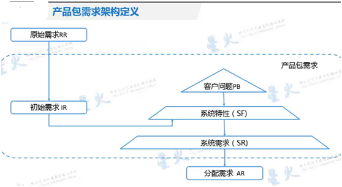

### 2.1.2 需求分析

需求分析是一个迭代过程。
*  需求分析定义：准确理解用户的要求，进行细致的调查分析，将用户非形式的需求陈述转化成完整的需求定义，再由需求定义转化成功能规约（需求规格说明）的过程。
*  需求分析输出的质量准则：完整性、正确性、可验证性、一致性。
*  需求分析过程和方法：愿意-目标-特性-系统需求-功能需求-模块需求
*  需求分析的微流程：收集需求-方案设计-需求冲突决策-方案确认-需求分解分配-需求实现-需求验证。

 

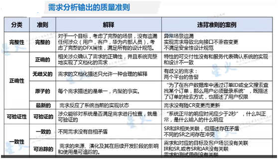


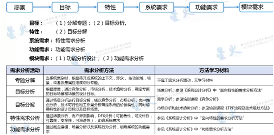


图 2 从原景到模板需求

 

特性需求分析：目标是需求的完整性，达到特性成熟度目标。

功能需求分析：方法包括概念建模、功能建模、系统行为建模。一个功能包含了一组功能需求，功能需求是系统功能最小粒度的重用单位。

系统模块结构设计中，一个模块应具备的要素包括输入和输出、处理功能、内部数据和程序代码。

 

完整的客户界面影响分析包含（ABCDE）

A 销售界面 

B 人机界面 

C 外部接口 

D 特性部署要求 

E 功能逻辑变更

 

### 2.1.3 需求分级

对需求进行合理的分解，去除伪需求，保留那些真正对产品或者设计目标有帮助的需求。常见理论有：
* 通用四象限法
* kano 模型
* 马斯洛需求层次理论

表格 1 需求分级列表

| 需求理论           | 适用场景                                               | 方法                                                         | 说明 |
| ------------------ | ------------------------------------------------------ | ------------------------------------------------------------ | ---- |
| 通用四象限法       | 交互设计师收到很多需求时。                             | 将需求划分到4个象限当中，按照落在各个象限的处理方式进行处理。 |      |
| kano 模型          | 收集到的需求当中，确定哪些需求能显著提升用户的满意度。 |                                                              |      |
| 马斯洛需求层次理论 | 需求实现的价值有多大？                                 | 人类需求像阶梯一样从低到高按层次分为五种，分别是：生理需求、安全需求、社交需求、尊重需求和自我实现需求。 |      |

 

#### 2.1.3.1 KANO模型

KANO 模型是东京理工大学教授狩野纪昭（Noriaki Kano）发明的对用户需求分类和优先排序的工具，以分析用户需求对用户满意的影响为基础，体现了产品性能和用户满意之间的非线性关系。

**（基本质量）必须具备的（Must-have）**

例如，一款美颜工具产品，拍照是必须具备的基本功能。

**（期望质量）所期望的（Linear）**

例如，一款美颜工具产品，使自己变得更漂亮——美颜，是用户比较明确「提出」的，否则为什么要下载使用。

**（魅力质量）超出预期的（Exciter）**

例如，一款美颜工具产品，居然可以一键美颜，自动帮你P成大眼、小脸、巨乳、蜂腰的大长腿女神，远超预期。

 

图 3 需求分级理论-KANO模型

 

#### 2.1.3.2 用户故事 User Story

**故事级别**
Epic 史诗故事
Feature 特性
User Story： 一个用户故事的时间周期控制在1周左右。

 

**STORY**

```
As a 角色
I want 特征
so that 利益
```

表格 2 用户故事要点

|         |                                            | 示例 |
| ------- | ------------------------------------------ | ---- |
| AS      | 标识出这个系统行为是为哪一个角色而定义的。 |      |
| WANT    | 指明了该角色想做的事                       |      |
| SO THAT | 想达到的目的。                             |      |

这三个断句定义了这个系统行为的参与者、范围。

 

同样的一个Story，可能会有不同的场景。通过上面的模板描述了故事之后，再通过下面的模板对不同场景进行描述

**Scenario:**

```shell
Given [上下文]
  And [更多的上下文]
When [事件]
Then [结果]
  And [其他结果]
```


说明：这些场景中的Given…When…Then…实际上就是设定该场景的状态、适用的事件，以及场景的执行结果。

通过这样的Story描述和场景设置，基本就完成了一个完整测试的定义。

## 2.2   需求开发

### 2.2.1 需求挖掘

需求挖掘是产品生命周期的启始阶段同时也贯穿了整个生命周期，一般包含了内部和外部挖掘。
1. 内部挖掘
在公司内部进行挖掘，比如说采用头脑风暴、组织会议、业务需求收集、运营反馈、其他部门的需求收集等方法。
2. 外部挖掘
针对真正的使用者，通过用户研究（重点在于研究用户痛点）进行挖掘，常用的用研方法有可用性测试、焦点小组、问卷调查、AB测试等。

 

## 2.3   需求变更管理

CCB：变更控制委员会。

RAT：需求分析。RAT动作流程就是决策需求落地及需求排序。

 

CCB(Change Control Board) 在[CMMI](https://baike.baidu.com/item/CMMI)(Capability Maturity Model Integration)中，是“变更控制委员会”的含义，同时具有配置控制委员会（Configuration Control Board）的含义。

**CCB主要职责**

1、批准配置项的标识，以及信息系统的基线建立

2、制定访问控制策略

3、建立更改基线的设置，审核变更申请

4、根据配置管理员的报告决定相应的对策

 

## 2.4   本章参考

[1].   超全面！交互设计的基础方法和理论总结（上） https://www.uisdc.com/ux-basic-method-theory-summary-1

 

# 3    产品竞争力和客户化视角

## 3.1   竞争分析

职能部门是市场机会分析部，洞察对手举动，预测对方下一步行动。主要通过MI+MA方式(信息收集和分析)运转。

 

商业竞争力：满足客户需求，（与竞争对手相比）客户使用我司解决方案在生命周期内总使用成本(CAPEX+OPEX)最低，我司盈利能力最强。

 

**竞争分析的常用方法**

* 波特的"五力模型"：1980s提出，认为行业中存在着决定规模和程序的五种力量，这五种力量综合起来影响着产业的吸引力以及现有企业的竞争战略决策。五力分别是供应商的讨价还价（议价）能力、购买者的讨价还价能力、替代品的替代能力、潜在竞争者的进入能力、行业内竞争者的现有竞争能力。
* 四角分析法：
* SWOT
* 市场定位
* 标杆管理

 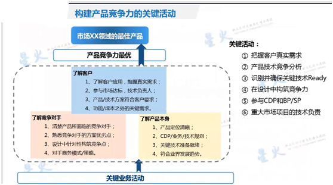

图 4 构建产品竞争力的关键活动

 

SE在竞争分析工作中的职责是（ABC） 
* A 分析友商产品成本 
* B 关键技术分析 
* C 竞争力落实到产品研发

 

**SE作为产品竞争力的构建者，所具备的职责包括( ABCE )** 
*  分析客户需求，竞争对手及关键技术 
*  参与价值特性分析及版本特性定义 
*  构建质量、成本等竞争力 
* （错误）负责设计产品的全生命周期和管理 
*  基于关键技术，提取专利及标准

 

### 波特五力

 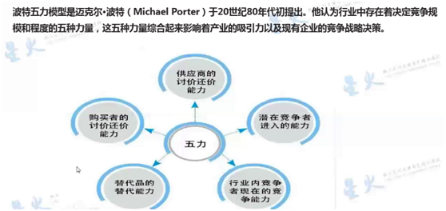

 

 

### 四角分析法

四角分析法用来达成企业的战略定位。

 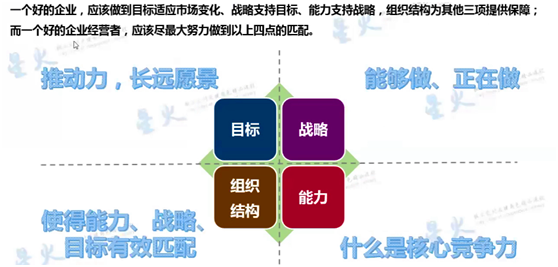

 

### SWOT分析

SWOT：Strong优势、Weak劣势、Oppotunity机遇和Trend威胁。

 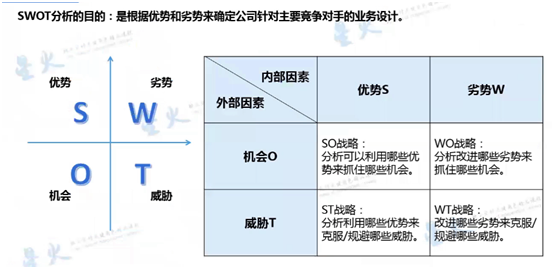

 

### 市场定位

 

 

## 3.2   本章参考

 

# 4  产品开发

产品的生命周期由两个关键阶段组成：概念期和实施期。
**概念期，性能和成本是主要驱动力。包括三大任务分别是需求分析、产品定义和设计完成**。
**实施期：包括六大任务分别是建立模型、确立试验、确证产品、预生产、第一批样品制造和全面生产**。

 

**术语定义**

DFX：Design for X，X代表产品开发流程或其中某一环节，如测试、采购等等。

IPD: Integrated Product Develop 集成产品开发。

CHATER：业务计划书，包括项目范围、目标、验收标准等

DCP: Decision Check Point )：业务决策点，包括CDCP/ADCP/PDCP

TR：Technical Review 技术评审

PDT: Product Development Team，产品开发团队，属于项目执行层。

IPMT: 集成产品管理团队，属于高层管理决策层。

CBB: Common Building Block. 公用构建模块

RAT：需求分析

SP/BP：产品规划

CDT: Chater开发

## 4.1   DFX

### 4.1.1 DFX简介

DFX是Design for X的缩写。其中，X代表产品开发流程或其中某一环节，例如采购、制造、测试等，也可以代表产品竞争力或决定产品竞争力的因素，例如成本、质量。DFx强调的是在设计的过程中，不仅要考虑外部需求，同时要考虑内部需求，例如：制造、采购、测试、服务等的需求。

DFX是并行工程的思想。

DFX强调的是在设计的过程中，不仅要考虑外部需求，同时要考虑内部需求，例如：制造、采购、测试、服务等的需求。

SE是产品DFX需求的第一责任人。资深SE与一般SE之间最大的差别是DFX能力高低。

 

常见的X如下：
 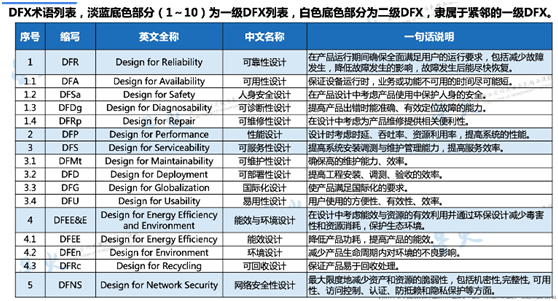

   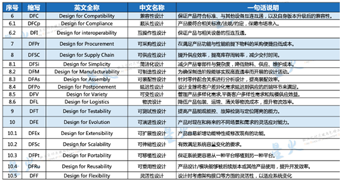

备注：10个一级分别是DFR/DFP/DFMt/DFEE&E/DFNS 、/DFC/DFPr/DFSC/DFT/DFE

 

### 4.1.2 DFX落地

DFX质量标准：分三级。

DFX分类：交付类、运行类、演进类

DFX说明：十大一级（每级含若干子类），分别从场景、定义、范围和价值进行阐述。

 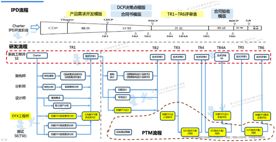

图 5 IPD流程中的研发流程（DFX落地）

 

DFX设计的关键活动包括
分析产品E2E场景和需求，明确DFX改进目标。
在产品设计中确保DFX需求和质量属性落地。
对DFX的改进目标达成结果负责，在E2E各环节现场对DFX目标达成情况进行评估和验收。
全流程E2E拉通DFX分析与设计。

 

## 4.2   IPD

[集成产品开发](https://baike.baidu.com/item/集成产品开发/3233925)（Integrated Product Development, 简称IPD）是一套产品开发的模式、理念与方法。IPD的思想来源于美国PRTM公司出版的《产品及生命周期优化法》（简称PACE——Product And Cycle-time Excellence）一书，该书中详细描述了这种新的产品开发模式所包含的各个方面。

1992年，IBM最先将IPD付诸实践。在IBM成功经验的影响下，国内外许多高科技公司采用了集成产品开发（IPD）模式，如美国波音公司和深圳华为公司（1998年，IBM给华为提供IPD全套规程体系）等，都取得了较大的成功。实践证明，IPD既是一种先进思想，也是一种卓越的产品开发模式。

 

**IPD与CMMI的区别：**

CMM是SEI针对软件质量保证制定的[能力成熟度模型](https://baike.baidu.com/item/能力成熟度模型)，与ISO9000系列标准和MIL标准一样，均属于[过程质量](https://baike.baidu.com/item/过程质量)模型。

IPD着眼于产品开发获得市场成功，是在PACE（[产品及周期优化法](https://baike.baidu.com/item/产品及周期优化法)）等产品开发模式的基础上，经过一些领先企业的实践发展起来的。 IPD关注的是将影响产品成功的关键要素（如结构化流程、产品决策评审、产品开发团队等）有机地整合起来，形成集成的产品开发模式，推动产品的成功。

主要有以下不同
* 层面：IPD是产品经营管理方法；CMM多面向研发。。
* 思想高度：IPD从更高角度看产品开发；CMM主要倡导通过过程和活动来保证质量。
* 流程结构化：IPD包括六个阶段。CMM是把流程分解为关键过程域KPA，是相对离散。
* 管理范围：IPD管理范围更广。
* 关注重点：IPD强调执行和决策。CMM主要关注执行。
* 人员管理：IPD包括了对团队和个人的考核。CMM不包括人员考核。

 

### 4.2.1 IPD框架

IPD作为先进的产品开发理念，其核心思想概括如下：

a) 新产品开发是一项投资决策。IPD强调要对产品开发进行有效的投资组合分析，并在开发过程设置检查点，通过阶段性评审来决定项目是继续、暂停、终止还是改变方向。

b) 基于市场的开发。IPD强调产品创新一定是基于市场需求和竞争分析的创新。为此，IPD把正确定义产品概念、市场需求作为流程的第一步，开始就把事情做正确。

c) 跨部门、跨系统的协同。采用跨部门的产品开发团队（PDT：Product Development Team），通过有效的沟通、协调以及决策，达到尽快将产品推向市场的目的。

d) 异步开发模式，也称并行工程。就是通过严密的计划、准确的接口设计，把原来的许多后续活动提前进行，这样可以缩短产品上市时间。

e) 重用性。采用公用构建模块（CBB：Common Building Block）提高产品开发的效率。

f) 结构化的流程。产品开发项目的相对不确定性，要求开发流程在非结构化与过于结构化之间找到平衡。

 

IPD框架是IPD的精髓，它集成了代表业界最佳实践的诸多要素。具体包括异步开发与共用基础模块CCB、跨部门团队、项目和管道管理、结构化流程、客户需求分析、优化投资组合和衡量标准共七个方面，IPD框架如下图所示:

 

 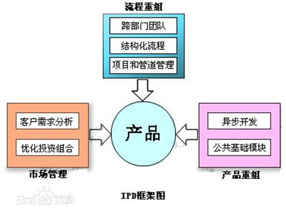

图 6 IPD框架图1

 

**IPD管理模式**

IPD的核心思想是通过IPD管理模式得到贯彻和落实

四个主流程：战略管理（产品战略），市场管理，产品开发（IPD流程），平台与技术的开发。实施IPD就是实施这四个主流程，流程就是保证做正确的事（产品战略和市场管理）和正确的做事（产品和产品平台的开发）；

四个支撑体系：质量，项目，绩效，成本的管理。支撑体系通过一系列结构化流程（6个阶段+4个决策评审点+6个技术评审点）和其子流程得以体现；

四个跨部门团队：IPMT，PMT，PDT，TDT。不同团队是实施不同流程的主体，有人和相应的组织才能做事，其有别于传统的组织结构。

 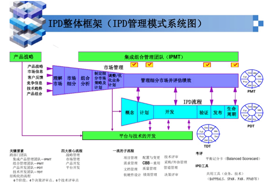

图 7 IPD框架2：管理模式

 

### 4.2.2 IPD流程

IPD流程对一个产品包从概念到生命周期管理阶段结束所需所有流程的主要活动进行管理。IPD流程分为6个阶段：概念、计划、开发、验证、发布和生命周期。

 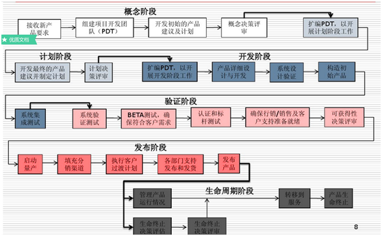

图 8 华为IPD管理流程图

备注: 华为的IPD不仅包括软件，还包括硬件。

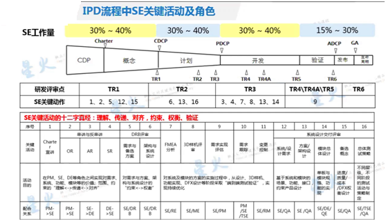

 

 

备注：IPD六个流程包括4个业务决策点，7个技术评审。

### 4.2.3 DCP业务决策评审

DCP ( Decision Check Point ): 业务决策评审点，在IPD流程体系中，是由IPMT来评审PDT团队的业务计划书，并对PDT团队的给予指导，并且评审通过的话，IPMT要承诺提供资金和资源给PDT，PDT团队则向IPMT汇报业务计划、方案并执行业务计划。主要是4个DCP。

DCP标志着大多数阶段的结束。在每个DCP，提出继续前进或终止项目或重新确定方向的建议。

表格 3 DCP评审（四个）

| DCP               | 内容                                                         | 备注 |
| ----------------- | ------------------------------------------------------------ | ---- |
| CDCP 概要         | 在概念阶段结束时要召开一个概念决策评审会, 在这个会议上，PDT正式向IPMT报告初始的业务计划，由IPMT来决定项目是继续还是终止。 |      |
| PDCP 计划         |                                                              |      |
| ADCP 可获得性     |                                                              |      |
| LDCP 生命周期结束 |                                                              | GP   |

 

### 4.2.4 TR 技术评审

TR，Technical Review，即技术评审，目的是尽早地发现工作成果中的缺陷，并帮助开发人员及时消除缺陷，从而有效地提高产品的质量。

产品开发中，TR是技术评审节点。

 

**技术评审注意事项：**

1、评审应针对被审材料而不是被审材料的作者。评审会的气氛应该保存轻松、愉快，指出问题的语气应该温和。

2、每次评审会的时间最好不要超过2小时。当被审材料较多时，应将被审材料分为若干部分分别进行评审。

3、限制争论和辩驳。在评审会上，对于一时无法取得一致意见的问题，应先记录在案，另行安排时间进行深入讨论。

4、阐明问题而不要试图解决问题。不要在评审会上解决发现的问题，可以在会后由作者自己或在个别人的帮助下解决这些问题。

 

**技术评审目的：**

（1）发现软件在功能、逻辑、实现上的错误；

（2）验证软件符合它的需求规格；

（3）确认软件符合预先定义的开发规范和标准；

（4）保证软件在统一的模式下进行开发；

（5）便于项目管理。

此外，技术评审为新手提供软件分析、设计和实现的培训途经，后备、后续开发人员也可以通过正规技术评审熟悉他人开发的软件。

 

IPD TR是指IPD流程中定义的TR1、TR2、TR3、TR4、TR4A、TR5、TR6等7个技术评审点。用于检查IPD实施到一定阶段以后产品的技术成熟度，发现遗留的技术问题，评估存在的技术风险，给出技术上的操作建议。

 

表格 4 TR七个技术评审点详述

| IPD  | TR   | 定义                                                         | 评审内容                                     | 备注                                                         |
| ---- | ---- | ------------------------------------------------------------ | -------------------------------------------- | ------------------------------------------------------------ |
| 概念 | TR1  | 在概念阶段CDCP前针对产品包需求和产品概念的评审。             | 业务需求评审：产品包需求和产品概念评审       |                                                              |
| 计划 | TR2  | 在计划阶段对产品设计规格的评审。                             | 需求分解和需求规格评审：功能需求和产品级规格 |                                                              |
|      | TR3  | 在计划阶段对概要设计（HLD）的评审，确保设计规格已经完全、正确地在概要设计中得到体现。 | 总体方案评审：系统设计、架构设计和概要设计。 | TR3结果将作为开发阶段的后续详细设计活动是否继续投入资源的根据。 |
| 开发 | TR4  | 保证BuildingBlock用于系统级构建之前是完整的。对于一次构建（Build）涉及到的每一个BuildingBlock，应该有且仅有一次TR4对其进行评审。 | 模块/系统评审：详细设计、BBFF测试结果        | 任何不符合规定的情况都应该在TR4问题记录中得到记录，并进行风险评估。 |
|      | TR4A | 在SDV完成后，对产品技术上的成熟度进行评估，确保所有存在的问题和风险都进行了评估，并生成了相应的改进计划，以保证供应和制造能力足以支撑初始产品生产活动。 | 原形机的质量SDV结果和初始产品的准备情况。    |                                                              |
|      | TR5  | 在发布给客户前对项目整体状态在设计稳定性和技术成熟度方面的独立评估活动。 | 初始产品的质量（SIT结果）：Alpha测试技术评审 | 确保产品符合预定的功能和性能要求，以满足前期确定的产品包需求 |
| 验证 | TR6  | 关注于系统级的评审。                                         | 发布评审：Beta测试、制造系统验证。           | 确保产品的制造能力已经能适应全球范围内发货的需求。           |

备注：TR2到TR4，对应测试设计阶段，主要任务是完成测试前期设计，包括测试方案设计和测试用例设计两个阶段。TR4到TR6阶段，是测试执行阶段。这是整个产品测试生命周期中持续时间最长，投入最大的阶段。

 

 

表格 5 IPD流程六阶段+

| 阶段     | 目的                                                         | 决策评审DCP                              | 技术评审TR     |
| -------- | ------------------------------------------------------------ | ---------------------------------------- | -------------- |
| 概念     | 保证PDT根据项目任务书，对市场机会、需求、质量、潜在的技术和制造方法/风险，成本/进度预测和财务影响进行（概要地）评估和归档。 | 概念决策评审点（CDCP）                   | TR1            |
| 计划     | 将产品包/解决方案业务计划扩展成详细的产品包定义，启动对开发方法的正式规划，包括完整的产品定义、开发与制造方法、销售与营销计划、项目管理计划、产品支持计划、详细的进度以及财务分析。 | 计划PDCP                                 | TR2/TR3        |
| 开发     | 包括产品设计、集成和验证、制造工艺设计/实施、性能、技术或构建模块和制造风险评估的各个方面。 |                                          | TR4/TR4A/  TR5 |
| 验证     | 以成功完成内部测试和向制造发布为起点。包括进行硬件/软件压力测试，标准和规格的一致性测试，以及获得专业认证。 | 可获得性ADCP                             | TR6            |
| 发布     | 以决定继续进入到产品包发布和GA开始的。发布阶段包括达到量产的准备，填充管道和制定最终的盈亏计划。一般可获得性（GA）是指产品包可以大批量交付给H3C客户的时间。 | GA                                       |                |
| 生命周期 | 在GA开始，包括产品生命周期内对产品包营销/销售，生产及服务的监控。在生命周期阶段会出现：停止生产（EOM）检查点，停止销售（EOS）检查点，停止服务与支持（EOL）检查点。 | 当所有与停止服务及支持相关的活动都完成时 |                |

备注：TR3衔接计划与开发；TR5衔接开发与验证；TR6衔接验证与发布。

即 计划 -- TR3 -- 开发-- TR5 -- 验证 -- TR6 -- 发布
* TR1：需求分析阶段
* TR2：方案设计阶段
* TR3-TR5：开发验证阶段
* TR6：即GA点，产品发布阶段


## 4.3   本章参考

[1].   百度百科-IPD https://baike.baidu.com/item/IPD

[2].   新产品开发中TR1,TR2,TR3..具体指什么？ https://blog.csdn.net/weixin_42139375/article/details/88774459

[3].   IPD入门及个人理解 https://www.jianshu.com/p/64e7ce8341f1


# 5  产品运营

详见 《运营专题》


# 6  市场洞察

Market：市场、行销，简称MKT。

Market Insight: 市场洞察，简称MI。是有实据的，发现潜在市场机会的行为。

MI**准则**：有方向才有思想（有观点）、有思想才有理论（有模型）、有理论才能有战略。


## 6.1   方法论

MI分析项：
宏观：PEST分析
行业：二个维度（市场业绩、市场价值大小）。可以细分分竞争分析、细分市场。
市场容量和机会：TAM（Total Avaliable Market，总可用市场）和SAM（Serviceable，可占据市场）。

 

# 参考资料