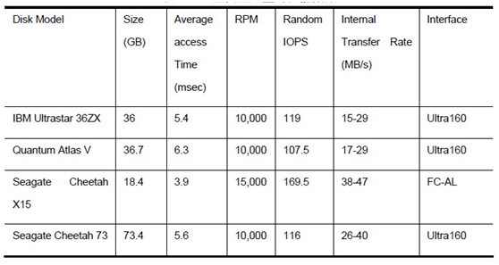
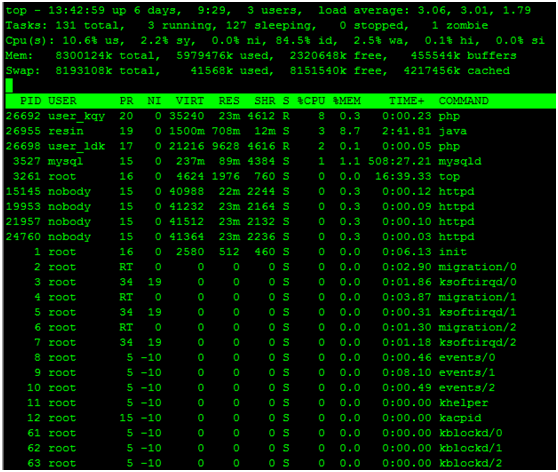
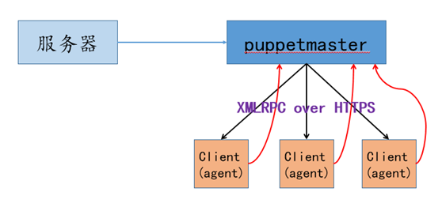
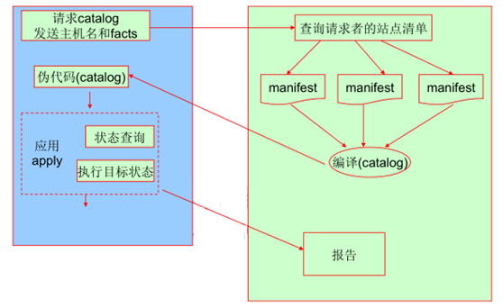

| 序号 | 修改时间   | 修改内容                                                     | 修改人 | 审稿人 |
| ---- | ---------- | ------------------------------------------------------------ | ------ | ------ |
| 1    | 2016-10-21 | 创建                                                         | 吴启福 | 吴启福 |
| 2    | 2016-12-22 | 增加WEB信息管理章节                                          | 同上   |        |
| 3    | 2018-3-28  | 重新组织目录结构，将运维内容单独成立。<br>补充docker/jenkins章节。 | 同上   |        |
| 4    | 2018-5-24  | 将网站整体优化章节迁移到《网站架构设计和开发》               | 同上   |        |
| 5    | 2019-4-1   | 更新容器部署章节                                             | 同上   |        |
|      |            |                                                              |        |        |
---

 

 

 

# 目录

目录

[目录... 1](#_Toc19744423)

[1    运维概述... 3](#_Toc19744424)

[2    运维技术篇... 3](#_Toc19744425)

[2.1    运维技术方向... 3](#_Toc19744426)

[2.2    硬件基础... 4](#_Toc19744427)

[2.2.1     CPU架构... 4](#_Toc19744428)

[2.2.2     存储介质... 4](#_Toc19744429)

[2.3    系统监控... 7](#_Toc19744430)

[2.3.1     监控指标... 7](#_Toc19744431)

[2.3.2     Linux环境监控IO性能... 7](#_Toc19744432)

[2.4    性能 Performance. 9](#_Toc19744433)

[2.4.1     性能指标... 9](#_Toc19744434)

[2.4.2     类unix系统性能监控命令... 11](#_Toc19744435)

[2.4.3     在线服务故障排查... 13](#_Toc19744436)

[2.4.4     性能压测工具... 14](#_Toc19744437)

[2.4.5     本节参考... 15](#_Toc19744438)

[2.5    高可用性HA. 16](#_Toc19744439)

[2.5.1     SLA协议... 16](#_Toc19744440)

[2.5.2     keepalive实现高可用... 17](#_Toc19744441)

[2.6    CICD持续集成-持续部署... 20](#_Toc19744442)

[2.7    服务集群管理... 20](#_Toc19744443)

[2.8    网站整体优化... 21](#_Toc19744444)

[2.9    本章参考... 21](#_Toc19744445)

[3    运维工具篇... 21](#_Toc19744446)

[3.1    运维工具列表... 21](#_Toc19744447)

[3.2    常用工具与镜像... 23](#_Toc19744448)

[3.2.1     VirtualBox. 23](#_Toc19744449)

[3.2.2     Vagrant. 23](#_Toc19744450)

[3.2.3     容器docker. 26](#_Toc19744451)

[3.2.4     容器编排 K8S. 26](#_Toc19744452)

[3.3    持续集成CI工具：Jenkins. 26](#_Toc19744453)

[3.3.1     安装篇... 26](#_Toc19744454)

[3.3.2     本节参考... 27](#_Toc19744455)

[3.4    Devops工具：TFS. 27](#_Toc19744456)

[3.5    自动化运维工具... 28](#_Toc19744457)

[3.5.1     Ansible. 29](#_Toc19744458)

[3.5.2     Puppet. 29](#_Toc19744459)

[3.5.3     Saltstack. 31](#_Toc19744460)

[3.5.4     fabric. 31](#_Toc19744461)

[3.5.5     本章参考... 32](#_Toc19744462)

[3.6    运维工具选型... 32](#_Toc19744463)

[3.7    本章参考... 32](#_Toc19744464)

[4    Hadoop集群运维... 32](#_Toc19744465)

[5    参考资料... 32](#_Toc19744466)

[5.1    参考书目... 32](#_Toc19744467)

[5.2    参考链接... 33](#_Toc19744468)

[5.3    运维相关的国际会议... 33](#_Toc19744469)

 

 

 

**表目录**

[表格 1 存储介质对比__ 4](#_Toc19744470)

[表格 2 知名服务系统吞吐量列表__ 10](#_Toc19744471)

[表格 3 性能压测工具简介__ 14](#_Toc19744472)

[表格 4 性能压测工具比较__ 15](#_Toc19744473)

[表格 5 每日构建与发布流程列表__ 20](#_Toc19744474)

[表格 6运维项及运维工具列表__ 21](#_Toc19744475)

[表格 7 轻量级运维（系统工具）列表__ 22](#_Toc19744476)

[表格 8 轻量级运维（系统工具）详述__ 22](#_Toc19744477)

[表格 9 常用工具镜像源__ 23](#_Toc19744478)

[表格 11 自动化运维工具比较列表__ 28](#_Toc19744479)

 


 

---

# 1  运维概述

运维发展史

人工阶段 -- 工具和自动化阶段 -- 平台化 -- AIOPs（智能运维2016~）

 

**运维**：运行维护，Operation and maintenance，服务要正常运转。

**运营**：Operation，服务要运转好。

**SRE**：Site Reliability Engineer (网站可靠性工程师)。起源于google，在国内他们被称为运维工程师(OPS,operations)，直接掌管着互联网公司的机器和服务，保证网站不宕机是他们的使命。

 

​     运维，这里指[互联网](https://baike.baidu.com/item/互联网/199186)运维，通常属于技术部门，与[研发](https://baike.baidu.com/item/研发)、[测试](https://baike.baidu.com/item/测试/112688)、[系统管理](https://baike.baidu.com/item/系统管理)同为互联网产品技术支撑的4大部门，这个划分在国内和国外以及大小公司间都会多少有一些不同。

​     一个互联网产品的生成一般经历的过程是：[产品经理](https://baike.baidu.com/item/产品经理)、需求分析、研发部门开发、测试部门测试、运维部门部署发布以及长期的运行维护。运维的职责覆盖了产品从设计到发布、运行维护、变更升级及至下线的生命周期。

 

**业务运维工程师的日常工作包括：**
* 监控线上的服务质量
* 响应异常/处理突发故障
* 在线发布/升级产品
* 和相应产品线的研发和测试协调处理产品问题
* 基于工作中的问题和数据分析进行抽取，将运维经验理念落地沉淀为方法论/工具/系统/平台，并制定相关的改进计划，在各个技术方向上落地实现，最终反馈回运维工作中，提高运维本身的效率和产品的价值。

 

# 2  运维技术篇

## 2.1 运维技术方向

产品的整个生命周期里运维的职责重要而广泛，但运维工程师们的职责不仅限于这部分工作，还需要总结工作中遇到的问题，抽取出相关的技术方向、研发相关的工具和平台以支持/优化业务的发展并提高运维的效率，相关技术工作主要包括：
* 服务监控技术：包括监控平台的研发、应用，服务监控准确性、实时性、全面性的保障
* 服务故障管理：包括服务的故障预案设计，预案的自动化执行，故障的总结并反馈到产品/系统的设计层面进行优化以提高产品的稳定性
* 服务容量管理：测量服务的容量，规划服务的机房建设，扩容、迁移等工作
* 服务性能优化：从各个方向，包括网络优化、操作系统优化、应用优化、客户端优化等，提高服务的性能和响应速度，改善用户体验
* 服务全局流量调度：接入服务的流量，根据容量和服务状态在各个机房间分配流量
* 服务任务调度：服务的各种定时/非定时任务的调度触发及状态监控
* 服务安全保障：包括服务的访问安全、防攻击、权限控制等
* 数据传输技术：包括p2p等各类传输技术的研发应用，也远距离大数据传输等问题的解决
* 服务自动发布部署：部署平台/工具的研发，及平台/工具的使用，做到安全、高效的发布服务
* 服务集群管理：包括服务的服务器管理、大规模集群管理等
* 服务成本优化：尽可能降低服务运行使用的资源，降低服务运行成本
* 数据库管理（DBA）：通过设计、开发和管理高性能数据库集群，使数据库服务更稳定、更高效、更易于管理。
* 平台化的开发：类docker和google borg平台的开发管理，及服务接入技术
* 分布式存储平台的开发优化：类google gfs等分布式存储平台的研发及服务接入

## 2.2 硬件基础

### 2.2.1 CPU架构
* SMP：Symmetric Multi-Processing，对称多处理。共享所有资源（CPU/内存/IO）。
* NUMA：NoN-Uniform Memory Access，非一致存储访问。不共享资源。

 

### 2.2.2 存储介质

IO总线：南北桥

存储系统的瓶颈一般在IO。

表格 1 存储介质对比

| 类别      | IOPS   | 每GB价格（元） | 容量     | 随机读取 | 随机写入     |
| ----------- | ------ | -------------- | -------- | -------- | ------------ |
| 内存        | 千万级 | 150            | 1G~3     | 友好     | 友好         |
| SSD（闪存） | 35000  | 20             |          | 友好     | 写入放大问题 |
| SAS磁盘     | 180    | 3              |          | 磁盘寻道 | 磁盘寻道     |
| SATA磁盘    | 90     | 0.3            | 0.5T~8TB | 磁盘寻道 | 磁盘寻道     |

备注：早期存储介质的价格差异巨大，所以多级缓存使用了不同介质。随着SSD的降价，多级缓存也可以使用SSD介质。

#### 2.2.2.1 磁盘IO性能评估

​                               

图 1一些典型磁盘的性能数据

说明：磁盘由扇区，柱区组成，每扇区大小为512Byte.

磁盘参数组成：平均寻址时间ms，RPM转速，IOPS每秒的IO数，传输率MB/S.

一次IO时间 = 寻址时间(Seek Time) +旋转延时(Rotational Delay) +传送时间(Transfer Time)

这3个参数，分别对应于磁盘的平均寻址时间、盘片旋转速度以及最大传送速度.
* IOPS主要取决于SeekTime, RPM。与IO ChunkSize反比，TransferRate正比。
* MB/s：最大传输速度，在顺序访问时，非常接近IOPS*IO ChunkSize.

于是公式：

IO Time = Seek Time + 60 sec/Rotational Speed/2 + IO ChunkSize/Transfer Rate

IOPS = 1/IO Time 

 

**概念：**
- 随机读写：在随机读写中，每次IO操作的寻址时间和旋转延时不能忽略不计。
- 顺序读写：每次IO操作的寻址时间和旋转延时几乎可忽略。

 

**磁盘IO性能的四个关键指标：**
* IO Chunk Size：单个IO的大小，数据库存储有个基本的块大小(Block Size)，磁盘页也为一个IO块，缺省为4K。但IO Chunk Size与IO Block Size并没关系。每次IO操作的大小是不固定的，系统会根据需要合并IO次数，集中读写，以提高性能。
* IOPS(IO per Second)：IO系统每秒所执行IO操作的次数。
* 传输速度(Transfer Rate)/ 吞吐率(Throughput)：同传输速度/传输率。磁盘在实际使用的时候从磁盘系统总线上流过的数据量。=IOPS * IO ChunkSize。 随机访问时取决于IOPS，顺序访问时取决于磁盘的最大传输速度。
* IO响应时间(IO Response Time)：IO响应时间也叫IO延时，就是从操作系统内核发出的一个读或者写的IO命令到操作系统内核接收到IO回应的时间。包括了IO在系统中等待时间。

 

**计算1：计算IOPS**

假设磁盘的转速(Rotational Speed)为15K RPM，平均寻道时间为5ms，最大传输速率为40MB/s, IO chunksize 4K.（这里将读写速度视为一样，实际会差别比较大）。

公式：IO Time = Seek Time + 60 sec/Rotational Speed/2 + IO ChunkSize/Transfer Rate

IOPS = 1/IO Time = 1/(5ms + 60s/15K/2 + 4K/40MB) = 1/(5ms+2ms+0.1ms) = 1/7.1*1000=143

注：**顺序访问**时，寻址时间和旋转延时几乎可忽略，只余下传送时间，这时的IPOS相对于**随机访问**时差别极大。

 

**计算2：计算磁盘的实际传输速度**

实际上传输速度和IOPS是没有直接关系，在没有缓存的情况下它们共同的决定因素都是对磁盘系统的访问方式以及单个IO的大小。对磁盘进行随机访问时候我们可以利用**IOPS**来衡量一个磁盘系统的性能，此时的传输速度不会太大；但是当对磁盘进行连续访问时，此时的IOPS已经没有了参考的价值，这个时候限制实际传输速度却是**磁盘的最大传输速度**。因此在实际的应用当中，只会用IOPS来衡量小IO的随机读写的性能，而当要衡量大IO连续读写的性能的时候就要采用传输速度而不能是IOPS了。

#### 2.2.2.2 缓存对磁盘IO性能的影响


#### 2.2.2.3 RAID对磁盘IO性能的影响

**RAID提升数据传输率**

当前单个磁盘的平均数据传输速率在20-50MBps之间，并没有完全利用SCSI总线的全部带宽，解决这个问题的方法是采用冗余磁盘阵列技术 （RAID）。N个磁盘组成的数组可以使数据传输速率获得接近N倍的提升，并且可以改善I/O请求的响应时间（同时也增加了IOPS），不同的配置方案对 I/O系统这两方面的影响可参考[Scheuermann, et al.,1998]。显然，这种提高I/O性能的方法是以增加系统硬件成本为代价的。

 

 

**示例：计算IOPS**

假设：IPOS为140, 读命中率为90%,写命中率为90%, 读RAID数目为4.

read IOPS = disk_IOPS/(1-read_cache_hit_ratio)*disk_num =140/(1-10%)*4 = 622 

write IOPS =disk_IOPS/(1-write_cache_hit_ratio)*disk_num/acture_IO_num =140/(1-10%)*4/1 = 622

 

 

## 2.3 系统监控

监控的四个黄金指标：延迟、流量、错误和饱和度。

* 延迟：服务处理某个请求所需要的失败。如要求API响应时间在500ms内。

* 流量：针对系统负载需求所进行的度量。如每秒HTTP请求数、QPS

* 错误：请求失败的速率。

* 饱和度：指系统中最为受限的资源具体指标的度量，通常指系统资源中最薄弱的一环如CPU/内存/IO等等。

 

## 2.4 性能 Performance

主要监控项：CPU使用率，磁盘IO，系统负载，程序服务状态和响应时间监控。

**经验值**：CPU不要高于70%，系统负载不要高于CPU个数*2。

### 2.4.1 性能指标

网站的性能由这些内容组成：带宽占用率，CPU利用率，内存使用率，响应时间，请求并发数（Ququests Per Second)。

**服务器并发处理能力**

- 呑吐率
- CPU并发计算
- 系统调用： 尽量少调用，减少内核CPU
- 内存分配
- 持久连接
- Io模型：阻塞/非阻塞，select/poll/epoll/kqueue/AIO
- 服务器并发策略：多线程，多进程，同步异步等。

 

#### 2.4.1.1 高并发指标

高并发（High Concurrency）是互联网分布式系统架构设计中必须考虑的因素之一，它通常是指，通过设计保证系统能够同时并行处理很多请求。

高并发相关常用的一些指标有响应时间（Response Time），吞吐量（Throughput），每秒查询率QPS（Query Per Second），并发用户数等。


* 响应时间：对请求作出响应所需要的时间。通常取平均响应时间。 
* 吞吐量：Throughput，单位时间内处理的请求数量。
* QPS或TPS：Query/事务 Per Second，每秒查询量。一般单机几百~几千QPS。在互联网领域，这个指标和吞吐量区分的没有这么明显。
* 并发数：系统同时处理的请求数或者用户数。同时承载正常使用系统功能的用户数量。例如一个即时通讯系统，同时在线量一定程度上代表了系统的并发用户数。

 

**计算公式：**
* QPS = 并发数/平均响应时间
* 并发数 = QPS * 平均响应时间
* 响应时间 = 网络传输时间 + 应用服务器处理时间 + 数据库服务器处理时间

 

一个系统的吞吐量（承压能力）与请求request对CPU的消耗、外部接口、IO等紧密关联。单个请求消耗的系统资源越少，系统吞吐能力就越高，反之越低。

吞吐量从不同角度可以表现为不同的形式：
* 从业务角度来看：请求数/秒、页面数/秒等（体现应用服务器和代码的瓶颈） 
* 从网络角度来看：字节/秒 （体现网络/服务器等的瓶颈）

 

**知名服务的系统吞吐量**

表格 2 知名服务系统吞吐量列表

| 知名服务 | 数据时间 | QPS         | 平均响应时间 | 数据量                                            | 其它                                       |
| -------- | -------- | ----------- | ------------ | ------------------------------------------------- | ------------------------------------------ |
| 百度贴吧 | 2011     | 10万        |              | 百亿帖子，某些热门话题千万回复，P级视频存储       |                                            |
| 腾讯微信 | 2011     |             |              | 10个月5千万用户，千万级在线                       | 2010.1.26发布1.0版本，2010.10发布3.0版本。 |
| QQGame   |          |             |              | 3.2亿注册用户，2千万活跃用户数，400万人同时在线。 |                                            |
| 淘宝搜索 |          |             |              |                                                   |                                            |
| 一淘     |          |             |              |                                                   |                                            |
| 新浪微博 |          |             |              |                                                   |                                            |
| 豆瓣     | 2009     | 峰值500~600 |              | 280万注册用户，约1/4活跃用户，千万级非注册用户。  | 每天约2千万请求。                          |
|          |          |             |              |                                                   |                                            |

备注：

#### 2.4.1.2 设备传输率
* 磁盘IO：IOPS 120次左右，平均寻址时间在5ms左右。最大传输率通常20MB/s，IO ChunkSize 10K，实际传输率=IOPS*IO ChunkSize=10MB/s
* 网络带宽：网络带宽10MB/s（Mbit/s），全速传输一天可传输 3600*24*10MB=864GB。
* 以太网带宽：取决于网卡，常见是150MB/S~300MB/S，也就是局域网内部传输率一天可达到3600*24*150MB=12960GB=13TB

备注：带宽速度常是性能瓶颈。

 

 

### 2.4.2 在线服务故障排查

说明：类unix系统下命令和命令参数通常大小写敏感。

1） CPU过高

示例：以tomcat实例为例，定位哪个服务进程、哪个线程、哪段代码导致CPU过载？

步骤一：找最耗CPU的进程

$ top c，显示进程运行信息列表

$ 键入P，进程按照CPU使用率排序

 

步骤二：找最耗CPU的线程

$ top -Hp [pid] 显示一个进程的线程运行信息列表

$ 键入P，线程按照CPU使用率排序

 

步骤三：将线程TID转化为16进制

$ printf "%x\n" [TID]

 

步骤四：查看堆栈

工具：pstack/jstack/grep

$ jstack [pid] | grep [TID] -C5 --color

 

步骤五：查看系统调用

工具：stract

$ stract [pid]

 

### 2.4.3 本节参考

[1]. [IO系统性能之一：衡量性能的几个指标](http://num7.javaeye.com/blog/787209)

[2]. [IO系统性能之二：缓存和RAID如何提高磁盘IO性能](http://num7.javaeye.com/blog/787211) http://num7.javaeye.com/blog/787211

[3]. [IO系统性能之三：在Linux中监视IO性能](http://num7.javaeye.com/blog/787217)

[4]. CentOS详解top命令各个数据的含义 https://blog.csdn.net/chaoluo001/article/details/79151905

 

## 2.5 高可用性HA

可用性定义
* 基于时间：可用性=系统正常运行时间/（系统正常运行时间+停机时间） >=99.99%
* 合计（请求成功率）：可用性=成功请求数/总的请求数 >=99.99%

 

HA的几个常用指标

* 平均故障间隔时间MTBF：Mean Time Between Failure
* 平均修复时间 MTTR: Mean Time To Repair
* 可有性 Avaliability：常用N个9来进行量化

### 2.5.1 SLA协议
- SL1: Service-Level Indicator，服务质量指标。某项服务质量的一个具体量化指标。
- SLO: Service-Level Objecct，服务质量目标。服务的某个SL1的目标范围。
- SLA：Service-Level Agreement的[缩写](https://baike.baidu.com/item/缩写/1948062)，意思是[服务等级协议](https://baike.baidu.com/item/服务等级协议/20861172)。是关于[网络服务](https://baike.baidu.com/item/网络服务/9498645)供应商和客户间的一份合同，其中定义了[服务类型](https://baike.baidu.com/item/服务类型/5935663)、服务质量和客户付款等术语。

说明：SLO和SLA的一个简单区别在于如果SLO没有达到时，会有什么后果。

 

**典型的SLA包括以下项目：**
* 分配给客户的最小[带宽](https://baike.baidu.com/item/带宽)；
* 客户带宽极限；
* 能同时服务的客户数目；
* 在可能影响用户行为的网络变化之前的通知安排；
* 拨入访问可用性；
* 运用统计学；
* 服务供应商支持的最小网络利用性能，如99.9%[有效工作时间](https://baike.baidu.com/item/有效工作时间)或每天最多为1分钟的停机时间；
* 各类客户的流量优先权；
* 客户技术支持和服务；
* 惩罚规定，为服务供应商不能满足 SLA 需求所指定。

### 2.5.2 keepalive实现高可用

​     keepalive起初专门为lvs负载均衡软件设计的，用来管理监控lvs集群系统中各个服务节点的状态，后来又加入了可以实现高可用的vrrp功能。

​     keepalive软件通过vrrp协议实现高可用功能的。VRRP（虚拟路由器冗余协议）目的就是为了解决静态路由单点故障问题，竞选机制来将路由的任务交给某台VRRP路由器的，保证节点宕机，整个网络可以不间断的运行。

　　Keepalived可以实现任意两台主机之间，例如Master和Backup主机之间的故障转移和自动切换，这个主机可以是普通的不能停机的业务服务器，也可以是LVS负载均衡、Nginx反向代理这样的服务器。

 

**Keepalived高可用简单原理**

　　master端的vrrp路由器会一直发送vrrp广播包，buckup会一直收到广播包，buckup不会抢占master资源，在backup上会一直监听，一旦收不到master的包，在多台backup中优先级最高的就会抢占为master。（master若故障，则此机上keepalived会尝试重启；若重启失败，则关闭keepalived，master心跳包停发）。

 

**keepalive服务的三个重要功能**
1. 管理LVS负载均衡软件
2. 实现对LVS集群节点健康检查功能
3. 作为系统网络服务的高可用功能
4. 双主热备. 自动切换（需要一个主备共用的VIP，前端用VIP访问；如果nginx的upstraem负载均衡采用轮询，也能自动剔除故障机器）

案例：LVS. Nginx

 

集群前提条件

(1). 各节点时间必须同步，这个操作很关键。工具有ntp和chrony（CentOS7上开始启用）

(2). 确保iptables及selinux不会成为阻碍。要停止firewalld服务和iptables

(3). 各节点之间可通过主机名互相通信（对KA并非必须），建议使用/etc/hosts文件实现

(4). 各节点之间的root用户可以基于密钥认证的ssh服务完成互相通信（对KA并非必须，但是建议配置）

(5). 多播地址。建议更改默认的多播地址，防止冲突，可以在配置文件里的全局加入选项vrrp_mcast_group4 224.100.50.100。将组播地址调整为224.100.50.100。

 

#### 2.5.2.1 keepalive实现LVS高可用

实现效果是当有请求过来时，根据轮询规则调度到后端RS,同时实现了对RS的健康性检查，同时实现VS的高可用。

 

 

#### 2.5.2.2 keepalive实现Nginx高可用

A机器：192.168.232.132

B机器：192.168.232.131

A级器作为master，B机器作为backup

 

**常用命令**
* service nginx start  # 启动nginx
* service nginx stop  # 关闭nginx

```sh
ip add  #查看本机ip地址信息
systemctl stop keepalived  #关闭keepalive  
systemctl start keepalived #启动keepalive
```

 

A机

$ vim /etc/keepalived/keepalived.conf
```ini
global_defs {
  notification_email {
   aming@aminglinux.com
  }
  notification_email_from root@aminglinux.com
  smtp_server 127.0.0.1
  smtp_connect_timeout 30
  router_id LVS_DEVEL       #唯一标识，不同机器不能一样
}
 
vrrp_script chk_nginx {
  script "/usr/local/sbin/check_ng.sh"    # 检测nginx服务器活跃脚本 
  interval 3
}
 
#vrrp实例，名字可以自定义，与前面关键字空格隔开
vrrp_instance VI_1 {
  state MASTER    # 标识主还是备，必须大写。A/B机不一样，A为MASTER, B为BACKUP
  interface eth0     # 默认的通信的接口，当vip不指定时，默认绑定eth0。
  virtual_router_id 51     # 实例ID，0~255，主备一样
  priority 100        # 权重，从机值稍小
  advert_int 1       # 心跳间隔
  authentication {
    auth_type PASS
    auth_pass aminglinux>com
  }
  virtual_ipaddress {      # vip地址，主备一样，可以指定多个
    192.168.232.100
  }
  track_script {
    chk_nginx
  }
}
vrrp_instance VI_1 {
  state MASTER    # 标识主还是备，必须大写。A/B机不一样，A为MASTER, B为BACKUP
  interface eth0     # 默认的通信的接口，当vip不指定时，默认绑定eth0。
  virtual_router_id 51     # 实例ID，0~255，主备一样
  priority 100        # 权重，从机值稍小
  advert_int 1       # 心跳间隔
  authentication {
    auth_type PASS
    auth_pass aminglinux>com
  }
  virtual_ipaddress {      # vip地址，主备一样
    192.168.232.100
  }
  track_script {
    chk_nginx
  }
}
```


脚本路径: /usr/local/sbin/check_ng.sh
```sh
#!/bin/bash
#时间变量，用于记录日志
d=`date --date today +%Y%m%d_%H:%M:%S`
#计算nginx进程数量
n=`ps -C nginx --no-heading|wc -l`
# 如果进程为0，则启动nginx，并且再次检测nginx进程数量，
# 如果还为0，说明nginx无法启动，此时需要关闭keepalived
if [ $n -eq "0" ]; then
    /etc/init.d/nginx start
    n2=`ps -C nginx --no-heading|wc -l`
    if [ $n2 -eq "0" ]; then
        echo "$d nginx down,keepalived will stop" >> /var/log/check_ng.log
        systemctl stop keepalived
    fi
fi
```


## 2.6 CICD持续集成-持续部署

CI：Continuous Integration. CI是敏捷开发的最有用的实践。

TFS和Jenkins是流行的CI工具。

表格 3 每日构建与发布流程列表

| 测试项       | 详细项                                                       | 备注 |
| ------------ | ------------------------------------------------------------ | ---- |
| 源码静态扫描 | 检查源码规范、注释覆盖率、代码圈复杂度。还可检查代码安全性。 |      |
| 环境配置     | 检测配置文件名  检测线上和测试环境配置差异                   |      |
| 单元测试脚本 | 脚本运行正确率、覆盖率                                       |      |
| 自动化布署   | 代码脚本上传  检测系统、开发工具需求（尝试docker）           |      |
|              |                                                              |      |

 

## 2.7 服务集群管理

示例：常见于 hadoop为代表的分布式平台。

 

**集群Cluster**指一组计算机系统构成一个松耦合的多处理器系统，它们之间通过网络实现进程间的通信，实现分布式计算。在客户端看来就像是只有一个服务器。集群可以利用多个计算机进行并行计算从而获得很高的计算速度，也可以用多个计算机做备份，从而使得任何一个机器坏了整个系统还是能正常运行。

 

**集群技术的分类**

- 高可用集群（High Availability，HA）：高可用的含义是最大限度地可以使用。从集群的名字上可以看出，此类集群实现的功能是保障用户的应用程序持久、不间断地提供服务。
- 负载均衡集群：分为前端负载调度和后端服务两个部分。负载调度部分负责把客户端的请求按照不同的策略分配给后端服务节点，而后端节点是真正提供应用程序服务的部分。与高可用集群不同的是，负载均衡集群中，所有的后端节点都处于活动动态，它们都对外提供服务，分摊系统的工作负载。
- 科学计算集群（High Performance Computing，HPC）：高性能计算集群。这类集群致力于提供单个计算机所不能提供的强大计算能力，包括数值计算和数据处理，并且倾向于追求综合性能。HPC 与超级计算类似，但是又有不同，计算速度是超级计算追求的第一目标。最快的速度、最大的存储、最庞大的体积、最昂贵的价格代表了超级计算的特点。

## 2.8 网站整体优化

详见 《网站架构设计与开发》

 

## 本章参考

[1]. selenium + python自动化测试环境搭建http://www.cnblogs.com/fnng/archive/2013/05/29/3106515.html

[2]. 性能测试工具列表：http://www.opensourcetesting.org/performance.php

[3]. Keepalive 之 高可用实现 https://www.jianshu.com/p/a209cb8ed693?utm_campaign=maleskine&utm_content=note&utm_medium=seo_notes&utm_source=recommendation


# 3  运维工具篇

## 3.1 运维工具列表

运维工程师使用的[运维平台](https://baike.baidu.com/item/运维平台)包括：
* Web服务器：apache、tomcat、nginx、lighttpd
* 数据库：mysql、oracle、sqlserver
* 分布式平台：hdfs、mapreduce、spark、storm、hive
* 分布式数据库：hbase、cassandra、redis、MongoDB

 

### 3.1.1 运维项

表格 4运维项及运维工具列表

| 运维项         | 简介                                                         | 使用的工具                                                   |
| -------------- | ------------------------------------------------------------ | ------------------------------------------------------------ |
| 日常任务       | 数据库定期备份、数据分发和同步                               | 参考以下：定时操作timer、数据分发和同步、自动化测试、服务器/系统的性能监控。 |
| 自动化布署     | 使用各种脚本实现布署的自动化。  包括数据的分发同步、配置文件的变更。 | ansible、sshpt、salt                                         |
| 容器           |                                                              | lxc、docker、K8s                                             |
| 虚拟化         |                                                              | openstack、xen、kvm LXC                                      |
| 配置管理       |                                                              | puppet、cfengine Consul  Zookeeper                           |
| 负载均衡       |                                                              | LVS、Haproxy、Nginx                                          |
| 传输工具       |                                                              | scribe、flume、fabric、                                      |
| 监控           |                                                              | nagios、ganglia、cacti、zabbix,   snmp                       |
| 安全           |                                                              | kerberos、selinux、acl、iptables                             |
| 问题追查       |                                                              | netstat、top、tcpdump、last                                  |
| 日志统计和分析 |                                                              | 百度站长流量跟踪系统、站长工具                               |
| 代码质量分析   | 从编码规范、代码质量属性多角度分析技术债务                   | sonar                                                        |
| 网络工具       |                                                              | curl tcpcopy                                                 |
| 编辑           | 编辑markdown格式文件                                         | mkdocs typora pandoc                                         |

备注：1. OS内主备机之间要设置NTP（网络时间）同步，最好在同一时区。
2. ssh 无终端后台挂起，ssh连接断了不会导致进程中断。
```sh
$ daemon [process]
$ nohup ./xxx & 
=./xxx &; exit;
=screen ./xxx
```


### 3.1.2 轻量级运维工具

表格 5 轻量级运维（系统工具）列表

| 运维项         | 简介                                                      | 使用的工具                                   |
| -------------- | --------------------------------------------------------- | -------------------------------------------- |
| 系统性能监控   | 监控CPU使用率，磁盘IO， 系统负载， 程序服务状态和响应时间 | top、free、netstat、ps、pgrep                |
| 定时操作timer  | 定时执行任务。                                            | windows: 计划任务  linux：crontab            |
| 数据分发和同步 |                                                           | rsync, ssh, scp, wget                        |
| 共享文件系统   |                                                           | nfs, smbfs, usefs, nfts,   proc....use mount |

 

### 3.1.3 命令行运维工具

#### 3.1.3.1 系统运维项及工具列表

表格 6 系统运维项

|          | 工具                          | 详介                                                         | 实现原理                                                     |
| -------- | ----------------------------- | ------------------------------------------------------------ | ------------------------------------------------------------ |
| cpu      | top/vmstat/sar/               | cpu = user + nice + system + idle                            | /proc/stat=100*(user+nice+system)/(user+nice+system+idle)  /proc/cpuinfo |
| 内存     | top/free/vmstat               | 应用程序可使用内存 = 物理内存Mem_free + buffers + cached.  大小比较：VIRT > RES > SHR | /proc/meminfo                                                |
| 负载     | top/uptime                    |                                                              | /proc/loadavg                                                |
| IO       | iostat                        |                                                              |                                                              |
| 网络     | netstat/ping/tractrt  /telnet | 查看端口及服务    netstat -npl  # linux  netstat -ano\|findstr  5000 #window |                                                              |
|          | lsof                          | lsof -i                                                      |                                                              |
|          | curl                          | curl –head [net-site]                                        |                                                              |
| 磁盘     | df/du                         |                                                              |                                                              |
| 进程     | ps                            |                                                              | /proc/[pid]                                                  |
| 线程     | ps/pstree                     | ps –LF [pid] #进程所属线程  ps -o nlwp [pid] #进程下线程数  pstree  -p |                                                              |
| dns      | dig/ nslookup                 |                                                              | apt-get install dnsutils                                     |
| 系统调用 | strace/dmesg                  | strace -p  [pid]                                             |                                                              |
                                                           |

 


表格 7 linux/windows下一些常用命令比较

| 命令           | linux                     | windows                     |
| -------------- | ------------------------- | --------------------------- |
| 查看端口如5000 | netstat -anpl \|grep 5000 | netstat -ano\|findstr  5000 |
| 查看进程       | ps -ef                    | tasklist                    |
| 杀死进程pid    | kill -9 [pid]             | taskkill /f -pid [pid]      |
|                |                           |                             |
|                |                           |                             |

 

**1)查看cpu**
cpu.sh
```sh
# cmd：sar-System Activity Reporter, mpstat, top, vmstat 
# imp：/proc/stat  = 100  *（user  +  nice  +  system）/（user  +  nice  +  system  +  idle）  
idle=`/usr/bin/mpstat 1 1 | /bin/grep Average | awk '{print $9}'`
used=`echo "100 - $idle" | /usr/bin/bc -l -s` 
```


**2)查看内存**

说明：内存以KB为单位。
* VIRT：virtual memory usage 虚拟内存大小，包括进程使用的库、代码、数据等 
* RES：resident memory usage 常驻内存 ，进程当前使用的内存大小（不包括SWAP）和进程间共享内存。
* SHR：shared memory 共享内存。包括进程间共享内存、库内存。
* 计算某个进程所占的物理内存大小公式：RES – SHR 

备注：1. 假如进程申请100m的内存，但实际只使用了10m，那么VIRT会增长100m，而RES增长10m。
2. 一般 VIRT > RES > SHR
mem.sh
```sh
# cmd：free, vmstat, top
# imp：/proc/meminfo  = 100  *  (cmem  /  umem) 
#    /proc/vmstat

/usr/bin/free |grep Mem|awk '{print $4/$2*100}'
/usr/bin/free |grep Swap|awk '{print $4/$2*100}'

# application momory utilization ratio
/usr/bin/free |grep Mem|awk '{print ($3-$7_$8)/$2*100}'
```

**示例：free**
```sh
qfwu@test30：~$ free
       total    used    free   shared  buffers   cached
Mem：   1026224  1001912   24312     0   109464   767516
-/+ buffers/cache：  124932   901292
Swap：  1052248    144  1052104
```

说明：
* 第一行为列属性名，shared为共享所用的内存，buffers为系统块设备文件缓存， cached为文件缓存。其中buffers+cached是为了提高文件读取的性能，当应用程序需要内存时，buffers+cached将快速回收。
* 第二行Mem指以操作系统角度来看，总共有1026224内存，其中used为1001912，total = used + free， used = buffers + cached + 内核使用的内存 + 应用程序使用的内存；
* （可选）第三行-/+ buffers/cache指以应用程序角度来看，第一行的total_1026224 = used + free; free _901292 = 第一行的buffers_109464 + cached_767516 + free_24312.
* 第四行swap指交互分区。当可用内存少于限定值时，就会开始进行交换，原理是用空间换时间，增大内存使用大小。

简而言之，应用程序可使用内存 = 物理内存Mem_free + buffers + cached.

 

**3)查看负载load** 

load averages，系统负载平均值，计算当前正在运行线程（运行+等待)的平均数据，一般会显示1、5、15分钟的平均值。
load average数据是每隔5秒钟检查一次活跃的进程数，然后按特定算法计算出的数值。如果这个数除以逻辑 CPU的数量，结果高于5的时候就表明系统在超负荷运转了。
load.sh
```sh
# cmd：uptime, top
# imp：/proc/loadavg
uptime |awk -Faverage '{print $2}'|awk '{print $2}'|awk -F, '{print $1}'
```

**4)查看网络连接**
```sh
# tcpstate.sh
# cmd：netstat
netstat -n | awk '/^tcp/ {++S[$NF]} END {for(a itomn S) print a, S[a]}'
```


**5)查看设备IO（详见iostat解读）**
```sh
# io.sh
# cmd：iostat
iostat -x /dev/sda|grep sda |awk '{print $8}'
```


6) 查看其它
* 磁盘使用情况：df –h
* 进程信息：cat /proc/[pid]
* 进程里的线程数：ps –LF [pid] 或者 pstree -p

 

#### 3.1.3.2 top~监控系统资源综合情况

cpu：idle项说明是空闲比率，其余是被使用的。（多核时，某进程CPU可能会大于100%。按数字1可显示各CPU使用情况）

**top排序**
* shift + P CPU
* shift + M memory
* 敲击键盘b（打开/关闭加亮效果）：横向
* 敲击键盘x（打开/关闭加亮效果）：纵向

 

 

***第四行：内存状态***
 8300124k total 物理内存总量（8GB）
 5979476k used 使用中的内存总量（5.7GB）
 2320648k free 空闲内存总量（2.2G）
 455544k buffers 缓存的内存量 （434M）

***第五行：**swap**交换分区***
 8193108k total 交换区总量（8GB）
 41568k used 使用的交换区总量（40.6M）
 8151540k free 空闲交换区总量（8GB）
 4217456k cached 缓冲的交换区总量（4GB）

服务器的可用内存： free + buffers + cached

 

#### 3.1.3.3 iostat~监控IO性能

**iostat参数说明**

rrqm/s 每秒进行merge的读操作数目。rqm—request merge

wrqm/s每秒进行merge的写操作数目。

r/s 每秒完成的读I/O设备次数。

w/s 每秒完成的写I/O设备次数。

rsec/s 每秒读扇区数。sec--sector

wsec/s 每秒写扇区数。

rkB/s每秒读K字节数。

wkB/s 每秒写K字节数。

avgrq-sz 平均每次设备I/O操作的数据大小(扇区)。 rq--request

avgqu-sz 平均I/O队列长度。qu--queue

await 平均每次设备I/O操作的等待时间(毫秒)。

svctm平均每次设备I/O操作的服务时间(毫秒)。

%util 一秒中有百分之多少的时间用于I/O操作，或者说一秒中有多少时间I/O队列是非空的。

 

**公式：（根据iostat大致估算）**

平均单次IO大小(IO Chunk Size) <=> avgrq-sz（扇区数）
 平均IO响应时间(IO Response Time) <=> await
 IOPS(IO per Second) <=> r/s + w/s
 吞吐率(Throughtput) <=> rkB/s + wkB/s

 

 

 

图 2 IO的执行过程的各个参数

上表说明：在从OS Buffer Cache传入到OS Kernel(Linux IO scheduler)的读IO操作的个数实际上是rrqm/s+r/s，直到读IO请求到达OS Kernel层之后，有每秒钟有rrqm/s个读IO操作被合并，最终转送给磁盘控制器的每秒钟读IO的个数为r/w；在进入到操作系统的设备层 (/dev/sda)之后，计数器开始对IO操作进行计时，最终的计算结果表现是await，这个值就是我们要的IO响应时间了；svctm是在IO操作 进入到磁盘控制器之后直到磁盘控制器返回结果所花费的时间，这是一个实际IO操作所花的时间，当await与svctm相差很大的时候，我们就要注意磁盘的IO性能了；而avgrq-sz是从OS Kernel往下传递请求时单个IO的大小，avgqu-sz则是在OS Kernel中IO请求队列的平均大小。

 

**示例1：测试本地磁盘IO性能**
```sh
jb-wuqf@is13084905-0123：~/test/replace_novel$ /usr/bin/time dd if=/dev/zero of=/tmp/foo bs=4k count=1024 > ~/disk.log

0.00user 0.02system 0：00.02elapsed 91%CPU (0avgtext+0avgdata 0maxresident)k

0inputs+0outputs (0major+209minor)pagefaults 0swaps
```


**示例2：iostat -x**
```sh
jb-wuqf@is13084905-0442：~$ iostat -x
Linux 2.6.9-42.ELsmp (is13084905-0442) 2011
avg-cpu：%user  %nice  %sys %iowait  %idle
      5.97  0.00  0.31  8.30  85.43
Device： rrqm/s wrqm/s  r/s  w/s rsec/s wsec/s  rkB/s  wkB/s avgrq-sz avgqu-sz  await svctm %util
sda     26.81  8.92 76.85 5.68 184.06 116.80   92.03  58.40   3.65   0.05  0.55  0.93  7.72
sdb     0.01  3.27 0.13 1.64  4.30  39.28   2.15  19.64  24.63   0.00  1.39  0.82  0.14
```


### 3.1.4 编程语言相关的运维工具

表格 8 编程语言相关的运维工具列表

| 编程语言 | 命令             | 简介                | 详述 |
| -------- | ---------------- | ------------------- | ---- |
| Java     | jps              | JVM进程状态查看工具 |      |
|          | jstat/jinfo/jmap |                     |      |
| Python   |                  |                     |      |

备注：

 

## 3.2   常用工具与镜像

表格 9 常用工具镜像源

| 工具           | 简介                            | 配置信息                                           | 官网镜像                        | 中国区镜像                                                   |
| -------------- | ------------------------------- | -------------------------------------------------- | ------------------------------- | ------------------------------------------------------------ |
| apt            | ubuntu的apt源。                 | apt-get  install xxx                               |                                 |                                                              |
| docker         | images。各种容器镜像。          | 镜像制作文：Dockerfile                             | https://hub.docker.com/         |                                                              |
| docker-compose | 容器编排，管理多个容器。        | docker-compose.yml                                 |                                 |                                                              |
| vagrant        | 管理虚拟环境。虚拟OS名称为box。 | box配置文件：vargrantfile  配置路径：~/.vagrant.d/ | https://app.vagrantup.com/boxes | https://mirrors.tuna.tsinghua.edu.cn/ubuntu-cloud-images/bionic/current/bionic-server-cloudimg-amd64-vagrant.box |
| pypi           | python模块二进制包。            | 下载配置：pip.ini  上传配置：~/.pypirc             | https://pypi.org/               |                                                              |
| maven          | Java  maven仓库。               | 配置文件pod.xml                                    |                                 |                                                              |
| npm            | nodejs的模块包。                |                                                    |                                 |                                                              |

备注：

### 3.2.1 VirtualBox 

VirtualBox 是 Oracle 开源的虚拟化系统，和 VMware 是同类产品，支持多个平台，可以到官方网站：https://www.virtualbox.org/wiki/Downloads 下载适合你平台的 VirtualBox 最新版本并安装。


### 3.2.2 Vagrant

Vagrant 是Hashicorp公司基于Ruby开发的用于创建和部署虚拟机开发环境，通常作为虚拟机管理软件。Vagrant 基于 VirtualBox 等虚拟机管理软件的接口，提供了一个可配置、轻量级的便携式虚拟开发环境。使用 Vagrant 可以很方便的就建立起来一个虚拟环境，而且可以模拟多台虚拟机，这样我们平时还可以在开发机模拟分布式系统。

vagrant下载相应系统平台的安装包：http://www.vagrantup.com/downloads.html

 

**Vagrant**
```sh
Usage: vagrant [options] <command> [<args>]
  -v, --version          Print the version and exit.
  -h, --help            Print this help.
 
Common commands:
   box       manages boxes: installation, removal, etc.
   cloud      manages everything related to Vagrant Cloud
   destroy     stops and deletes all traces of the vagrant machine
   global-status  outputs status Vagrant environments for this user
   halt      stops the vagrant machine
   help      shows the help for a subcommand
   init      initializes a new Vagrant environment by creating a Vagrantfile
   login
   package     packages a running vagrant environment into a box
   plugin     manages plugins: install, uninstall, update, etc.
   port      displays information about guest port mappings
   powershell   connects to machine via powershell remoting
   provision    provisions the vagrant machine
   push      deploys code in this environment to a configured destination
   rdp       connects to machine via RDP
   reload     restarts vagrant machine, loads new Vagrantfile configuration
   resume     resume a suspended vagrant machine
   snapshot    manages snapshots: saving, restoring, etc.
   ssh       connects to machine via SSH
   ssh-config   outputs OpenSSH valid configuration to connect to the machine
   status     outputs status of the vagrant machine
   suspend     suspends the machine
   up       starts and provisions the vagrant environment
   upload     upload to machine via communicator
   validate    validates the Vagrantfile
   version     prints current and latest Vagrant version
   winrm      executes commands on a machine via WinRM
   winrm-config  outputs WinRM configuration to connect to the machine
 
For help on any individual command run `vagrant COMMAND -h`
Additional subcommands are available, but are either more advanced
or not commonly used. To see all subcommands, run the command
`vagrant list-commands`.
```


**vagrant常用命令**

1）添加vagrant box镜像
远程镜像
```sh
vagrant box add \
https://mirrors.tuna.tsinghua.edu.cn/ubuntu-cloud-images/bionic/current/bionic-server-cloudimg-amd64-vagrant.box \
--name ubuntu/bionic
```

本地：vagrant box add <本地 box 名称> <box 文件>
```sh
vagrant box add centos7 CentOS-7.box
```

 

2）查看 box是否添加成功

```
vagrant box list
```

 

3）初始化上面添加的 box，初始化后会在当前目录生产一个 Vagrantfile 文件

```
vagrant init <本地 box 名称>
```

 

4）启动虚拟机，启动后自动将当前目录和虚拟机的/vargrant目录共享

vagrant up

5）连接虚拟机
```sh
vagrant ssh 
# 查看vagrant共享目录 
df -h
```


**vagrant配置文件：VagrantFile**

Vagrantfile 主要包括三个方面的配置，虚拟机的配置、SSH配置、Vagrant 的一些基础配置。Vagrant 是使用 Ruby 开发。

修改完配置后需要执行 vagrant reload 重启 VM 使其配置生效。

**vagrant启动一个虚拟机**

```sh
Vagrant.configure("2") do |config|
     # box配置，定义了虚拟机使用的操作系统类型及版本
     config.vm.box = "centos/7"
     # VM配置
     config.vm.provider "virtualbox" do |v|
        v.customize ["modifyvm", :id, "--name", "ubuntu", "--memory", "1024"]
     end
     config.vm.hostname = "kubernetes"
end
```

**vagrant启动虚拟机集群**

下列是2个VM，分别是web和db，在同一网段，使用同一个box启动
```sh
Vagrant.configure("2") do |config|
 config.vm.define :web do |web|
  web.vm.provider "virtualbox" do |v|
     v.customize ["modifyvm", :id, "--name", "web", "--memory", "512"]
  end
  web.vm.box = "ubuntu-server-16.04"
  web.vm.hostname = "web"
  web.vm.network :private_network, ip: "11.11.1.1"
 end
 
 config.vm.define :db do |db|
  db.vm.provider "virtualbox" do |v|
     v.customize ["modifyvm", :id, "--name", "db", "--memory", "512"]
  end
  db.vm.box = "ubuntu-server-16.04"
  db.vm.hostname = "db"
  db.vm.network :private_network, ip: "11.11.1.2"
 end
end
```


### 3.2.3 容器docker

详见 《[docker用户手册](../media/软件可复用/tools.工具/docker用户手册)》


### 3.2.4 容器编排 K8S

详见 《CNCF云原生框架分析》

 

## 3.3   持续集成CI工具：Jenkins

详见 《[Jenkins用户手册](../media/软件可复用/tools.工具/Jenkins用户手册.md)》

Jenkins是一个开源软件项目，是基于Java开发的一种[持续集成](https://baike.baidu.com/item/持续集成)工具，用于监控持续重复的工作，旨在提供一个开放易用的软件平台，使软件的持续集成变成可能。可以用于自动化执行所有与编译、测试、提交、调度软件相关的任务。

 

Jenkins功能包括：
* 可以签出源码，执行测试（测试覆盖率），统计TODO任务，发送结果通知和编写文档等。
* 持续的软件版本发布/测试项目。
* 监控外部调用执行的工作。

## 3.4   Devops工具：TFS

TFS下载 https://visualstudio.microsoft.com/zh-hans/vso/?rr=https%3A%2F%2Fwww.cnblogs.com%2F

 

Visual Studio Online 5 人以下的小团队免费。

Team Foundation Server (TFS)是一个应用软件生命周期管理（ALM）软件，是一个软件研发平台产品，其功能覆盖了软件研发过程中的所有环节（包括源代码管理）和所有角色。

**TFS是微软的云在线DEVOPS工具。**

**六大功能**
- 敏捷运作：项目、团队、区域、迭代、容量、工时、燃尽图
- 代码管理：分支策略、代码评审
- 持续集成：
- 持续部署：
- 持续测试
- 持续运营

 

TFS的优势在于：

**1) 易用性。**

在用户习惯上，TFS秉承了微软所有产品的特新，开发人员非常容易上手。软件使用过程中，用户会发现与日常导入操作系统、开发工具（VS），Office软件等有很多共同的体验。

**2) 高度集成其他工具。**

TFS高度集成主流的开发工具和常见的办公工具。

例如Visual Studio, Eclipse, XCode, ItelliJ，

例如Excel, 浏览器，Project

同时，TFS提供方便的API（.NET API, Java API, Rest API）集成，可以与企业现有的系统实现数据共享

 

**3) 高度集成研发团队的工作项目**

可以通过TFS的源代码，查询到代码变更的依据（需求、任务、Bug等）

反过来，可以通过项目管理的数据（需求、任务、Bug等），查询到相应代码的变动。例如，你可以查询到修复Bug所修改的代码行数。

 

**4) 支持分布式代码库（Git）**

除了支持集中式代码库（SVN属于此类），TFS还支持分布式的源代码库Git。这为TFS开拓了分布式代码管理的一个广阔天地，是SVN望成莫及的。

**5) 搁置集**

可以通过TFS将代码保持在服务器上，但是不签入到代码库中，实现将你的变更保存在服务器上一个临时的位置。这样，既备份了自己的代码，有不会影响其他团队成员的代码。

 

**6) 代码评审**

TFS提供基于开放工具的便捷的代码评审机制，可以实现研发团队内部之间的代码评审，或者与外部专家的代码评审。

**7) 后台数据库存储**

TFS的所有源代码和版本信息都存储在数据库中，在大型软件研发团队中，可以大幅提升数据的查询和存储速度。

同时，基于数据库存储，系统管理员可以方便的备份和还原TFS中的任何数据。

**8) 代码搜索**

TFS提供非常方便的代码搜索功能，开发人员可以在代码库中基于方法、类、对象等查询相关文件和代码。

**9) 快速修改代码**

你可以不需要任何开发工具，在浏览器上就可以完成代码的修改功能。

**10) 自动化生成和发布**

开箱即用的TFS就集成的自动生成和发布功能。可以实现修改代码以后，生成和发布自动完成；也可以在发布过程中增加流程控制，例如需要项目经理审批才能继续发布过程。

 

## 3.5   自动化运维工具

表格 13 自动化运维工具比较列表

|           | 简介                                                        | 优点                                                         | 缺点                                                         |
| --------- | ----------------------------------------------------------- | ------------------------------------------------------------ | ------------------------------------------------------------ |
| Ansible   | python开发的自动化运维工具，通过SSH方式执行命令（命令式）。 | 部署成本低；不需要Agent；学习成本低；完备模块。              | WINDOWS环境兼容差；需要python环境。                          |
| Puppet    | Ruby开发的集中化运维工具。（声明式）                        | 丰富模块；多操作系统兼容。基于证书的通讯。                   | 需要Ruby环境；  命令式触发功能较弱。                         |
| Saltstack | python开发的集中化运维工具。功能相当于Ansible+Puppet。      | 可以Ansible样的主动触发命令；也可Puppeet样的SLS文件描述状态。 | 集中化操作的返回结果不够友好，可能无结果返回。无源情况下安装较为不便。 |
| fabric    | python工具，简化SSH+SHELL。                                 |                                                              |                                                              |

 

### 3.5.1 Ansible

环境搭建与部署的自动化。

运行环境：python

依赖模块(python)：paramiko PyYAML Jinja2 httplib2 six

配置文件：/etc/ansible/[ansible.cfg](https://raw.github.com/ansible/ansible/devel/examples/ansible.cfg)

 

测试命令

$ ansible all -m ping --ask-pass

### 3.5.2 Puppet 

**概述**

puppet是一个IT基础设施自动化管理工具，它能够帮助系统管理员管理基础设施的整个生命周期： 供应(provisioning)、配置(configuration)、联动(orchestration)及报告(reporting)。

基于puppet ，可实现自动化重复任务、快速部署关键性应用以及在本地或云端完成主动管理变更和快速扩展架构规模等。

基于ruby语言开发。2.0.0之前遵循GPL 协议, 2.7.0 以后使用(Apache 2.0 license)

对于系统管理员是抽象的，只依赖于ruby与facter。

能管理多达40 多种资源，例如：file、user、group、host、package、service、cron、exec、yum repo等。

 

**名词术语**
* 资源：是puppet的核心，通过资源申报，定义在资源清单中。相当于ansible中的模块，只是抽象的更加彻底。
* 类：一组资源清单。
* 模块：包含多个类。相当于ansible中的角色。
* 站点清单：以主机为核心，应用哪些模块。

 

**工作流程**

puppet与其他手工操作工具有一个最大的区别就是 puppet的配置具有稳定性,因此你可以多次执行puppet, 一旦你更新了你的配置文件,puppet就会根据配置文件来更改你的机器配置,通常每30分钟检查一次。.

 

图 4 puppet的工作流程

 

**使用模型**

puppet的使用模型分为单机使用模型和master/agent模型，下面我们来看看这两个模型的原理图。

1). 单机使用模型

实现定义多个manifests --> complier --> catalog --> apply

 

2). master/agent模型

master/agent模型实现的是集中式管理，即 agent 端周期性向 master 端发起请求，请求自己需要的数据。然后在自己的机器上运行，并将结果返回给 master 端。

 

图 5 puppet的master/agent模式架构


 

图 6 puppet的master-agent模式的工作原理

### 3.5.3 Saltstack

SaltStack是一个服务器基础架构集中化管理平台，具备配置管理、远程执行、监控等功能，基于Python语言实现，结合轻量级消息队列（ZeroMQ）与Python第三方模块（Pyzmq、PyCrypto、Pyjinjia2、python-msgpack和PyYAML等）构建。

通过部署SaltStack，我们可以在成千万台服务器上做到批量执行命令，根据不同业务进行配置集中化管理、分发文件、采集服务器数据、操作系统基础及软件包管理等，SaltStack是运维人员提高工作效率、规范业务配置与操作的利器。

 

**SaltStack工作原理**

SaltStack 采用 C/S模式，server端就是salt的master，client端就是minion，minion与master之间通过ZeroMQ消息队列通信

minion上线后先与master端联系，把自己的pub key发过去，这时master端通过salt-key -L命令就会看到minion的key，接受该minion-key后，也就是master与minion已经互信

master可以发送任何指令让minion执行了，salt有很多可执行模块，比如说cmd模块，在安装minion的时候已经自带了，它们通常位于你的python库中，locate salt | grep /usr/ 可以看到salt自带的所有东西。

 

### 3.5.4 Fabric

python工具，简化SSH+SHELL。


### 3.5.5 本章参考

[1].   Ansible中文权威指南 [www.ansible.com.cn](http://www.ansible.com.cn)

[2].   puppet  https://puppet.com/docs

[3].   saltstack  https://docs.saltstack.com/en/latest/

[4].   自动化运维工具——puppet详解 https://www.cnblogs.com/keerya/p/8040071.html 

[5].   SaltStack学习 https://www.jianshu.com/p/624b9cf51c64

 

## 3.6  运维工具选型

|              | 简介                         | 优点 | 缺点 |
| ------------ | ---------------------------- | ---- | ---- |
| ActiveMQ     | 消息中间件。JMS。            |      |      |
| Apache Karaf | OSGI容器，可支持热插拔特性。 |      |      |
| Zabbix       | 开源监控系统。               |      |      |

备注：OSGI*i*(Open Service Gateway Initiative)~Java的动态模块化系统，,定义了一套模块应用开发的框架，提供了程序热更新的特性。*OSGI*容器实现方案如Apache Karaf、Knopflerfish, Equinox, and Apache Felix。

## 本章参考

[1].   [jenkins和docker实现自动化构建部署](https://blog.csdn.net/bingoxubin/article/details/78720976)

[2].   Vagrant 入门指南 https://blog.csdn.net/qianghaohao/article/details/80038096

[3].   Jenkins官网 https://jenkins.io/

[4].   watch OS and web server http://uptime.netcraft.com/up/graph?site


# 4 Hadoop集群运维

详见 《Hadoop体系》相关章节。


# 5 微服务运维

## 5.1 微服务部署方式

各微服务之间要互相隔离，独自部署。

* 虚拟环境virtual env（python)：每个微服务一个虚拟环境。

* Docker部署：每个微服务一个基础镜像（Dockerfile里的FROM项），命名为`项目名:1.0`

* K8S/ECS/docker-compose部署：一个组件管理一个微服务或组合微服务（若干紧耦合的微服务）。


## 本章参考

* [docker用户手册](../软件可复用/tool.工具/docker用户手册.md)


# 参考资料

## 参考书目
* [Python自动化运维 : 技术与最佳实践](https://book.douban.com/subject/26258735/) 刘天斯 / 机械工业出版社 / 2014-11-1
* 自动化运维软件设计实战 吴文豪 / 电子工业出版社 / 2015-7-1
* [SRE: Google运维解密](https://book.douban.com/subject/26875239/)【美】Betsy Beyer（贝特西 拜尔）等 / 孙宇聪 / 电子工业出版社 / 2016-10-1 / CNY 108.00 


## 参考链接

[1].   百度百科-运维 [https://baike.baidu.com/item/%E8%BF%90%E7%BB%B4](https://baike.baidu.com/item/运维)

[2].   十大云运维监控工具横向评测 http://chuansong.me/n/1857260 

[3].   DevOps 标准体系发布及权威解读 [www.sohu.com/a/207491875_262549](http://www.sohu.com/a/207491875_262549)

 

## 运维相关的国际会议

以下是部分运维相关的国际会议，会议涉及运维及运维相关技术的交流学习。
* nsdi'14
* Percona live
* Velocity Oreilly web
* fcw'14
* LISA '14
* 35th IEEE S&P 2014
* SIGMOD/PODS ’14
* OSDI'14
* oow'13
* SRECON

