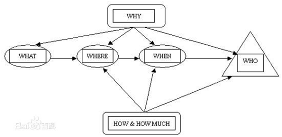
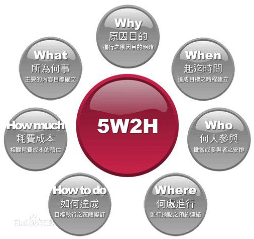
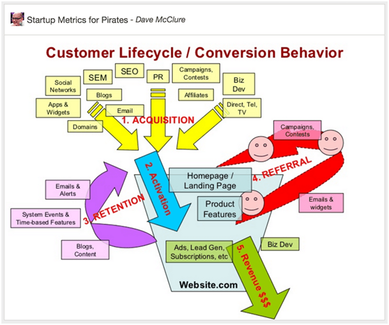
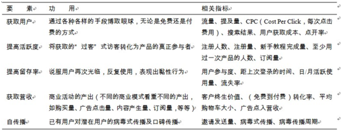
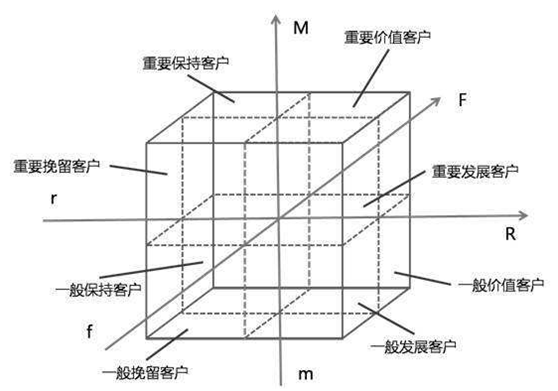

| 序号 | 修改时间  | 修改内容 | 修改人 | 审稿人 |
| ---- | --------- | -------- | ------ | ------ |
| 1    | 2018-7-26 | 创建     | 吴启福 | 吴启福 |
|      |           |          |        |        |
---

 

 

 

# 目录

目录

[目录... 1](#_Toc526270279)

[1    运营概述... 3](#_Toc526270280)

[2    运营职位... 3](#_Toc526270281)

[2.1    产品经理... 3](#_Toc526270282)

[2.1.1     产品经理的自我修养... 3](#_Toc526270283)

[2.2    业务分析BA. 4](#_Toc526270284)

[2.2.1     BABOK. 4](#_Toc526270285)

[3    数字化运营... 4](#_Toc526270286)

[3.1    方法论... 4](#_Toc526270287)

[3.1.1     5W+2H法... 5](#_Toc526270288)

[3.1.2     5W+1H.. 6](#_Toc526270289)

[3.1.3     Gartner的魔力四象限（2006）... 6](#_Toc526270290)

[3.1.4     竞价推广的四象限... 7](#_Toc526270291)

[3.1.5     数据可视化4步工作法... 8](#_Toc526270292)

[3.2    数据分析方法... 8](#_Toc526270293)

[3.2.1     统计分析方法... 8](#_Toc526270294)

[3.2.2     数据挖掘方法... 9](#_Toc526270295)

[3.2.3     漏斗模型... 9](#_Toc526270296)

[3.2.4     归因模型... 10](#_Toc526270297)

[3.3    指标体系... 11](#_Toc526270298)

[3.3.1     企业KPI 11](#_Toc526270299)

[3.3.2     报表的指标体系... 12](#_Toc526270300)

[3.4    本章参考... 12](#_Toc526270301)

[4    用户运营... 12](#_Toc526270302)

[4.1    用户运营的指标体系... 12](#_Toc526270303)

[4.1.1     第一关键指标法OMTM.. 12](#_Toc526270304)

[4.1.2     海盗指标法AARRR. 13](#_Toc526270305)

[4.2    用户画像... 15](#_Toc526270306)

[4.2.1     用户画像分层... 15](#_Toc526270307)

[4.3    用户分群：RFM用户模型... 15](#_Toc526270308)

[4.4    本章参考... 17](#_Toc526270309)

[5    网络推广与营销... 17](#_Toc526270310)

[5.1    微信/微博/SNS/营销... 17](#_Toc526270311)

[5.2    APP推广... 17](#_Toc526270312)

[应用商店内推广(ASO优化) 17](#_Toc526270313)

[应用商店外推广... 18](#_Toc526270314)

[5.3    精准营销... 19](#_Toc526270315)

[SEO/SEM.. 19](#_Toc526270316)

[5.4    本章参考... 19](#_Toc526270317)

[参考资料... 19](#_Toc526270318)

[附录... 19](#_Toc526270319)

[微信运营工具箱... 19](#_Toc526270320)

 

 

 

**表目录**

[表格 1 方法论分类... 4](#_Toc526270321)

[表格 2 数字化运营的方法论（5W+1H法）... 6](#_Toc526270322)

[表格 3 统计分析方法列表... 8](#_Toc526270323)

[表格 4 产品经理的数据挖掘方法... 9](#_Toc526270324)

[表格 5 北极星指标的三个案例... 13](#_Toc526270325)

[表格 6 微信运营工具箱列表... 19](#_Toc526270326)

 

---
# 1 运营概述

运维是要正确执行，运营则要执行好。

传统运营主要包括内容运营、用户运营以及活动运营三个方面。
* 内容运营：参见 《互联网经济研究》之自媒体章节。
* 用户运营：参见 4 见下方 用户运营
* 活动运营：

 

**运营职位**

运营职位主要是产品经理PM和业务分析BA。

# 2 数字化运营

## 2.1   方法论

表格 1 方法论分类

| 分类     | 细类         | 方法论                                                       |
| -------- | ------------ | ------------------------------------------------------------ |
| 应用场景 | 分析管理     | 5W2H、逻辑树、MECE原则、电梯法则、十字象限分析法、GTD、6点优先工作制、莫法特休息法、六顶思考帽、金字塔原则、SMART原则 |
|          | 市场营销     | 4P营销理论、用户行为理论、波士顿矩阵、生命周期理论、KANO模型、成熟度模型 |
|          | 战略制定     | PEST分析模型、SWOT模型、麦肯锡矩阵、帕累托原则、SCP分析模型、波特五力模型、波特价值链分析模型 |
| 内容     | 任务         | 金字塔原则、4P营销、用户行为理论、波士顿矩阵、KANO模型、麦肯锡矩阵SCP、STP、波特五力模型、波特价值链分析模型 |
|          | 阶段         | 生命周期理论、成熟度模型                                     |
|          | 技巧         | 5W2H、MECE、电梯法则、十字象限分析法、6点优先工作制、莫法特休息法、六顶思考帽、SMART、PEST、SWOT、帕累托原则 |
|          | 工具         | 逻辑树、GTD                                                  |
| 目的     | 时间管理目的 | GTD、6点优先工作制、莫法特休息法、帕累托原则、电梯法则       |
|          | 战略决策     | PEST、SWOT、SCP、STP、波特五力、波特价值链分析               |
|          | 逻辑组织     | 5W2H、逻辑树、MECE、SMART、六顶思考帽、金字塔原则            |
|          | 抽象建模     | 4P营销、用户行为理论、生命周期理论、KANO、成熟度模型         |
| 形式     | 矩阵分析形式 | 波士顿矩阵、麦肯锡矩阵、十字象限分析法                       |

备注：

 

经济学理论：

 

### 2.1.1 5W+2H法

5W2H分析法又叫七问分析法，是二战中美国陆军兵器修理部首创。简单、方便，易于理解、使用，富有启发意义，广泛用于企业管理和技术活动，对于[决策](https://baike.baidu.com/item/决策)和执行性的活动措施也非常有帮助，也有助于弥补考虑问题的疏漏。

发明者用五个以W开头的英语单词和两个以H开头的英语单词进行设问，发现解决问题的线索，寻找发明思路，进行设计构思，从而搞出新的发明项目，这就叫做5W2H法。

（1）[WHAT](https://baike.baidu.com/item/WHAT/61780)——是什么？目的是什么？做什么工作？

（2）[WHY](https://baike.baidu.com/item/WHY/73467)——为什么要做？可不可以不做？有没有替代方案？

（3）[WHO](https://baike.baidu.com/item/WHO/74453)——谁？由谁来做？

（4）[WHEN](https://baike.baidu.com/item/WHEN)——何时？什么时间做？什么时机最适宜？

（5）WHERE——何处？在哪里做？

（6）HOW ——怎么做？如何提高效率？如何实施？方法是什么？

（7）[HOW MUCH](https://baike.baidu.com/item/HOW MUCH)——多少？做到什么程度？数量如何？质量水平如何？费用产出如何？

​                               

图  5W2H分析法

 

图  5W2H分析法2

 

### 2.1.2 5W+1H

表格 2 数字化运营的方法论（5W+1H法）

|       | 定义         | 详解或案例                                           |
| ----- | ------------ | ---------------------------------------------------- |
| WHO   | 用户是谁？   | 用户=组织架构+自顶而下。高层、中层管理和基层执行层。 |
| WHY   | 为什么用？   | 驱动力=业务运营瓶颈+数据技术成熟                     |
| WHAT  | 用来做什么， | 目标和收益=内部业务支持（服务）+外部数据变现         |
| WHEN  | 什么时候使用 |                                                      |
| WHERE | 在哪里使用   | 切入点=业务驱动+迭代思维                             |
| HOW   | 如何使用     | 运营模式=横向跨领域的数据融合+纵向的数据价值链打通   |

 

### 2.1.3 Gartner的魔力四象限（2006）

详见 《大数据开发安全》Gartner章节。

### 2.1.4 竞价推广的四象限

二个维度：成本 、转换

我们在做竞争推广的时候，SEM专员需要分析竞价推广账户内的许多数据情况。其中一种，就是四象限法则：高成本高转化、高成本低转化、低成本高转化、低成本低转化。

 

| 象限                    | 表现                        | 解决方法                                                     |
| ----------------------- | --------------------------- | ------------------------------------------------------------ |
| 1高成本 高转换          | 1、转化率低，  网页跳出率高 | a.提高网站打开速度  b.着陆页相关度  c.网页吸引               |
|                         | cpc（点击价格）贵           | a.排名过高(适当降低排名)  b.质量度差(提升关键词质量度)  c.起价过高(降低排名) |
| 2 高成本低转化      |                             | 将这类词向增加转化量方向优化，  再向降低消费方向优化，  如果尝试失败可以暂停或者删除这类竞价关键词。 |
| 3低消费 高转化  |                             | 将这部分词作为核心关键词词，进行拓词，进而挖掘更有价值的关键词。 |
| 4 低消费 低转化 | 1.关键词展现量不足          | a、排名低(提高出价)  b、关键词数量不足(拓展新的关键词)  c、关键词触发几率小(拓宽匹配模式)  d、没搜索量(寻找合适的搜索词，查看搜索词报告) |
|                         | 2.关键词点击率过低          | a、创意不吸引人(撰写创意)  b、排名低(提高出价)               |

 

### 2.1.5 数据可视化4步工作法

分析逻辑：明确应用场景 -- 确定框架结构 -- 确定指标、维度 -- 校核明细数据

图形语言：         面 --       线、点  --  各类图元类型

## 2.2   数据分析方法

 

图 4 自上而下的数据指标体系

说明：根据目标分解出相关的指标。分解的方式有很多种，有SMART框架，需要遵循MECE原则（完全穷举，相互独立）。

 

由下至上地实施落地到BI系统：

连接数据 --> 数据处理 --> 数据建模 --> 制作数据报表 --> 非功能需求实现

 

常见的数据分析方法有：
* 多维事件分析：多个维度看同一个事件。
* 漏斗分析：如看一个用户从第一步操作以及后面每步操作的实际转化过程
* 留存分析：日/周/月留存率
* 行为序列分析：通过用户行为轨迹分析，识别用户意图
* A/B测试
* 用户分群：参见‘用户运营’

### 2.2.1 统计分析方法

表格 3 统计分析方法列表

| 数据类型   | 分析项                                                       | 备注 |
| ---------- | ------------------------------------------------------------ | ---- |
| 非时序数据 | 集中趋势：平均数、中位数、众数、四分位数  离散趋势：方差、标准差、最值、极差  数据分布：高斯分布、指数分布 |      |
| 时序数据   | 三比：同比、环比、定比                                       |      |
| 分类       |                                                              |      |
| 连续       | 相关性、                                                     |      |
| 分散       | 熵                                                           |      |

 

### 2.2.2 数据挖掘方法

表格 4 产品经理的数据挖掘方法

|              | 分析项                                                       | 备注 |
| ------------ | ------------------------------------------------------------ | ---- |
| 回归分析     | 线性回归、逻辑回归                                           |      |
| 概率         | 朴素贝叶斯                                                   |      |
| 聚类         | K-means：  层次聚类：                                        |      |
| 关联规则挖掘 |                                                              |      |
| 时序序列分析 | ARIMA：AR、I、MA  AR~自动回归，拟合；I~Integrated集分；MA~滑动平均 |      |
| 文本挖掘     |                                                              |      |
| 社交网络     |                                                              |      |
| 用户画像     | 详见  ‘用户运营’章节                                         |      |
| 知识图谱     |                                                              |      |
| 集成学习     |                                                              |      |

 

### 2.2.3 漏斗模型

漏斗模型可以广泛应用于流量监控、产品目标转化等日常数据运营工作中。

之所以称为漏斗，就是因为用户（或者流量）集中从某个功能点进入（这是可以根据业务需求来自行设定的），可能会通过产品本身设定的流程完成操作。

 

分析过程可以从以下三步展开：确定需要分析的访问路径或操作流程，收集数据并分别统计出该路径中每一步的人数，最后用漏斗模型展示结果。

示例1：搜索营销效果转化漏斗，漏斗的五层对应了企业搜索营销的各个环节，反映了从*展现*、*点击*、*访问*、*咨询*，直到*生成订单*过程中的客户数量及流失。从最大的展现量到最小的订单量，这个一层层缩小的过程表示不断有客户因为各种原因离开，对企业失去兴趣或放弃购买。

 

图 5 搜索营销效果转化漏斗

 

示例2：电商购物流程的漏斗模型

 

图 6 电商购物流程的漏斗模型

 

### 2.2.4 归因模型

**归因模型**，更准确的描述其实是一种既定的规则，我们需要根据产品的实际需求，将达成目标（形成转化）之前的功劳根据设定的权重分配给每一个转化节点。

归因模型在使用过程中通常分为几类：最终互动模型、首次互动模型、线性归因模型、时间衰减归因模型、自定义等。

 

产品情景描述：用户在Baidu上搜索一个关键词，点进了一个叫a.com的网站之后放弃继续搜索。过了几天他又在自己的Facebook上看到了这个关键词的广告，随后他点击了广告最终完成购买。

 

最终互动模型：最后一个节点将被分配100%的功劳，那么Facebook（社交媒体）上的广告获得100%的功劳；

首次互动模型：用户首先是在Baidu进行关键词搜索的，那么Baidu（搜索引擎）将被分配100%的功劳；

线性归因模型：用户从开始搜索到转化，共经历了三个渠道（节点），那么每个节点将被平均授予33.3%的功劳；

时间衰退归因模型：用户在Baidu搜索和访问了a.com是几天之前的事情，那么这两个渠道因为时间经历比较长的原因将被分配较低的功劳（如各20%），Facebook将被分配相对较高的功劳（60%）；

 

## 2.3   指标体系

​     指标体系（Indication System，IS）是指若干个相互联系的[统计指标](https://baike.baidu.com/item/统计指标)所组成的有机体。指标体系（IndicationSystem-IS）的建立是进行预测或评价研究的前提和基础，它是将抽象的研究对象按照其本质属性和特征的某一方面的标识分解成为具有行为化、可操作化的结构，并对指标体系中每一构成元素（即指标）赋予相应权重的过程。

​     指标体系规划的常用工具有SMART框架、战略地图/平衡记分卡、KPI价值树、全面预算管理和现有管理报表。

 

​     指标体系术语有：原子指标、时间周期、修饰类型、修饰词、派生指标、维度、维度属性。

 

**SMART框架**

SMART框架来自于BernardMarr（伯纳德·马尔）于2015年著的《智能大数据SMART准则-数据分析方法.案例和行动纲领》。

SMART即Strategy/Measure/Analytics/Report/Transform。

 

### 2.3.1 企业KPI

​     企业的指标体系，即企业关键业绩指标([KPI](https://baike.baidu.com/item/KPI)：Key Performance Indicator)是通过对组织内部流程的输入端、输出端的关键参数进行设置、取样、计算、分析，衡量流程绩效的一种目标式量化管理指标，是把企业的战略目标分解为可操作的工作目标的工具，是企业绩效管理的基础。

​     确定关键绩效指标有一个重要的SMART原则。SMART是5个英文单词首字母的缩写：
* S代表具体(Specific)，指绩效考核要切中特定的工作指标，不能笼统；
* M代表可度量(Measurable)，指绩效指标是数量化或者行为化的，验证这些绩效指标的数据或者信息是可以获得的；
* A代表可实现(Attainable)，指绩效指标在付出努力的情况下可以实现，避免设立过高或过低的目标；
* R代表现实性(Realistic)，指绩效指标是实实在在的，可以证明和观察；
* T代表有时限(Timebound)，注重完成绩效指标的特定期限。

 

**企业级KPI --** **部门KPI --** **个人KPI**

建立KPI指标的要点在于流程性、计划性和系统性。首先明确企业的战略目标，并在企业会议上利用头脑风暴法和鱼骨分析法找出企业的业务重点，也就是企业价值评估的重点。然后，再用头脑风暴法找出这些关键业务领域的关键业绩指标(KPI)，即企业级KPI。

接下来，各部门的主管需要依据企业级KPI建立部门级KPI，并对相应部门的KPI进行分解，确定相关的要素目标，分析绩效驱动因数(技术、组织、人)，确定实现目标的工作流程，分解出各部门级的KPI，以便确定评价指标体系。然后，各部门的主管和部门的KPI人员一起再将KPI进一步细分，分解为更细的KPI及各职位的业绩衡量指标。

指标体系确立之后，还需要设定评价标准。最后，必须对关键绩效指标进行审核。

 

### 2.3.2 报表的指标体系

指标体系的最佳实践是按照‘主题’对指标进行划分。

报表指标体系主题划分，主要从企业管理报表的设计方和创建方的角度出发的。

## 2.4   本章参考

[1].   数据分析方法论（一）——构建数据指标体系 https://www.jianshu.com/p/b207c9e5bff3 

[2].   浅谈如何建立数据指标体系？ http://baijiahao.baidu.com/s?id=1582067672016453347&wfr=spider&for=pc 

# 3 用户运营

## 3.1   用户运营的指标体系

用户运营，它以最大化提升用户价值为目的，通过各类运营手段提高活跃度、留存率或者付费指标。

常用有两种方法：第一关键指标法和海盗指标法。

### 3.1.1 第一关键指标法OMTM

North Star Metric” 北极星指标，又叫做“OMTM” One metric that matters,第一关键指标。

不同时期的北极星指标不尽相同
* MVP阶段（创业初期）：你需要关注的是产品是否被用户需要，通过访谈或者观察来判断产品的价值，这时候需要定性的分析，而非具体的某个指标。
* 增长阶段：产品处于快速增长期，这时候我们需要考虑的是如何留住老用户，吸引新用户。重要的指标就是留存率、复购率、引荐系数等。
* 营收阶段：这个阶段产品已经相对比较成熟，我们考虑的重点就变成了如何赚更多的钱，以及如何规模化。我们关注的重点成了 LTV（Life Time Value）、CAC（Customer Acquisition Cost）、渠道分成比例、渠道用户盈利周期、成本等。

 

表格 5 北极星指标的三个案例

| 案例     | 商业模式 | 核心价值       | 北极星指标 |
| -------- | -------- | -------------- | ---------- |
| 阿里巴巴 | 电商     | 快捷的网上购物 | 总销售额   |
| 简书     | 社区     | 知识传播       | 文章发布数 |
| 摩拜单车 | 共享经济 | 自行车资源共享 | 月活跃用户 |

 

### 3.1.2 海盗指标法AARRR

海盗指标是一套适用于移动APP的分析框架，因为读音非常像海盗喊话。

海盗指标即AARRR，它最早来自Dave McClure的著名分享，他提出了创业公司赢得客户的五个阶段：获取(Acquisition)、激活(Activation)、留存(Retention)、推荐(Referral)、收入(Revenue)。

 

 

图 7 AARRR的用户生命周期和转化行为

 

图 8 海盗指标法各阶段关注的数据指标

 

## 3.2   用户画像

**用户画像**：一般体现的是用户的客观属性。如性别、年龄、职业等，一般是不以用户的主观意愿所转移的。

**用户分层**：一般体现的是用户在产品上所处的状态。比如免费用户、活跃用户、付费用户、高额付费用户等，由于是“层”嘛，所以它有一个层级的概念，有一个状态递进的过程，大多是呈漏斗形的形状。而且用户的层级一般不会分的太多。

**用户分群**：一般体现的是用户的行为表现上。比如说频次低单价高、频次高单价低，这两种用户可能都属于高额付费用户，但表现形式不一样，所以所处的群也是不一样，所对应的运营策略也是不一样的。也可以认为用户分群是用户分层的进一步精细化过程。

 

### 3.2.1 用户画像分层

用户画像大致可分为四层，分别是原始层、事实层、模型层和业务层。

 

## 3.3   用户分群：RFM用户模型

RFM模型是客户管理中的经典方法，它用以衡量消费用户的价值和创利能力，是一个典型的分群。

它依托收费的三个核心指标：消费金额、消费频率和最近一次消费时间，以此来构建消费模型。
* 消费金额Monetary：消费金额是营销的黄金指标，二八法则指出，企业80%的收入来自20%的用户，该指标直接反应用户的对企业利润的贡献。
* 消费频率Frequency：消费频率是用户在限定的期间内购买的次数，最常购买的用户，忠诚度也越高。
* 最近一次消费时间Recency：衡量用户的流失，消费时间越接近当前的用户，越容易维系与其的关系。1年前消费的用户价值肯定不如一个月才消费的用户。

 

图 9 RFM用户模型

通过最近一次消费(Recency)、消费频率(Frequency)、消费金额(Monetary)这三个指标，然后把每个指标按照实际的情况，分成5档，一共形成了125类的用户。然后为了执行方便，把125类的用户归纳成8大类，如下图，最后根据这8大类用户的情况制定运营策略。

 

备注：RFM模型不是互联网时代的产物，事实上在传统行业里也用的很广，所以其指标主要针对的是付费用户。如果我们的互联网产品用户人群是免费用户，一样可以用这个RFM模型并使用它的方法，只是指标换成了最后一次登录、登录频率、产品使用时间。

 

RFM模型的扩展
* 金融：最近一次投资时间、投资频率、投资金额；
* 直播：最近一次观看时间、观看直播时长、打赏金额；
* 网站：最近一次登录时间、登录次数、登录时长；
* 内容：评论次数、评论字数、评论被点赞数；
* 游戏：等级、游戏时长、游戏充值金额。

 

## 3.4   本章参考

 

# 4 网络推广与营销

## 4.1   微信/微博/SNS/营销

双微：微信和微博。

以公众号为主的自媒体的价值主要体现在这三个方面：品牌价值、内容价值和流量价值。

## 4.2   APP推广

APP的推广可以分为应用商店内的推广和商店外的推广，就像网站优化一样，分为站内优化和站外优化。商店内推广主要是通过增加APP展示率和转化率从 而带来更多下载量，而应用商店外的推广则主要是增加知名度和曝光度

 

### 应用商店内推广(ASO优化)

商店内推广也就是常说的应用商店优化，即ASO优化。因为我们开发的是iOS应用，在这儿我就以App Store为例做一些介绍。

1.申请首发推荐位置。试问免费的机会，怎么可能放过?每个应用市场后台都有具体的申请规则，准备好首发版本、更新日志、广告素材等资料，就可以申请独家首发或者是联合首发。如果通过了，会给APP带来不少的下载。

2.ASO优化。 又可以细分为展示优化和转化优化。展示优化是通过覆盖热门关键词和提高关键词排名来完成，而转化优化则是对描述、截图、评论等信息做好设置，提高用户的第 一印象，增加APP被下载的几率。我们的大部分预算(其实也没多少)都用在这儿了，做关键词排名，做好评，效果还不错。

3.冲榜。冲 榜常用的两种方式是机器刷假量和积分墙模式。刷假量价格便宜，但是风险很大，很容易被苹果检测到，而且最近App Store对刷榜的打击力度更大。积分墙模式相对来讲要安全一些，就是花钱让用户完成指定任务：搜索、下载、试用、好评等等，我们需要考虑的是量的多少和 什么时候刷才能达到最好的效果。

4.应用市场的广告推荐位，前段时间一个很热门的话题就是App Store效仿Google Play尝试引入竞价排名。只要肯花钱，就可以直接上应用市场的广告推荐位。App Store的收费模式暂时还不清楚，无论是按CPT收费，还是CPD等方式，每天需要大量的预算，性价比不是很高。对于预算比较少的开发者来讲，这种方法 完全不需要考虑。

 

### 应用商店外推广

1.品牌基础推广， 国内可以创建百度百科、360百科等品牌词条。通过百度经验、和文库上传一些APP使用说明，在几个知名问答平台建立问答，这样用户之后在网上搜索APP 信息的时候会看见很多有利的因素。比如说国内最常用的百度知道和知乎，国外类似的问答平台有quora，推广效果也很赞!

2.社交平台推广。 为你的APP创建各种社交账号，并保持账号的活跃。国内主要是微博、微信推广。在微博上利用最新的热点新闻话题，坚持原创内容创作，同时也可以想办法让微 博红人转发，提高品牌的曝光率。而微信则可以通过一些转发送礼品这样的活动来提高传播度。海外可以在Facebook和Twitter这样的平台上推广， 用户多，活跃度高，是很理想的推广渠道。

3.论坛推广。即在和APP相关论坛或者活跃度较高的论坛发帖。发帖可不是在一些垃圾板块不停地刷屏这么简单就行了，要结合产品的定位和目标人群，到相关的板块发帖。最好是以官方和用户两种身份发帖推广，同时可以联系管理员做一些活动推广。国内可以在豆瓣、天涯这些好的平台推广。

4.发动朋友推广，因为我们平时也接触了很多开发朋友，这个时候是时候利用人脉资源了。我们都让周围的朋友去下载APP玩玩，帮忙转发一下，做做宣传，同时帮忙写一些好评，这样相当于省下一大笔推广经费了。

5.PR和软文推广。利用微博Kol、微信公众号、自媒体专栏、博客这些平台发一些软文，也会取得意想不到的效果。还有钛媒体、36Kr这种新闻媒体也可以寻求产品报道，也可以花钱在一些网站上买几篇文章。如果文笔好的同学，可以自己写，实在不行也可以在网上找人写，给点稿费就行了。

 

一些感觉不错的推广方式：

1.线下推广，常见的线下推广有线下媒体推广、线下店面推广、地推等方式。这种推广方式的效果是不错，不过需要很大的投入，有条件的朋友可以去试试。

2.广告投放，通过插屏广告或者网盟渠道来获取下载量。一般手游类产品适合采用插屏广告形式，点击率、转化率、用户活跃度都不错。而网盟渠道也分为CPM、CPC、CPA等计费模式，购买之前需要和对方商议好，最好是商定一个KPI，用于保证用户质量。

通过这些方式的推广，任何APP最终都能获得不少的下载量。其实无论是应用商店内还是商店外的，适用的推广方式就那么几种，如何结合APP本身来发挥出每种方式的特点才是最重要的环节。有钱的人可以任性，没钱的人可不能认命啊，只要认真去做，也能取得成功。

 

## 4.3   精准营销

### SEO/SEM

SEO：搜索引擎优化

SEM：搜索引擎营销

 

## 4.4   本章参考

[1].   亮点传媒 http://www.21ld.com

[2].   怎样有效地推广APP  http://www.21ld.com/ld1688/vip_doc/2036395.html

[3].   APP推广和ASO优化：[http://www.asotop1.com/](http://www.asotop1.com/?from=lss)

# 5 电商运营

 

# 参考资料

**参考书目**
* [数据产品经理必修课：从零经验到令人惊艳 ](https://book.douban.com/subject/30185228/) 李鑫 / 电子工业出版社 / 2018-4
* [人人都是产品经理2.0 : 写给泛产品经理 ](https://book.douban.com/subject/27029547/) 苏杰 / 电子工业出版社 / 2017-5 /
* [用数据讲故事 ](https://book.douban.com/subject/27108685/) [美] Cole Nussbaumer Knaflic / 陆　昊、吴梦颖 / 人民邮电出版社 / 2017-8

 

**参考链接**

[1].   方法篇｜如何成为一个运营大牛：用户分层 https://baijiahao.baidu.com/s?id=1588411295952705393&wfr=spider&for=pc

 

# 附录

## 微信运营工具箱

表格 6 微信运营工具箱列表

| 分类       | 列项                                                         |
| ---------- | ------------------------------------------------------------ |
| 综合指南   | [新榜](http://newrank.cn/)、[清博指数-新媒体大数据平台](http://www.gsdata.cn/) |
| 编辑器     | [秀米](http://xiumi.us/)、[微信排版工具](http://www.ipaiban.com/) [MAKA](http://www.maka.im/) |
| 表单       | [麦客](http://www.mikecrm.com/login.php?d=formManager.php)   |
| 运营助手   | [新媒体管家](http://xmt.cn/) [西瓜公众号助手](http://www.xiguaji.com/) 爱微帮：[微榜](http://top.aiweibang.com/) |
| 门票       | [活动行](http://www.huodongxing.com/)                        |
| 机器人     | [公众宝-您的公众号微信机器人](http://gz.xiaoi.com/)          |
| 微商       | 有赞：[有赞 - 移动零售服务商](https://www.youzan.com/)       |
| 二维码     | [草料二维码生成器](http://cli.im/)                           |
| 免版税图库 | [壹图网_最大中文微利图片库](http://www.1tu.com/photos/freeImage)   [秀多多 - 微信配图素材](http://xiudodo.com/)  [Free   Stock Photos · Search 30+ sites with LibreStock](http://librestock.com/)  [摄图网-摄影图片照片应有尽有，设计师和摄影师的聚集地](http://699pic.com/) |
| 短网址     | [新浪微博短网址生成器](http://www.waqiang.com/index.php/url) |

 